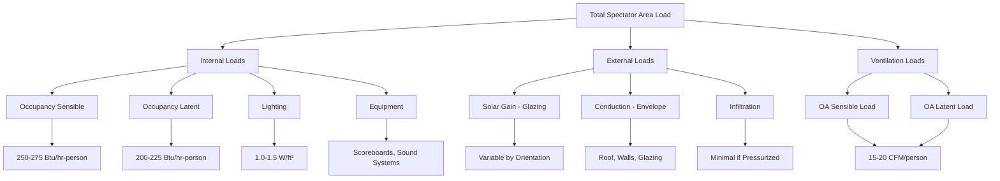

## Overview

Spectator area load characteristics differ fundamentally from pool hall loads due to intermittent occupancy, high density during events, and distinct sensible heat ratio profiles. Accurate load assessment requires consideration of diversity factors, transient behavior, and the time-varying nature of spectator occupancy patterns.

## Occupancy Load Components

### Sensible Heat Gain from Occupants

The sensible heat gain from spectators follows ASHRAE assembly occupancy guidelines:

$$q_{s,occ} = N \cdot q_{s,person} \cdot CLF$$

where:
- $q_{s,occ}$ = sensible heat gain from occupants (Btu/hr)
- $N$ = number of occupants (persons)
- $q_{s,person}$ = sensible heat per person (Btu/hr-person)
- $CLF$ = cooling load factor (dimensionless)

For seated spectators at moderate activity:
- Sensible heat: 250-275 Btu/hr-person
- Latent heat: 200-225 Btu/hr-person
- Total metabolic rate: 450-500 Btu/hr-person

### Latent Heat Gain from Occupants

$$q_{l,occ} = N \cdot q_{l,person} \cdot F_{diversity}$$

where:
- $q_{l,occ}$ = latent heat gain from occupants (Btu/hr)
- $q_{l,person}$ = latent heat per person (Btu/hr-person)
- $F_{diversity}$ = diversity factor (0.75-0.95 for spectator areas)

The sensible heat ratio for spectator areas typically ranges from 0.52 to 0.58, significantly lower than office spaces due to high occupant density and metabolic activity.

## Load Components Breakdown

## Lighting Heat Gain

Lighting loads in spectator areas depend on event type and venue lighting strategy:

$$q_{lights} = A \cdot W_{lighting} \cdot F_{use} \cdot F_{ballast}$$

where:
- $q_{lights}$ = lighting heat gain (Btu/hr)
- $A$ = floor area (ft²)
- $W_{lighting}$ = installed lighting power density (W/ft²)
- $F_{use}$ = use factor (0.7-1.0)
- $F_{ballast}$ = ballast factor (1.0 for LED, 1.15-1.20 for fluorescent)

Typical lighting power densities:
- Competition events: 1.2-1.5 W/ft²
- Practice sessions: 0.6-0.8 W/ft²
- Non-event periods: 0.2-0.3 W/ft²

## Load Comparison by Event Capacity

| Occupancy Scenario | Occupants | Sensible Load (Btu/hr) | Latent Load (Btu/hr) | Total Load (tons) | Ventilation (CFM) |
|-------------------|-----------|------------------------|---------------------|-------------------|------------------|
| Empty (cleaning) | 5 | 1,375 | 1,125 | 0.2 | 75 |
| Practice (10% capacity) | 50 | 13,750 | 11,250 | 2.1 | 750 |
| School meet (40% capacity) | 200 | 55,000 | 45,000 | 8.3 | 3,000 |
| Championship (75% capacity) | 375 | 103,125 | 84,375 | 15.6 | 5,625 |
| Full capacity (100%) | 500 | 137,500 | 112,500 | 20.8 | 7,500 |

*Assumptions: 275 Btu/hr-person sensible, 225 Btu/hr-person latent, 15 CFM/person minimum outdoor air*

## Diversity Factors

Diversity factors account for the reality that peak conditions rarely occur simultaneously:

$$q_{total} = \sum (q_i \cdot F_{diversity,i})$$

Recommended diversity factors for natatorium spectator areas:
- **Occupancy**: 0.85-0.95 (high diversity during events)
- **Lighting**: 0.90-1.00 (depends on event scheduling)
- **Equipment**: 0.70-0.85 (scoreboards, sound systems intermittent)
- **Solar gain**: 1.00 (no diversity for envelope loads)

## Transient Load Considerations

Spectator area loads exhibit pronounced transient behavior:

**Pre-event period (1-2 hours before)**
- Gradual occupancy buildup from 0% to 100%
- HVAC system must handle ramp-up without comfort complaints
- Pre-cooling strategies can reduce peak demand

**Event period (2-4 hours)**
- Maximum occupancy and metabolic loads
- Ventilation at peak outdoor air requirements
- Lighting and equipment at full operation

**Post-event period (0.5-1 hour)**
- Rapid occupancy decline to near zero
- Opportunity for system setback and energy recovery
- Maintain slight positive pressure for moisture control

The thermal time constant for spectator areas is typically 1.5-2.5 hours, requiring responsive HVAC control strategies.

## Ventilation Requirements

ASHRAE Standard 62.1 specifies outdoor air requirements for assembly spaces:

$$\dot{V}_{OA} = R_p \cdot P + R_a \cdot A$$

where:
- $\dot{V}_{OA}$ = outdoor air ventilation rate (CFM)
- $R_p$ = outdoor air rate per person (5 CFM/person)
- $P$ = number of people (persons)
- $R_a$ = outdoor air rate per area (0.06 CFM/ft²)
- $A$ = floor area (ft²)

For spectator areas with potential high occupancy density, design outdoor air rates of 15-20 CFM/person provide better comfort and air quality during peak events.

## Sensible Heat Ratio Analysis

The sensible heat ratio for spectator areas:

$$SHR = \frac{q_s}{q_s + q_l}$$

Typical SHR ranges:
- **Low occupancy** (< 25% capacity): 0.65-0.75
- **Medium occupancy** (25-60% capacity): 0.58-0.65
- **High occupancy** (> 60% capacity): 0.52-0.58

The low SHR during events necessitates dehumidification capacity beyond what the sensible cooling coil provides. Dedicated outdoor air systems (DOAS) or reheat strategies effectively address this requirement.

## Design Recommendations

1. **Size equipment for 75-85% capacity** rather than absolute peak to avoid excessive first cost and part-load inefficiency
2. **Implement occupancy-based controls** with CO₂ sensors to modulate ventilation rates
3. **Design for SHR of 0.55** at peak occupancy conditions
4. **Provide pre-event cooling** capability to offset thermal mass effects
5. **Maintain 0.02-0.05 in. w.c. positive pressure** relative to pool hall to prevent moisture migration

The intermittent nature of spectator area loads creates opportunities for energy optimization through demand-controlled ventilation, economizer operation during shoulder seasons, and strategic thermal storage approaches.
