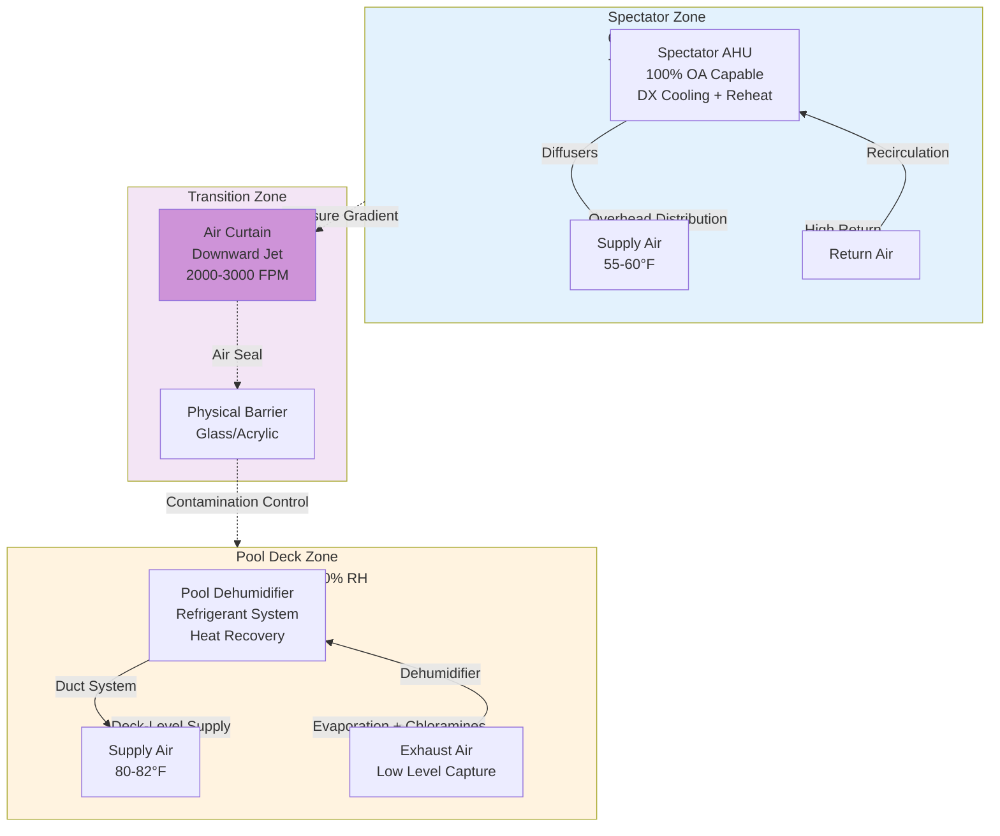

## Engineering Rationale for System Separation

Spectator areas in natatoriums require dedicated HVAC systems separate from pool deck zones due to fundamentally incompatible environmental conditions and air quality requirements. ASHRAE Applications Handbook Chapter 6 (Natatoriums) mandates this separation for facilities with substantial spectator occupancy, driven by three critical factors: divergent temperature and humidity setpoints, chloramine exposure limits, and occupant activity levels.

The pool deck environment operates at 2-4°F above water temperature (typically 82-84°F) with 50-60% relative humidity to minimize evaporation and maintain swimmer comfort. Spectator areas require substantially different conditions: 68-72°F and 30-50% RH for sedentary occupants. Attempting to serve both zones from a single system creates thermal discomfort and energy waste.

More critically, chloramine concentrations at the pool deck surface frequently exceed 0.3 ppm trichloramine—the odor threshold and respiratory irritant level. Spectators, particularly children and individuals with respiratory sensitivities, require air quality meeting ASHRAE 62.1 standards for occupied spaces, which pool deck air cannot provide without substantial dilution.

## Load Isolation and Energy Analysis

The thermal load differential between spectator and pool zones necessitates separate capacity calculations. Spectator area loads follow conventional assembly space patterns:

$$Q_{\text{spectator}} = Q_{\text{sensible}} + Q_{\text{latent}} = \left(\dot{m}c_p\Delta T\right)_{\text{people}} + \left(h_{fg}\dot{m}_v\right)_{\text{people}} + Q_{\text{envelope}} + Q_{\text{solar}}$$

Where:
- $Q_{\text{sensible}}$ = sensible heat from occupants, lighting, envelope, and solar gains
- $Q_{\text{latent}}$ = moisture load from occupants (low relative to pool deck)
- $Q_{\text{envelope}}$ = envelope load based on spectator setpoint (68-72°F)
- $Q_{\text{solar}}$ = solar heat gain through glazing

Pool deck loads are dominated by evaporative moisture:

$$Q_{\text{pool}} = \dot{m}_{\text{evap}} \cdot h_{fg} + Q_{\text{sensible,deck}}$$

Where evaporative mass flow $\dot{m}_{\text{evap}}$ follows the Carrier equation:

$$\dot{m}_{\text{evap}} = 0.1 \cdot A_{\text{pool}} \cdot \left(p_{w,sat} - p_{w,air}\right) \cdot \left(1 + 0.2V_{\text{wind}}\right)$$

The latent load from evaporation typically represents 60-75% of total pool deck load, while spectator latent loads rarely exceed 25% of total. This disparity makes single-system humidity control impossible without severe overcooling of one zone or underdehumidification of the other.

Energy analysis confirms separation benefits. A combined system must supply air at conditions satisfying the most demanding zone (pool deck dewpoint), then reheat for spectator comfort. This reheat penalty can represent 15-30% of total HVAC energy consumption in combined designs. Separate systems eliminate this reheat load and allow independent economizer operation for the spectator zone during mild weather.

## Zoning Configuration

The following diagram illustrates proper HVAC separation with pressure relationships and air curtain placement:

The spectator zone operates at positive pressure (+5 to +10 Pa) relative to the pool deck to prevent chloramine migration. The pool deck maintains negative pressure (-5 to -10 Pa) relative to adjacent spaces to contain contaminants. This pressure cascade requires careful balancing and monitoring.

## Interface Strategies and Comparison

Multiple approaches exist for managing the spectator-pool interface. Selection depends on architectural constraints, budget, and operational complexity tolerance.

| Strategy | Implementation | Effectiveness | Energy Impact | Capital Cost | Maintenance |
|----------|---------------|---------------|---------------|--------------|-------------|
| **Air Curtain** | High-velocity downward jet (2000-3000 FPM) at opening | 75-85% containment with pressure control | +8-12% fan energy | Moderate ($8-15K per opening) | Filter changes, motor maintenance |
| **Pressure Control** | Differential pressure sensors with automated damper control | 80-90% with proper commissioning | Minimal if properly tuned | Low ($3-5K per zone) | Annual calibration |
| **Physical Barrier** | Tempered glass or acrylic partition with doors | 95-98% separation | None (passive) | High ($150-300/SF installed) | Cleaning, gasket replacement |
| **Vestibule Entry** | Double-door airlock with local exhaust | 90-95% effective | +5-8% for vestibule conditioning | Moderate-High ($25-40K) | Door operators, seals |
| **Combined Approach** | Physical barrier + air curtain + pressure control | >98% containment | +10-15% total | Highest | Multiple systems |

Best practice for competitive aquatic centers and large spectator facilities combines a physical barrier (glass wall) with pressure differential control. The glass provides visual connection while achieving near-complete air separation. Pressure control handles door openings and ensures consistent airflow direction.

For smaller facilities or retrofit applications where full barriers are impractical, air curtains paired with aggressive pressure differentials (15-20 Pa) provide acceptable performance. The air curtain must be sized for the opening width with minimum 2000 FPM discharge velocity and air volume matching 75-100% of the opening cross-section.

## Chloramine Exposure Mitigation

Trichloramine (NCl₃) is the primary airborne contaminant concern in natatoriums. Its volatility and irritant properties drive the requirement for spectator system separation. Pool deck air commonly contains 0.2-0.5 ppm trichloramine, while safe continuous exposure limits for the general public are below 0.1 ppm.

Separate spectator systems mitigate exposure through three mechanisms:

1. **Source Isolation**: Physical and aerodynamic separation prevents bulk chloramine transport into spectator zones
2. **Dedicated Ventilation**: Spectator systems introduce 100% outdoor air during peak occupancy, diluting any migrated contaminants to negligible levels
3. **Pressure Control**: Positive pressure in spectator areas ensures any air leakage flows from spectator zone toward pool deck, not vice versa

The spectator system outdoor air requirement follows ASHRAE 62.1 occupancy-based calculations (typically 5-7 CFM/person for assembly spaces), not the elevated natatorium rates (6-8 ACH minimum). This distinction allows energy recovery on spectator system exhaust without chloramine cross-contamination concerns that preclude energy recovery on pool deck exhaust.

## Code Requirements and Standards

ASHRAE 62.1 Ventilation for Acceptable Indoor Air Quality requires dedicated exhaust from pool deck areas without recirculation to occupied spaces not designed for pool use. This effectively mandates separate systems when spectator areas exist. The International Mechanical Code (IMC) Section 403.2 reinforces this through occupancy-based outdoor air requirements that cannot be met with pool deck air.

State and local health codes frequently impose additional restrictions. Many jurisdictions prohibit any recirculation between pool and spectator zones or require physical separation when spectator capacity exceeds 50-100 persons. California Title 24 and similar energy codes often mandate air-side economizers for spectator systems while prohibiting them for pool systems due to humidity control requirements—another factor driving system separation.

Accessibility codes (ADA, local equivalents) influence interface design. Openings requiring accessible passage cannot use air curtains alone; they need physical barriers with accessible door hardware. This constraint often favors the glass partition approach with automated or low-effort door operators.

## System Configuration Best Practices

Spectator HVAC systems should employ conventional comfort cooling equipment: packaged rooftop units, split systems, or dedicated air handlers with DX cooling and gas heat. Avoid oversized equipment; spectator loads are predictable and sizing should follow ACCA Manual J or ASHRAE fundamentals. Provide humidity control through proper cooling coil selection (dewpoint control) and avoid the specialized dehumidification equipment required for pool decks.

Supply air distribution uses overhead delivery with high-induction diffusers to promote mixing and avoid stratification. Return air grilles mount high on walls or ceilings, away from the pool interface. This arrangement maintains the positive pressure gradient and ensures any infiltration from the pool deck occurs at low levels where it can be captured before reaching the breathing zone.

Zoning within the spectator area should follow occupancy patterns. Separate control for upper seating tiers allows setback during non-event periods. Demand-controlled ventilation based on CO₂ sensing is highly effective for spectator zones with variable attendance, reducing outdoor air during low-occupancy periods while maintaining proper ventilation during events.

Controls integration between spectator and pool systems enables coordinated pressure management. The building automation system monitors differential pressure at the interface and modulates exhaust/supply fan speeds to maintain the target gradient. Interlocks prevent simultaneous economizer operation or pressure reversals during equipment failures.

## Conclusion

Separate HVAC systems for spectator areas represent sound engineering practice driven by fundamentally incompatible environmental requirements. The temperature differential, humidity control needs, and chloramine exposure concerns cannot be adequately addressed with shared systems. While system separation increases first cost and control complexity, it delivers superior occupant comfort, air quality, and long-term energy performance. For any natatorium with regular spectator use exceeding 25-50 persons, dedicated spectator HVAC systems should be considered mandatory rather than optional.
