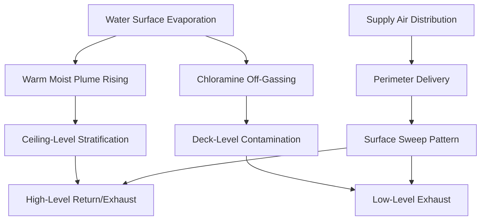
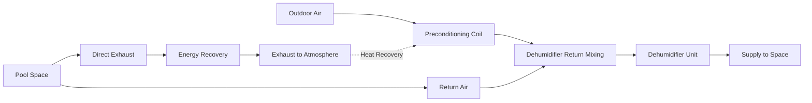

Indoor swimming pools present unique ventilation challenges that distinguish them from conventional occupied spaces. The combination of high moisture loads, airborne chemical contaminants, and stringent comfort requirements demands ventilation systems engineered to address both air quality and thermodynamic constraints.

## Fundamental Ventilation Drivers

Natatorium ventilation serves three primary functions: dilution of airborne contaminants, moisture control, and space pressurization. Unlike typical commercial spaces where ventilation primarily addresses occupant CO₂ generation, pool facilities must contend with continuous off-gassing of chloramines and other disinfection byproducts from the water surface.

**Chloramine Formation and Off-Gassing**

When chlorine-based disinfectants react with nitrogenous compounds introduced by swimmers (urea, sweat, cosmetics), they form combined chlorine compounds known as chloramines. The most problematic is nitrogen trichloride (NCl₃), which volatilizes readily at typical pool water temperatures.

The mass transfer rate of chloramines from water to air follows:

$$\dot{m}_{NCl_3} = k_L \cdot A \cdot (C_L - C_L^*)$$

Where:
- $\dot{m}_{NCl_3}$ = mass transfer rate of trichloramine (lb/hr)
- $k_L$ = overall mass transfer coefficient (ft/hr)
- $A$ = water surface area (ft²)
- $C_L$ = bulk liquid concentration (ppm)
- $C_L^*$ = equilibrium concentration at the interface (ppm)

The mass transfer coefficient increases with water surface turbulence (wave action, fountains, slides) and air velocity across the surface. This explains why active pools generate higher contaminant loads than quiescent water bodies.

## Code-Mandated Outdoor Air Requirements

**ASHRAE 62.1 Minimum Rates**

ASHRAE Standard 62.1 specifies minimum ventilation rates for natatoriums based on deck area and spectator occupancy:

| Space Type | Outdoor Air Rate | Application |
|-----------|------------------|-------------|
| Pool Deck (inactive) | 0.48 cfm/ft² | Deck area method |
| Pool Deck (active/competition) | 0.48 cfm/ft² + occupant component | Deck + occupancy |
| Spectator Areas | Based on Table 6-1 occupancy | Assembly spaces |

For a typical 25m × 12m pool (984 ft² water surface) with 1,500 ft² deck area:

$$V_{OA,min} = 0.48 \times 1500 = 720 \text{ cfm}$$

This represents the absolute minimum. Actual requirements frequently exceed code minimums due to contaminant control needs.

**International Mechanical Code (IMC) Requirements**

The IMC Section 403.3.2 mandates that natatoriums maintain negative pressure relative to adjacent occupied spaces, requiring exhaust-to-supply air imbalance. Most jurisdictions require 5-15% exhaust excess.

## Contaminant Dilution Requirements

The critical ventilation driver is chloramine concentration control. Recommended maximum trichloramine concentrations:

- Recreational pools: 0.5 mg/m³ (0.0002 gr/ft³)
- Competition facilities: 0.3 mg/m³ (0.00012 gr/ft³)
- Health/therapy pools: 0.2 mg/m³ (0.00008 gr/ft³)

The required ventilation rate for dilution follows:

$$Q_{dil} = \frac{\dot{m}_{NCl_3}}{\rho_{air} \cdot (C_{max} - C_{OA})}$$

Where:
- $Q_{dil}$ = dilution airflow rate (cfm)
- $\rho_{air}$ = air density (lb/ft³)
- $C_{max}$ = maximum allowable indoor concentration (gr/lb)
- $C_{OA}$ = outdoor air concentration (typically zero)

For typical recreational pools, this calculation yields 4-8 air changes per hour (ACH), significantly exceeding ASHRAE 62.1 minimums. Competition pools and facilities with poor water chemistry may require 8-12 ACH.

## Exhaust Strategy and Air Distribution

Effective contaminant removal requires strategic exhaust placement. Chloramines are slightly denser than air (molecular weight ~120 vs. 29 for air), promoting settling toward deck level. However, thermal stratification from warm water surfaces creates upward convection currents.

**Recommended Exhaust Distribution:**

| Exhaust Location | Percentage of Total | Function |
|-----------------|---------------------|----------|
| Deck level (< 3 ft) | 30-40% | Direct chloramine capture |
| Water surface (< 8 ft) | 20-30% | Intercept rising plume |
| Ceiling level | 30-50% | General dilution/moisture control |

Low-level exhaust should maintain 50-100 fpm velocity across deck surfaces without creating drafts in occupied zones. High-level exhaust integrates with dehumidification returns.

## Space Pressurization Control

Natatoriums must operate at negative pressure (-0.02 to -0.05 in. w.c.) relative to adjacent spaces to prevent migration of humid, chloramine-laden air into corridors, locker rooms, and mechanical spaces. This pressurization is achieved through exhaust-supply imbalance.

**Pressure Differential Calculation:**

$$\Delta P = \frac{\rho \cdot v^2}{2} + \rho \cdot g \cdot h \cdot \Delta T_{adj}$$

Where the velocity pressure component dominates in properly sealed spaces. The required exhaust excess:

$$Q_{exhaust} = Q_{supply} + Q_{excess}$$

Typical $Q_{excess}$ = 10-15% of supply, adjusted based on:
- Building envelope tightness (tighter = less excess needed)
- Door traffic patterns (high traffic = more excess)
- Adjacent space pressure requirements

Differential pressure sensors with direct digital control (DDC) modulation of exhaust fans maintain setpoint under varying conditions.

## Energy Considerations

Ventilation represents the dominant energy load in natatorium HVAC systems. For a 2,000 ft² deck facility in a heating climate:

**Annual Ventilation Energy Load (Heating Season):**

$$Q_{vent,heating} = \dot{m}_{OA} \cdot c_p \cdot (T_{indoor} - T_{outdoor}) \cdot t_{heating}$$

At 1,500 cfm outdoor air, 82°F indoor, 35°F average outdoor, 6,000 heating hours:

$$Q_{vent,heating} = \frac{1500 \times 0.075}{60} \times 0.24 \times (82-35) \times 6000 = 2.55 \times 10^6 \text{ Btu}$$

This excludes latent load conditioning (typically 2-3× the sensible load) and represents ~40-60% of total facility heating energy.

**Energy Recovery Strategies:**

1. **Enthalpy wheels**: 60-75% total effectiveness
2. **Plate heat exchangers**: 50-65% sensible effectiveness
3. **Heat pipe systems**: 45-55% sensible effectiveness
4. **Run-around loops**: 50-60% sensible effectiveness

Chloramine corrosion limits recovery options. Enthalpy wheels risk cross-contamination; plate exchangers require corrosion-resistant materials (aluminum or coated). Many designers specify run-around glycol loops with separation between exhaust and supply airstreams.

## Integration with Dehumidification Systems

Dedicated pool dehumidifiers provide the majority of space air circulation (8-12 ACH), while the ventilation system introduces outdoor air and exhausts contaminated air. The systems integrate at the dehumidifier return:

The outdoor air fraction in the dehumidifier return typically ranges from 15-35%, with modulating dampers maintaining space pressure while meeting minimum ventilation rates.

## Summary

Natatorium ventilation rates are governed by chloramine dilution requirements rather than occupancy-based calculations. Typical facilities require 4-8 ACH minimum, with strategic exhaust placement at multiple levels to capture both deck-level contaminants and ceiling stratification. Negative pressurization through exhaust excess prevents migration to adjacent spaces. Energy recovery is essential for operational cost control but must address corrosion concerns inherent to chlorinated environments.

Proper ventilation system design balances air quality, comfort, pressure control, and energy efficiency—a significantly more complex challenge than conventional commercial HVAC applications.
