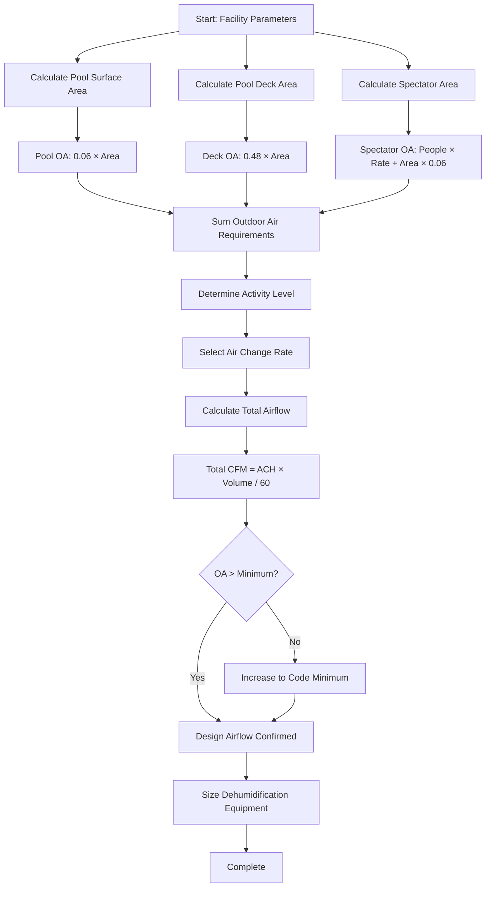

Air change rates in natatorium design serve two distinct but overlapping purposes: dilution of airborne contaminants (primarily chloramines) and humidity control through ventilation. Unlike conventional occupied spaces where ventilation primarily addresses metabolic CO₂ and odors, natatorium ventilation must manage chemical off-gassing from water treatment processes while supporting mechanical dehumidification systems. Understanding the physics of contaminant generation, dispersion, and removal guides proper air change rate selection.

## ASHRAE 62.1 Ventilation Requirements

ASHRAE Standard 62.1 establishes minimum outdoor air requirements for natatoriums based on floor area rather than occupancy, recognizing that the pool water surface itself generates the primary contaminant load. The standard differentiates between pool deck areas and spectator areas due to their fundamentally different exposure profiles.

### Minimum Outdoor Air Rates

**Pool Deck Area** (area within 10 feet of pool perimeter where swimmers and staff operate):

$$V_{oa,deck} = 0.48 \times A_{deck}$$

where $V_{oa,deck}$ is outdoor air rate in cfm and $A_{deck}$ is pool deck area in ft².

**Pool Water Surface**:

$$V_{oa,pool} = 0.06 \times A_{pool}$$

where $V_{oa,pool}$ is outdoor air rate in cfm and $A_{pool}$ is pool water surface area in ft².

**Spectator Areas** (bleachers, viewing galleries separated from pool deck):

Standard occupancy-based ventilation applies, typically 5-7.5 cfm/person depending on age group and activity.

### Total Outdoor Air Calculation

The complete outdoor air requirement combines pool surface, deck area, and spectator ventilation:

$$V_{oa,total} = (0.06 \times A_{pool}) + (0.48 \times A_{deck}) + (R_p \times P) + (R_a \times A_{spectator})$$

where:
- $R_p$ = people outdoor air rate (cfm/person)
- $P$ = number of occupants in spectator area
- $R_a$ = area outdoor air rate (cfm/ft²), typically 0.06 cfm/ft²
- $A_{spectator}$ = spectator area floor area (ft²)

## Physical Basis for Air Change Requirements

The air change rate requirements derive from contaminant generation and removal principles. Trichloramine (NCl₃), the primary irritant in pool air, forms at the water surface through chemical reactions between free chlorine and nitrogenous compounds (urine, sweat, cosmetics) introduced by swimmers. The mass transfer rate from water to air depends on:

1. **Trichloramine concentration in pool water** (typically 0.1-0.5 mg/L)
2. **Henry's Law equilibrium** governing gas-liquid partitioning
3. **Mass transfer coefficient** at water-air interface (function of turbulence)
4. **Pool water surface area**

Once airborne, trichloramine concentration in natatorium space follows steady-state mass balance:

$$C_{ss} = \frac{G}{Q_{vent} + k \cdot V}$$

where:
- $C_{ss}$ = steady-state concentration (mg/m³)
- $G$ = generation rate (mg/h)
- $Q_{vent}$ = ventilation rate (m³/h)
- $k$ = removal rate constant for filtration/destruction (h⁻¹)
- $V$ = room volume (m³)

To maintain trichloramine below 0.5 mg/m³, sufficient ventilation must dilute the constant generation from pool water. Higher activity levels increase generation through water agitation and swimmer loading, necessitating increased air change rates.

## Activity-Based Ventilation Rates

Empirical data from operating natatoriums demonstrates that minimum code ventilation often proves insufficient during high-activity periods. Activity-based adjustments account for increased contaminant generation:

| Activity Level | Pool Usage | Air Changes per Hour | Outdoor Air Fraction |
|----------------|------------|---------------------|---------------------|
| Low | Minimal use, calm water | 4-6 ACH | 30-40% |
| Moderate | Recreational swimming | 6-8 ACH | 40-50% |
| High | Competitive swimming, lessons | 8-12 ACH | 50-70% |
| Peak | Synchronized swimming, water polo | 12-15 ACH | 70-90% |

These rates assume properly functioning dehumidification equipment. Pure outdoor air ventilation without mechanical dehumidification requires substantially higher rates (15-30 ACH) and only functions in dry climates or specific seasonal conditions.

## Zone-Specific Requirements

Natatoriums typically contain distinct zones requiring differentiated ventilation strategies:

### Pool Deck Zone

The pool deck zone experiences the highest contaminant exposure and humidity levels. Air distribution should provide:

- **Minimum 6 ACH** for contaminant dilution
- **0.48 cfm/ft² outdoor air** per ASHRAE 62.1
- **Air velocity 50-100 fpm** at breathing height for occupant comfort
- **Temperature 2-4°F above pool water** to minimize evaporation

Deck areas with hot tubs or therapy pools require additional ventilation (add 15-20 cfm per person in hot tub) due to elevated water temperature increasing evaporation rate.

### Spectator Area Zone

Spectator areas can be isolated from pool deck air through strategic supply air delivery and return air placement. This separation provides two benefits:

1. **Reduced exposure** to chloramines (concentrations 50-70% lower than deck)
2. **Lower humidity** for improved comfort (40-50% RH versus 50-60% at deck)

Recommended approach:

- **Separate air handling** with dedicated supply and return
- **Slight positive pressure** relative to pool deck (0.02-0.03 in. w.g.)
- **5-7 cfm/person outdoor air** per ASHRAE 62.1 occupancy ventilation
- **4-6 ACH total** for comfort and air quality

Physical separation between zones should include:

$$\Delta P = \frac{\rho \cdot v^2}{2} \cdot C_f$$

where pressure differential $\Delta P$ across separation barrier prevents chloramine migration to spectator areas. A 0.03 in. w.g. positive pressure in spectator area relative to pool deck provides effective isolation.

## Ventilation Rate Calculation Methodology

### Worked Example

**Facility Parameters**:
- Pool surface area: 1,500 ft² (25m × 25yd competition pool)
- Pool deck area: 2,500 ft² (includes 8-10 ft perimeter)
- Spectator area: 1,200 ft² (120 seats)
- Ceiling height: 18 ft
- Expected activity: High (competitive swimming)

**Outdoor Air Requirements**:

Pool surface contribution:
$$V_{oa,pool} = 0.06 \times 1500 = 90 \text{ cfm}$$

Pool deck contribution:
$$V_{oa,deck} = 0.48 \times 2500 = 1200 \text{ cfm}$$

Spectator contribution (7.5 cfm/person):
$$V_{oa,spec} = 7.5 \times 120 + 0.06 \times 1200 = 900 + 72 = 972 \text{ cfm}$$

Total outdoor air:
$$V_{oa,total} = 90 + 1200 + 972 = 2262 \text{ cfm}$$

**Air Change Rate Verification**:

Pool deck volume:
$$V_{deck} = 2500 \times 18 = 45,000 \text{ ft}^3$$

Required ACH for high activity = 8-12 ACH. Using 10 ACH:
$$Q_{deck} = \frac{10 \times 45,000}{60} = 7,500 \text{ cfm}$$

Outdoor air fraction:
$$\frac{V_{oa,deck}}{Q_{deck}} = \frac{1290}{7500} = 17.2\%$$

This falls below recommended 50-70% OA for high activity, indicating need for enhanced filtration (activated carbon or UV) to manage chloramines with reduced outdoor air energy penalty. Alternative: increase outdoor air to 50% (3,750 cfm) for dilution-based control.

## Operational Considerations

Air change rates should be adjustable based on actual facility use:

**Demand-Controlled Ventilation**: Modulating outdoor air based on measured chloramine concentration or pool occupancy reduces energy consumption during low-use periods while maintaining air quality. Chloramine sensors (0-1 ppm range) provide direct feedback for ventilation control.

**Night Setback**: Reducing ventilation to 50-60% of occupied rates during unoccupied periods (pool covered) maintains humidity control while reducing heating/cooling energy. Minimum 2-4 ACH prevents excessive moisture accumulation.

**Pre-Occupancy Purge**: Operating at 100% outdoor air for 1-2 hours before occupancy dilutes accumulated chloramines, particularly important after heavy-use periods or water treatment.

## Design Recommendations

For optimal natatorium air quality and energy performance:

1. **Meet minimum ASHRAE 62.1 rates** (0.48 cfm/ft² deck + 0.06 cfm/ft² pool) as baseline
2. **Design for 8-10 ACH** at pool deck for competitive/high-use facilities
3. **Separate spectator areas** with independent air handling and slight positive pressure
4. **Install adjustable outdoor air dampers** (20-100% range) for demand control
5. **Provide 50-70% outdoor air fraction** during peak use or install supplemental chloramine removal
6. **Size dehumidification** for total airflow, not just outdoor air component
7. **Include air quality monitoring** (chloramine, humidity, temperature) for verification and optimization

Proper air change rate selection balances air quality, comfort, energy efficiency, and equipment durability. Conservative design (higher ACH) provides operational margin for peak conditions while demand control strategies minimize energy penalties during typical operation. The investment in adequate ventilation capacity prevents chronic air quality complaints and long-term corrosion damage that plague under-ventilated natatoriums.

## Code Compliance Summary

| Code/Standard | Requirement | Application |
|---------------|-------------|-------------|
| ASHRAE 62.1 | 0.48 cfm/ft² deck | Minimum outdoor air |
| ASHRAE 62.1 | 0.06 cfm/ft² pool surface | Minimum outdoor air |
| ASHRAE 62.1 | 7.5 cfm/person spectators | Age >18, seated |
| IMC Section 403.3.3 | Mechanical ventilation required | Pool facilities |
| CDC MAHC | <0.5 mg/m³ trichloramine | Air quality target |

Total air change rates (4-15 ACH depending on activity) combine outdoor air requirements with recirculated air through dehumidification equipment to achieve humidity control and contaminant dilution simultaneously.
