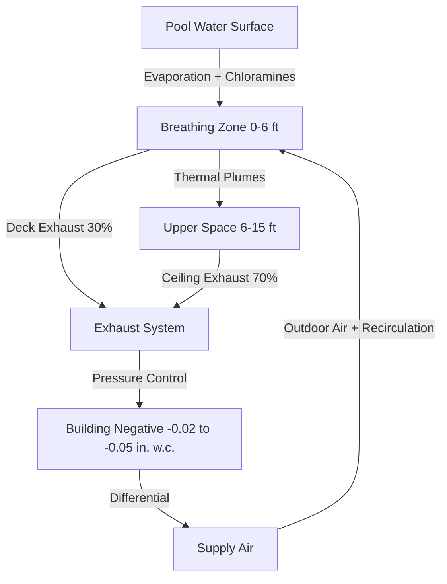
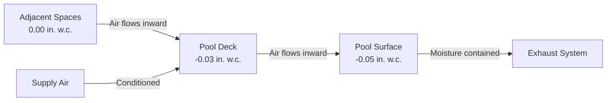

Exhaust air volume determination in natatorium HVAC systems controls chloramine concentration, prevents moisture migration, and maintains occupant comfort. The exhaust strategy must address contaminant removal at the source while managing building pressurization to prevent structural degradation.

## Fundamental Exhaust Requirements

Natatorium exhaust systems serve three critical functions: chloramine removal from breathing zones, humidity control through mass transfer, and building envelope protection via pressure management. The total exhaust volume derives from the highest demand among these three drivers.

### Exhaust Volume Calculation Basis

ASHRAE 62.1 specifies minimum ventilation rates based on occupancy and floor area. For natatoriums, the calculation combines pool water surface area and deck area contributions:

$$Q_{exhaust} = (A_{pool} \times R_{pool}) + (A_{deck} \times R_{deck}) + Q_{occupant}$$

Where:
- $Q_{exhaust}$ = total exhaust airflow (CFM)
- $A_{pool}$ = pool water surface area (ft²)
- $R_{pool}$ = pool surface ventilation rate (CFM/ft²)
- $A_{deck}$ = deck area (ft²)
- $R_{deck}$ = deck ventilation rate (CFM/ft²)
- $Q_{occupant}$ = occupancy-based ventilation (CFM)

| Zone Type | Minimum Ventilation Rate | Notes |
|-----------|--------------------------|-------|
| Pool surface area | 0.06-0.48 CFM/ft² | Varies with activity level |
| Deck area | 0.06 CFM/ft² | ASHRAE 62.1 baseline |
| Spectator area | 7.5 CFM/person | Plus area component |
| Locker rooms | 0.5 CFM/ft² | Separate exhaust recommended |

### Activity-Based Pool Surface Rates

Pool activity directly influences contaminant generation through agitation-enhanced evaporation and bather loading. The pool surface ventilation rate scales with use intensity:

$$R_{pool} = 0.06 + (0.42 \times AF)$$

Where $AF$ is the activity factor (0 for still water, 1.0 for intensive use such as competition or water parks).

## Exhaust Location Strategy

Contaminant stratification in natatoriums creates distinct concentration gradients that demand zone-specific exhaust. Chloramines, being slightly denser than air at typical pool temperatures, exhibit complex behavior influenced by thermal plumes from the water surface.

### Deck Level Exhaust

Deck level exhaust captures contaminants in the breathing zone before convective currents transport them throughout the space. Position exhaust inlets 24-36 inches above finished floor (AFF) around the pool perimeter.

**Deck exhaust velocity requirements:**
- Inlet face velocity: 400-600 FPM
- Capture distance: 6-10 feet from inlet
- Coverage: one inlet per 40-60 linear feet of perimeter

The capture velocity at distance $x$ from an exhaust inlet follows:

$$V_x = V_0 \times \frac{A_{inlet}}{A_{inlet} + 10x^2}$$

Where $V_0$ is inlet face velocity (FPM), $A_{inlet}$ is inlet area (ft²), and $x$ is distance from inlet (ft).

### Ceiling Level Exhaust

Ceiling exhaust removes warm, humid air accumulating at the space upper boundary. This stratified layer forms from buoyant plumes rising from the pool surface, carrying moisture and residual chloramines.

The buoyant plume velocity at height $h$ above the water surface:

$$V_h = 1.15 \times Q_{conv}^{1/3} \times h^{-1/3}$$

Where $Q_{conv}$ is the convective heat gain from the pool surface (BTU/hr-ft²).

## Exhaust Distribution Ratios

Optimal contaminant removal requires coordinated deck and ceiling exhaust. Field measurements demonstrate that deck-level exhaust provides disproportionate chloramine removal relative to airflow percentage.

### Recommended Exhaust Split

| Exhaust Location | Percentage of Total | Removal Efficiency |
|------------------|---------------------|-------------------|
| Deck level (24-36" AFF) | 25-35% | 60-70% of chloramines |
| Ceiling level | 65-75% | 30-40% of chloramines |
| Total | 100% | System performance |

This distribution exploits the mass transfer principle where contaminant capture effectiveness peaks near the generation source. Deck exhaust intercepts chloramines before convective mixing dilutes concentration gradients.

## Chloramine Removal Effectiveness

Chloramine concentration reduction depends on exhaust placement, volumetric exchange rate, and mixing patterns. The contaminant removal effectiveness $\epsilon$ relates to exhaust configuration:

$$\epsilon = \frac{C_{breathing} - C_{exhaust}}{C_{generation} - C_{exhaust}}$$

Where concentrations are measured at breathing zone, exhaust inlet, and generation point respectively.

**Target removal effectiveness:**
- Deck exhaust system: $\epsilon$ = 0.6-0.8
- Ceiling exhaust system: $\epsilon$ = 0.3-0.5
- Combined system: $\epsilon$ = 0.7-0.9

Higher effectiveness values indicate better capture of contaminants before dilution. Deck exhaust achieves superior effectiveness through proximity to source generation.

## Exhaust to Supply Air Ratios

Building pressurization management prevents moisture migration into building assemblies while maintaining occupant comfort. The exhaust-to-supply ratio establishes pressure differentials.

### Standard Operating Ratios

$$\frac{Q_{exhaust}}{Q_{supply}} = 1.05 \text{ to } 1.15$$

This 5-15% exhaust excess creates negative pressure of -0.02 to -0.05 inches water column relative to adjacent spaces. The pressure differential drives airflow direction at penetrations and openings.

**Pressure control zones:**

### Dynamic Pressure Control

Occupancy variations and door operations disturb pressure balance. Modulating exhaust and supply fans through building pressure sensors maintains setpoint within ±0.01 inches water column.

**Control sequence:**
1. Measure space static pressure relative to reference zone
2. Compare to setpoint (-0.03 in. w.c. typical)
3. Modulate exhaust VFD to increase/decrease airflow
4. Adjust supply VFD maintaining constant offset

## Spectator and Locker Room Exhaust

Spectator areas require separate exhaust calculation based on ASHRAE 62.1 occupant density. Locker rooms demand dedicated exhaust preventing odor transfer to pool areas.

| Space Type | Exhaust Basis | Typical Rate |
|------------|---------------|--------------|
| Spectator seating | People + area | 7.5 CFM/person + 0.06 CFM/ft² |
| Locker rooms | 100% outdoor air | 0.5 CFM/ft² minimum |
| Shower areas | Moisture removal | 50 CFM/shower head |

Locker room exhaust must not recirculate to pool spaces. Dedicated exhaust systems prevent cross-contamination and odor transfer.

## Exhaust Air Balance and Verification

Balancing verifies design intent through measured airflow and pressure differentials. Test and balance procedures for natatorium exhaust:

**Testing protocol:**
1. Verify total exhaust airflow within ±10% of design
2. Confirm deck vs. ceiling split within ±5% of specified ratio
3. Measure building static pressure at 5+ locations
4. Verify pressure cascade from adjacent spaces to pool
5. Document all measurements under occupied conditions

**Acceptance criteria:**
- Total exhaust: 90-110% of design CFM
- Building pressure: -0.02 to -0.05 in. w.c.
- Deck exhaust split: 25-35% of total
- All exhaust inlets within ±20% of average flow

Seasonal verification confirms system performance under varying outdoor conditions. Winter operation presents the greatest challenge for pressure control due to increased stack effect.

## Design Implementation Checklist

- [ ] Calculate pool surface exhaust based on activity factor
- [ ] Size deck exhaust for 25-35% of total at 400-600 FPM face velocity
- [ ] Position deck inlets 24-36" AFF, maximum 50' spacing
- [ ] Design ceiling exhaust for 65-75% of total volume
- [ ] Specify exhaust-to-supply ratio of 1.05-1.15
- [ ] Provide building pressure control with ±0.01 in. w.c. accuracy
- [ ] Separate locker room exhaust from pool space recirculation
- [ ] Include provisions for test and balance verification

Exhaust air volume design integrates contaminant control physics, moisture management requirements, and building envelope protection into a unified system strategy that maintains healthy conditions while preventing structural degradation.
