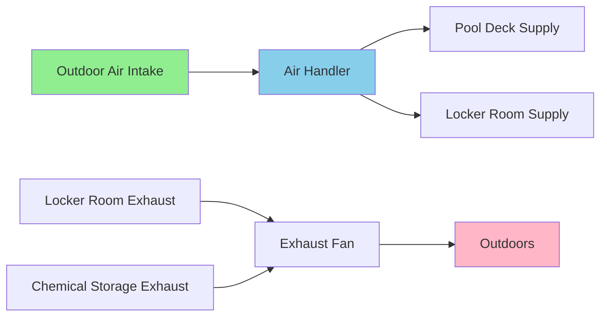
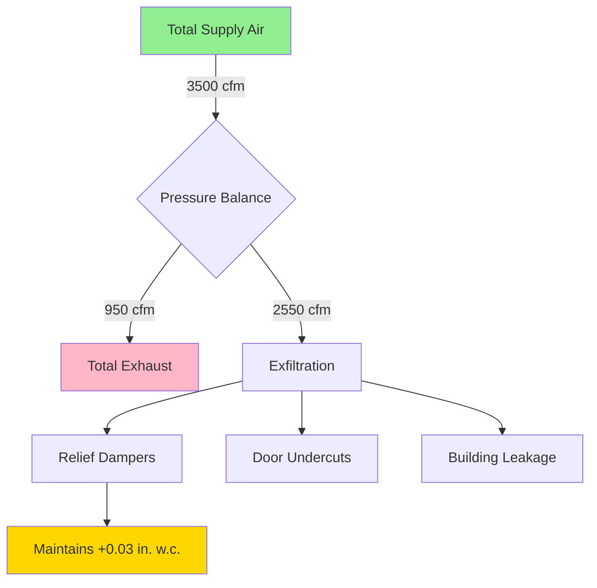

Outdoor air requirements for natatoriums exceed typical commercial spaces due to elevated contaminant generation from chloramines, the necessity for makeup air to balance exhaust systems, and pressurization demands to prevent moisture migration. These requirements derive from multiple code sources that address occupant health, air quality, and building envelope protection.

## Code-Mandated Minimum Outdoor Air Rates

ASHRAE Standard 62.1 establishes baseline outdoor air requirements for natatoriums through two components: area-based rates and occupancy-based rates. The total outdoor air requirement follows:

$$V_{ot} = R_p \times P_z + R_a \times A_z$$

Where:
- $V_{ot}$ = Total outdoor air requirement (cfm)
- $R_p$ = Outdoor air per person (cfm/person)
- $P_z$ = Zone population
- $R_a$ = Outdoor air per unit area (cfm/ft²)
- $A_z$ = Zone floor area (ft²)

### ASHRAE 62.1 Rates by Space Type

| Space Classification | $R_a$ (cfm/ft²) | $R_p$ (cfm/person) | Occupant Density (persons/1000 ft²) |
|----------------------|-----------------|---------------------|-------------------------------------|
| Pool deck (no spectators) | 0.48 | 7.5 | 13 |
| Pool deck with spectator seating | 0.48 | 7.5 | 150 (seating area) |
| Therapy pool | 0.48 | 7.5 | 13 |
| Spa/hot tub | 0.48 | 7.5 | 13 |

The area-based component ($R_a = 0.48$ cfm/ft²) dominates in natatoriums. For a 5,000 ft² pool deck with 20 swimmers:

$$V_{ot} = 7.5 \times 20 + 0.48 \times 5000 = 150 + 2400 = 2550 \text{ cfm}$$

The area term contributes 94% of the requirement, reflecting that surface evaporation and off-gassing exceed occupant-generated contaminants.

## International Mechanical Code Requirements

The IMC Section 403.3.1 mandates minimum outdoor air rates but defers to ASHRAE 62.1 for specific values. IMC Section 403.3.1.1 includes provisions for demand-controlled ventilation but excludes natatoriums from this option due to the area-dominant contaminant source.

IMC Section 403.4 requires that outdoor air intakes be located to avoid contamination, positioned minimum 10 feet from exhaust outlets and hazardous sources. For natatoriums, this prevents recirculation of chloramine-laden exhaust air.

## Chloramine Dilution Requirements

Trichloramine (NCl₃) concentration drives actual outdoor air needs beyond code minimums. Trichloramine volatilizes from the water surface when chlorine reacts with nitrogen compounds, creating the characteristic "chlorine smell" and respiratory irritation.

The mass balance for contaminant dilution establishes outdoor air requirements:

$$V_{oa} = \frac{G}{C_s - C_{oa}}$$

Where:
- $V_{oa}$ = Required outdoor air rate (cfm)
- $G$ = Contaminant generation rate (mg/hr)
- $C_s$ = Maximum acceptable space concentration (mg/m³)
- $C_{oa}$ = Outdoor air contaminant concentration (mg/m³)

For trichloramine, recommended space concentrations range from 0.2-0.5 mg/m³. Generation rates vary with bather load, water chemistry, and water temperature. Typical generation rates:

- Recreational pool: 5-15 mg/hr per swimmer
- Competitive pool: 15-25 mg/hr per swimmer
- Therapy/spa: 20-40 mg/hr per user

A recreational pool with 20 swimmers generating 10 mg/hr each requires:

$$V_{oa} = \frac{20 \times 10}{(0.3 - 0.02) \times 2.12} = \frac{200}{0.594} = 337 \text{ m}^3\text{/hr} = 198 \text{ cfm}$$

This calculation assumes outdoor air trichloramine concentration of 0.02 mg/m³ and target space concentration of 0.3 mg/m³. The conversion factor 2.12 cfm = 1 m³/hr.

In practice, water surface area correlates more reliably with chloramine generation. Empirical guidelines suggest 0.3-0.5 cfm/ft² of water surface as minimum outdoor air for acceptable air quality.

## Makeup Air for Exhaust Systems

Natatoriums require exhaust ventilation for locker rooms, restrooms, and chemical storage areas. The HVAC system must provide makeup air equal to total exhaust to prevent building depressurization.

Total outdoor air must satisfy:

$$V_{oa,total} = \max(V_{oa,62.1}, V_{oa,dilution}) + \sum V_{exhaust}$$

For a facility with:
- ASHRAE 62.1 requirement: 2,550 cfm
- Locker room exhaust: 800 cfm
- Chemical storage exhaust: 150 cfm

$$V_{oa,total} = 2550 + 800 + 150 = 3500 \text{ cfm}$$

## Pressurization Strategy

Maintaining slight positive pressure (0.02-0.05 in. w.c.) in the pool enclosure prevents moisture migration into adjacent spaces and building cavities. This requires outdoor air supply to exceed total exhaust by 5-10%.

### Pressure Balance Calculation

For the previous example with 3,500 cfm outdoor air and 950 cfm exhaust:

$$V_{supply} = V_{oa,total} = 3500 \text{ cfm}$$
$$V_{exhaust} = 950 \text{ cfm}$$
$$V_{excess} = 3500 - 950 = 2550 \text{ cfm}$$

This excess air exfiltrates through doors, relief dampers, and building leakage, creating positive pressure. The pressure difference relates to flow through openings by:

$$\Delta P = K \times Q^2$$

Where $K$ depends on opening geometry and area. For typical natatorium construction with relief dampers, 2,000-3,000 cfm excess flow produces 0.02-0.05 in. w.c. positive pressure.

## Selection Methodology

Determine outdoor air requirements through this sequence:

1. **Calculate ASHRAE 62.1 minimum** using area and occupancy rates
2. **Assess chloramine dilution needs** based on water surface area (0.3-0.5 cfm/ft²)
3. **Sum all exhaust requirements** from support spaces
4. **Apply pressurization factor** (5-10% additional supply)
5. **Select governing requirement** (typically exhaust makeup plus pressurization)

Most natatoriums require outdoor air rates of 0.5-0.75 cfm per square foot of pool deck area to simultaneously satisfy code minimums, contaminant dilution, exhaust makeup, and pressurization. High-use facilities with intensive bather loads may require up to 1.0 cfm/ft² for adequate chloramine control.

Energy recovery equipment becomes economically justified at these high outdoor air rates, with annual energy savings offsetting equipment costs within 3-5 years in most climates. However, recovery equipment must resist corrosion from chloramine exposure and maintain separation between supply and exhaust airstreams to prevent cross-contamination.
