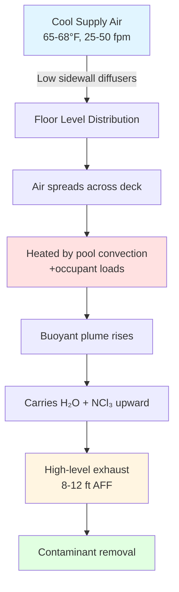
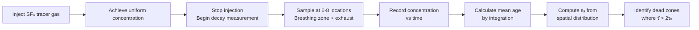

Ventilation effectiveness quantifies how efficiently outdoor air removes contaminants and provides fresh air to occupied zones. In natatoriums, where moisture, chloramines, and thermal stratification dominate the indoor environment, understanding ventilation effectiveness separates functional systems from failed designs.

## Air Change Effectiveness Factor

Air change effectiveness ($\varepsilon_a$) compares actual contaminant removal to ideal plug flow conditions:

$$\varepsilon_a = \frac{\tau_n}{\bar{\tau}} = \frac{C_e - C_s}{C_r - C_s}$$

Where:
- $\tau_n$ = nominal time constant (room volume/ventilation rate)
- $\bar{\tau}$ = mean age of air in occupied zone
- $C_e$ = exhaust air contaminant concentration
- $C_s$ = supply air contaminant concentration
- $C_r$ = room average contaminant concentration

For perfect mixing ventilation, $\varepsilon_a = 1.0$. Displacement ventilation in properly designed natatoriums achieves $\varepsilon_a = 1.2$ to $1.4$, indicating superior contaminant removal. Values below 0.9 signal short-circuiting or dead zones.

## Displacement vs Mixing Ventilation Performance

| Ventilation Strategy | $\varepsilon_a$ Range | Supply Temperature Differential | Typical Application | Contaminant Removal |
|---------------------|---------------------|--------------------------------|-------------------|-------------------|
| Mixing (Overhead Supply/Exhaust) | 0.85-1.05 | 15-25°F below room | Standard pools | Moderate |
| Displacement (Low-velocity sidewall) | 1.15-1.40 | 2-5°F below room | Competition facilities | Excellent |
| Stratified (Ceiling supply, low exhaust) | 0.60-0.85 | Variable | Not recommended | Poor |
| Hybrid (Displacement + overhead mixing) | 1.05-1.25 | 5-10°F below room | Natatorium/spa combination | Good |

**Physics of Displacement Ventilation:**

Displacement systems exploit buoyancy-driven stratification. Cool supply air ($\rho_{supply} > \rho_{room}$) enters near floor level at low velocity (25-50 fpm), spreads across the floor, and is heated by convective loads from the water surface, occupants, and equipment. The heated air rises, creating a stable thermal gradient:

$$\frac{dT}{dz} = \frac{q}{kA}$$

Where:
- $dT/dz$ = vertical temperature gradient
- $q$ = convective heat flux from water surface
- $k$ = effective thermal conductivity of air layer
- $A$ = water surface area

This upward flow carries moisture and chloramines to high-level exhaust grilles. The neutral plane forms at approximately 6-8 feet above the pool deck in properly designed systems.

## Stratification Effects and Thermal Gradients

Natatoriums naturally stratify due to the large upward sensible heat flux from the pool surface (typically 15-30 Btu/hr-ft²). The Richardson number quantifies stratification stability:

$$Ri = \frac{g \beta \Delta T H}{U^2}$$

Where:
- $g$ = gravitational acceleration (32.2 ft/s²)
- $\beta$ = thermal expansion coefficient (1/T absolute)
- $\Delta T$ = vertical temperature difference
- $H$ = characteristic height (ceiling height)
- $U$ = supply air velocity

For $Ri > 1.0$, buoyancy forces dominate and stratification is stable. For $Ri < 0.1$, mechanical mixing dominates. Natatoriums with displacement ventilation typically operate at $Ri = 2$ to $5$, maintaining controlled stratification that enhances contaminant removal.

**Problematic stratification** occurs when:
1. Supply air velocity is too low ($U < 20$ fpm) causing excessive $Ri$ and stagnant layers
2. Supply temperature is too high, eliminating the density differential needed for floor spreading
3. Exhaust placement is too low, short-circuiting the buoyant plume

## Contaminant Removal Efficiency

Contaminant removal effectiveness ($\varepsilon_c$) specifically addresses pollutant extraction:

$$\varepsilon_c = \frac{C_r - C_s}{C_b - C_s}$$

Where $C_b$ = breathing zone contaminant concentration.

For chloramines (NCl₃) in natatoriums, displacement systems achieve $\varepsilon_c = 1.3$ to $1.6$ compared to $\varepsilon_c = 0.9$ to $1.1$ for mixing systems. This 40-50% improvement in contaminant removal directly correlates with reduced occupant complaints and respiratory irritation.

The mass balance for steady-state chloramine concentration in the breathing zone:

$$C_b = C_s + \frac{G}{\varepsilon_c \cdot Q}$$

Where:
- $G$ = chloramine generation rate (lb/hr)
- $Q$ = outdoor air ventilation rate (cfm)

This equation demonstrates that increasing ventilation effectiveness ($\varepsilon_c$) reduces breathing zone concentration without increasing airflow, saving energy.

## Air Age Calculations and Tracer Gas Testing

Mean air age ($\bar{\tau}$) at a point represents the average time elapsed since air molecules entered the space. The local mean age of air is calculated from tracer gas decay:

$$\bar{\tau}(x,y,z) = \int_0^\infty \left(1 - \frac{C(t)}{C_0}\right) dt$$

Where:
- $C(t)$ = tracer gas concentration at time $t$
- $C_0$ = initial tracer concentration

**Tracer gas testing protocol for natatoriums:**

Dead zones exist where $\bar{\tau} > 2\tau_n$. In natatoriums, common dead zones include:
- Corners with inadequate air circulation
- Areas below diving boards or platforms
- Spaces behind large pool equipment
- Alcoves with therapy pools or spas

## CFD Modeling for Design Optimization

Computational Fluid Dynamics (CFD) solves the Navier-Stokes equations numerically to predict airflow patterns, temperature distributions, and contaminant transport:

**Conservation of Mass:**
$$\frac{\partial \rho}{\partial t} + \nabla \cdot (\rho \mathbf{u}) = 0$$

**Conservation of Momentum:**
$$\rho \frac{D\mathbf{u}}{Dt} = -\nabla p + \mu \nabla^2 \mathbf{u} + \rho \mathbf{g}$$

**Conservation of Energy:**
$$\rho c_p \frac{DT}{Dt} = k \nabla^2 T + \dot{q}$$

**Contaminant Transport:**
$$\frac{\partial C}{\partial t} + \mathbf{u} \cdot \nabla C = D \nabla^2 C + S$$

Where $S$ represents chloramine generation from the pool surface.

| CFD Analysis Parameter | Typical Grid Resolution | Boundary Condition | Output Metric |
|------------------------|------------------------|-------------------|---------------|
| Velocity field | 1-3 ft cells | Supply: velocity inlet Exhaust: pressure outlet | Streamlines, velocity magnitude |
| Temperature distribution | 1-2 ft cells | Pool surface: 82-84°F Walls: measured values | Vertical gradient, $dT/dz$ |
| Chloramine concentration | 2-4 ft cells | Pool surface: generation rate Supply: zero concentration | $\varepsilon_c$, breathing zone levels |
| Mean age of air | 2-4 ft cells | Supply: zero age Walls: zero flux | $\bar{\tau}$ distribution, dead zones |

CFD modeling identifies issues before construction:
- Predicts air velocity at swimmer head height (target < 50 fpm to prevent draft)
- Locates thermal stratification planes
- Optimizes diffuser placement for maximum $\varepsilon_a$
- Quantifies chloramine levels in spectator seating areas

## Ventilation Efficiency Metrics Summary

| Metric | Symbol | Ideal Value | Natatorium Target | Measurement Method |
|--------|--------|-------------|-------------------|-------------------|
| Air change effectiveness | $\varepsilon_a$ | 1.0 (perfect mixing) | 1.15-1.35 | Tracer gas decay |
| Contaminant removal effectiveness | $\varepsilon_c$ | > 1.0 | 1.20-1.50 | Steady-state concentration |
| Ventilation effectiveness index | VEI | 1.0 | 1.10-1.30 | Combined measurement |
| Air exchange efficiency | $\varepsilon_{AE}$ | 50% | 55-65% | Age of air distribution |

**Practical Design Guidance:**

To achieve high ventilation effectiveness in natatoriums:

1. **Supply air delivery:** Use low-velocity displacement diffusers (25-50 fpm face velocity) positioned 12-24 inches above floor level on sidewalls perpendicular to long pool axis

2. **Supply temperature:** Maintain 2-5°F below pool deck setpoint to ensure floor spreading without excessive temperature gradient discomfort

3. **Exhaust location:** Position exhaust grilles 8-12 feet above finished floor, distributed along pool perimeter to capture rising moisture and chloramine plumes

4. **Airflow rate:** Design for minimum 6 air changes per hour based on pool water surface area and occupancy, but verify with contaminant generation calculations

5. **Validation:** Commission systems using tracer gas testing to verify $\varepsilon_a \geq 1.1$ in occupied zones before final acceptance

Ventilation effectiveness transforms ventilation rate from a simple volume exchange metric into a performance-based assessment of contaminant control, directly improving indoor air quality while potentially reducing energy consumption through more efficient pollutant removal.
