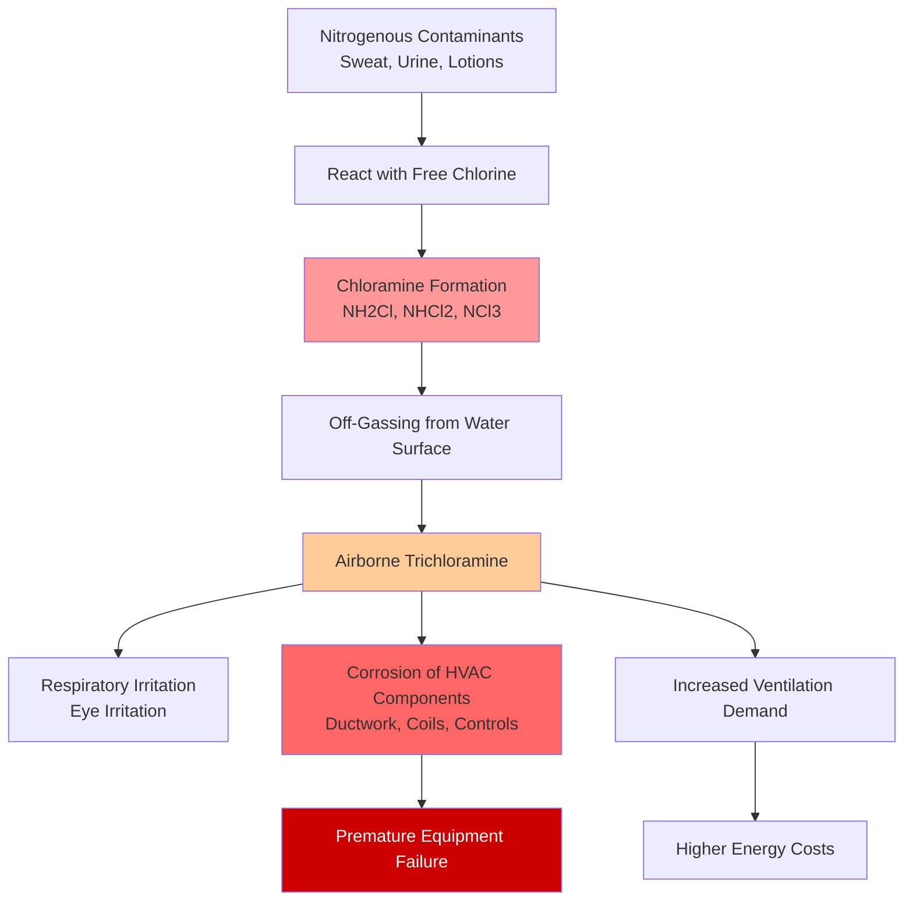

Pool water chemistry directly determines HVAC system performance, longevity, and air quality in natatoriums. The interaction between sanitizers, pH levels, and temperature creates corrosive airborne compounds that demand specialized ventilation and materials selection.

## Chloramine Formation and Off-Gassing

When chlorine-based sanitizers react with nitrogenous contaminants (sweat, urine, cosmetics), they form chloramines through sequential substitution reactions:

$$NH_3 + HOCl \rightarrow NH_2Cl + H_2O \quad \text{(monochloramine)}$$

$$NH_2Cl + HOCl \rightarrow NHCl_2 + H_2O \quad \text{(dichloramine)}$$

$$NHCl_2 + HOCl \rightarrow NCl_3 + H_2O \quad \text{(trichloramine)}$$

Trichloramine ($NCl_3$) is the primary concern for HVAC systems. This volatile compound has a vapor pressure approximately 100 times greater than water at typical pool temperatures, causing it to readily transfer from the water surface to the air space. The rate of off-gassing follows Henry's Law, increasing exponentially with water temperature and agitation.

## ASHRAE Air Quality Standards

ASHRAE Standard 62.1 establishes air quality requirements for natatoriums, though specific trichloramine limits are not federally mandated in the United States. Industry best practice, based on European standards and health research, targets maximum trichloramine concentrations of 0.5 mg/m³, with preferred levels below 0.2 mg/m³.

To achieve these targets, ASHRAE recommends minimum ventilation rates of:

- **Deck areas:** 0.48 cfm/ft² (6 air changes per hour minimum)
- **Pool water surface:** 0.06 cfm/ft² additional outdoor air

These rates assume proper water chemistry management. Poor water chemistry can require ventilation rates 2-3 times higher to maintain acceptable air quality.

## pH Influence on Corrosion and Off-Gassing

Water pH affects both chloramine formation rates and HVAC corrosion potential through two mechanisms:

**Chloramine Formation:** Lower pH (6.5-7.0) favors trichloramine formation over mono- and dichloramines, increasing off-gassing rates by 40-60% compared to pH 7.4-7.6.

**Corrosion Acceleration:** The combined presence of chloride ions and acidic conditions (from $NCl_3$ and $HCl$ hydrolysis products) creates aggressive corrosion on metal surfaces:

$$NCl_3 + 3H_2O \rightarrow NH_3 + 3HOCl$$

$$HOCl \rightarrow H^+ + OCl^-$$

This reaction produces hydrochloric acid in condensate, dropping surface pH to 2-4 on cooling coils and ductwork. Galvanized steel experiences 8-12 times faster corrosion rates under these conditions compared to neutral environments.

## Sanitization Methods Comparison

| Sanitization Method | Primary Chemical | Chloramine Formation | HVAC Corrosion Risk | Ventilation Impact | Material Requirements |
|---------------------|-----------------|----------------------|---------------------|--------------------|-----------------------|
| **Chlorine Gas** | $Cl_2$ | High (if poor control) | Very High | 1.0× baseline | 316 SS, special coatings |
| **Sodium Hypochlorite** | $NaOCl$ | High (if poor control) | High | 1.0× baseline | 316 SS, epoxy-coated |
| **Cal-Hypo** | $Ca(OCl)_2$ | High (if poor control) | High | 1.0× baseline | 316 SS, epoxy-coated |
| **Saltwater Chlorination** | $HOCl$ (generated) | Moderate-High | Very High (chlorides) | 0.9-1.1× baseline | 316 SS required, titanium preferred |
| **UV + Chlorine** | $HOCl$ (reduced) | Low-Moderate | Moderate | 0.5-0.7× baseline | 304 SS acceptable, epoxy recommended |
| **Ozone + Chlorine** | $O_3$ + $HOCl$ (reduced) | Low | Low-Moderate | 0.4-0.6× baseline | Ozone-resistant materials, 304 SS |
| **Bromine** | $HOBr$ | Very Low (bromamines less volatile) | Moderate | 0.6-0.8× baseline | Similar to chlorine systems |

**Notes:**
- Baseline ventilation = ASHRAE 62.1 minimum rates
- All hybrid systems (UV, ozone) maintain residual halogen sanitizer
- Material specifications: 316 SS = Type 316 stainless steel; 304 SS = Type 304 stainless steel

## Ventilation Requirements Based on Water Chemistry

The relationship between water chemistry management and required ventilation follows empirical correlations derived from measured trichloramine concentrations:

$$\text{Required OA} = \text{OA}_{\text{base}} \times \left(1 + 2.5 \times \frac{[\text{Combined Cl}]}{[\text{Free Cl}]}\right)$$

Where:
- $\text{OA}_{\text{base}}$ = ASHRAE minimum outdoor air rate
- $[\text{Combined Cl}]$ = Combined chlorine concentration (ppm)
- $[\text{Free Cl}]$ = Free chlorine concentration (ppm)

Well-maintained pools maintain combined chlorine below 0.2 ppm with free chlorine at 1-3 ppm, yielding a ratio below 0.1 and minimal ventilation increase. Poorly maintained pools with ratios exceeding 0.5 require 2.25× baseline ventilation to achieve equivalent air quality.

## HVAC Design Implications

**Material Selection:**
- Coils: Type 316 stainless steel, copper-nickel alloys (70/30), or epoxy-coated aluminum
- Ductwork: Type 316 stainless steel, fiberglass-reinforced plastic (FRP), or PVC-coated galvanized steel
- Fasteners: Type 316 stainless steel exclusively
- Controls: NEMA 4X enclosures with conformal coating on circuit boards

**System Configuration:**
- Dedicated outdoor air systems (DOAS) separate from recirculation to prevent cross-contamination
- Minimum 60% outdoor air fraction to dilute chloramines
- Cooling coil face velocity limited to 400-450 fpm to minimize condensate carryover
- Drain pans with continuous slope (minimum 1/8" per foot) and trapped drains

**Dehumidification Capacity:**
- Account for elevated evaporation rates from water chemistry-induced surface tension reduction
- Size for 125-150% of calculated evaporation rate when combined chlorine exceeds 0.3 ppm

**Energy Recovery:**
- Avoid hygroscopic wheels (contamination and corrosion)
- Use plate heat exchangers with corrosion-resistant materials
- Design for easy access and periodic washing of surfaces

Proper water chemistry management reduces HVAC equipment costs by 30-40% through reduced material requirements and extends equipment life from 8-12 years to 15-20 years. The operational energy penalty for poor water chemistry ranges from 15-35% due to increased ventilation requirements and reduced heat exchanger effectiveness from corrosion.
