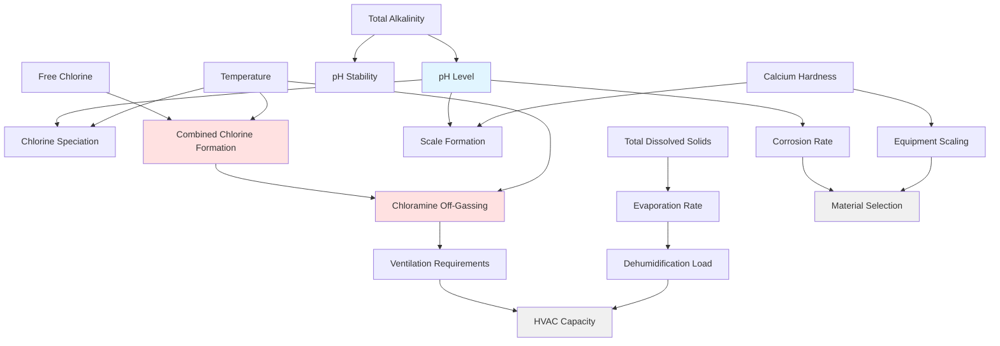

## Overview

Pool water chemistry directly influences HVAC system performance, material selection, and operational requirements in natatorium facilities. Chemical parameters determine the rate of chloramine formation, corrosive potential of the environment, and required ventilation rates. Understanding these relationships is essential for designing HVAC systems that maintain air quality while withstanding the harsh chemical environment.

## Chlorine Chemistry and HVAC Impact

### Free Chlorine vs Combined Chlorine

Free chlorine exists in equilibrium between hypochlorous acid (HOCl) and hypochlorite ion (OCl⁻), governed by pH:

$$\ce{HOCl <=> H+ + OCl-}$$

The dissociation constant is:

$$K_a = \frac{[\ce{H+}][\ce{OCl-}]}{[\ce{HOCl}]} = 3.0 \times 10^{-8} \text{ at } 25°\text{C}$$

When free chlorine reacts with nitrogenous compounds from bathers (urea, sweat, cosmetics), combined chlorine forms:

$$\ce{HOCl + NH3 -> NH2Cl + H2O}$$ (monochloramine)

$$\ce{NH2Cl + HOCl -> NHCl2 + H2O}$$ (dichloramine)

$$\ce{NHCl2 + HOCl -> NCl3 + H2O}$$ (trichloramine)

Dichloramine and trichloramine are volatile and escape into the air space, creating the characteristic pool odor and driving HVAC ventilation requirements. Higher combined chlorine concentrations increase off-gassing rates and necessitate increased outdoor air ventilation.

### pH Influence on System Design

The pH level affects both chlorine speciation and material corrosion rates. The Henderson-Hasselbalch equation describes the chlorine equilibrium:

$$\text{pH} = \text{pK}_a + \log\left(\frac{[\ce{OCl-}]}{[\ce{HOCl}]}\right)$$

Where pK_a = 7.52 at 25°C. At pH 7.5, approximately 50% of free chlorine exists as HOCl (the more effective disinfectant). Lower pH increases HOCl percentage but also increases corrosion potential on HVAC components. Higher pH reduces disinfection effectiveness, potentially requiring higher total chlorine levels and increasing chloramine formation.

## Critical Chemical Parameters

## Parameter Ranges and HVAC Implications

| Parameter | Acceptable Range | HVAC Impact | Control Strategy |
|-----------|------------------|-------------|------------------|
| **pH** | 7.2 - 7.8 | Corrosion increases below 7.0; scaling increases above 8.0 | Specify corrosion-resistant materials; monitoring systems |
| **Free Chlorine** | 1.0 - 3.0 ppm | Higher levels increase chloramine formation potential | Adequate ventilation for anticipated loads |
| **Combined Chlorine** | < 0.2 ppm | Above 0.4 ppm significantly increases off-gassing | Design for minimum 0.5 cfm/ft² when elevated |
| **Total Alkalinity** | 80 - 120 ppm | Low alkalinity causes pH instability and corrosion | pH buffer capacity affects material longevity |
| **Calcium Hardness** | 200 - 400 ppm | Below 150 ppm increases corrosion; above 500 ppm causes scaling | Heat exchanger and coil material selection |
| **Total Dissolved Solids (TDS)** | < 1500 ppm | Higher TDS increases evaporation rate and corrosive potential | Affects dehumidification capacity requirements |
| **Cyanuric Acid** | 30 - 50 ppm (outdoor pools) | Not recommended for indoor pools; reduces chlorine effectiveness | Avoid in natatoriums to minimize chloramine formation |
| **Oxidation-Reduction Potential (ORP)** | 650 - 750 mV | Indicates sanitizer effectiveness; low ORP requires higher chlorine | Monitor for chemical control verification |

## Design Considerations

### Material Compatibility

The corrosive environment created by chlorine species, low pH, and elevated humidity requires careful material selection:

- **Ductwork**: 316L stainless steel, fiberglass-reinforced plastic (FRP), or PVC-coated galvanized steel
- **Coils**: Coated copper-nickel, polymer-coated aluminum, or titanium for extreme environments
- **Fasteners**: 316 stainless steel minimum; avoid galvanized hardware
- **Insulation**: Closed-cell foam resistant to chlorine degradation

### Alkalinity and pH Buffer Capacity

Total alkalinity provides pH buffering capacity. Insufficient alkalinity (below 80 ppm) results in pH instability, causing rapid swings that accelerate corrosion of HVAC components. The relationship is:

$$\text{Buffer Capacity} \propto [\ce{HCO3-}] + 2[\ce{CO3^2-}]$$

Low buffer capacity requires more frequent chemical adjustments, potentially exposing HVAC materials to transient corrosive conditions during pH correction.

### Calcium Hardness and Scaling

The Langelier Saturation Index (LSI) predicts scaling or corrosive tendency:

$$\text{LSI} = \text{pH} - \text{pH}_s$$

Where pH_s is the saturation pH. Positive LSI indicates scaling tendency; negative LSI indicates corrosive tendency. For HVAC design:

- LSI between -0.3 and +0.3 is ideal
- Negative LSI accelerates corrosion of heat exchangers and coils
- Positive LSI causes scale buildup, reducing heat transfer efficiency

### TDS Impact on Evaporation

Higher TDS reduces water vapor pressure, slightly decreasing evaporation rates. However, elevated TDS typically indicates poor water quality with higher chloramine potential. The modified evaporation equation accounting for TDS:

$$E = A \times (P_{w,adj} - P_a) \times F$$

Where $P_{w,adj}$ is adjusted water vapor pressure accounting for dissolved solids.

## ASHRAE Guidelines

ASHRAE Applications Handbook Chapter 6 (Places of Assembly) recommends maintaining combined chlorine below 0.4 ppm to minimize air quality issues. When combined chlorine exceeds this threshold, increase outdoor air ventilation from the baseline 0.48 cfm/ft² to 0.5-0.6 cfm/ft² or higher based on actual measurements.

The standard emphasizes coordination between pool operators and HVAC professionals to maintain water chemistry within acceptable ranges, as chemical excursions directly impact air quality and system longevity.

## Operational Integration

Effective natatorium HVAC design accounts for inevitable chemical parameter variations:

1. **Monitoring**: Install continuous pH and ORP sensors with data trending to identify patterns affecting air quality
2. **Redundancy**: Specify materials capable of withstanding short-term excursions beyond normal ranges
3. **Maintenance Access**: Provide accessible locations for inspecting corrosion-prone components
4. **Documentation**: Establish water chemistry logs correlated with HVAC maintenance records to identify chemical impact patterns

The interdependency between water chemistry and HVAC performance requires ongoing coordination between pool maintenance and facilities management teams to optimize both water quality and system longevity.
