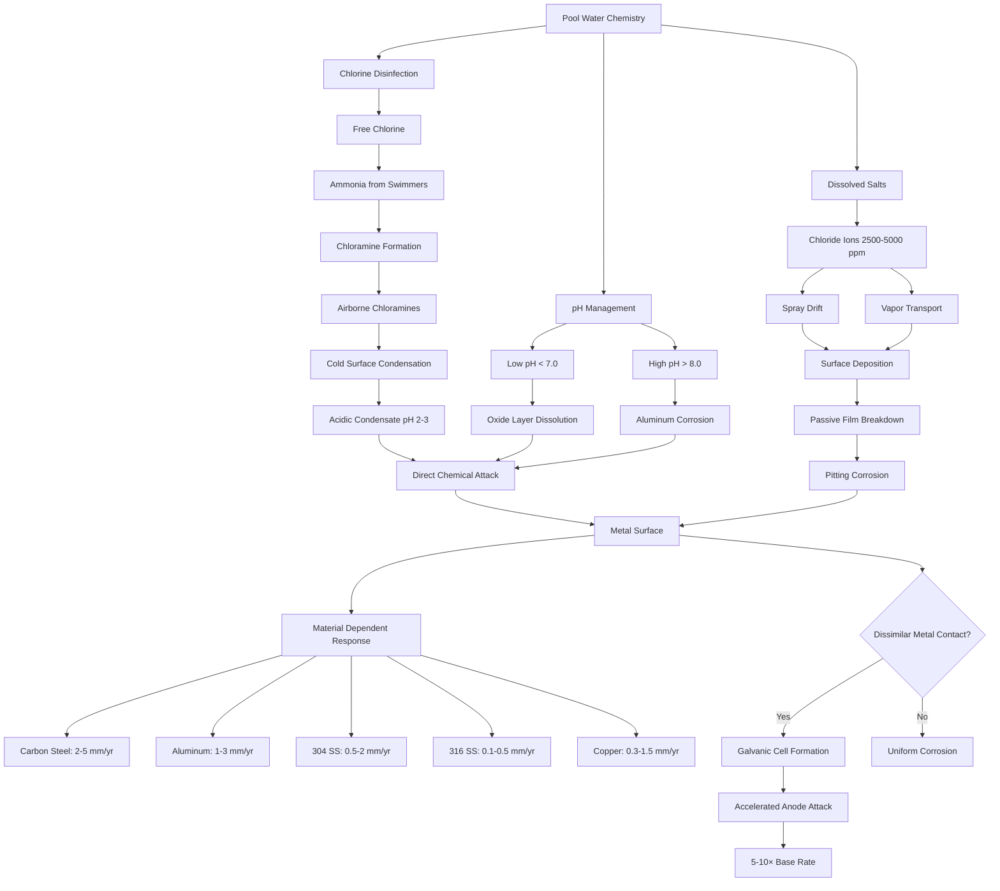

Pool water chemistry creates one of the most corrosive environments for HVAC equipment. The combination of chlorinated compounds, dissolved salts, temperature, and humidity produces electrochemical and chemical attack mechanisms that exceed typical commercial building conditions by an order of magnitude. Understanding these corrosion pathways is essential for proper material selection and system longevity.

## Chloramine Attack Mechanisms

Chloramines form when free chlorine reacts with nitrogen compounds from swimmer load. These volatile compounds evaporate into the air stream and drive aggressive corrosion:

$$\ce{NH3 + HOCl -> NH2Cl + H2O}$$

Monochloramine formation from ammonia and hypochlorous acid.

$$\ce{NH2Cl + HOCl -> NHCl2 + H2O}$$

Dichloramine formation, which is highly volatile and corrosive.

Trichloramine (NCl₃) concentrations above 0.2 mg/m³ indicate poor ventilation and aggressive corrosion conditions. These compounds deposit on cold metal surfaces in air handling units, forming acidic condensate with pH values as low as 2-3. The corrosion rate increases exponentially with chloramine concentration:

$$CR_{Cl} = k \cdot C_{NCl_3}^{1.5} \cdot e^{-E_a/RT}$$

Where:
- $CR_{Cl}$ = corrosion rate (mm/yr)
- $k$ = material-specific constant
- $C_{NCl_3}$ = trichloramine concentration (mg/m³)
- $E_a$ = activation energy (kJ/mol)
- $R$ = gas constant (8.314 J/mol·K)
- $T$ = temperature (K)

## Chloride Ion Effects

Pool water contains 2500-5000 ppm chloride in salt-based systems, compared to <100 ppm in typical potable water. Chloride ions penetrate passive oxide layers on metals and initiate pitting corrosion:

$$\text{Pit Initiation: } \ce{Cl^- + Fe^{2+} -> FeCl2}$$

The critical pitting potential decreases with chloride concentration:

$$E_{pit} = E_0 - \beta \log(C_{Cl^-})$$

Where $E_{pit}$ is the pitting potential (mV), $E_0$ is the base potential, $\beta$ is a material constant (typically 150-300 mV/decade), and $C_{Cl^-}$ is chloride concentration (ppm).

Spray drift and condensate carry these chlorides throughout the mechanical space, attacking equipment far from the pool itself.

## pH Influence on Corrosion

Pool water pH directly affects corrosion rates through multiple mechanisms:

**Low pH (< 7.0) Conditions:**
- Increases hydrogen evolution corrosion
- Dissolves protective oxide layers
- Accelerates galvanic cell activity
- Corrosion rate doubles for each 1.0 pH unit drop below 7.0

**High pH (> 8.0) Conditions:**
- Promotes calcium carbonate scaling
- Protects steel but attacks aluminum
- Increases stress corrosion cracking susceptibility
- Aluminum corrosion rate increases exponentially above pH 8.5

The pH-dependent corrosion rate follows:

$$CR_{pH} = CR_0 \cdot 10^{|pH_{actual} - pH_{neutral}|/\alpha}$$

Where $\alpha$ is a material-dependent coefficient (typically 1.5-3.0 for common alloys).

## Galvanic Corrosion Pathways

Dissimilar metal contact in humid, chloride-rich environments drives galvanic corrosion. The potential difference between metals determines current flow:

$$i_{galv} = \frac{E_{cathode} - E_{anode}}{R_{total}}$$

Common galvanic couples in natatoriums include copper/steel, stainless steel/carbon steel, and aluminum/steel connections. The corrosion current density at the anode increases with area ratio:

$$i_{anode} = i_{galv} \cdot \frac{A_{cathode}}{A_{anode}}$$

Small anodes coupled to large cathodes experience accelerated attack rates exceeding 5-10 mm/yr.

## Corrosion Pathways in Natatorium HVAC

## Material Corrosion Resistance in Pool Environments

| Material | Corrosion Rate (mm/yr) | Resistance Rating | Critical Failure Modes | Recommended Applications |
|----------|------------------------|-------------------|------------------------|--------------------------|
| Carbon Steel (uncoated) | 2.0-5.0 | Poor | Uniform corrosion, rust staining | Not recommended |
| Carbon Steel (epoxy coated) | 0.2-0.5 | Good | Coating breakdown, pitting | Ductwork, structural |
| Galvanized Steel | 0.5-1.5 | Fair | Zinc depletion, red rust | Limited, away from pool |
| Aluminum 3003 | 1.0-3.0 | Fair | Pitting, crevice corrosion | Avoid in pool areas |
| Aluminum 6061 | 0.8-2.0 | Fair to Good | Pitting at welds | Louvers if coated |
| Copper | 0.3-1.5 | Good | Dezincification (brass), pitting | Heat exchangers (cupronickel) |
| 304 Stainless Steel | 0.5-2.0 | Fair | Crevice corrosion, pitting | Limited indoor use |
| 316 Stainless Steel | 0.1-0.5 | Excellent | Crevice corrosion rare | AHU components, fasteners |
| 6% Molybdenum SS (AL-6XN) | <0.05 | Excellent | Minimal under proper conditions | Critical components |
| Titanium | <0.01 | Excellent | Hydrogen absorption rare | Heat exchangers, premium |
| PVC/CPVC | Negligible | Excellent | UV degradation, creep | Ductwork, piping |
| FRP (Fiber Reinforced Plastic) | Negligible | Excellent | Resin degradation, delamination | Ductwork, casings |

**Notes:**
- Corrosion rates assume air temperature 80-85°F, 60-70% RH, 0.3-0.5 mg/m³ trichloramine
- Actual rates vary with chloramine concentration, chloride exposure, and pH
- Crevice and pitting corrosion may penetrate faster than uniform rates suggest

## Material Selection Guidelines

ASHRAE Handbook - HVAC Applications (Chapter 6: Natatoriums) specifies minimum material standards:

1. **Air Handling Units:** 316 stainless steel construction or aluminum with heavy epoxy coating
2. **Ductwork:** FRP, PVC, or hot-dip galvanized steel with phenolic or epoxy coating
3. **Heat Exchangers:** Cupronickel (90/10 or 70/30), titanium, or polymer-coated
4. **Fasteners:** 316 stainless steel minimum, avoid dissimilar metal contact
5. **Controls and Instrumentation:** NEMA 4X rated, conformal-coated electronics

Protective measures include:
- Physical isolation of dissimilar metals with gaskets
- Sacrificial anodes where galvanic couples are unavoidable
- Heavy epoxy or polyurethane coatings (minimum 8-10 mils DFT)
- Regular maintenance and recoating on 2-3 year cycles

## Design Considerations

Minimize corrosion through system design:

- Maintain trichloramine below 0.2 mg/m³ through adequate ventilation (6-8 ACH minimum)
- Keep equipment dewpoint above metal surface temperature to prevent condensation
- Isolate AHUs from pool room in separate mechanical space when possible
- Specify materials one grade higher than calculated minimum for safety factor
- Avoid threaded connections where crevice corrosion initiates

Pool water chemistry control remains the primary defense: maintaining pH 7.2-7.8, free chlorine 1-3 ppm, and minimizing combined chlorine formation through proper oxidation reduces airborne corrosive species at the source.

## References

**ASHRAE Standards:**
- ASHRAE Handbook - HVAC Applications, Chapter 6: Natatoriums
- ASHRAE Standard 62.1: Ventilation for Acceptable Indoor Air Quality

**Industry Guidelines:**
- NACE International SP0487: "Consideration of Microbiologically Influenced Corrosion in Deaerators and Storage Tanks"
- ASTM G48: "Standard Test Methods for Pitting and Crevice Corrosion Resistance of Stainless Steels"
- ASTM G78: "Standard Guide for Crevice Corrosion Testing of Iron-Base and Nickel-Base Stainless Alloys"

**Technical References:**
- Pourbaix, M. "Atlas of Electrochemical Equilibria in Aqueous Solutions" (NACE, 1974)
- Fontana, M.G. "Corrosion Engineering" (McGraw-Hill, 3rd Edition)
