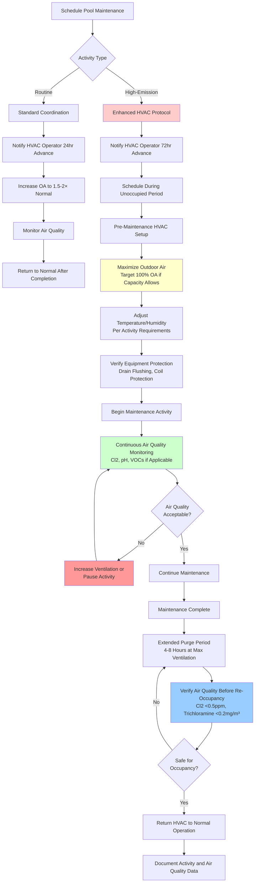

Pool maintenance activities generate extreme chemical off-gassing conditions that exceed normal HVAC design parameters. Coordinating these operations with HVAC adjustments protects equipment from corrosive damage, maintains acceptable indoor air quality, and ensures occupant safety during high-emission events.

## Superchlorination and Shock Treatment

Superchlorination raises free chlorine levels to 10-20× normal concentrations (10-30 ppm) to oxidize accumulated chloramines and organic contaminants. This process creates temporary conditions where chlorine off-gassing and residual chloramine volatilization dramatically increase airborne irritant concentrations.

### Off-Gassing During Shock Treatment

The rate of chlorine and chloramine transfer to the air space during superchlorination follows mass transfer principles, with the flux increasing proportionally to the concentration gradient:

$$\dot{m} = k_L \cdot A \cdot (C_{\text{water}} - C_{\text{air}}/H)$$

Where:
- $\dot{m}$ = Mass transfer rate of chlorine species (lb/hr)
- $k_L$ = Mass transfer coefficient (ft/hr), typically 0.3-0.8 for quiescent pools
- $A$ = Water surface area (ft²)
- $C_{\text{water}}$ = Chlorine concentration in water (ppm)
- $C_{\text{air}}$ = Airborne chlorine concentration (ppm)
- $H$ = Henry's Law constant (dimensionless), ~0.09 for $HOCl$ at 80°F

During shock treatment with $C_{\text{water}} = 20$ ppm, the driving force increases 10-15× compared to normal operation (1.5-2 ppm), demanding proportional ventilation increases to maintain acceptable air concentrations below 1 ppm.

### Required Ventilation Adjustments

HVAC systems must increase outdoor air supply to dilute elevated off-gassing rates. The required ventilation rate during superchlorination is:

$$Q_{\text{shock}} = Q_{\text{normal}} \times \left(3 + 1.5 \times \frac{C_{\text{shock}}}{C_{\text{normal}}}\right)$$

Where:
- $Q_{\text{shock}}$ = Required outdoor air during shock treatment (cfm)
- $Q_{\text{normal}}$ = Normal outdoor air rate per ASHRAE 62.1 (cfm)
- $C_{\text{shock}}$ = Shock chlorine concentration (ppm)
- $C_{\text{normal}}$ = Normal free chlorine concentration (ppm), typically 2 ppm

**Example Calculation:**

For a 2,000 ft² pool requiring baseline ventilation of 480 cfm (0.48 cfm/ft² deck + 0.06 cfm/ft² water surface) during shock treatment to 20 ppm:

$$Q_{\text{shock}} = 480 \times \left(3 + 1.5 \times \frac{20}{2}\right) = 480 \times 18 = 8,640 \text{ cfm}$$

This represents an 18× increase in outdoor air, which exceeds most natatorium HVAC system capacities. Therefore, shock treatment typically occurs during unoccupied periods with maximum ventilation and extended purge times before re-occupancy.

## HVAC Adjustments During Pool Maintenance

| Maintenance Activity | Duration | Outdoor Air Requirement | Recirculation | Temperature Setpoint | Humidity Control | Equipment Protection |
|---------------------|----------|------------------------|---------------|---------------------|------------------|---------------------|
| **Superchlorination (10-20 ppm)** | 8-24 hours | 15-20× normal, 100% OA if possible | Minimize or eliminate | Maintain 78-82°F | Maintain dehumidification | Monitor coil pH, increase drain flushing |
| **Breakpoint Chlorination (5-10× combined Cl)** | 4-12 hours | 10-15× normal | 50% maximum | Maintain 78-82°F | Normal operation | Inspect drains for sediment |
| **Acid Washing (pH 1-2)** | 2-6 hours | 8-12× normal, 100% OA required | Isolate pool area if possible | Normal | Reduce or stop dehumidification | Shutdown if acid fumes reach air handler |
| **Muriatic Acid Addition (pH adjustment)** | 1-2 hours | 3-5× normal | Maintain | Normal | Normal | Monitor condensate pH |
| **Drain and Refill** | 1-3 days | Normal (pool covered) | Normal | Reduce to 70-75°F | Minimal dehumidification needed | Verify drain traps remain filled |
| **Resurfacing (epoxy/plaster)** | 3-14 days | 6-10× normal during curing | 100% OA, no recirculation | Maintain 70-75°F per coating spec | Control per coating requirements | Isolate AHU intake if VOCs detected |
| **Filter Backwashing** | 15-30 minutes | Normal + 20% | Normal | Normal | Normal | None required |
| **Tile Cleaning (acid-based)** | 2-4 hours | 5-8× normal | Maintain | Normal | Normal | Monitor air quality near returns |

**Notes:**
- All outdoor air rates assume proper dilution to maintain chlorine/acid vapor <1 ppm
- Temperature and humidity adjustments depend on coating manufacturer specifications during resurfacing
- Equipment protection measures should be implemented 30 minutes before maintenance begins

## Maintenance Coordination Workflow

## Acid Washing Considerations

Acid washing uses muriatic acid (hydrochloric acid, 15-30% concentration) to remove mineral deposits, stains, and algae from pool surfaces. This process generates $HCl$ vapors that create severe corrosion risks for HVAC equipment.

### Vapor Generation

Hydrochloric acid vapor pressure follows Raoult's Law, with the partial pressure proportional to solution concentration and temperature:

$$P_{HCl} = x_{HCl} \cdot P°_{HCl} \cdot \gamma$$

Where:
- $P_{HCl}$ = Partial pressure of $HCl$ vapor
- $x_{HCl}$ = Mole fraction of $HCl$ in solution
- $P°_{HCl}$ = Vapor pressure of pure $HCl$
- $\gamma$ = Activity coefficient (accounts for non-ideal behavior)

For 20% muriatic acid at 70°F, the equilibrium $HCl$ concentration in air can reach 200-400 ppm at the liquid surface, far exceeding the OSHA ceiling limit of 5 ppm for occupational exposure.

### HVAC Protection Protocol

**Before Acid Washing:**
1. Increase outdoor air to maximum capacity (100% if possible)
2. Verify all condensate drains are flowing freely
3. Flush cooling coil drain pans with clean water
4. Consider temporary intake relocation if acid washing occurs near air handler intakes
5. Monitor condensate pH continuously (target >6.0)

**During Acid Washing:**
1. Maintain maximum ventilation throughout the process
2. If condensate pH drops below 5.0, consider shutting down mechanical cooling to prevent coil damage
3. Monitor air quality at return air locations (target $HCl$ <2 ppm)
4. Keep pool personnel equipped with appropriate respiratory protection

**After Acid Washing:**
1. Continue maximum ventilation for 4-6 hours after acid neutralization
2. Flush all drain pans again with clean water or dilute sodium bicarbonate solution
3. Inspect accessible ductwork and coil surfaces for visible corrosion
4. Document condensate pH readings and any equipment impacts

## Resurfacing Ventilation Requirements

Pool resurfacing with epoxy coatings, plaster, or aggregate finishes generates volatile organic compounds (VOCs) during application and curing. These emissions require sustained high ventilation rates for extended periods.

### Epoxy and Coating Emissions

Epoxy pool coatings release VOCs including:
- Xylene and toluene (aromatic hydrocarbons)
- Methyl ethyl ketone (MEK)
- Aliphatic hydrocarbons
- Amine curing agents

Peak emission rates occur during the first 24-48 hours, with declining rates over 7-14 days until full cure. Total VOC concentrations can reach 10-50 ppm during application and initial cure, requiring continuous high ventilation to maintain <1 ppm in occupied spaces.

### Curing Period HVAC Management

Temperature and humidity during curing significantly affect coating performance:

**Epoxy Systems:**
- Temperature: 70-85°F (manufacturer-specific)
- Relative Humidity: 40-60% maximum
- Cure Time: 5-7 days before water fill, 14 days for full cure
- Ventilation: 8-10× normal outdoor air continuously

**Plaster/Cement-Based Finishes:**
- Temperature: 60-80°F
- Relative Humidity: Keep surface moist for first 24-48 hours (water spray or wet burlap)
- Cure Time: 28 days for full strength, can fill after 7-14 days with special procedures
- Ventilation: Normal rates adequate, focus on temperature control

## Automated Control Integration

Modern building automation systems can coordinate pool maintenance activities with HVAC operations through:

**Pre-Programmed Maintenance Modes:**
- "Shock Treatment Mode": Increases outdoor air to maximum, extends runtime, delays occupancy schedules
- "Acid Wash Mode": Maximum ventilation, temperature hold, condensate pH monitoring alarms
- "Resurfacing Mode": Sustained high ventilation, precise temperature/humidity control per coating specifications

**Interlock Requirements:**
- Chemical feed system interlocks to HVAC mode selection
- Air quality sensor triggers (chlorine, $HCl$, total VOC) override normal scheduling
- Occupancy lockout until air quality verification complete
- Automated documentation of maintenance events and HVAC responses

## Preventive Maintenance Schedule Integration

Coordinate pool and HVAC maintenance activities to minimize operational disruptions:

**Weekly:**
- Water chemistry testing and adjustment (normal HVAC operation)
- Filter backwashing (minimal HVAC impact)
- Skimmer and pump basket cleaning (no HVAC coordination required)

**Monthly:**
- Detailed water balance testing (normal operation)
- Filter inspection and pressure testing (normal operation)
- HVAC air filter replacement (coordinate to minimize pool area exposure to dusty conditions)

**Quarterly:**
- Superchlorination if combined chlorine >0.4 ppm (enhanced HVAC protocol)
- HVAC coil inspection and cleaning (drain pool area if accessing air handlers)
- Tile and surface cleaning with acid-based products (moderate HVAC adjustments)

**Annually:**
- Comprehensive water chemistry analysis including TDS, calcium hardness, alkalinity
- Drain and acid wash if mineral buildup evident (full HVAC coordination protocol)
- HVAC system comprehensive inspection including ductwork, controls, and corrosion assessment
- Coordinate major pool repairs with HVAC shutdown periods if possible

## Air Quality Verification

Before returning natatorium to normal occupancy after high-emission maintenance, verify:

**Chlorine Species:**
- Free chlorine vapor: <0.5 ppm (1-minute average)
- Trichloramine: <0.2 mg/m³ (15-minute average)

**Acid Vapors:**
- $HCl$: <1 ppm (1-minute average)
- pH of condensate: >5.5 at all drain locations

**VOCs (if resurfacing):**
- Total VOC: <1 ppm (continuous measurement)
- Specific compounds below OSHA PELs: Xylene <100 ppm, MEK <200 ppm, Toluene <200 ppm

Proper coordination between pool maintenance and HVAC operations prevents equipment damage, controls operating costs, and protects occupants from harmful chemical exposures during necessary maintenance activities.
