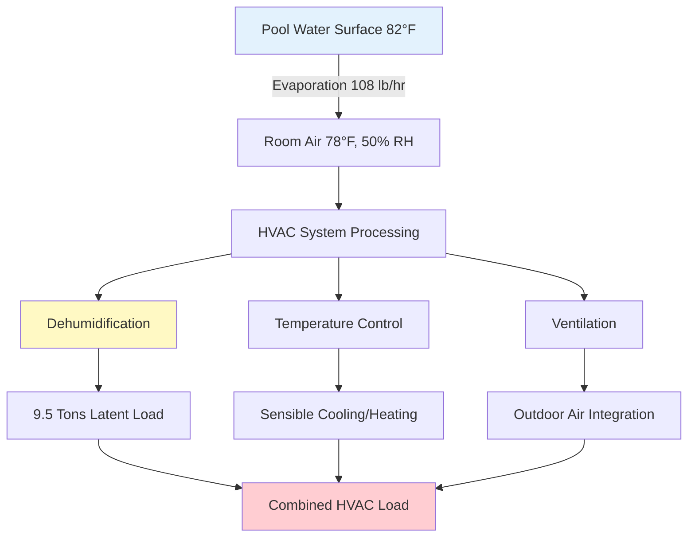
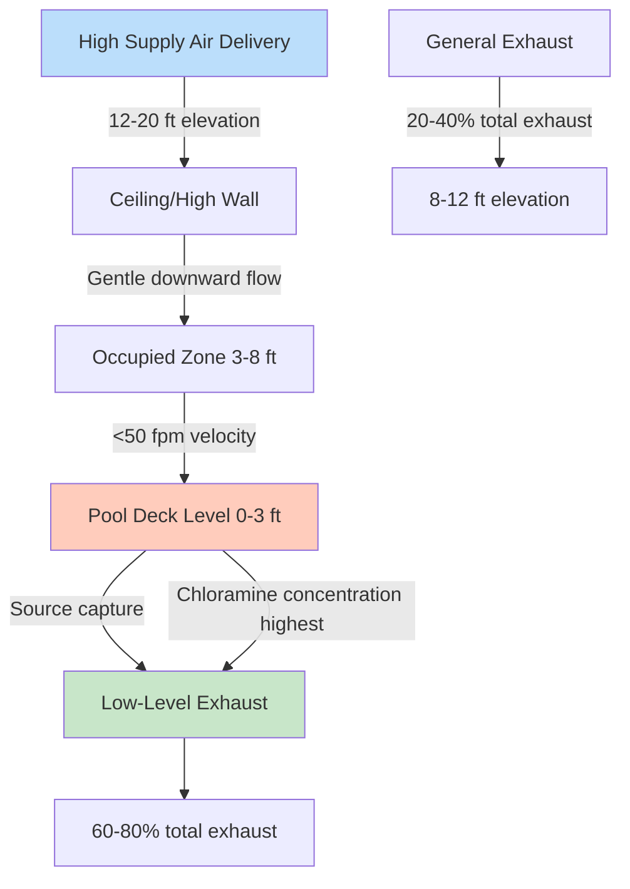
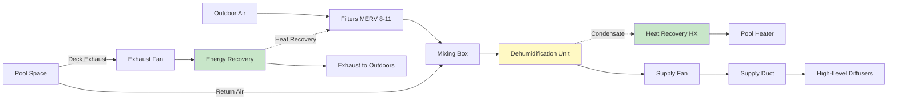

## Unique Challenges of Natatorium Environments

Indoor swimming pool facilities present extraordinary HVAC design challenges unmatched by conventional commercial spaces. The combination of large evaporating water surfaces, elevated humidity requirements, corrosive airborne contaminants, and high occupant expectations creates a demanding engineering environment requiring specialized knowledge and careful system integration.

Three fundamental physics phenomena drive natatorium HVAC design:

1. **Massive latent loads** from continuous water evaporation (100-300 lb/hr typical)
2. **Airborne contaminant generation** from chlorine-nitrogen reactions
3. **Accelerated corrosion** from humid, chemical-laden air

These challenges demand systems significantly more complex than standard comfort HVAC, with typical installed costs of $25-50 per square foot for pool and deck areas alone.

## Fundamental Thermodynamic Principles

### Water Evaporation Physics

Water molecules escape liquid surfaces when kinetic energy exceeds intermolecular attractive forces. The evaporation rate depends on the vapor pressure gradient between saturated air at the water surface and bulk room air:

$$\dot{m}_{evap} = k_m \cdot A \cdot \rho_{air} \cdot (W_{sat,pool} - W_{air})$$

where:
- $\dot{m}_{evap}$ = evaporation rate (lb/hr or kg/hr)
- $k_m$ = mass transfer coefficient (ft/hr or m/hr)
- $A$ = water surface area (ft² or m²)
- $\rho_{air}$ = air density (lb/ft³ or kg/m³)
- $W_{sat,pool}$ = humidity ratio at pool surface temperature (lb/lb or kg/kg)
- $W_{air}$ = humidity ratio of room air (lb/lb or kg/kg)

The mass transfer coefficient increases with air velocity over the water surface:

$$k_m = k_0 \cdot (1 + Bv^{0.9})$$

where $v$ is air velocity (fpm or m/s) and $B$ is an empirical constant (0.0019 for Imperial units). This relationship explains why minimizing air movement over pool surfaces reduces evaporation.

### ASHRAE Evaporation Calculation Method

ASHRAE Applications Handbook Chapter 6 provides the industry-standard empirical correlation:

$$E = A \cdot F_a \cdot (p_{w,pool} - p_{w,air}) \cdot (0.089 + 0.0782v)$$

where:
- $E$ = evaporation rate (lb/hr)
- $A$ = pool water surface area (ft²)
- $F_a$ = activity factor (dimensionless)
- $p_{w,pool}$ = saturation vapor pressure at pool water temperature (in. Hg)
- $p_{w,air}$ = partial vapor pressure of room air (in. Hg)
- $v$ = air velocity over water surface (typically 10-30 fpm)

**Activity factors** account for swimmer-induced turbulence:
- $F_a = 0.5$ for unoccupied pools
- $F_a = 0.65$ for residential pools with minimal activity
- $F_a = 1.0$ for public/competitive pools with high activity
- $F_a = 1.5$ for wave pools, waterslides, therapy jets

### Latent Heat Load Calculation

The thermal energy required to evaporate water equals:

$$Q_{latent} = \dot{m}_{evap} \cdot h_{fg}$$

where $h_{fg}$ = heat of vaporization ≈ 1,060 BTU/lb at typical pool temperatures.

For a 75 ft × 45 ft competitive pool (3,375 ft²) at 82°F with room conditions of 78°F and 50% RH:

**Step 1**: Determine vapor pressures from psychrometric tables:
- $p_{w,pool}$ at 82°F = 1.125 in. Hg (saturated)
- $p_{w,air}$ at 78°F, 50% RH = 0.515 in. Hg

**Step 2**: Calculate evaporation rate with $F_a = 1.0$ and $v = 15$ fpm:

$$E = 3,375 \times 1.0 \times (1.125 - 0.515) \times (0.089 + 0.0782 \times 15)$$
$$E = 3,375 \times 1.0 \times 0.610 \times 1.262 = 2,598 \text{ lb/hr}$$

**Step 3**: Convert to moisture removal rate:

$$\dot{m}_{moisture} = \frac{2,598}{24} = 108 \text{ lb/hr average}$$

**Step 4**: Calculate latent load:

$$Q_{latent} = 108 \times 1,060 = 114,480 \text{ BTU/hr} = 9.5 \text{ tons}$$

This represents only the moisture removal component; total dehumidification capacity must also handle sensible cooling, ventilation loads, and safety margins.

## Design Parameters and Control Setpoints

ASHRAE Standards 62.1 (Ventilation) and Applications Handbook Chapter 6 establish fundamental design criteria.

### Temperature and Humidity Setpoints

| Parameter | Recommended Range | Design Rationale |
|-----------|------------------|------------------|
| Pool water temperature | 78-82°F | Thermal comfort for swimmers |
| Air temperature | 78-84°F | 2-4°F warmer than water prevents chill |
| Relative humidity | 50-60% | Balances comfort and evaporation |
| Maximum humidity | 65% RH | Prevents condensation and mold |
| Minimum humidity | 40% RH | Avoids excessive drying of respiratory tract |
| Air-water temperature difference | +2 to +4°F | Air warmer reduces evaporation and chill |

**Temperature differential physics**: When air temperature equals or exceeds water temperature by 2-4°F, swimmers exiting the pool do not experience evaporative cooling discomfort. Lower differentials cause perceived "cold" despite adequate air temperature.

### Ventilation Requirements

ASHRAE 62.1 specifies minimum outdoor air based on pool area:

$$Q_{OA,min} = 0.48 \times A_{pool} + 0.06 \times A_{deck}$$

where:
- $Q_{OA,min}$ = minimum outdoor air (cfm)
- $A_{pool}$ = pool water surface area (ft²)
- $A_{deck}$ = deck area (ft²)

For the example 3,375 ft² pool with 2,500 ft² deck:

$$Q_{OA,min} = 0.48 \times 3,375 + 0.06 \times 2,500 = 1,620 + 150 = 1,770 \text{ cfm}$$

This rate dilutes chloramines and maintains acceptable indoor air quality. Higher rates (2-3× minimum) may be necessary for:
- Poor water chemistry with elevated chloramine generation
- High bather loads (>30 simultaneous swimmers)
- Inadequate source control measures
- Spectator areas requiring additional ventilation

### Building Pressure Control

Natatoriums must operate at negative pressure relative to adjacent spaces to prevent moisture and odor migration:

$$\Delta P = -0.02 \text{ to } -0.05 \text{ in. w.c.}$$

This requires exhaust airflow to exceed supply airflow:

$$Q_{exhaust} = Q_{supply} + Q_{pressurization}$$

where $Q_{pressurization}$ typically equals 5-10% of supply airflow.

## Dehumidification System Selection

Two primary technologies address natatorium moisture loads: refrigerant-based and desiccant-based systems.

### Refrigerant Dehumidification Systems

Refrigerant systems cool air below its dew point to condense moisture, then reheat the air to prevent overcooling the space.

**Operating cycle:**

1. Return air from pool space enters evaporator coil
2. Cooling to 45-55°F condenses water vapor
3. Condensate drains to waste or heat recovery
4. Cold, dry air passes through condenser coil
5. Reheat restores supply air to 78-84°F
6. Warm, dry air returns to space

**Energy balance:**

$$Q_{evap} = Q_{latent} + Q_{sensible,cooling}$$
$$Q_{cond} = Q_{evap} + W_{comp}$$

where $W_{comp}$ is compressor work input. The condenser heat recovery provides "free" reheat, achieving energy efficiency ratios of 3.5-5.0 lb moisture removed per kWh.

### Desiccant Dehumidification Systems

Desiccant systems use hygroscopic materials (silica gel, molecular sieves, lithium chloride) to adsorb water vapor chemically.

**Operating principles:**

- **Process stream**: Humid air contacts rotating desiccant wheel, water adsorbs, dry air discharges
- **Regeneration stream**: Heated air (180-250°F) drives moisture from desiccant, exhaust to outdoors
- **Continuous operation**: Wheel rotates slowly (6-20 rev/hr) for simultaneous drying and regeneration

**Energy considerations:**

Regeneration heat requirement:

$$Q_{regen} = \dot{m}_{water} \cdot (h_{fg} + q_{ads}) + Q_{sensible,heating}$$

where $q_{ads}$ = heat of adsorption ≈ 1,100-1,150 BTU/lb (exceeds heat of vaporization due to wetting heat).

### System Comparison

| Criteria | Refrigerant System | Desiccant System |
|----------|-------------------|------------------|
| **Moisture removal capacity** | 10-25 lb/hr per ton | 8-20 lb/hr per ton |
| **Operating temperature range** | 50-90°F (limited by refrigerant) | -20 to 120°F (unlimited) |
| **Humidity control precision** | ±5% RH | ±2% RH |
| **Energy source** | Electricity (compressor) | Heat (gas, steam, hot water) |
| **First cost** | Lower ($15-25/lb/day capacity) | Higher ($25-40/lb/day capacity) |
| **Operating cost** | Lower with electric rates <$0.12/kWh | Competitive with low-cost heat |
| **Maintenance complexity** | Moderate (refrigeration expertise) | Higher (wheel cleaning, seals) |
| **Integrated heat recovery** | Inherent (condenser reheat) | Requires separate heat exchanger |
| **Low-temperature performance** | Poor (coil frosting) | Excellent |
| **Part-load efficiency** | Good with VFD control | Excellent (modulating regeneration) |

**Selection guidance:**

- **Refrigerant systems** suit most applications with moderate climates, electric-only facilities, and standard humidity requirements (45-60% RH)
- **Desiccant systems** excel in cold climates, low-humidity requirements (<40% RH), or facilities with low-cost thermal energy sources

## Chloramine Generation and Control

Chloramines represent the most challenging air quality concern in natatoriums.

### Formation Chemistry

Free chlorine (HOCl) reacts with nitrogen-containing organic compounds (urea, sweat, cosmetics) introduced by swimmers:

$$\text{HOCl} + \text{NH}_3 \rightarrow \text{NH}_2\text{Cl} \text{ (monochloramine)}$$
$$\text{HOCl} + \text{NH}_2\text{Cl} \rightarrow \text{NHCl}_2 \text{ (dichloramine)}$$
$$\text{HOCl} + \text{NHCl}_2 \rightarrow \text{NCl}_3 \text{ (trichloramine)}$$

Trichloramine ($\text{NCl}_3$) volatilizes readily from water to air due to low Henry's law constant, causing:

- Eye and respiratory irritation at 0.02-0.05 mg/m³
- Strong "chlorine" odor perception
- Corrosive attack on building materials and HVAC equipment

### Control Strategies Hierarchy

**Primary (source reduction):**
- Maintain proper water chemistry (free chlorine 1-3 ppm, pH 7.2-7.6, combined chlorine <0.2 ppm)
- Enforce pre-swim showers (removes 60-80% of contaminant load)
- Breakpoint chlorination to oxidize chloramines
- UV photolysis or ozone oxidation of chloramines in circulation loop

**Secondary (ventilation):**
- Adequate outdoor air per ASHRAE 62.1 minimum (0.48 cfm/ft² pool area)
- Performance-based ventilation targeting <0.05 mg/m³ trichloramine
- Strategic air distribution with deck-level exhaust and high supply

**Tertiary (air treatment):**
- Activated carbon filtration (60-85% single-pass removal)
- Enhanced outdoor air rates (2-3× ASHRAE minimum)
- Air washing or scrubbing systems for severe cases

## Corrosion Control and Material Selection

Humid, chlorinated environments accelerate corrosion of building materials and HVAC components.

### Corrosion Mechanisms

**Chloride-induced corrosion** attacks passive oxide layers on metals:

$$\text{Fe} + \text{Cl}^- + \text{O}_2 + \text{H}_2\text{O} \rightarrow \text{Fe(OH)}_3 + \text{Cl}^-$$

The chloride ion acts catalytically, regenerating to attack additional metal. High humidity maintains surface moisture films enabling electrochemical reactions.

### Material Selection Guidelines

| Component | Avoid | Specify |
|-----------|-------|---------|
| **Ductwork** | Galvanized steel (5-7 year life) | Stainless steel 304/316, fiberglass, coated aluminum |
| **Fasteners** | Carbon steel | Stainless steel 316, hot-dip galvanized |
| **Structural steel** | Uncoated steel | Epoxy-coated, hot-dip galvanized, or encased |
| **Piping** | Black steel, copper | Stainless steel, CPVC, PVC, HDPE |
| **HVAC coils** | Bare aluminum, copper | Coated coils (epoxy, phenolic) with stainless headers |
| **Electrical** | Standard enclosures | NEMA 4X stainless or fiberglass |
| **Hangers/supports** | Bare steel | Plastic-coated, epoxy-painted, stainless |
| **Diffusers/grilles** | Aluminum, steel | Stainless steel, PVC, powder-coated aluminum |

**Coating requirements:**

- Exposed steel: 3-coat epoxy system (minimum 10 mils DFT)
- Ductwork: Factory-applied epoxy or field-applied mastic
- Regular inspection and touchup every 2-3 years

## Energy Recovery Integration

Natatoriums require substantial outdoor air, creating significant conditioning loads. Energy recovery systems reduce operating costs.

### Heat Recovery Wheel (Enthalpy Wheel)

Rotating desiccant-coated wheel transfers both sensible heat and latent energy between exhaust and supply air streams.

**Total effectiveness:**

$$\varepsilon_{total} = \frac{h_{supply,out} - h_{supply,in}}{h_{exhaust} - h_{supply,in}}$$

Typical values: 70-85% depending on wheel size, rotation speed, and airflow.

**Annual energy savings:**

$$\text{Savings} = Q_{OA} \times \varepsilon \times (h_{exhaust} - h_{OA}) \times \text{hours} \times \text{cost}$$

For 5,000 cfm outdoor air with 8,000 annual hours and $0.10/kWh equivalent energy cost:

$$\text{Savings} = 5,000 \times 0.75 \times 8 \times 8,000 \times 0.10 = \$24,000/\text{year}$$

### Pool Water Heat Recovery

Condensate from dehumidification carries significant thermal energy that can preheat pool water:

$$Q_{condensate} = \dot{m}_{condensate} \times c_p \times (T_{condensate} - T_{pool})$$

For 100 lb/hr condensate at 55°F entering 80°F pool water:

$$Q_{condensate} = 100 \times 1.0 \times (80 - 55) = 2,500 \text{ BTU/hr}$$

Integrated with refrigerant system hot gas heat recovery:

$$Q_{total,recovery} = Q_{condenser} + Q_{condensate}$$

Properly designed systems recover 50-70% of dehumidification energy to pool heating, reducing gas or electric resistance heating.

## Air Distribution Design

Strategic supply and exhaust placement maximizes comfort and contaminant removal.

### Design Principles

**Supply air:**
- High-level delivery (12-20 ft) creates gentle downward displacement flow
- Low discharge velocity (<500 fpm) prevents excessive turbulence over pool
- Temperature 2-4°F above pool water to minimize evaporation

**Exhaust air:**
- 60-80% at deck level (0-6 inches above deck) captures contaminants at source
- 20-40% at general level (8-12 ft) provides overall air circulation
- Continuous perimeter exhaust along pool edge most effective

**Air velocity management:**
- Deck level: <50 fpm to minimize evaporation rate increase
- Occupied zone: 25-50 fpm for comfort without drafts
- Above pool surface: minimize to 10-20 fpm

## Typical System Schematic

## System Sizing Procedure

**Step 1: Calculate evaporation rate**
- Use ASHRAE method with appropriate activity factor
- Account for pool covers if used during closure periods

**Step 2: Determine outdoor air requirement**
- ASHRAE 62.1 minimum (0.48 cfm/ft² pool + 0.06 cfm/ft² deck)
- Increase for chloramine control if water chemistry suboptimal

**Step 3: Calculate total moisture load**
$$\dot{m}_{total} = \dot{m}_{evap} + \dot{m}_{OA} + \dot{m}_{occupants} + \dot{m}_{infiltration}$$

**Step 4: Size dehumidification capacity**
- Base capacity = total moisture load
- Safety factor: 15-25% for design conditions uncertainty
- Future expansion: 10-15% if anticipated

**Step 5: Determine sensible cooling/heating**
- Sensible cooling: occupant loads + solar + lights + equipment
- Heating: envelope losses + outdoor air + pool evaporative cooling
- Integrate condenser heat recovery in energy balance

**Step 6: Select equipment type**
- Refrigerant for standard applications
- Desiccant for extreme conditions or specialty requirements

**Step 7: Design air distribution**
- Supply airflow: sufficient for heating/cooling and dehumidification reheat
- Exhaust airflow: supply + pressurization allowance (5-10%)
- Duct sizing for low velocity (<1,500 fpm) to minimize noise

## Maintenance Requirements

Long-term performance depends on rigorous maintenance protocols.

### Critical Maintenance Tasks

| Frequency | Task | Rationale |
|-----------|------|-----------|
| **Daily** | Water chemistry verification | Prevents chloramine formation |
| **Weekly** | Coil and filter inspection | Detects early corrosion or clogging |
| **Monthly** | Air balance spot check | Ensures design airflows maintained |
| **Quarterly** | Comprehensive TAB verification | Confirms system performance |
| **Quarterly** | Corrosion inspection | Identifies coating failures early |
| **Semiannually** | Carbon filter replacement | Maintains chloramine removal |
| **Annually** | Complete system commissioning | Verifies all controls and sequences |
| **Annually** | Coating touchup | Prevents accelerated corrosion |

### Common Failure Modes

**Inadequate dehumidification:**
- Undersized equipment for actual loads
- Poor water chemistry increasing evaporation
- Fouled coils reducing capacity
- Refrigerant charge loss or compressor failure

**Poor air quality:**
- Insufficient outdoor air volume
- Exhaust air imbalance creating positive pressure
- Failed carbon filters
- Inadequate source control (water chemistry)

**Accelerated corrosion:**
- Coating failures from poor application or mechanical damage
- Excessive humidity from dehumidification failure
- Incorrect material specifications
- Inadequate ventilation creating localized high-humidity zones

## Conclusion

Natatorium HVAC systems demand specialized engineering integrating thermodynamic principles, water chemistry knowledge, corrosion science, and indoor air quality management. Successful designs balance massive latent loads (typically 80-120 lb/hr per 1,000 ft² pool area), maintain precise humidity control (50-60% RH), ensure excellent air quality (<0.05 mg/m³ chloramines), and protect building infrastructure from corrosive attack.

Key success factors include:

- **Accurate load calculation** using ASHRAE methods with appropriate activity factors and actual operating schedules
- **Appropriate equipment selection** matching refrigerant vs. desiccant technology to climate, energy costs, and performance requirements
- **Strategic air distribution** emphasizing source capture with deck-level exhaust and high supply delivery
- **Robust material selection** specifying corrosion-resistant materials and protective coatings throughout
- **Energy recovery integration** capturing 50-70% of conditioning energy through heat wheels, condensate recovery, and refrigerant hot gas recovery
- **Proactive maintenance** including daily water chemistry management, regular air balance verification, and coating inspection programs

Proper execution of these principles produces reliable, efficient natatorium environments supporting swimmer comfort, spectator experience, and long-term facility durability.
