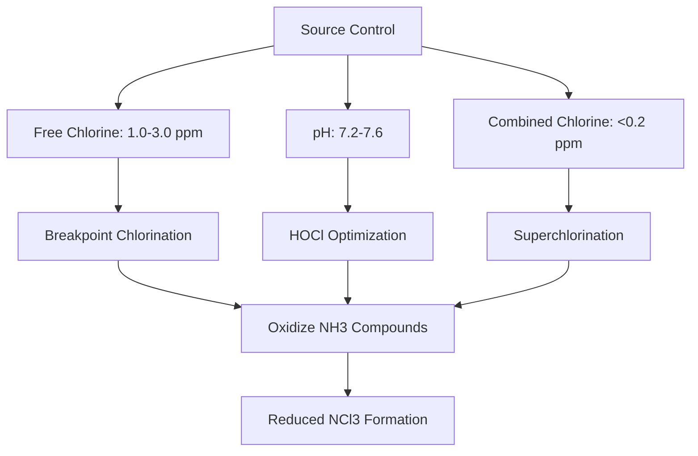
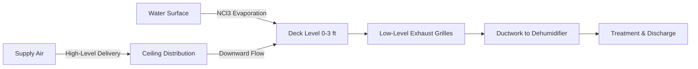
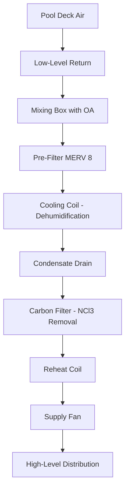

## Overview

Chloramines represent the most significant air quality challenge in natatorium environments, causing respiratory irritation, eye discomfort, and corrosion of building systems. Effective control requires integrated strategies spanning water chemistry management, ventilation system design, and targeted air distribution to remove contaminants at their source. ASHRAE Standard 62.1 and specialized natatorium design guidelines establish the framework for maintaining safe exposure levels.

## Chloramine Formation Chemistry

Chloramines form through chemical reactions between free chlorine disinfectants and nitrogen-containing compounds introduced by swimmers, primarily urea, sweat, and cosmetics.

### Reaction Pathways

The formation proceeds through sequential chlorination reactions:

$$\text{NH}_3 + \text{HOCl} \rightarrow \text{NH}_2\text{Cl} + \text{H}_2\text{O}$$

$$\text{NH}_2\text{Cl} + \text{HOCl} \rightarrow \text{NHCl}_2 + \text{H}_2\text{O}$$

$$\text{NHCl}_2 + \text{HOCl} \rightarrow \text{NCl}_3 + \text{H}_2\text{O}$$

Where:
- $\text{NH}_2\text{Cl}$ = monochloramine (low volatility)
- $\text{NHCl}_2$ = dichloramine (moderate volatility)
- $\text{NCl}_3$ = trichloramine (high volatility, primary air contaminant)

### Volatilization Mechanism

Trichloramine's low Henry's law constant ($H = 0.015$ atm·m³/mol at 25°C) facilitates transfer from aqueous to gas phase. The mass transfer rate follows:

$$J = k_L \times (C_w - \frac{C_a}{H})$$

Where:
- $J$ = mass flux (mg/m²·s)
- $k_L$ = liquid-phase mass transfer coefficient (m/s)
- $C_w$ = concentration in water (mg/L)
- $C_a$ = concentration in air (mg/m³)
- $H$ = Henry's law constant (dimensionless)

Air movement over water surfaces increases $k_L$ proportionally to $v^{0.5}$, where $v$ is air velocity, explaining why still-water conditions reduce emissions.

## Health Effects and Exposure Limits

### Physiological Impacts

Trichloramine exposure produces concentration-dependent health effects:

| Concentration (mg/m³) | Duration | Effects |
|----------------------|----------|---------|
| 0.02-0.05 | Chronic | Mild eye irritation, detectable odor |
| 0.05-0.20 | Hours | Moderate respiratory irritation, conjunctivitis |
| 0.20-0.50 | Minutes | Severe irritation, breathing difficulty, coughing |
| >0.50 | Immediate | Acute respiratory distress, potential pulmonary damage |

### Regulatory Standards

Current exposure guidelines vary by jurisdiction:

- **ANSI/ASHRAE Standard 62.1**: Does not specify numeric limit but requires control of perceived air quality
- **WHO Guidelines**: Maximum 0.5 mg/m³ (short-term exposure)
- **French Standard**: Maximum 0.3 mg/m³ (swimming pools)
- **German DIN 19643**: Maximum 0.2 mg/m³ (public pools)

Occupational exposure for pool operators should remain below 0.05 mg/m³ for 8-hour time-weighted average.

## Source Reduction Strategies

Minimizing chloramine formation at the source provides the most effective control approach.

### Water Chemistry Management

**Optimal chemical parameters:**

**Breakpoint chlorination** achieves complete oxidation of ammonia when free chlorine reaches 10:1 ratio with nitrogen compounds:

$$\text{Cl}_2 \text{ required} = 10 \times [\text{NH}_3\text{-N}]$$

This "breakpoint" eliminates chloramine formation temporarily but requires careful monitoring to avoid overdosing.

### Advanced Oxidation Systems

**UV photolysis** systems positioned in circulation loops destroy chloramines:

$$\text{NCl}_3 + h\nu \rightarrow \text{products}$$

UV dose requirements:
- Medium-pressure lamps: 40-100 mJ/cm² for 90% reduction
- Effective wavelength range: 200-280 nm
- Flow rate: 30-60 seconds contact time

**Ozone injection** provides supplemental oxidation:

$$\text{O}_3 + \text{NCl}_3 \rightarrow \text{products}$$

Typical dosing: 0.2-0.8 mg O₃ per mg combined chlorine, with 3-5 minute contact time before dechlorination.

### Bather Load Management

Swimmer introduction of contaminants directly correlates with chloramine production:

$$R_{\text{NCl}_3} = k \times N_b \times t$$

Where:
- $R_{\text{NCl}_3}$ = trichloramine generation rate (mg/hr)
- $k$ = bather contamination factor (2-5 mg/person·hr)
- $N_b$ = number of bathers
- $t$ = duration (hours)

**Control measures:**
- Pre-swim showers (removes 60-80% of contaminants)
- Swimwear laundering requirements
- Cosmetic restrictions (sunscreen, lotions)
- Proper diaper facilities for children
- Maximum bather load enforcement

## Ventilation System Design

Adequate outdoor air ventilation dilutes and removes airborne chloramines to maintain acceptable concentrations.

### Ventilation Rate Calculations

ASHRAE Standard 62.1 specifies minimum rates:

$$Q_{\text{min}} = 0.48 \times A_{\text{pool+deck}}$$

Where:
- $Q_{\text{min}}$ = minimum outdoor air (cfm)
- $A_{\text{pool+deck}}$ = pool water surface + deck area (ft²)

For a 25m × 25yd competitive pool (5,380 ft²) with 3,000 ft² deck:

$$Q_{\text{min}} = 0.48 \times (5,380 + 3,000) = 4,022 \text{ cfm}$$

This represents a baseline; actual requirements depend on source strength and target concentration.

### Performance-Based Ventilation

Advanced design bases ventilation on contaminant generation rate:

$$Q = \frac{G}{C_t - C_o}$$

Where:
- $Q$ = required ventilation rate (cfm)
- $G$ = chloramine generation rate (mg/hr)
- $C_t$ = target indoor concentration (mg/m³)
- $C_o$ = outdoor concentration (mg/m³, typically ≈0)

Converting to standard units and targeting $C_t = 0.05$ mg/m³:

$$Q = \frac{G \times 2.119}{C_t}$$

For typical generation rates of 30-80 mg/hr (moderate use):

$$Q = \frac{50 \times 2.119}{0.05} = 2,119 \text{ cfm}$$

Higher bather loads or water chemistry issues may require 6,000-10,000 cfm for large facilities.

### Air Change Rate Method

Alternative specification uses volumetric exchange:

$$\text{ACH} = \frac{Q \times 60}{V}$$

Recommended rates:
- Competition pools: 4-6 ACH
- Recreational pools: 6-8 ACH
- Therapy pools (higher temperatures): 8-12 ACH

## Air Distribution for Contaminant Removal

Strategic supply and exhaust placement maximizes removal efficiency.

### Source Capture Principles

Chloramines concentrate at the water-air interface (0-6 feet above deck). Optimal exhaust positioning captures emissions before mixing into upper zones:

**Design principles:**

1. **Exhaust location**: 60-80% of total exhaust within 3 feet of deck level
2. **Supply location**: High sidewall or ceiling mounting (12-20 feet) creates downward displacement flow
3. **Velocity management**: Deck-level velocities <50 fpm prevent excessive evaporation
4. **Air patterns**: Laminar downward flow sweeps contaminants toward low exhausts

### Displacement Ventilation Analysis

The effectiveness factor $\varepsilon$ quantifies removal efficiency:

$$\varepsilon = \frac{C_e - C_s}{C_o - C_s}$$

Where:
- $C_e$ = exhaust concentration
- $C_s$ = supply concentration
- $C_o$ = occupied zone concentration

Displacement systems achieve $\varepsilon = 1.2$ to $1.4$ (20-40% better than mixing), reducing required ventilation:

$$Q_{\text{displacement}} = \frac{Q_{\text{mixing}}}{\varepsilon}$$

### Deck-Level Exhaust Configuration

Typical grill placement:

| Location | Percentage of Total Exhaust | Mounting Height | Spacing |
|----------|------------------------------|-----------------|---------|
| Pool perimeter | 40-50% | 0-6 inches above deck | 10-15 ft on center |
| Gutter/overflow | 20-30% | At water level | Continuous |
| Deck areas | 10-20% | 2-3 ft above deck | 15-20 ft on center |
| General exhaust | 10-20% | 8-12 ft | As needed |

Perimeter exhaust grilles should include removable covers for cleaning and corrosion protection.

## Integration with Dehumidification Systems

Chloramine removal coordinates with moisture control in mechanical dehumidification units.

### Treatment Sequence

Modern pool dehumidifiers incorporate chloramine reduction:

**Carbon filtration** removes gaseous chloramines:

- **Activated carbon**: 0.5-1.0 lb carbon per 1,000 cfm
- **Contact time**: 0.05-0.10 seconds minimum
- **Removal efficiency**: 60-85% single pass
- **Replacement interval**: 6-12 months depending on loading

### Outdoor Air Integration

Dedicated outdoor air (DOA) systems prevent over-ventilation of conditioned space:

$$Q_{\text{OA,total}} = Q_{\text{vent}} + Q_{\text{makeup}}$$

Where:
- $Q_{\text{vent}}$ = ASHRAE 62.1 minimum (4,000+ cfm)
- $Q_{\text{makeup}}$ = Exhaust makeup (typically 90% of ventilation)

Energy recovery reduces conditioning loads:

$$Q_{\text{recovered}} = Q_{\text{OA}} \times \varepsilon_{\text{ERV}} \times (h_{\text{exhaust}} - h_{\text{OA}})$$

Enthalpy wheel effectiveness $\varepsilon_{\text{ERV}} = 0.70$ to $0.80$ for natatorium applications with chloramine-resistant materials (epoxy-coated aluminum, synthetic media).

## Monitoring and Control

Continuous monitoring ensures system performance.

### Sensor Placement

- **Chloramine sensors**: Electrochemical or optical, positioned 3-6 feet above deck in breathing zone
- **Temperature/humidity**: Multiple locations at deck and elevated levels
- **CO₂**: Spectator areas if applicable
- **Airflow stations**: Supply and exhaust ducts with pressure differential monitoring

### Control Strategies

**Ventilation modulation** based on measured chloramine concentration:

$$Q = Q_{\text{min}} + (Q_{\text{max}} - Q_{\text{min}}) \times \frac{C_{\text{measured}} - C_{\text{low}}}{C_{\text{high}} - C_{\text{low}}}$$

Where:
- $C_{\text{low}}$ = 0.02 mg/m³ (minimum setpoint)
- $C_{\text{high}}$ = 0.05 mg/m³ (maximum setpoint)
- $Q_{\text{min}}$ = ASHRAE minimum
- $Q_{\text{max}}$ = Design maximum (typically 2-3× minimum)

Variable-speed drives on supply and exhaust fans maintain building pressure while modulating flow.

## Maintenance Requirements

Long-term performance depends on rigorous maintenance:

**Daily/weekly:**
- Water chemistry verification (free/combined chlorine, pH)
- Visual inspection of grilles and returns
- Airflow measurement verification

**Monthly:**
- Filter replacement/cleaning (MERV 8 pre-filters)
- Carbon filter pressure drop monitoring
- Condensate drain inspection

**Quarterly:**
- Full air balance verification
- Chloramine sensor calibration
- Duct cleaning inspection

**Annually:**
- Carbon filter replacement
- Comprehensive TAB report
- UV lamp replacement (if installed)
- Coating/corrosion inspection

## Conclusion

Effective chloramine control in natatoriums requires coordinated application of source reduction through water chemistry optimization, adequate ventilation per ASHRAE 62.1 with performance-based adjustments, strategic air distribution emphasizing deck-level exhaust, and continuous monitoring to maintain exposure below 0.05 mg/m³. Integration of advanced oxidation, carbon filtration, and displacement ventilation principles achieves superior air quality while optimizing energy performance in these challenging environments.
