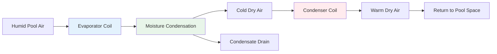
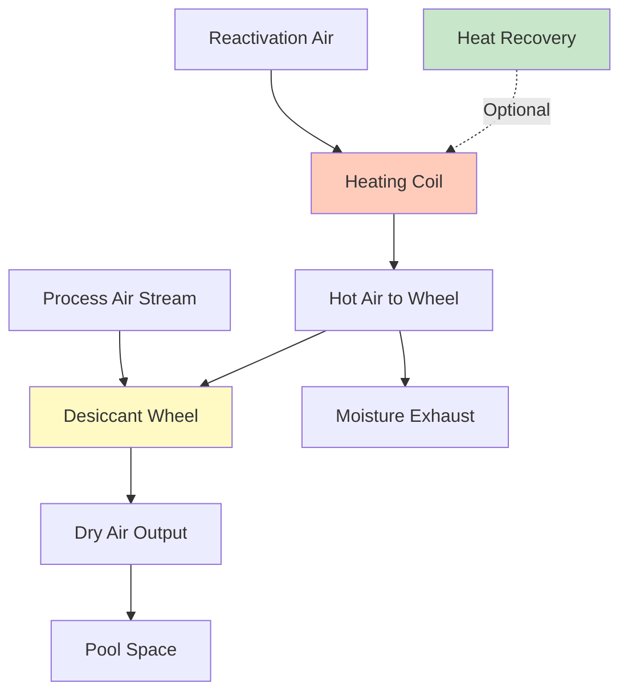

## Fundamental Physics of Pool Evaporation

Water evaporation from pool surfaces represents the primary moisture load in natatoriums. The evaporation rate depends on the vapor pressure differential between the saturated air at the water surface and the ambient air above.

The mass transfer driving force follows:

$$\dot{m}_{evap} = h_m \cdot A \cdot (W_{sat,pool} - W_{air})$$

where:
- $\dot{m}_{evap}$ = evaporation rate (lb/hr or kg/hr)
- $h_m$ = mass transfer coefficient (ft/hr or m/hr)
- $A$ = pool surface area (ft² or m²)
- $W_{sat,pool}$ = humidity ratio at pool surface temperature (lb/lb or kg/kg)
- $W_{air}$ = humidity ratio of room air (lb/lb or kg/kg)

### ASHRAE Evaporation Rate Calculation

ASHRAE Applications Handbook provides empirical correlations accounting for pool activity levels:

$$E = A \cdot F_a \cdot (p_{w,pool} - p_{w,air}) \cdot \left(0.089 + 0.0782v\right)$$

where:
- $E$ = evaporation rate (lb/hr)
- $A$ = pool area (ft²)
- $F_a$ = activity factor (0.5 unoccupied, 0.65 residential, 1.0 public pools)
- $p_{w,pool}$ = saturation vapor pressure at pool temperature (in. Hg)
- $p_{w,air}$ = vapor pressure of room air (in. Hg)
- $v$ = air velocity over water surface (typically 10-30 fpm)

The vapor pressure differential drives continuous moisture addition. A 3,000 ft² public pool at 82°F with 50% RH air at 78°F generates approximately 180-240 lb/hr of moisture requiring removal.

## Refrigerant-Based Dehumidification

Refrigerant dehumidifiers operate on the vapor compression cycle, cooling air below its dew point to condense moisture.

### Operating Principles

The refrigeration cycle removes latent heat while the condenser reheat provides sensible cooling compensation:

$$Q_{latent} = \dot{m}_{water} \cdot h_{fg}$$

where $h_{fg}$ = 1,060 BTU/lb at typical conditions.

For 200 lb/hr moisture removal:

$$Q_{latent} = 200 \times 1,060 = 212,000 \text{ BTU/hr} = 17.7 \text{ tons}$$

The refrigerant system simultaneously provides:
- Evaporator cooling: Condenses moisture + sensible cooling
- Condenser reheat: Recovers sensible heat to prevent overcooling

Net energy recovery efficiency typically reaches 50-70%, reducing heating requirements.

### Refrigerant System Performance

| Parameter | Typical Range | Notes |
|-----------|---------------|-------|
| Evaporator Temperature | 45-55°F | Below dew point for condensation |
| Condensing Temperature | 105-125°F | Determines reheat capacity |
| Moisture Removal | 10-25 lb/hr/ton | Depends on entering conditions |
| Energy Efficiency | 3.5-5.0 lb/kWh | Including reheat benefit |
| Operating Range | 50-90°F DB | Limited by refrigerant properties |
| Humidity Control Range | 40-60% RH | Optimal natatorium conditions |

## Desiccant Dehumidification

Desiccant systems use hygroscopic materials to adsorb water vapor through chemical attraction rather than cooling condensation.

### Sorption Thermodynamics

Desiccants (silica gel, molecular sieves, lithium chloride) attract water molecules through:

1. **Physical adsorption**: Van der Waals forces on porous surfaces
2. **Chemical adsorption**: Molecular bonding with active sites

The adsorption process releases heat of sorption:

$$q_{ads} = h_{fg} + q_{wetting}$$

where $q_{wetting}$ = 50-100 BTU/lb additional heat release.

Regeneration requires heating to reverse the process:

$$Q_{regen} = \dot{m}_{water} \cdot (h_{fg} + q_{wetting}) + Q_{sensible}$$

### Desiccant System Characteristics

| Parameter | Typical Range | Notes |
|-----------|---------------|-------|
| Moisture Removal | 8-20 lb/hr/ton | Higher at low humidity |
| Regeneration Temperature | 180-250°F | Determines energy use |
| Wheel Rotation Speed | 6-20 rev/hr | Affects capacity |
| Dew Point Depression | 20-40°F | Below entering conditions |
| Operating Range | -20 to 120°F | No freezing limitations |
| Humidity Range | 10-90% RH | Effective at low humidity |

## System Comparison Analysis

| Criteria | Refrigerant System | Desiccant System |
|----------|-------------------|------------------|
| **Initial Cost** | Lower ($15-25/lb/day) | Higher ($25-40/lb/day) |
| **Operating Cost** | Lower with electric | Variable with fuel source |
| **Humidity Control** | Good (40-60% RH) | Excellent (20-80% RH) |
| **Low Temperature** | Poor (freezing risk) | Excellent |
| **Energy Recovery** | Integrated condenser | Requires heat exchanger |
| **Maintenance** | Moderate complexity | Higher complexity |
| **Part Load Efficiency** | Good with VFD | Excellent |
| **Space Requirements** | Compact | Larger footprint |

## Pool Cover Effects

Pool covers dramatically reduce evaporation rates through physical vapor barrier and activity suppression.

### Evaporation Reduction Factors

| Cover Type | Evaporation Reduction | Typical Application |
|------------|----------------------|---------------------|
| No Cover | 0% (baseline) | Active use periods |
| Floating Discs | 30-40% | During operation |
| Manual Cover | 90-95% | Overnight/weekends |
| Automatic Cover | 95-98% | Automated scheduling |
| Rigid Cover | 98-99% | Complete closure |

For a pool generating 200 lb/hr uncovered, an automatic cover during 12-hour nightly closure reduces average moisture load to:

$$\dot{m}_{avg} = 200 \times 0.5 + 200 \times 0.02 \times 0.5 = 102 \text{ lb/hr}$$

This 49% reduction translates to:
- 49% lower dehumidification capacity requirement
- Reduced equipment size and first cost
- Lower operating energy consumption
- Extended equipment service life

## Energy Recovery Integration

Energy recovery substantially improves natatorium dehumidification economics.

### Heat Recovery Wheel

Rotating enthalpy wheels transfer both sensible and latent energy between exhaust and supply streams:

$$\varepsilon_{total} = \frac{h_{supply,leaving} - h_{supply,entering}}{h_{exhaust} - h_{supply,entering}}$$

Typical effectiveness: 70-85% total energy recovery.

### Heat Pipe Heat Exchanger

Passive refrigerant-charged pipes transfer sensible heat:

$$Q_{recovered} = \varepsilon \cdot \dot{m}_{air} \cdot c_p \cdot (T_{exhaust} - T_{supply})$$

Typical effectiveness: 50-70% sensible heat recovery.

### Energy Recovery Benefits

| Strategy | Annual Energy Savings | Payback Period |
|----------|----------------------|----------------|
| Heat Recovery Wheel | 30-45% | 3-6 years |
| Heat Pipe Exchanger | 20-30% | 4-7 years |
| Condenser Heat Recovery | 15-25% | 2-4 years |
| Pool Cover (automatic) | 40-60% | 1-3 years |
| Combined Strategies | 60-75% | 2-5 years |

## System Sizing Methodology

**Step 1**: Calculate peak evaporation rate using ASHRAE method with activity factors.

**Step 2**: Determine outdoor air ventilation per ASHRAE 62.1 (0.48 cfm/ft² pool + 0.06 cfm/ft² deck).

**Step 3**: Calculate total moisture load:

$$\dot{m}_{total} = \dot{m}_{evap} + \dot{m}_{ventilation} + \dot{m}_{occupants}$$

**Step 4**: Size dehumidification capacity with 15-25% safety factor.

**Step 5**: Select refrigerant vs. desiccant based on climate, energy costs, and humidity requirements.

**Step 6**: Integrate energy recovery for economic optimization.

## ASHRAE Design Recommendations

Per ASHRAE Applications Handbook Chapter 6 (Natatoriums):

- Maintain pool space: 78-82°F, 50-60% RH
- Pool water temperature: 78-82°F (2-4°F warmer than air)
- Air velocity over pool surface: minimize to 10-20 fpm
- Outdoor air: 0.48 cfm/ft² pool area minimum
- Exhaust air: maintain negative pressure (-0.02 to -0.05 in. w.c.)
- Dehumidification capacity: handle peak + 25% margin
- Emergency ventilation: 6 air changes per hour
- Chloramine control: enhanced outdoor air or secondary treatment

Proper dehumidification system selection and sizing ensures comfortable conditions, building envelope protection, and energy-efficient operation throughout the facility lifecycle.
