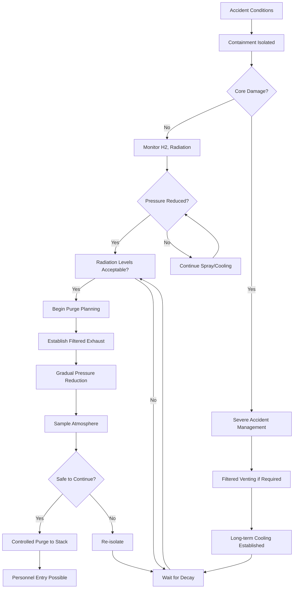

## Overview

During accident conditions, nuclear containment ventilation systems transition from normal operation to emergency modes designed to maintain containment integrity, remove decay heat, control combustible gases, and protect the environment from radioactive releases.

## Containment Isolation on Accident Signal

### Automatic Isolation Logic

Containment isolation occurs within seconds of detecting accident conditions:

**Isolation Signals:**
- High containment pressure (typically >3 psig)
- High radiation levels in containment atmosphere
- Safety injection actuation signal (SIAS)
- Low reactor coolant system pressure
- High steam line differential pressure

**Isolation Valve Closure:**
- Phase A isolation: Non-essential penetrations close immediately
- Phase B isolation: Essential systems isolated on high containment pressure
- Redundant isolation valves in series on each penetration
- Valve closure time: 4-10 seconds typical
- Power sources: Safety-related DC and AC systems

### Penetration Classification

| Penetration Type | Isolation Method | Closure Time | Redundancy |
|-----------------|------------------|--------------|------------|
| Purge supply/exhaust | Motor-operated valves | 5 seconds | Two in series |
| Equipment hatch | Manual bolted closure | Pre-accident | Single barrier |
| Personnel airlock | Interlocked doors | Maintained | Double door |
| Piping <2 inches | Check valves | Immediate | Single/double |
| Electrical | Sealed penetration | Continuous | Pressure boundary |
| Instrumentation | Isolation valves | 10 seconds | Two in series |

## Post-Accident Hydrogen Control

### Hydrogen Generation Mechanisms

During core damage accidents, metal-water reactions generate hydrogen:

$$Q_{H_2} = n_{Zr} \times \Delta H_{rxn}$$

Where:
- $Q_{H_2}$ = energy released from hydrogen generation (kJ)
- $n_{Zr}$ = moles of zirconium oxidized
- $\Delta H_{rxn}$ = reaction enthalpy (586 kJ/mol for Zr + 2H₂O)

**Zirconium-Water Reaction:**
$$Zr + 2H_2O \rightarrow ZrO_2 + 2H_2 + \text{energy}$$

### Hydrogen Control Systems

**Passive Autocatalytic Recombiners (PARs):**
- Catalytic surface promotes H₂ + ½O₂ → H₂O at ambient temperature
- No power required, self-initiating above 1-2% H₂
- Heat release: approximately 242 kJ/mol H₂ recombined
- Distribution: 50-100+ units throughout containment
- Design capacity: prevents >10% H₂ concentration

**Deliberate Ignition Systems:**
- Glow plug igniters activate at preset H₂ concentrations
- Controlled burns prevent deflagration/detonation
- Typical activation: 8-10% H₂ by volume
- Power requirements: safety-related batteries

**Mixing Systems:**
- Containment air recirculation fans
- Prevent stratification and local accumulation
- Flow rates: 10,000-50,000 cfm per fan
- Redundant fans on separate power divisions

## Containment Cooling Methods

### Post-Accident Heat Removal

Total decay heat following reactor shutdown:

$$Q_{decay}(t) = Q_0 \times \left(0.066 \times \frac{t^{-0.2} - (t+T)^{-0.2}}{T^{0.2}}\right)$$

Where:
- $Q_{decay}(t)$ = decay heat at time t (MW)
- $Q_0$ = reactor thermal power before shutdown (MW)
- $t$ = time after shutdown (seconds)
- $T$ = reactor operating time before shutdown (seconds)

### Cooling System Configurations

**Containment Spray Systems:**
- Spray flow rates: 2,000-4,000 gpm per train
- Spray coverage: >95% of containment volume
- Droplet size: 500-1,000 microns for optimal heat/mass transfer
- Spray temperature: initially ambient, increases to 150-200°F
- Chemical addition: sodium hydroxide or trisodium phosphate for iodine removal

Heat removal by spray:

$$Q_{spray} = \dot{m}_{spray} \times c_p \times (T_{vapor} - T_{spray,in})$$

Where:
- $Q_{spray}$ = heat removal rate (Btu/hr)
- $\dot{m}_{spray}$ = spray mass flow rate (lb/hr)
- $c_p$ = specific heat of water (1.0 Btu/lb-°F)
- $T_{vapor}$ = containment atmosphere temperature (°F)
- $T_{spray,in}$ = spray inlet temperature (°F)

**Containment Fan Coolers:**
- Redundant units: 2-4 per containment
- Cooling capacity: 20-50 million Btu/hr per unit
- Airflow: 40,000-70,000 cfm per fan
- Cooling water source: service water or component cooling
- Operates during small breaks where containment remains subcooled

**Ice Condenser Systems (PWR-specific):**
- Ice mass: 2-3 million pounds
- Heat absorption: approximately 144 Btu/lb (latent heat of fusion)
- Passive operation initiated by pressure differential
- Door opening pressure: 1-2 psid

## Filtered Venting Systems

### Purpose and Design

Filtered containment venting systems prevent overpressure failure during extended severe accidents while minimizing radioactive releases.

**Vent Activation Criteria:**
- Containment pressure approaching design limit (45-60 psig)
- Alternative AC power unavailable
- Containment cooling systems inoperable
- Core damage confirmed or highly probable

**Filter Technologies:**

| Filter Type | Removal Efficiency | Target Species | Configuration |
|-------------|-------------------|----------------|---------------|
| Metal fiber pre-filter | >99% for particles >1 μm | Large particulates | Upstream |
| Venturi scrubber | 95-99.9% for aerosols | Cesium, iodine compounds | Primary |
| Metal fiber HEPA | >99.9% for particles >0.3 μm | Fine aerosols | Secondary |
| Molecular sieve | >95% for elemental iodine | I₂, organic iodides | Tertiary |

**Decontamination Factors:**
- Overall DF for aerosols: 1,000-10,000
- Elemental iodine: 100-1,000
- Noble gases: 1 (no retention)

## Severe Accident Considerations

### Containment Challenge Mechanisms

**Overpressure Threats:**
- Steam generation from core-concrete interaction
- Non-condensible gas accumulation (H₂, CO, CO₂)
- Loss of containment heat removal
- Design pressure typically 45-60 psig; failure predicted at 90-150 psig

**Thermal Loads:**
- Direct containment heating from high-pressure melt ejection
- Hydrogen combustion
- Core debris on containment floor

**Basemat Penetration:**
- Molten corium-concrete interaction (MCCI)
- Attack rate: 2-6 inches/hour depending on concrete type
- Gas generation exacerbates pressure challenge

### Mitigation Strategies

**Cavity Flooding:**
- Deliberate flooding of reactor cavity with 3-6 feet of water
- Stabilizes core debris, prevents basemat penetration
- Steam generation manageable with spray systems

**Hydrogen Ignition Management:**
- Controlled burns preferable to delayed deflagration
- Inerted containments (BWR with nitrogen) eliminate combustion risk

## Recovery Ventilation Sequences

### Post-Accident Atmosphere Restoration

### Purge System Restoration

**Prerequisites for Purge:**
- Containment pressure <1 psig above atmospheric
- Hydrogen concentration <2% by volume
- Radiation levels permit HEPA/charcoal filter operation
- Decay heat removal established and stable
- Emergency response organization approval

**Purge Sequence:**
1. **System alignment** (0-2 hours):
   - Verify filter train integrity and pressure drop
   - Establish negative containment pressure capability
   - Confirm stack monitoring operational

2. **Initial venting** (2-24 hours):
   - Flow rate: 100-500 cfm initially
   - Maintain negative pressure: -0.1 to -0.5 inches w.c.
   - Continuous stack and containment atmosphere monitoring

3. **Full purge operation** (1-7 days):
   - Increase flow to design rates: 2,000-10,000 cfm
   - Multiple volume changes to reduce contamination
   - Target: <1% of initial airborne activity before entry

**Containment Parameters During Recovery:**

| Parameter | Accident Peak | Start Purge | Entry Permitted |
|-----------|---------------|-------------|-----------------|
| Pressure (psig) | 45-60 | <1.0 | <0.1 |
| Temperature (°F) | 250-350 | <150 | <120 |
| Humidity (%) | 100 | <95 | <80 |
| H₂ concentration (%) | 0-10+ | <2.0 | <0.5 |
| Radiation level (R/hr) | >1,000 | <100 | <0.1 |
| Airborne contamination | High | Moderate | Low |

## Summary

Containment ventilation during accident conditions prioritizes public safety through automatic isolation, decay heat removal, combustible gas control, and filtered release pathways. Recovery ventilation enables eventual containment access while maintaining radiological protection. Design basis and severe accident management strategies ensure containment integrity across the full spectrum of postulated events.
