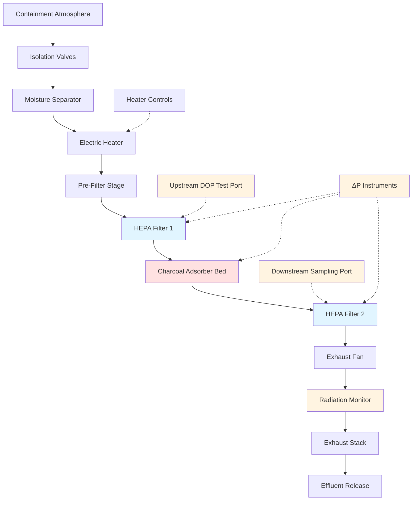

Filtered exhaust systems for nuclear containment represent the final engineered barrier against radioactive material release to the environment. These systems must achieve extremely high removal efficiencies for particulate radionuclides and gaseous iodine isotopes under both normal operating conditions and post-accident scenarios involving elevated temperature, humidity, and radiation levels.

## HEPA Filter Requirements

High-Efficiency Particulate Air (HEPA) filters form the primary defense against particulate fission product release. Nuclear-grade HEPA filters must meet stringent performance criteria established by ASME AG-1 (Code on Nuclear Air and Gas Treatment) and demonstrated through individual filter testing per MIL-STD-282 or equivalent methods.

### Efficiency Standards

Nuclear HEPA filters achieve minimum removal efficiency of 99.97% for 0.3 μm particles, the most penetrating particle size (MPPS) where collection mechanisms transition between diffusion-dominated and interception-dominated regimes. The penetration through a HEPA filter is calculated as:

$$P = 1 - \eta = 0.0003$$

where $\eta$ represents the removal efficiency. For multi-stage HEPA configurations, total system penetration follows:

$$P_{total} = P_1 \times P_2 = (1 - \eta_1)(1 - \eta_2)$$

A two-stage HEPA system achieves combined efficiency:

$$\eta_{total} = 1 - (0.0003)^2 = 0.9999999 = 99.99999\%$$

This corresponds to a decontamination factor (DF) of:

$$DF = \frac{1}{P_{total}} = \frac{1}{9 \times 10^{-8}} \approx 11,000,000$$

### Construction and Materials

Nuclear HEPA filters utilize deep-pleated borosilicate glass fiber media with organic binders resistant to radiation degradation. Standard sizes include 24" × 24" × 11.5" units providing approximately 2,000 CFM capacity at 1.0 in. w.g. pressure drop when clean. Filter frames constructed from fire-resistant materials (typically stainless steel or plywood with fire retardant treatment) ensure structural integrity under accident conditions.

Separators between pleats prevent media contact under differential pressure loading. Aluminum separators predominate in most applications, though corrugated media construction eliminates separators in some modern designs.

## Charcoal Adsorber for Iodine Removal

Radioactive iodine isotopes (primarily I-131, I-132, I-133, I-135) present the most significant volatile fission product hazard. These isotopes concentrate in the thyroid gland following inhalation, making removal efficiency critical for dose limitation. Charcoal adsorbers capture iodine through physical adsorption on activated carbon media impregnated with chemicals to enhance retention.

### Impregnant Types

Nuclear service charcoal employs specific impregnants optimized for iodine species:

**Triethylenediamine (TEDA) Impregnated Carbon:**
- Standard impregnation: 2-5% TEDA by weight
- Enhanced performance for methyl iodide (CH₃I)
- Efficiency: 95-99% for organic iodine at 2-4 inch bed depth
- Recommended for most nuclear applications

**Potassium Iodide (KI) Impregnated Carbon:**
- Historical use in early installations
- Better elemental iodine (I₂) performance
- Lower organic iodine efficiency than TEDA
- Moisture sensitivity issues

### Bed Design Parameters

Charcoal adsorber beds follow specific geometric and flow parameters to achieve design efficiency:

| Parameter | Design Value | Basis |
|-----------|--------------|-------|
| Bed Depth | 2-4 inches | Residence time requirement |
| Face Velocity | 40 ft/min maximum | Pressure drop, efficiency |
| Residence Time | 0.10-0.25 seconds | Adsorption kinetics |
| Relative Humidity | <70% at bed | Prevent moisture loading |
| Temperature | <250°F | Carbon ignition safety |
| Carbon Mesh Size | 8×16 or 12×30 | Optimize surface area |

Iodine removal efficiency relates to residence time through empirical correlation:

$$\eta = 1 - e^{-kt}$$

where $k$ is the adsorption rate constant (dependent on carbon type, impregnation, and iodine species) and $t$ is residence time calculated as:

$$t = \frac{L}{v} = \frac{L}{Q/A}$$

where $L$ is bed depth, $v$ is face velocity, $Q$ is volumetric flow rate, and $A$ is bed face area.

## Pre-Filter Design for HEPA Protection

Pre-filtration stages protect expensive HEPA filters from premature loading by removing larger particulates and aerosol droplets that would rapidly increase HEPA pressure drop.

### Moisture Separators

Moisture separators (demisters) remove entrained water droplets from post-accident steam-air mixtures before reaching HEPA filters. These devices achieve 99% removal efficiency for droplets greater than 3 μm diameter through inertial impaction on closely-spaced corrugated surfaces.

Design considerations include:

- Face velocity: 300-500 ft/min
- Pressure drop: 0.5-1.5 in. w.g. when clean
- Materials: Stainless steel for corrosion resistance
- Drainage: Gravity drains preventing re-entrainment

### Pre-Filters

Standard efficiency pre-filters (MERV 8-11 rating) remove coarse dust and debris, extending HEPA service life. Typical arrangements include:

**Two-stage pre-filtration:**
1. Roughing filter (MERV 8): 30-40% efficiency @ 1.0 μm
2. Intermediate filter (MERV 11): 60-75% efficiency @ 1.0 μm

Pre-filters require regular replacement based on differential pressure monitoring, typically when ΔP exceeds 2.0 in. w.g. or doubles from clean condition.

## Filter Testing and Replacement

### In-Place Testing

Filter trains undergo comprehensive in-place testing following installation and periodically during operation to verify continued performance. ASME N510 establishes testing protocols including:

**DOP/PAO Aerosol Penetration Test:**
- Introduces monodisperse 0.3 μm aerosol upstream
- Measures downstream penetration with photometer
- Acceptance: <0.05% penetration (99.95% efficiency)
- Frequency: After installation, annually, after maintenance

**Halogenated Hydrocarbon (Freon) Test for Charcoal:**
- Introduces refrigerant gas (historically R-11, now R-134a)
- Measures downstream concentration via gas chromatograph
- Acceptance: Matches design efficiency (typically >95%)
- Frequency: After installation, annually, after carbon replacement

**Pressure Drop Testing:**
- Measures ΔP across each filter stage
- Identifies loaded filters requiring replacement
- Establishes trending data for predictive maintenance

### Laboratory Testing

Removed charcoal samples undergo laboratory analysis per ASTM D3803 to determine residual adsorption capacity:

**Methyl Iodide Penetration Test:**
- Exposes carbon sample to CH₃I-laden air stream
- Measures downstream concentration
- Calculates decontamination factor: $DF = C_{in}/C_{out}$
- Acceptance: DF >100 at 2-inch bed depth, 70°F, 95% RH

Carbon beds require replacement when testing indicates efficiency below administrative limits (typically 95% of design efficiency) or after radiation dose exposure exceeds manufacturer limits (commonly 10⁸ rad absorbed dose).

### HEPA Filter Replacement Criteria

HEPA filters require replacement when:

1. In-place testing shows >0.05% penetration
2. Differential pressure exceeds maximum design value (typically 4-6 in. w.g.)
3. Visual inspection reveals media damage
4. Radiation dose reaches design limit (typically 10⁸ rad)
5. Moisture damage or fire impairment suspected

## Exhaust Stack Monitoring

Continuous monitoring of filtered exhaust releases provides real-time detection of abnormal radioactive material discharge and regulatory compliance documentation.

### Radiation Monitoring Systems

**Particulate Monitoring:**
- Fixed filter paper continuously collects particulates
- Beta-gamma detector monitors accumulated activity
- Typical sensitivity: 10⁻¹¹ μCi/cc
- Alarm setpoints at administrative limits

**Iodine Monitoring:**
- Charcoal cartridge adsorbs iodine isotopes
- Gamma spectrometry identifies specific isotopes
- Separate channel for real-time iodine detection

**Noble Gas Monitoring:**
- Continuous gamma detector in sample stream
- Compensated for natural background radiation
- Detects Kr-85, Xe-133, other noble gases

### Sampling System Design

Representative sampling requires isokinetic extraction from the exhaust stack:

$$v_{sample} = v_{stack} \cdot \frac{A_{probe}}{A_{sample}}$$

where velocity matching ensures accurate particulate collection. Sample probes position at locations of uniform flow profile (typically 7-10 duct diameters downstream of flow disturbances) with multiple extraction points averaged for large diameter stacks.

## Effluent Release Limits

### Regulatory Dose Limits

NRC regulations under 10 CFR 20 and 10 CFR 50 Appendix I establish dose limits for routine radioactive releases:

| Pathway | Dose Limit | Regulatory Basis |
|---------|------------|------------------|
| Whole Body | ≤25 mrem/year | 10 CFR 50 App I (liquid) |
| Thyroid | ≤75 mrem/year | 10 CFR 50 App I (gaseous) |
| Any Organ | ≤25 mrem/year | 10 CFR 50 App I (liquid) |
| Site Boundary | ≤500 mrem/year | 10 CFR 20.1301 |
| ALARA Goal | <10% of limits | Regulatory Guide 1.109 |

These limits apply to normal operations; accident dose criteria follow 10 CFR 50.67 (alternative source term) allowing 25 rem thyroid, 5 rem total effective dose equivalent (TEDE) at exclusion area boundary.

### Technical Specification Limits

Each facility's Technical Specifications establish administrative release limits based on site-specific dose modeling using approved methodologies (typically GASPAR II or equivalent codes). Release limits account for:

- Site meteorology (χ/Q values at critical receptor locations)
- Population distribution
- Radionuclide mixture (isotopic composition)
- Multiple release pathways
- Conservative dose conversion factors

Typical annual release limits might specify:

- Noble gases: <10-20 Ci fission gases
- Iodines: <0.1-1.0 Ci I-131 equivalent
- Particulates: <0.1-0.5 Ci gross activity

Filtered exhaust systems ensure actual releases remain small fractions of these limits through demonstrated high removal efficiency and continuous performance verification.

## System Process Flow

## Filter Train Specifications

| Component | Specification | Performance |
|-----------|--------------|-------------|
| **Moisture Separator** | Stainless steel vanes | 99% @ 3 μm droplets |
| **Electric Heater** | 20-50 kW capacity | Reduce RH to <70% |
| **Pre-Filter** | MERV 11, 24"×24"×4" | 65% @ 1.0 μm |
| **HEPA Stage 1** | Type A, 24"×24"×11.5" | 99.97% @ 0.3 μm |
| **Charcoal Bed** | TEDA-impregnated, 2" depth | 95% methyl iodide |
| **HEPA Stage 2** | Type A, 24"×24"×11.5" | 99.97% @ 0.3 μm |
| **ΔP Transmitters** | 0-10 in. w.g. range | ±1% accuracy |
| **Exhaust Fan** | Centrifugal, 10,000 CFM | 15 in. w.g. static |
| **Stack Monitor** | Beta-gamma, iodine, noble gas | 10⁻¹¹ μCi/cc sensitivity |

Filtered exhaust systems for nuclear containment demonstrate the highest level of engineering rigor in HVAC design, combining redundant filtration stages, continuous performance monitoring, and conservative design margins to ensure public safety under all operational conditions and design basis accidents.
