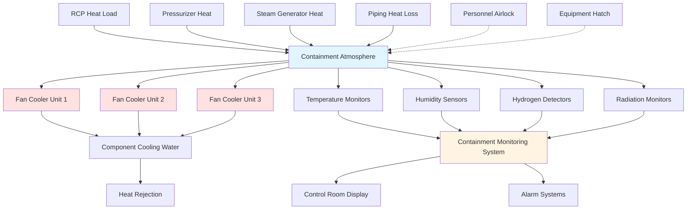

## Containment Air Cooling Systems

During normal operation, nuclear reactor containment buildings require continuous cooling to maintain acceptable temperature and humidity levels. The containment cooling system removes heat generated by reactor coolant system equipment, pumps, valves, and piping through a combination of sensible and latent heat transfer.

The total heat load consists of equipment radiation, convection losses, and ambient infiltration:

$$Q_{total} = Q_{equipment} + Q_{radiation} + Q_{convection} + Q_{infiltration}$$

Typical containment heat loads during normal operation range from 5-15 million BTU/hr depending on reactor size and design. The cooling system must maintain containment temperature below design limits, typically 120-130°F, to ensure equipment operability and structural integrity.

## Fan Cooler Unit Operation

Containment fan cooler units (CFCUs) serve as the primary heat removal mechanism during normal operation. These units consist of centrifugal or axial fans that circulate containment air across finned-tube heat exchangers cooled by component cooling water or service water.

Each CFCU operates in a low-speed configuration during normal conditions:

$$Q_{cooler} = \dot{m}_{air} \cdot c_p \cdot (T_{in} - T_{out})$$

Where air mass flow rates typically range from 30,000-50,000 CFM per unit. Most containment designs include 3-5 CFCUs, with 2-3 operating continuously and others in standby. The cooling water side heat removal follows:

$$Q_{water} = \dot{m}_{water} \cdot c_p \cdot (T_{out} - T_{in})$$

Fan cooler units are positioned to create optimal air circulation patterns, directing cool air toward high heat load areas and establishing thermal stratification that prevents hot spots. Unit placement considers equipment access, radiation shielding, and airflow interference.

## Containment Atmosphere Monitoring

Continuous monitoring of containment atmosphere composition ensures early detection of abnormal conditions. The monitoring system tracks multiple parameters through strategically located sampling points.

Temperature sensors throughout containment measure both bulk atmosphere and local hot spot temperatures. Humidity sensors detect moisture increases that could indicate leakage from reactor coolant systems. Radiation monitors provide immediate indication of fuel cladding failures or primary system breaches.

Air sampling systems continuously analyze containment atmosphere for radioactive noble gases, iodine, and particulates. These systems include isokinetic sampling probes, particulate filters, charcoal cartridges, and gamma spectrometry equipment.

## Hydrogen Concentration Control

During normal operation, hydrogen concentration in containment atmosphere remains negligible, but monitoring systems maintain vigilance for any accumulation. Radiolysis of water or chemical reactions could produce small quantities of hydrogen.

The hydrogen control strategy during normal operation includes:

- Continuous hydrogen concentration monitoring with detectors having 0.1% sensitivity
- Passive autocatalytic recombiners (PARs) positioned throughout containment
- Hydrogen purge capability through containment purge and exhaust system
- Administrative limits requiring action if concentration exceeds 0.5%

Most modern containment designs limit hydrogen concentration to less than 2% by volume during all operating modes to prevent deflagration risk.

## Personnel Entry Ventilation

Personnel access to containment during power operation occurs only under strict administrative control and typically for limited duration. When entry is required, temporary ventilation measures ensure worker safety.

The personnel entry ventilation system provides:

1. Positive pressure in access airlocks to prevent contamination spread
2. Supplied air breathing systems for workers in high radiation areas
3. Temporary portable ventilation units for localized cooling
4. Continuous air monitoring at entry and exit points

Airlock differential pressure typically maintains 0.25-0.5 inches water column relative to containment. The access sequence involves multiple doors with interlocks preventing simultaneous opening.

## Equipment Heat Load Removal

Individual equipment items contribute varying heat loads requiring targeted cooling approaches. Major heat sources include reactor coolant pumps, pressurizer, steam generators, and associated piping.

| Equipment | Heat Load (BTU/hr) | Cooling Method |
|-----------|-------------------|----------------|
| RCP Motors (each) | 1,200,000 | Direct air cooling |
| Pressurizer | 800,000 | Natural convection |
| Steam Generators (each) | 600,000 | Radiation/convection |
| RCS Piping | 2,000,000 | Ambient circulation |
| Valves and Penetrations | 500,000 | Local air movement |

The heat removal effectiveness depends on airflow patterns established by CFCU operation:

$$h_{conv} = \frac{Nu \cdot k}{L}$$

Where the Nusselt number (Nu) varies with Reynolds number and surface geometry. Forced convection from CFCU operation significantly enhances heat transfer coefficients compared to natural convection alone.

Equipment compartments receive dedicated airflow through carefully designed ventilation paths. Structural features like floors, walls, and equipment cubicles channel air to ensure adequate cooling of all components while maintaining acceptable ambient temperatures for instrumentation and electrical equipment.

## Normal Operation Parameters

Maintaining containment conditions within specified limits ensures equipment operability and structural margin. The following table presents typical normal operation parameters:

| Parameter | Normal Range | Design Limit | Action Level |
|-----------|--------------|--------------|--------------|
| Temperature | 70-110°F | 130°F | 120°F |
| Relative Humidity | 30-70% | 90% | 80% |
| Pressure | -0.5 to +0.5 psig | 50 psig | ±1.0 psig |
| Hydrogen Concentration | <0.1% | 4% | 0.5% |
| Radiation Level | <1 mR/hr | N/A | 5 mR/hr |
| Air Changes | 2-4 per hour | N/A | <1 per hour |
| CFCU Cooling Capacity | 60-80% | 100% | >95% |

The ventilation system maintains these parameters through automatic control of CFCU operation, cooling water flow rates, and periodic purging when hydrogen or humidity approaches action levels. Continuous monitoring with redundant instrumentation provides operators with real-time containment status and early warning of degrading conditions.
