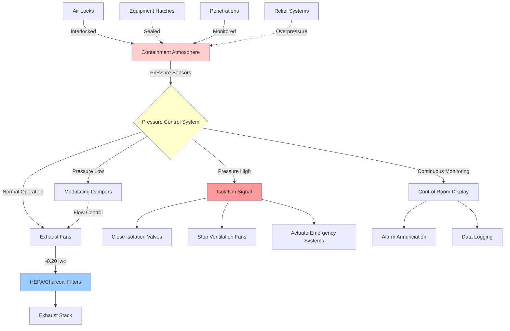

Pressure control in nuclear containment buildings represents one of the most critical safety functions in nuclear facility HVAC design. The containment ventilation system must maintain precise pressure differentials to prevent radioactive material release while accommodating normal operations and emergency scenarios.

## Negative Pressure Maintenance Requirements

Nuclear containment buildings operate under negative pressure relative to adjacent areas to ensure airflow always moves toward areas of higher radioactive potential. This pressure cascade prevents contaminated air from escaping to occupied or clean areas.

Primary containment structures typically maintain pressures ranging from -0.10 to -0.25 inches water column (iwc) below atmospheric pressure during normal operations. Secondary containment or auxiliary buildings maintain intermediate pressures, creating a stepped pressure profile.

The required pressure differential $\Delta P$ across containment boundaries is calculated based on design basis accident scenarios:

$$\Delta P = P_{\text{ref}} - P_{\text{cont}} \geq \Delta P_{\text{min}}$$

where $P_{\text{ref}}$ is the reference pressure (typically atmospheric or adjacent space pressure), $P_{\text{cont}}$ is the containment pressure, and $\Delta P_{\text{min}}$ is the minimum required differential, typically specified as 0.10-0.25 iwc for operating conditions.

## Pressure Differential Monitoring

Continuous pressure monitoring systems track differentials across all containment boundaries with redundant instrumentation. Pressure transmitters measure differentials at multiple locations to detect localized pressure variations and ensure consistent pressure cascade performance.

Monitoring systems provide:

- Real-time differential pressure indication with 0.01 iwc resolution
- Alarm setpoints for high and low differential conditions
- Trending and data logging for regulatory compliance documentation
- Automatic control system inputs for pressure regulation
- Safety system actuations on abnormal conditions

Pressure transmitters undergo periodic calibration and testing per regulatory requirements, typically quarterly functional tests and annual calibrations with documented traceability to NIST standards.

## Containment Pressure Requirements by Area

| Area Type | Pressure Differential | Tolerance | Monitoring Frequency |
|-----------|----------------------|-----------|---------------------|
| Primary Containment | -0.15 to -0.25 iwc | ±0.02 iwc | Continuous |
| Secondary Containment | -0.10 to -0.15 iwc | ±0.02 iwc | Continuous |
| Fuel Handling Building | -0.05 to -0.10 iwc | ±0.015 iwc | Continuous |
| Auxiliary Building | -0.03 to -0.08 iwc | ±0.015 iwc | Continuous |
| Equipment Hatches | -0.10 to -0.20 iwc | ±0.02 iwc | During operations |
| Personnel Air Locks | Variable | ±0.03 iwc | Per cycle |

## Air Lock and Personnel Entry Considerations

Personnel and equipment air locks maintain containment integrity during access operations through interlocked double-door systems. The air lock volume undergoes pressure equalization before door opening, preventing pressure surges that could compromise containment.

Air lock pressure control sequences:

1. **Entry sequence**: Outer door opens at ambient pressure, personnel enter, outer door closes and interlocks, air lock depressurizes to containment pressure, inner door unlocks and opens
2. **Exit sequence**: Inner door closes, air lock pressurizes to ambient, outer door unlocks after pressure equalization
3. **Emergency mode**: Rapid equalization with override capabilities and alarming

Air lock leakage testing occurs during periodic containment integrated leak rate testing (ILRT) with acceptance criteria defined in 10 CFR 50 Appendix J.

## Containment Leak Rate Testing

Integrated leak rate testing verifies containment integrity through pressurization testing at design pressure conditions. Type A testing occurs at approximately 10-year intervals, while Type B and C local leak rate tests occur more frequently on penetrations and isolation valves.

The allowable leak rate $L_a$ is calculated as a percentage of containment volume per day:

$$L_a = \frac{V_{\text{cont}} \times 0.01}{24 \text{ hours}} \times \frac{P_{\text{test}}}{P_{\text{atm}}}$$

where $V_{\text{cont}}$ is containment volume and $P_{\text{test}}$ is test pressure. Total leakage must remain below $L_a$ to demonstrate acceptable performance.

## Emergency Pressure Relief

Containment structures include pressure relief capabilities to prevent overpressure conditions during design basis accidents. Relief systems may include:

- **Rupture disks**: Passive devices that fail at predetermined pressure thresholds
- **Pressure-actuated relief valves**: Active systems with redundant actuation
- **Filtered venting systems**: Controlled release paths with particulate and iodine removal
- **Suppression pools**: Pressure suppression through steam condensation

Relief setpoints are established well above operating pressures but below containment design pressure, typically 90-95% of design basis accident pressure.

## HVAC System Isolation on High Pressure

Containment isolation valves automatically close on high containment pressure signals to terminate normal ventilation and prevent release pathways. Isolation logic includes:

- Redundant pressure switches with 2-out-of-3 voting logic
- Automatic closure of supply and exhaust isolation dampers
- Shutdown of normal ventilation fans
- Actuation of containment spray systems (if equipped)
- Emergency filtration system startup for controlled releases

The pressure setpoint for isolation typically ranges from -0.05 to +0.10 iwc above normal operating pressure, providing early isolation before significant pressure rise.

## Control System Integration

Modern containment pressure control systems integrate with plant distributed control systems (DCS) providing comprehensive monitoring and automatic regulation. Control loops continuously adjust exhaust fan speeds and damper positions to maintain target pressure differentials despite variations in leakage, thermal expansion, and operational activities.

The control system implements proportional-integral-derivative (PID) algorithms with tight tuning parameters to minimize pressure fluctuations while avoiding control instability. Typical control loop response times range from 30-60 seconds for small pressure deviations.

Pressure control systems undergo extensive testing during plant startup and refueling outages, with documented performance verification required for regulatory compliance and operational safety assurance.