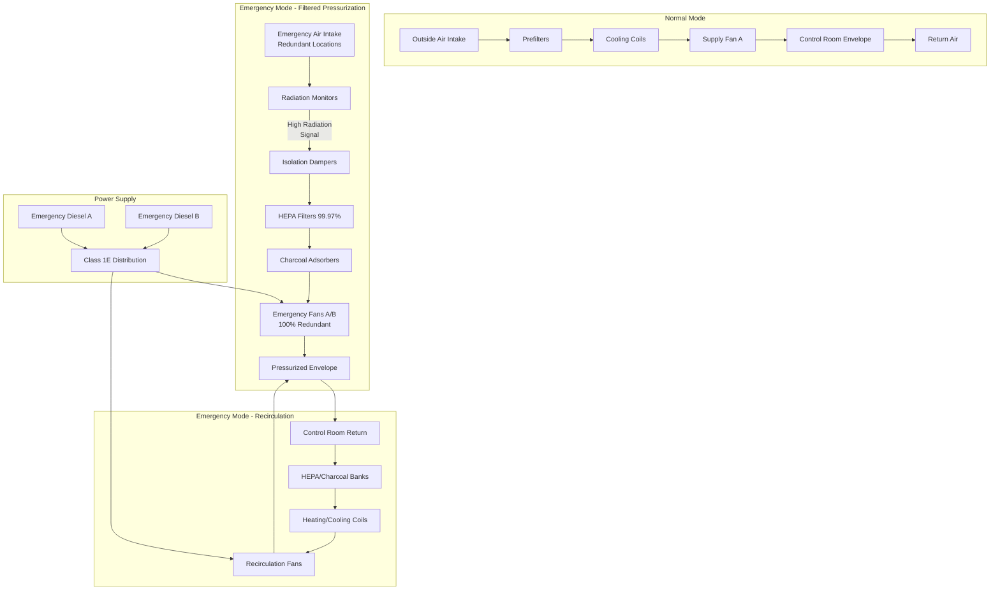

## Overview of Nuclear Emergency Ventilation Systems

Emergency ventilation systems in nuclear power plants maintain habitability of control rooms, technical support centers, and other critical areas during accident scenarios including design basis accidents (DBA), loss-of-coolant accidents (LOCA), and external hazards. These systems transition from normal operation to emergency modes within seconds, providing filtered recirculation and pressurization to protect personnel from airborne radioactive contamination and toxic gases.

NRC regulations in 10 CFR 50 Appendix A, General Design Criterion 19, and guidance in NUREG-0800 Section 6.4 establish requirements for control room habitability systems to ensure operators can safely control the reactor for the duration of an accident. Emergency ventilation systems must function independently of normal HVAC, powered by emergency diesel generators with seismic qualification and redundancy.

## Control Room Habitability System Design

### Regulatory Basis

**10 CFR 50 Appendix A, GDC 19** requires control room design to:
- Permit occupancy and operation under accident conditions without personnel receiving radiation exposures exceeding 5 rem TEDE (Total Effective Dose Equivalent) for duration of accident
- Protect against toxic gas hazards
- Provide adequate habitability for extended accident scenarios (30 days minimum)

**NUREG-0800 acceptance criteria** for control room habitability include:
- Maximum unfiltered in-leakage ≤10 cfm for pressurized envelope
- Filtered recirculation efficiency ≥99% for particulates, ≥95% for halogens
- Pressurization ≥0.125 inches w.g. relative to adjacent areas
- Emergency mode activation within 30 seconds of accident signal

### System Configuration

### Envelope Integrity Requirements

Control room envelope design maintains pressurization against unfiltered in-leakage:

$$Q_{leak} = C \cdot A_{leak} \cdot \sqrt{\Delta P}$$

Where:
- $Q_{leak}$ = unfiltered in-leakage (cfm)
- $C$ = flow coefficient (cfm/√in. w.g.) dependent on leak geometry
- $A_{leak}$ = equivalent leak area (in²)
- $\Delta P$ = pressure differential (in. w.g.)

**Typical envelope integrity criteria:**
- Measured in-leakage ≤10 cfm at +0.125 in. w.g. test pressure
- In-leakage testing per ASTM E741 (pressurization method) or ASTM E779 (fan pressurization)
- Envelope includes control room, operator rest areas, and emergency facilities
- Penetrations sealed: cable trays, conduits, piping, doors

**Pressurization flow calculation:**

$$Q_{press} = Q_{leak} + Q_{exfiltration} + Q_{makeup}$$

Where:
- $Q_{press}$ = total pressurization flow required (cfm)
- $Q_{exfiltration}$ = designed exfiltration through airlocks (cfm)
- $Q_{makeup}$ = outdoor air for occupants (typically 5-10 cfm/person minimum)

## Accident Response Modes

### Mode Transition Logic

Emergency ventilation systems operate in multiple modes based on accident conditions:

| Mode | Activation Signal | Outside Air | Recirculation | Filtration | Pressurization |
|------|------------------|-------------|---------------|------------|----------------|
| Normal | Default | 100% or mixed | Yes | Prefilters only | Optional |
| Filtered Pressurization | High radiation or toxic gas | Filtered OA via HEPA/charcoal | Yes | HEPA + charcoal | Yes, ≥0.125 in. w.g. |
| Recirculation Only | Extreme contamination | Isolated | 100% | HEPA + charcoal | Yes, reduced flow |
| Post-LOCA | LOCA signal + timer | Filtered OA (delayed) | Yes | HEPA + charcoal | Yes |

### Design Basis Accident Scenarios

**Loss-of-Coolant Accident (LOCA):**
- Immediate isolation of normal ventilation
- Activation of emergency recirculation within 30 seconds
- Initial 100% recirculation mode for first 30 minutes
- Transition to filtered pressurization with minimum outside air for personnel
- Radiation monitor setpoints: 1-10 mR/hr for intake isolation

**Fuel Handling Accident:**
- Isolation dampers close on high radiation in fuel building exhaust
- Control room switches to filtered pressurization
- Iodine-131 and particulate filtration critical
- Extended operation duration (days to weeks)

**Toxic Gas Release:**
- Chlorine, ammonia, or other hazardous chemical detection
- Immediate isolation of outside air intakes
- 100% recirculation until hazard clears
- Toxic gas monitors at intake locations with <10 ppm chlorine setpoint

### Radiation Dose Calculations

Control room dose analysis per Regulatory Guide 1.183:

$$TEDE = TEDE_{external} + TEDE_{inhalation}$$

**External dose component:**

$$TEDE_{external} = \int_0^{t_{mission}} \dot{D}_{shine}(t) \cdot SF_{shield} \, dt$$

Where:
- $\dot{D}_{shine}(t)$ = direct radiation dose rate from plume and surfaces (rem/hr)
- $SF_{shield}$ = shielding factor for control room structure
- $t_{mission}$ = mission time (typically 30 days)

**Inhalation dose component:**

$$TEDE_{inhalation} = \sum_{i} \int_0^{t_{mission}} \chi_i(t) \cdot BR \cdot DCF_i \, dt$$

Where:
- $\chi_i(t)$ = airborne concentration of radionuclide $i$ in control room (μCi/m³)
- $BR$ = breathing rate (3.5×10⁻⁴ m³/s for light activity)
- $DCF_i$ = dose conversion factor for inhalation (rem/μCi)

**Unfiltered in-leakage impact:**

$$\chi_{CR}(t) = \frac{Q_{leak} \cdot \chi_{ambient}(t) + Q_{filtered} \cdot \eta \cdot \chi_{ambient}(t)}{V_{CR} / t_{exchange}}$$

Where:
- $\chi_{CR}(t)$ = control room concentration
- $\chi_{ambient}(t)$ = outdoor concentration
- $Q_{leak}$ = unfiltered in-leakage (cfm)
- $Q_{filtered}$ = filtered intake flow (cfm)
- $\eta$ = filtration efficiency (0.99 for HEPA, 0.95 for charcoal/halogens)
- $V_{CR}$ = control room volume (ft³)

## Filtered Recirculation System Design

### HEPA and Charcoal Filter Configuration

**Two-stage filtration trains:**
1. Moisture separators/prefilters (MERV 8-11)
2. First-stage HEPA filters (99.97% at 0.3 μm per ASME AG-1)
3. Charcoal adsorbers for radioiodine (2-4 inch bed depth)
4. Second-stage HEPA filters (99.97% capture of charcoal fines)

**Charcoal adsorber specifications:**
- Activated carbon impregnated with potassium iodide (KI) or triethylenediamine (TEDA)
- Minimum residence time: 0.25 seconds at design flow
- Removal efficiency: ≥95% for methyl iodide (CH₃I) per ASTM D3803
- Maximum face velocity: 40 fpm to prevent channeling
- Relative humidity control: 30-70% for optimal adsorption

**Filter housing requirements:**
- Seismic Category I design and qualification testing
- Gastight housing with leak test ports
- DOP (dioctyl phthalate) aerosol testing capability per ASME N510
- Differential pressure monitoring across each filter stage
- Fire-resistant construction with 1.5-hour rating minimum

### Performance Testing and Surveillance

**In-place HEPA testing (ASME N510):**
- DOP aerosol challenge at 99.97% efficiency verification
- Maximum penetration: 0.05% (500 ppm upstream, 0.25 ppm downstream allowable)
- Test frequency: 18 months or after filter replacement
- Flow distribution verification within ±20% of average

**Charcoal adsorber testing (ASME N509, ASTM D3803):**
- Methyl iodide penetration testing on representative samples
- Laboratory analysis every 18 months
- Maximum allowable penetration: 5% (95% removal efficiency)
- Replace charcoal if efficiency falls below 95% or after 4-8 years

**Surveillance requirements:**
- Continuous differential pressure monitoring
- Automatic alarm on high ΔP (filters loading) or low ΔP (filter failure)
- Monthly visual inspections of housings and dampers
- Quarterly filter efficiency trending

## Emergency Diesel Generator Integration

### Class 1E Power Supply Requirements

Emergency ventilation systems connect to Class 1E electrical distribution:

**Redundancy and separation:**
- Division A and Division B independent power trains
- Each division powered by separate emergency diesel generator
- Physical and electrical separation per IEEE 384
- Single failure criterion compliance—loss of one division maintains habitability

**Diesel generator sequencing:**
- Control room emergency ventilation loads on first load sequence (typically 0-10 seconds)
- Priority equal to or higher than emergency core cooling systems
- Continuous duty rating for 7-30 day mission time
- Load profile includes fan motors, damper actuators, instrumentation, heating/cooling

### Load Calculation Example

**Division A emergency ventilation electrical loads:**

| Component | HP | Load Factor | Running kW | Starting kVA |
|-----------|-----|-------------|------------|--------------|
| Emergency supply fan | 20 | 0.85 | 14.4 | 95 |
| Recirculation fan A | 15 | 0.80 | 10.8 | 72 |
| Chilled water pump | 10 | 0.70 | 6.3 | 48 |
| Damper actuators (10) | — | — | 0.5 | — |
| Controls/monitoring | — | — | 2.0 | — |
| **Total Division A** | — | — | **34.0 kW** | **95 kVA inrush** |

Diesel generator must accommodate simultaneous starting of largest motor (emergency supply fan) plus running loads.

### Starting and Control Sequences

**Automatic start logic:**
1. Safety Injection Signal (LOCA) OR High Radiation Monitor OR Toxic Gas Detection
2. Diesel generator auto-start (target: 10 seconds to rated voltage and frequency)
3. Emergency bus energization and sequencing
4. Control room isolation dampers close (normal HVAC intake/exhaust)
5. Emergency fans start in sequence: recirculation fan first (0-5 sec), then filtered supply fan (5-10 sec)
6. Pressurization achieved within 30 seconds of signal
7. Continuous operation until manual reset or accident termination

**Manual controls:**
- Handswitches in control room for mode selection override
- Local manual operation capability at fan units
- Test mode for monthly surveillance without isolation

## Heating and Cooling in Emergency Mode

Control room heat removal during emergency operation maintains habitability:

**Heat load sources during accident:**
- Occupants: 400 Btu/hr per person sensible, 200 Btu/hr latent (30-50 people)
- Instrumentation and control panels: 50-150 kW (170,000-510,000 Btu/hr)
- Lighting: 2-5 W/ft² (6.8-17 Btu/hr/ft²)
- External heat gain through envelope: minimized by shielding structure

**Total heat load example (1500 ft² control room):**

$$Q_{total} = Q_{occupants} + Q_{equipment} + Q_{lights} + Q_{envelope}$$

$$Q_{total} = (30 \times 600) + 340,000 + (3 \times 1500 \times 6.8) + 15,000 = 385,600 \text{ Btu/hr} = 32 \text{ tons}$$

**Cooling methods:**
- Chilled water coils in recirculation path (most common, seismic-qualified valves)
- Direct expansion (DX) cooling with redundant compressors on emergency power
- Passive heat removal via conduction to adjacent cooled areas (limited capacity)

**Heating provision:**
- Electric resistance heaters in recirculation ductwork for cold weather
- Typically 10-30 kW capacity to maintain 70-75°F minimum
- Thermostat control to prevent overcooling during low equipment load periods

## NRC Regulatory Framework

### Key Regulations and Guidance Documents

**10 CFR 50 Appendix A, General Design Criteria:**
- GDC 2: Seismic and environmental design
- GDC 4: Environmental and dynamic effects design bases
- GDC 19: Control room habitability
- GDC 60: Control of releases of radioactive materials

**NRC Regulatory Guides:**
- RG 1.52: Design, Inspection, and Testing Criteria for Air Filtration and Adsorption Units
- RG 1.95: Protection of Nuclear Power Plant Control Room Operators Against an Accidental Chlorine Release
- RG 1.183: Alternative Radiological Source Terms for Evaluating Design Basis Accidents
- RG 1.197: Demonstrating Control Room Envelope Integrity at Nuclear Power Reactors

**NUREG documents:**
- NUREG-0800 Standard Review Plan Section 6.4: Control Room Habitability System
- NUREG-0737: Clarification of TMI Action Plan Requirements (post-TMI improvements)

### Licensing and Compliance

**Design certification requirements:**
- FSAR (Final Safety Analysis Report) Chapter 6.4 describes control room habitability
- Radiological dose analysis demonstrating <5 rem TEDE for operators
- Single failure analysis proving redundancy adequacy
- Environmental qualification of components per 10 CFR 50.49

**Testing and surveillance:**
- Pre-operational testing per ASME N510 before fuel load
- Type C leak rate testing of control room envelope per 10 CFR 50 Appendix J (6-year frequency)
- Technical Specifications require monthly damper cycling, quarterly filter ΔP checks, 18-month filter efficiency testing
- Emergency diesel generator monthly surveillance runs with emergency ventilation load

**Inspection and enforcement:**
- NRC resident inspectors verify Technical Specification compliance
- Triennial assessments of control room habitability per RG 1.197
- Violation examples: excessive in-leakage, degraded filter efficiency, diesel generator failures

## Design Optimization Considerations

**Minimizing unfiltered in-leakage:**
- Personnel access via airlocks with interlocked doors
- Continuous envelope pressure monitoring and makeup flow adjustment
- Seal all penetrations: expanding foam, silicone caulk, gasketed plates
- Quarterly tracer gas testing (SF₆) to identify and repair leaks

**Reliability enhancements:**
- Testable isolation dampers with position indication and leak-tight shutoff
- Continuous online filtration efficiency monitoring (radiation detectors downstream)
- Automatic switchover between redundant fans on failure detection
- Battery backup for critical dampers and instrumentation (Class 1E batteries)

**Operational flexibility:**
- Adjustable outside air flow rates for varying occupancy
- Ability to manually control intake/exhaust balance for pressure optimization
- Portable HEPA filter units for supplemental filtration during maintenance

The integration of seismic design, redundant emergency power, high-efficiency filtration, and rigorous testing ensures control room emergency ventilation systems protect operators under the most severe accident conditions, enabling safe reactor shutdown and long-term coolant inventory management.
