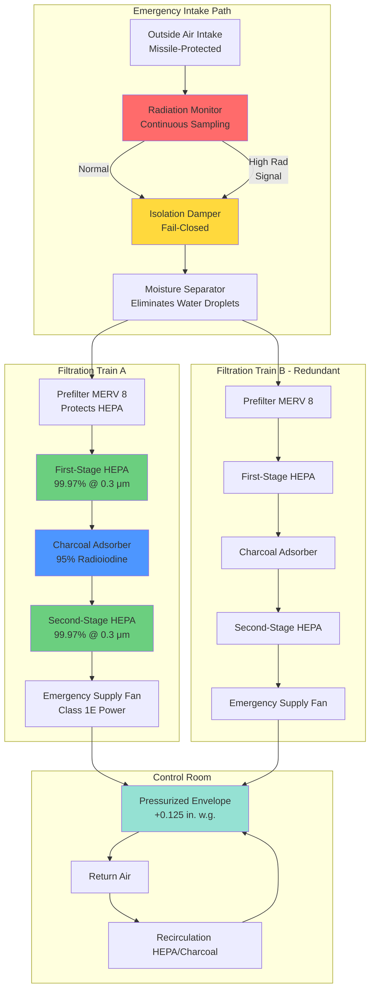

## Design Basis Accident Considerations

Design basis accidents (DBA) establish the most severe conditions nuclear facility HVAC systems must withstand while maintaining critical area habitability and containment integrity. Emergency ventilation systems transition from normal operation to accident modes within seconds, providing filtered recirculation, pressure boundary protection, and radioactive material containment.

NRC regulations require emergency HVAC systems to function during postulated accidents including loss-of-coolant accidents (LOCA), fuel handling accidents, main steam line breaks, and external hazards. Systems must operate for extended periods (30 days minimum) on emergency power while maintaining operator dose exposure below 5 rem TEDE per 10 CFR 50 Appendix A, General Design Criterion 19.

### Critical Design Basis Accident Parameters

| Accident Type | Duration | Radiation Level | Containment Pressure | Ventilation Response | Filtration Required |
|---------------|----------|-----------------|---------------------|---------------------|---------------------|
| LOCA (Large Break) | 0-30 days | 10²-10⁶ R/hr peak | 45-60 psig peak | Immediate isolation, recirculation | HEPA + charcoal |
| LOCA (Small Break) | 0-30 days | 10¹-10⁴ R/hr | 20-40 psig | Delayed isolation, filtered makeup | HEPA + charcoal |
| Fuel Handling | 2 hrs-7 days | 10⁰-10³ R/hr | Atmospheric | Control room isolation | HEPA + charcoal |
| Main Steam Line Break | 0-8 hours | 10⁻¹-10² R/hr | Subatmospheric | Filtered pressurization | HEPA filters |
| Toxic Gas Release | 15 min-2 hrs | N/A | Atmospheric | Complete isolation | Recirculation only |
| Seismic Event | 0-72 hours | Variable | Variable | Maintain function post-earthquake | Per accident type |

### Radiation Dose Analysis Requirements

Control room habitability analysis demonstrates operator protection during accidents using source term calculations per Regulatory Guide 1.183:

$$TEDE_{total} = TEDE_{shine} + TEDE_{inhalation}$$

**Shine dose from external radiation:**

$$TEDE_{shine} = \int_0^{30d} \dot{D}_{external}(t) \cdot SF_{structure} \cdot OF(t) \, dt$$

Where:
- $\dot{D}_{external}(t)$ = time-dependent dose rate from contaminated surfaces and plume (rem/hr)
- $SF_{structure}$ = structural shielding factor (typically 0.1-0.5 for concrete control rooms)
- $OF(t)$ = occupancy factor (1.0 for first 24 hours, 0.6 for days 1-4, 0.4 thereafter)

**Inhalation dose from airborne contamination:**

$$TEDE_{inhalation} = \sum_{i} \chi_i \cdot BR \cdot DCF_i \cdot t_{exposure}$$

Where:
- $\chi_i$ = time-integrated airborne concentration of radionuclide $i$ (μCi·s/m³)
- $BR$ = breathing rate (3.5×10⁻⁴ m³/s for seated light activity)
- $DCF_i$ = dose conversion factor for inhalation (rem/μCi)
- $t_{exposure}$ = exposure duration (seconds)

## Radioactive Release Containment

Emergency ventilation systems prevent uncontrolled release of radioactive materials through multiple barrier defense:

### Primary Containment Isolation

Reactor containment building maintains pressure boundary during LOCA:

**Isolation valve requirements:**
- Redundant isolation valves on all penetrations (Type A, B, C per 10 CFR 50 Appendix J)
- Automatic closure on containment isolation signals within 5-60 seconds depending on penetration type
- Leak-tight shutoff: Type B testing maximum allowable leakage 0.01-0.10 La (La = design basis accident leakage)
- Seismic Category I qualification, environmental qualification for post-accident temperature/pressure/radiation

**Containment pressure control:**

$$P_{containment}(t) = P_{initial} + \frac{m_{steam}(t) \cdot R \cdot T_{avg}}{V_{containment}}$$

Where:
- $P_{containment}(t)$ = time-dependent containment pressure (psia)
- $m_{steam}(t)$ = mass of steam released from primary system (lbm)
- $R$ = gas constant for steam (85.78 ft·lbf/lbm·°R)
- $T_{avg}$ = average containment atmosphere temperature (°R)
- $V_{containment}$ = free containment volume (ft³)

Containment spray systems and fan coolers remove heat to reduce pressure below design limit (typically 45-60 psig).

### Secondary Confinement and Filtration

Buildings surrounding primary containment maintain negative pressure and exhaust through HEPA/charcoal filters:

**Standby gas treatment system (SBGT):**
- Maintains -0.25 to -0.5 inches w.g. in secondary containment (auxiliary building, fuel building)
- Exhaust capacity 3,000-10,000 cfm per train with 100% redundancy
- Two-stage HEPA + charcoal filtration before discharge to elevated stack (150-300 ft height)
- Automatic start on low differential pressure or high radiation signal

**Filtration efficiency requirements:**

$$\eta_{overall} = 1 - (1 - \eta_{HEPA1})(1 - \eta_{charcoal})(1 - \eta_{HEPA2})$$

For particulates with two-stage HEPA at 99.97% each:

$$\eta_{overall} = 1 - (1 - 0.9997)^2 = 0.999991 = 99.9991\%$$

For radioiodine with 99.97% HEPA, 95% charcoal, 99.97% HEPA:

$$\eta_{overall} = 1 - (0.0003)(0.05)(0.0003) = 0.999999955 \approx 99.9999955\%$$

### Control Room Envelope Protection

Control room habitability system creates positive pressure boundary to exclude contaminated air:

**Unfiltered in-leakage limit:**

$$Q_{leak} \leq 10 \text{ cfm at } \Delta P = 0.125 \text{ in. w.g.}$$

**Pressurization flow calculation:**

$$Q_{supply} = Q_{leak} + Q_{personnel} + Q_{exfiltration}$$

Where:
- $Q_{supply}$ = filtered makeup air required (cfm)
- $Q_{personnel}$ = ventilation for occupants (5-10 cfm/person × occupancy)
- $Q_{exfiltration}$ = designed leakage through airlocks and emergency exits (typically 50-100 cfm)

**Control room airborne concentration:**

$$\frac{d\chi_{CR}}{dt} = \frac{Q_{leak} \cdot \chi_{ambient} + Q_{filtered} \cdot (1-\eta) \cdot \chi_{ambient} - (Q_{leak} + Q_{filtered}) \cdot \chi_{CR}}{V_{CR}}$$

Solving for steady-state with decay:

$$\chi_{CR} = \frac{Q_{leak} + Q_{filtered}(1-\eta)}{Q_{leak} + Q_{filtered} + \lambda V_{CR}} \cdot \chi_{ambient}$$

Where $\lambda$ = radioactive decay constant (s⁻¹) plus any recirculation filtration removal rate.

## Emergency Filtration Requirements

### HEPA Filter Performance Standards

High-efficiency particulate air filters remove airborne radioactive particles per ASME AG-1 and N509:

**Efficiency specifications:**
- Minimum 99.97% removal of 0.3 μm particles (most penetrating particle size)
- DOP aerosol testing per ASME N510 in-place verification
- Maximum allowable penetration 0.05% (500 ppm upstream, 0.25 ppm downstream)
- Resistance: 1.0 inch w.g. clean, replace at 4.0 inch w.g. loaded

**Filter media construction:**
- Borosilicate glass fiber media with submicron diameter fibers
- Pleated design for maximum surface area (25-50 ft²/ft² face area)
- Aluminum or stainless steel frames with gasket seal
- Fire-resistant adhesives and separators rated 400-750°F

**Filtration mechanism efficiency:**

$$\eta_{total} = 1 - [(1-\eta_{diffusion})(1-\eta_{interception})(1-\eta_{impaction})]$$

For 0.3 μm particles in properly designed HEPA filter:

$$\eta_{total} \approx 1 - 0.0003 = 0.9997 = 99.97\%$$

### Charcoal Adsorber Design

Radioiodine removal requires activated carbon impregnated with potassium iodide or TEDA:

**Performance criteria (per ASME N509, ASTM D3803):**
- Minimum 95% methyl iodide (CH₃I) removal efficiency at 95% relative humidity
- Residence time ≥0.25 seconds at design flow rate
- Bed depth 2-4 inches for deep-bed adsorbers
- Maximum face velocity 40 fpm to prevent channeling and ensure contact time

**Residence time calculation:**

$$t_{residence} = \frac{V_{bed} \cdot \epsilon}{Q_{air}}$$

Where:
- $t_{residence}$ = gas residence time in charcoal bed (seconds)
- $V_{bed}$ = total bed volume (ft³)
- $\epsilon$ = bed void fraction (typically 0.45-0.55 for granular activated carbon)
- $Q_{air}$ = volumetric flow rate (ft³/s)

For 1000 cfm flow through 4-inch deep bed with 100 ft² face area:

$$V_{bed} = 100 \text{ ft}^2 \times \frac{4}{12} \text{ ft} = 33.3 \text{ ft}^3$$

$$t_{residence} = \frac{33.3 \times 0.5}{1000/60} = 1.0 \text{ second}$$

This exceeds the 0.25 second minimum requirement by 4×, providing safety margin.

**Adsorption capacity degradation:**

$$\eta(t) = \eta_0 \cdot e^{-k_{deg} \cdot t}$$

Where:
- $\eta(t)$ = efficiency at time $t$
- $\eta_0$ = initial efficiency (typically 99% for elemental iodine, 95% for organic iodides)
- $k_{deg}$ = degradation rate constant (depends on humidity, temperature, contaminants)
- $t$ = service time (months/years)

Replace charcoal when efficiency falls below 95% or after 4-8 years maximum service life.

### Filter System Configuration

## Automatic Isolation Sequences

Emergency ventilation system activation follows predetermined logic sequences initiated by accident signals:

### Isolation Signal Logic

**Primary initiation signals:**
1. **Safety Injection Actuation Signal (SIAS)** - high containment pressure, low pressurizer pressure, or manual actuation indicates LOCA
2. **High Radiation Monitor** - intake radiation exceeds setpoint (1-10 mR/hr depending on location)
3. **High Containment Pressure** - pressure exceeds 3-5 psig indicating primary system breach
4. **Toxic Gas Detection** - chlorine or ammonia concentration exceeds 10 ppm at intake
5. **Manual Initiation** - operator-actuated from control room or technical support center

**Isolation sequence timing:**

| Event | Time from Signal | Action | Verification |
|-------|------------------|--------|--------------|
| Signal received | t = 0 sec | Annunciate alarm | Control room panel |
| Isolation dampers start closing | t = 0-2 sec | Normal intake/exhaust dampers close | Position indication |
| Normal HVAC shutdown | t = 2-5 sec | Normal fans de-energize | Current monitoring |
| Emergency diesel start | t = 0-10 sec | EDG reaches rated speed/voltage | Frequency, voltage meters |
| Emergency fans start | t = 10-15 sec | Sequenced loading on EDG | Airflow indication |
| Pressurization achieved | t = 20-30 sec | Envelope pressure ≥+0.125 in. w.g. | Differential pressure transmitter |
| Continuous monitoring | t > 30 sec | Verify flows, pressures, radiation | Control room displays |

### Damper Performance Requirements

**Isolation damper specifications:**
- Leak-tight shutoff: ≤4 cfm/ft² at 4 inch w.g. differential pressure (bubble-tight construction)
- Actuator stroke time: 5-30 seconds depending on size and application
- Seismic Category I qualification, tested on shake table to site-specific response spectra
- Environmental qualification for accident temperature/humidity/radiation per 10 CFR 50.49
- Redundant position indication (limit switches or potentiometers)
- Manual override capability for testing and emergency operation

**Damper leakage testing:**

$$L_{damper} = C_d \cdot A \cdot \sqrt{\Delta P}$$

Where:
- $L_{damper}$ = leakage rate through closed damper (cfm)
- $C_d$ = discharge coefficient (typically 0.6-0.8 for parallel blade dampers)
- $A$ = damper free area when closed (ft², much smaller than open area)
- $\Delta P$ = pressure differential across damper (inches w.g.)

Maximum allowable leakage typically 4 cfm/ft² of damper face area at 4 inch w.g. test pressure.

### Control Logic Diagrams

Emergency ventilation mode selection based on accident type and progression:

**LOCA sequence:**
1. High containment pressure or SIAS → immediate isolation
2. 0-30 minutes: 100% recirculation mode (no outside air)
3. 30 minutes-72 hours: minimum filtered makeup air for personnel (5-10 cfm/person)
4. >72 hours: increased filtered outside air as ambient radiation decreases

**Fuel handling accident:**
1. High radiation in fuel building exhaust → control room isolation
2. Immediate transition to filtered pressurization mode
3. Continuous filtered makeup air throughout accident duration
4. Return to normal when radiation levels return to background

**Toxic gas release:**
1. Toxic gas detector alarms → complete outside air isolation
2. 100% recirculation on HEPA/charcoal filters (removes any internal contamination)
3. Periodic intake sampling to determine when hazard has cleared
4. Return to filtered pressurization when gas concentration <1 ppm

## Control Room Habitability During Accidents

### Envelope Integrity Maintenance

Control room habitability depends on maintaining positive pressure boundary that prevents unfiltered in-leakage:

**Testing and verification:**
- Pre-operational envelope integrity test per ASTM E741 or E779 (blower door test)
- Acceptance criterion: ≤10 cfm total in-leakage at +0.125 inch w.g.
- Periodic verification every 6 years per 10 CFR 50 Appendix J (Type C testing)
- Tracer gas testing (SF₆ or refrigerant) to locate and seal leaks

**Envelope penetration sealing:**
- Cable tray penetrations: fire-rated silicone foam seal packs
- Conduit penetrations: link seal modular seals or expanding grout
- Pipe penetrations: mechanical pipe seals with inflatable gaskets
- HVAC ductwork: gastight dampers with inflatable blade edge seals
- Personnel doors: double-door airlock with interlocked operation, compression gaskets
- Equipment hatches: bolted gasketed closures, tested for leak-tightness

**Pressurization maintenance:**

$$\Delta P = \frac{Q_{excess}^2}{(C \cdot A_{leak})^2}$$

Where:
- $\Delta P$ = pressure differential maintained (inches w.g.)
- $Q_{excess}$ = supply air in excess of envelope exfiltration (cfm)
- $C$ = flow coefficient for leak paths
- $A_{leak}$ = total equivalent leak area (in²)

This shows pressure varies with square of excess supply flow—doubling flow increases pressure by factor of 4.

### Life Support Requirements

Emergency ventilation provides breathable atmosphere for 30-50 occupants during extended accidents:

**Oxygen supply:**
- Minimum outside air: 5 cfm/person (ASHRAE 62.1 minimum for sedentary activity)
- Control room occupancy: 30-50 people during accidents (operations staff plus technical support)
- Required filtered makeup air: 150-250 cfm minimum
- Oxygen concentration maintained >19.5% (normal atmosphere 20.9%)

**CO₂ removal:**

$$\dot{m}_{CO_2} = N_{occupants} \times 0.3 \text{ cfm CO}_2\text{/person}$$

For 40 occupants:

$$\dot{m}_{CO_2} = 40 \times 0.3 = 12 \text{ cfm CO}_2 \text{ generation}$$

Maximum allowable CO₂ concentration 5000 ppm (0.5%) for 8-hour exposure per OSHA.

Required ventilation to dilute to 1000 ppm (comfort limit):

$$Q_{required} = \frac{12 \text{ cfm} \times 10^6}{1000 - 400} = 20,000 \text{ cfm recirculation}$$

Where 400 ppm is outdoor CO₂ concentration baseline.

**Temperature and humidity control:**
- Temperature maintained 70-78°F for operator comfort and equipment function
- Relative humidity 30-60% (low humidity causes static electricity, high humidity degrades charcoal)
- Cooling capacity 25-50 tons for typical control room (accounts for high equipment heat load)
- Heating capacity 10-30 kW electric resistance for cold weather conditions

### Operator Radiation Exposure Limits

Habitability systems limit operator dose to ensure personnel can safely control reactor:

**Regulatory dose limits:**
- 10 CFR 50 Appendix A GDC 19: ≤5 rem TEDE for duration of accident (30 days)
- Dose components: external shine from plume/surfaces + inhalation of contaminated air
- Most limiting radionuclides: I-131, Cs-137, Kr-85, Xe-133

**Shielding and filtration effectiveness:**

$$TEDE = SF_{structure} \cdot D_{shine} + \frac{(Q_{leak} + Q_{filtered}(1-\eta))}{V_{CR}/t_{air}} \cdot DCF \cdot \chi_{ambient}$$

Where:
- $SF_{structure}$ = structural shielding factor (0.1-0.5 for concrete walls 1-3 ft thick)
- $D_{shine}$ = unshielded direct radiation dose (rem)
- $V_{CR}/t_{air}$ = control room air change rate (hr⁻¹)
- $DCF$ = dose conversion factor for inhalation pathway

**Example dose calculation (LOCA):**
- Unshielded shine dose: 50 rem over 30 days
- Concrete structure shielding factor: 0.2
- Shine contribution: 50 × 0.2 = 10 rem

- Ambient I-131 concentration peak: 1000 μCi/m³
- Unfiltered in-leakage: 10 cfm = 4.7 L/s = 0.017 m³/s
- Filtered makeup: 200 cfm at 99% efficiency = 0.094 m³/s effective
- Control room volume: 100,000 ft³ = 2830 m³
- Breathing rate: 3.5×10⁻⁴ m³/s
- I-131 inhalation DCF: 3.0×10⁻⁵ rem/μCi

Time-integrated inhalation dose requires numerical integration of:

$$TEDE_{inh} = \int_0^{30d} \frac{(Q_{leak} + Q_{filt}(1-\eta)) \cdot \chi(t)}{V_{CR}} \cdot BR \cdot DCF \, dt$$

With proper filtration (99%), inhalation dose typically <1 rem, giving total TEDE ~11 rem—exceeding the 5 rem limit.

**Corrective measures to meet dose limit:**
1. Reduce in-leakage from 10 cfm to 5 cfm (improved envelope sealing)
2. Increase filtration efficiency from 99% to 99.5% (triple-stage HEPA)
3. Increase shielding or reduce occupancy time in high-dose locations

With these improvements, revised dose: 10 × 0.2 + 0.5 = 2.5 rem, well below 5 rem limit.

## Conclusion

Emergency ventilation systems for nuclear accident scenarios integrate multiple engineered safety features: rapid automatic isolation, redundant high-efficiency filtration, emergency power supply, and rigorous testing programs. Design basis accidents define worst-case conditions that systems must withstand while maintaining control room habitability below 5 rem operator dose. HEPA and charcoal filtration achieves >99.99% removal of particulates and radioiodine, while envelope integrity testing verifies minimal unfiltered in-leakage. These systems represent critical barriers protecting operators who must safely shut down and maintain reactors during the most severe postulated accidents.
