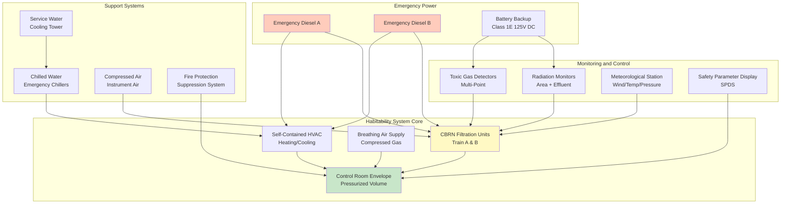

## Overview of Nuclear Habitability Systems

Habitability systems in nuclear facilities ensure control room operators can safely perform critical safety functions during design basis accidents and external hazards for extended periods. These systems integrate toxic gas protection, CBRN (chemical, biological, radiological, nuclear) filtration, breathing air supplies, self-contained HVAC units, and emergency power to maintain habitable conditions for minimum 30-day occupancy without external support.

NRC General Design Criterion 19 mandates control room design permitting continuous occupancy under accident conditions without personnel exceeding 5 rem TEDE (Total Effective Dose Equivalent). Habitability systems provide defense-in-depth protection against multiple simultaneous hazards: radioactive contamination, toxic industrial chemicals, and loss of normal building systems.

## Toxic Gas Protection Requirements

### Regulatory Basis and Design Criteria

**Regulatory Guide 1.78 and 1.95** establish toxic gas protection requirements:
- Control room isolation from atmospheric releases of chlorine, ammonia, sulfur dioxide, and other hazardous chemicals
- Toxic gas concentration limits: ≤IDLH (Immediately Dangerous to Life or Health) values
- Detection and isolation response time: ≤30 seconds from alarm to complete isolation
- Minimum safe breathing period: 30 minutes at 100% recirculation without degradation

**Common toxic gas threats:**
- Chlorine: IDLH = 10 ppm (water treatment facilities)
- Ammonia: IDLH = 300 ppm (refrigeration systems)
- Sulfur dioxide: IDLH = 100 ppm (fossil fuel combustion)
- Hydrogen sulfide: IDLH = 100 ppm (wastewater treatment)

### Toxic Gas Detection and Monitoring

**Multi-point detection system:**
- Continuous monitors at all outside air intakes (minimum 2 per intake)
- Electrochemical or infrared sensors with <1 minute response time
- Alarm setpoints: 50% of IDLH for isolation, 25% of IDLH for pre-alarm
- Automatic calibration and bump testing per ISA 12.13.01

**Meteorological integration:**
- Wind speed and direction sensors for plume trajectory prediction
- Automatic intake selection based on upwind source identification
- Site-specific dispersion modeling per NUREG/CR-6624

Toxic gas concentration in control room envelope during isolation:

$$C_{CR}(t) = C_0 \cdot e^{-\lambda t} + \frac{Q_{leak} \cdot C_{ambient}}{\lambda \cdot V_{CR}} \cdot (1 - e^{-\lambda t})$$

Where:
- $C_{CR}(t)$ = control room concentration at time $t$ (ppm)
- $C_0$ = initial control room concentration (ppm)
- $\lambda$ = air change rate ($\text{hr}^{-1}$) = $(Q_{leak} + Q_{reaction}) / V_{CR}$
- $Q_{leak}$ = unfiltered in-leakage (cfm)
- $V_{CR}$ = control room volume (ft³)
- $C_{ambient}$ = outdoor concentration (ppm)

**Design target:** Maintain $C_{CR}(t) < 0.1 \times IDLH$ for 30-minute minimum duration.

## CBRN Filtration Capabilities

### Multi-Stage Filtration Design

Habitability systems incorporate military-grade CBRN filtration for protection against warfare agents and industrial hazards:

**Four-stage filtration configuration:**

```mermaid
graph LR
    A[Emergency Air Intake<br/>Multiple Locations] --> B[Prefilter Stage<br/>MERV 11-13]
    B --> C[HEPA Filter Bank 1<br/>99.97% @ 0.3 μm]
    C --> D[Activated Carbon Adsorbers<br/>Chemical/Gas Removal]
    D --> E[HEPA Filter Bank 2<br/>Carbon Dust Capture]
    E --> F[Supply Fan<br/>100% Redundant]
    F --> G[Conditioned Air<br/>to Control Room]

    G --> H[Control Room Envelope<br/>Pressurized +0.125 in w.g.]
    H --> I[Recirculation Return]
    I --> J[Cooling/Heating Coils]
    J --> K[Recirculation HEPA/Carbon]
    K --> C

    style H fill:#e1f5ff
    style D fill:#ffe1e1
```

### CBRN Filter Specifications

**HEPA filtration performance:**
- Minimum efficiency: 99.97% at 0.3 μm DOP test per MIL-STD-282
- Pressure drop: 1.0-2.0 in. w.g. clean, 4.0 in. w.g. maximum loaded
- Face velocity: 250 fpm maximum for optimal penetration resistance
- Construction: Fire-resistant medium, continuous gasket sealing

**Activated carbon specifications for CBRN:**

| Parameter | Specification | Test Method |
|-----------|---------------|-------------|
| Carbon type | Impregnated ASZM-TEDA | MIL-PRF-32016 |
| Bed depth | 2-4 inches minimum | ASTM D3467 |
| Residence time | ≥0.25 seconds | Calculated at design flow |
| Methyl iodide removal | ≥95% @ 2.5 mg/m³ challenge | ASTM D3803 |
| Cyanogen chloride removal | ≥95% @ 150 mg/m³ | MIL-STD-282 |
| Phosgene removal | ≥99% @ 10,000 mg-min/m³ | NSF P248 |
| Relative humidity | 30-70% optimal | Continuous monitoring |

**Chemical warfare agent protection:**
- Nerve agents (Sarin, VX): >99.9% removal via adsorption and catalytic decomposition
- Blister agents (Mustard gas): >99% removal via activated carbon bed
- Blood agents (Hydrogen cyanide): >95% removal with TEDA-impregnated carbon
- Choking agents (Phosgene, chlorine): >99% removal via chemical adsorption

### Filtration Efficiency Testing

**In-place aerosol testing (ASME N510):**

$$\eta_{HEPA} = \left(1 - \frac{C_{downstream}}{C_{upstream}}\right) \times 100\%$$

Where:
- $\eta_{HEPA}$ = HEPA filter efficiency (%)
- $C_{upstream}$ = DOP concentration upstream (μg/L)
- $C_{downstream}$ = DOP concentration downstream (μg/L)

**Acceptance criteria:** $\eta_{HEPA} \geq 99.95\%$ (maximum 0.05% penetration)

## Breathing Air Systems

### Compressed Breathing Air Supply

Self-contained breathing air systems provide emergency respiratory protection independent of filtered ventilation:

**System configuration:**
- Medical-grade compressed air: Grade D per CGA G-7.1 (19.5-23.5% O₂, <5 ppm CO, <25 ppm CO₂, <10 mg/m³ oil mist)
- Storage capacity: 8-24 hours at 30 occupants × 1.5 cfm/person = 3,600-10,800 scf
- Pressure: 2,400-4,500 psig storage, reduced to 50 psig distribution
- Redundant cylinder banks with automatic switchover

**Breathing air consumption calculation:**

$$V_{BA} = N_{occ} \times Q_{person} \times t_{mission} \times SF$$

Where:
- $V_{BA}$ = total breathing air volume required (scf)
- $N_{occ}$ = number of occupants (30-50 typical)
- $Q_{person}$ = breathing air demand per person (1.5 cfm at standard conditions)
- $t_{mission}$ = mission time (480-1440 minutes for 8-24 hours)
- $SF$ = safety factor (1.5 typical)

**Example:** $V_{BA} = 30 \times 1.5 \times 720 \times 1.5 = 48,600 \text{ scf}$

At 2,400 psig storage pressure, cylinder volume required:

$$V_{cylinder} = \frac{V_{BA} \times P_{atm}}{P_{storage} \times \eta_{discharge}} = \frac{48,600 \times 14.7}{2,400 \times 0.90} = 331 \text{ ft}^3$$

**Distribution options:**
- Full-face supplied air respirators (SARs) with emergency egress bottles
- Airline manifolds at operator workstations with quick-disconnect fittings
- Self-contained breathing apparatus (SCBA) for mobility (30-60 minute capacity)

### Oxygen Monitoring and Makeup

**Continuous oxygen monitoring:**
- Electrochemical O₂ sensors at breathing zone height
- Alarm setpoints: <19.5% low alarm, <18.0% evacuation alarm
- Span gas calibration quarterly per manufacturer specifications

**CO₂ scrubbing for extended occupancy:**

$$V_{CO_2} = N_{occ} \times 0.35 \text{ cfm} \times 0.04 = N_{occ} \times 0.014 \text{ cfm CO}_2 \text{ generation}$$

Lithium hydroxide (LiOH) scrubbers remove CO₂ in sealed environments:
- Capacity: 0.78 lb CO₂ per lb LiOH consumed
- Canister sizing: 1.5 lb LiOH per person per day for extended missions

## Self-Contained HVAC Units

### Packaged Habitability System Design

Self-contained HVAC units integrate filtration, conditioning, and controls in seismically qualified, redundant packages:

**Unit specifications:**

| Component | Specification | Redundancy |
|-----------|---------------|------------|
| Supply airflow | 2,000-4,000 cfm per unit | 100% (2 units, each 100% capacity) |
| Filtration | HEPA + carbon in housing | Dual independent trains |
| Cooling capacity | 15-40 tons DX or chilled water | Redundant compressors/coils |
| Heating capacity | 30-60 kW electric resistance | Dual element banks |
| Fan motor | 15-30 HP, Class 1E power | VFD or multi-speed |
| Seismic qualification | IBC Seismic Design Category D-F | Shake table tested |
| Instrumentation | ΔP, flow, temp, damper position | Redundant sensors |

### Thermal Load Management

**Control room heat load during emergency operation:**

$$Q_{total} = Q_{occupants} + Q_{equipment} + Q_{lights} + Q_{infiltration}$$

**Component heat loads:**

$$Q_{occupants} = N_{occ} \times (250 \text{ Btu/hr sensible} + 200 \text{ Btu/hr latent})$$

$$Q_{equipment} = 3.41 \times P_{electrical} \text{ (Btu/hr, where } P_{electrical} \text{ in kW)}$$

$$Q_{lights} = A_{floor} \times 3 \text{ W/ft}^2 \times 3.41 \text{ Btu/hr/W}$$

**Example calculation (2,000 ft² control room, 40 occupants, 100 kW equipment load):**

$$Q_{total} = 40 \times 450 + 3.41 \times 100,000 + 2000 \times 3 \times 3.41 + 5,000$$

$$Q_{total} = 18,000 + 341,000 + 20,460 + 5,000 = 384,460 \text{ Btu/hr} = 32 \text{ tons}$$

**Cooling system design:**
- Redundant DX units: 2 × 35 ton capacity (110% each, N+1 configuration)
- Chilled water alternative: Dual coils with independent emergency chillers
- Condensing method: Air-cooled condensers on emergency power, elevated installation
- Controls: Staged cooling with temperature dead band 72-76°F

### Humidity Control

**Humidity requirements for equipment and comfort:**
- Operating range: 30-60% RH for electronic equipment reliability
- High humidity concern: Condensation on cold surfaces, mold growth >70% RH
- Low humidity concern: Static electricity, respiratory discomfort <30% RH

**Dehumidification during recirculation:**

$$m_{water} = \frac{Q_{cfm} \times 60 \times \rho_{air} \times (W_{in} - W_{out})}{7000}$$

Where:
- $m_{water}$ = moisture removal rate (lb/hr)
- $Q_{cfm}$ = airflow rate (cfm)
- $\rho_{air}$ = air density (0.075 lb/ft³)
- $W_{in}$, $W_{out}$ = humidity ratio in/out (lb water/lb dry air)

Cooling coils operating below dew point provide dehumidification; reheat maintains temperature.

## Emergency Diesel Backup

### Diesel Generator Load Allocation

**Habitability system electrical loads:**

| Load Description | Rating | Starting kVA | Running kW | Load Sequence |
|-----------------|--------|--------------|------------|---------------|
| Supply fan A (emergency) | 25 HP | 120 | 16.8 | First (0-5 sec) |
| Recirculation fan A | 20 HP | 95 | 13.4 | First (5-10 sec) |
| DX compressor 1 | 30 HP | 180 | 21.5 | Second (10-20 sec) |
| DX compressor 2 (backup) | 30 HP | 180 | 21.5 | On-demand |
| Electric heater bank | 40 kW | — | 40.0 | On-demand |
| Chilled water pump | 5 HP | 24 | 3.4 | Second (15-25 sec) |
| Damper actuators/controls | — | — | 2.5 | First (0-5 sec) |
| Instrumentation | — | — | 1.0 | Continuous |
| **Total Division A** | — | **180** | **120.1** | — |

**Diesel generator sizing:**
- Continuous rating: 150-200 kW minimum per division for habitability loads
- Peak starting capacity: Accommodate largest motor (DX compressor 180 kVA) plus running loads
- Total site emergency load: Habitability typically 10-15% of total EDG capacity
- Fuel consumption: 10-15 gallons/hour at 75% load, 7-day onsite fuel storage minimum

### Load Sequencing and Control

**Automatic start sequence:**

1. **0 seconds:** Safety actuation signal (LOCA, high radiation, toxic gas)
2. **0-10 seconds:** Emergency diesel generator acceleration to rated speed/voltage
3. **10 seconds:** Emergency bus energized, load sequencer activated
4. **10-15 seconds:** Isolation dampers close, supply/recirc fans start
5. **15-30 seconds:** Pressurization achieved, cooling system starts
6. **30+ seconds:** Continuous operation until manual termination

**Electrical protection:**
- Overcurrent protection coordinated with upstream diesel breaker
- Motor overload relays with Class 20 trip characteristics
- Ground fault detection and alarm (no trip on first ground)
- Undervoltage relay monitoring with diesel restart on sustained low voltage

## 30-Day Habitability Requirements

### Consumables and Life Support

**Minimum 30-day supply inventory:**

| Consumable | Quantity per Person | Total (40 occupants, 30 days) |
|------------|---------------------|-------------------------------|
| Potable water | 1 gallon/day | 1,200 gallons |
| Food (MRE equivalent) | 3 meals/day | 3,600 meals |
| Breathing air (backup) | 10 scf/hr | 288,000 scf (optional) |
| Medical supplies | First aid kit | 2 kits (primary + backup) |
| Sanitation supplies | As required | 30-day inventory |
| LiOH CO₂ scrubbers | 1.5 lb/person-day | 1,800 lb (if sealed mode) |

### Water and Sanitation Systems

**Potable water supply:**
- Onsite storage: 1,500-2,000 gallon emergency tanks
- Emergency well or connection to safety-related water supply
- Water quality testing capability for radiological contamination
- Distribution: Low-pressure plumbing system independent of plant service water

**Sanitation facilities:**
- Self-contained restrooms within habitability envelope
- Sewage holding tanks: 200-400 gallon capacity (0.5 gallon/person-day × safety factor)
- Backup sanitary facilities: Chemical toilets if primary system fails
- Waste storage: Sealed containers for 30-day solid waste accumulation

### Environmental Monitoring

**Continuous habitability monitoring:**

| Parameter | Range | Alarm Setpoint | Instrument Type |
|-----------|-------|----------------|-----------------|
| Temperature | 65-85°F | <65°F or >80°F | RTD or thermocouple |
| Relative humidity | 20-70% | <25% or >65% | Capacitive sensor |
| Oxygen concentration | 19.5-23.5% | <20% or >23% | Electrochemical |
| CO₂ concentration | 0-5,000 ppm | >1,000 ppm | NDIR sensor |
| CO concentration | 0-50 ppm | >25 ppm | Electrochemical |
| Radiation dose rate | 0-1000 mR/hr | Site-specific | Ion chamber |
| Pressurization | 0-0.25 in w.g. | <0.10 in w.g. | Differential pressure |

**Data logging and trending:**
- Minimum 30-day continuous recording at 1-minute intervals
- Archival storage for post-accident analysis per 10 CFR 50.47
- Redundant recording systems on separate power divisions
- Remote monitoring capability from Technical Support Center

### Medical and Personnel Support

**Medical capabilities:**
- First aid station with emergency supplies for trauma, cardiac events
- AED (automated external defibrillator) with trained personnel
- Communication to offsite medical facilities via dedicated lines
- Radiation contamination survey equipment and decontamination supplies

**Rest and habitability facilities:**
- Sleeping accommodations: 20-30 bunks for shift rotation
- Food preparation: Microwave, refrigerator on emergency power
- Communications: Redundant telephone, radio links to EOF (Emergency Operations Facility)
- Lighting: Emergency LED lighting, 30 foot-candles minimum at workstations

## Habitability System Integration

### Coordination with Other Emergency Systems

**Interfaces and dependencies:**

**Critical interfaces:**
- Emergency diesel generators provide uninterruptible power via Class 1E distribution
- Radiation and toxic gas monitors trigger automatic mode transitions
- SPDS (Safety Parameter Display System) provides real-time plant status to operators
- Chilled water system maintains cooling despite loss of normal plant systems
- Fire suppression designed to maintain envelope integrity during firefighting operations

### Performance Verification Testing

**Pre-operational testing program:**
1. Envelope leak rate testing per ASTM E741 at +0.125 in. w.g. test pressure
2. HEPA/carbon filter in-place testing per ASME N510 and N509
3. Integrated system test: 72-hour continuous operation on emergency power
4. Simulated accident scenarios: LOCA, toxic gas, and radiological release
5. Diesel generator load profile verification with full habitability loads

**Periodic surveillance requirements:**
- Monthly: Damper cycling, fan operation, diesel generator run with load
- Quarterly: Filter differential pressure trending, instrumentation calibration
- Annual: Toxic gas detector response verification, breathing air quality testing
- 18-month: In-place filter efficiency testing (DOP for HEPA, lab samples for carbon)
- 6-year: Type C leak rate testing per 10 CFR 50 Appendix J

**Acceptance criteria summary:**
- Pressurization: ≥0.125 in. w.g. achieved within 30 seconds, maintained ±0.02 in. w.g.
- Unfiltered in-leakage: ≤10 cfm at test pressure (tracer gas verification)
- HEPA efficiency: ≥99.95% by in-place DOP test
- Carbon efficiency: ≥95% methyl iodide removal by laboratory test
- Temperature control: Maintain 70-78°F under maximum heat load conditions
- Diesel generator: Start and accept load within 10 seconds, run 24 hours continuously

The comprehensive integration of toxic gas protection, CBRN filtration, breathing air systems, self-contained HVAC, and emergency power ensures nuclear control room habitability systems meet the most stringent regulatory requirements for 30-day accident response capability, protecting operators who maintain safe shutdown and mitigation functions under the most severe postulated conditions.
