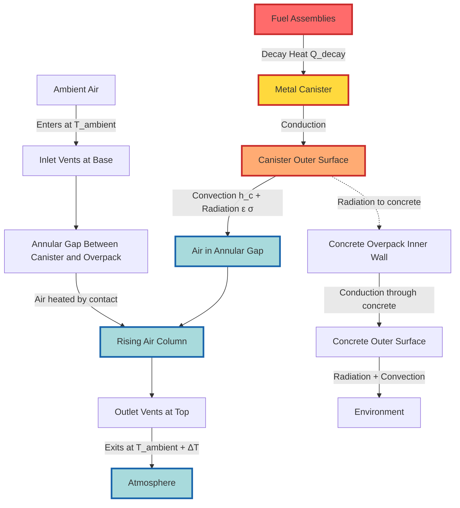

Dry cask storage systems store spent nuclear fuel in sealed, gas-filled containers cooled by passive natural convection, eliminating the need for active mechanical ventilation or cooling systems. Independent Spent Fuel Storage Installations (ISFSIs) rely on fundamental heat transfer principles—conduction through cask walls, radiation to surrounding structures, and convection by ambient air—to remove decay heat generated by fuel assemblies. This passive approach ensures long-term safety without dependence on electrical power, mechanical equipment, or operator action, meeting the robust safety requirements of 10 CFR Part 72 (Licensing Requirements for the Independent Storage of Spent Nuclear Fuel) and design guidance in NUREG-1536 (Standard Review Plan for Spent Fuel Dry Storage Systems).

## Physical Principles of Passive Cooling

Spent nuclear fuel continues generating decay heat for decades after reactor discharge. Fuel assemblies loaded into dry storage casks typically cool for 3-10 years in spent fuel pools before transfer, reducing decay heat to levels manageable by passive air cooling.

**Decay Heat Characteristics:**

A typical pressurized water reactor (PWR) fuel assembly generates approximately:

- 1-2 kW thermal at 1 year post-discharge
- 0.5-0.8 kW thermal at 5 years post-discharge
- 0.3-0.5 kW thermal at 10 years post-discharge
- 0.2-0.3 kW thermal at 20 years post-discharge

A standard dry storage cask contains 24-32 PWR assemblies or 56-68 boiling water reactor (BWR) assemblies, resulting in total cask heat loads of 10-25 kW when loaded with minimum-cooled fuel.

**Heat Transfer Mechanisms:**

Heat removal from cask to environment occurs through three sequential processes:

1. **Conduction through fuel and cask structure:** Decay heat conducts from fuel pellets through cladding, fuel basket metallic structure, and cask walls
2. **Radiation and convection from cask surface:** Heat radiates from hot cask exterior surfaces and transfers to surrounding air through natural convection
3. **Buoyancy-driven ventilation:** Heated air rises and exits through upper vents while cool ambient air enters lower vents, creating continuous circulation

The limiting thermal resistance typically occurs at the cask surface-to-air boundary, making ventilation airflow rate the critical parameter for temperature control.

## Natural Convection Heat Transfer Analysis

Passive cooling relies on thermosiphon effect: air heated by contact with hot surfaces becomes less dense and rises, drawing cool replacement air from below.

**Buoyancy-Driven Airflow:**

The volumetric airflow rate through natural convection passages depends on the vertical height difference between inlet and outlet, temperature rise of air, and flow resistance of the ventilation path.

$$\dot{V} = C_d A \sqrt{2 g H \frac{\Delta T}{T_{\text{avg}}}}$$

Where:
- $\dot{V}$ = volumetric airflow rate (m³/s)
- $C_d$ = discharge coefficient (0.6-0.8 for well-designed passages)
- $A$ = minimum flow area (m²)
- $g$ = gravitational acceleration (9.81 m/s²)
- $H$ = vertical height between inlet and outlet centerlines (m)
- $\Delta T$ = air temperature rise from inlet to outlet (K)
- $T_{\text{avg}}$ = average absolute air temperature (K)

**Heat Transfer by Convection:**

The heat removal rate by natural convection equals the thermal capacity of airflow times temperature rise:

$$Q_{\text{conv}} = \dot{m} c_p \Delta T = \rho \dot{V} c_p \Delta T$$

Where:
- $Q_{\text{conv}}$ = convective heat removal (W)
- $\dot{m}$ = mass airflow rate (kg/s)
- $\rho$ = air density at average temperature (kg/m³)
- $c_p$ = specific heat of air at constant pressure (1005 J/kg·K)
- $\Delta T$ = air temperature rise (K)

Combining these relationships yields the fundamental natural convection cooling equation:

$$Q_{\text{conv}} = \rho c_p C_d A \Delta T \sqrt{2 g H \frac{\Delta T}{T_{\text{avg}}}}$$

This demonstrates that heat removal scales with $\Delta T^{3/2}$, meaning convective cooling becomes more effective as surface temperatures increase, providing inherent thermal stability.

**Surface Heat Transfer Coefficient:**

The convective heat transfer coefficient for natural convection on vertical surfaces depends on the Rayleigh number:

$$h_c = \frac{k}{L} \times 0.59 \left( \text{Ra}_L \right)^{0.25}$$

For turbulent natural convection (Ra > 10⁹):

$$h_c = \frac{k}{L} \times 0.10 \left( \text{Ra}_L \right)^{0.33}$$

Where:
- $h_c$ = convective heat transfer coefficient (W/m²·K)
- $k$ = thermal conductivity of air (0.026 W/m·K at 20°C)
- $L$ = characteristic length (cask height for vertical surfaces)
- $\text{Ra}_L$ = Rayleigh number = $\frac{g \beta \Delta T L^3}{\nu \alpha}$
- $\beta$ = thermal expansion coefficient (1/T for ideal gas)
- $\nu$ = kinematic viscosity of air
- $\alpha$ = thermal diffusivity of air

Typical natural convection coefficients range from 5-15 W/m²·K depending on surface orientation, temperature difference, and wind conditions.

**Radiation Heat Transfer:**

High-temperature cask surfaces radiate significant thermal energy to surrounding concrete structures:

$$Q_{\text{rad}} = \varepsilon \sigma A (T_{\text{cask}}^4 - T_{\text{surr}}^4)$$

Where:
- $Q_{\text{rad}}$ = radiative heat transfer (W)
- $\varepsilon$ = effective emissivity (0.4-0.7 for painted steel, 0.7-0.9 for concrete)
- $\sigma$ = Stefan-Boltzmann constant (5.67 × 10⁻⁸ W/m²·K⁴)
- $A$ = radiating surface area (m²)
- $T_{\text{cask}}$ = cask surface temperature (K)
- $T_{\text{surr}}$ = surrounding structure temperature (K)

For typical cask surface temperatures of 150-200°C and concrete overpack temperatures of 50-80°C, radiation provides 30-50% of total heat rejection.

## Dry Storage System Design Comparison

Multiple dry cask storage system designs are licensed under 10 CFR Part 72, each with distinct thermal-hydraulic characteristics.

| System Type | Vendor Example | Cooling Configuration | Ventilation Path | Max Heat Load | Peak Cladding Temp | Key Features |
|-------------|----------------|----------------------|------------------|---------------|-------------------|--------------|
| Vertical concrete overpack | HI-STORM 100 | Natural convection through annulus | 4 inlet vents at base, 4 outlet vents at top, ~5 m height | 25-40 kW | 350-400°C | Concrete radiation shielding, steel MPC inside, ambient air through annulus |
| Horizontal storage module | NUHOMS-HD | Natural convection over canister | Side wall inlet louvers, roof outlet vents | 15-25 kW | 350-380°C | Horizontal canister in concrete module, airflow over canister surface |
| Bare metal cask | NAC-MPC | Direct surface convection/radiation | No confined ventilation path, open air exposure | 20-30 kW | 380-420°C | Thick steel/lead shielding, air circulation around exposed surfaces |
| Ventilated storage cask | TN-32 | Enhanced natural convection | Peripheral fins, multiple vent openings | 30-35 kW | 340-370°C | Finned steel cask surface, optimized for heat transfer |
| Underground vault | Vault design (rare) | Forced or natural ventilation through buried structure | Underground intake ducts, exhaust stack | 10-20 kW | 300-350°C | Earth shielding, requires active ventilation or large natural draft |

**Design Selection Criteria:**

- **Site ambient temperature:** Higher ambient temperatures reduce natural convection driving force; require lower heat load limits
- **Seismic qualification:** Horizontal systems have lower center of gravity; vertical systems require seismic analysis of tip-over
- **Security considerations:** Horizontal modules partially embedded; vertical casks more exposed
- **Future retrievability:** Horizontal systems require more space for transfer operations; vertical can be lifted directly
- **Thermal performance:** Vertical systems with tall vent paths generate stronger natural draft; horizontal rely more on surface area

## Ventilation Path Design Requirements

Proper ventilation path design ensures adequate airflow while preventing debris ingress, animal intrusion, and water accumulation.

**Inlet Vent Configuration:**

Bottom inlet vents admit cool ambient air to the annular space between fuel canister and concrete overpack.

- **Location:** Positioned at lowest practical elevation to maximize thermal driving head
- **Sizing:** Total inlet area typically 0.3-0.6 m² for 25 kW heat load casks
- **Screen protection:** Debris screens with 50-70% free area to prevent blockage while minimizing pressure drop
- **Weather protection:** Angled louvers or rain hoods prevent direct water entry
- **Missile protection:** Screens designed to withstand tornado-generated debris per site-specific requirements

**Outlet Vent Configuration:**

Top outlet vents discharge heated air to atmosphere while preventing rainwater entry.

- **Location:** Near top of overpack to maximize height difference from inlet
- **Sizing:** Total outlet area equals or exceeds inlet area (typically 1.1-1.2× inlet to account for air expansion)
- **Rain protection:** Horizontal louvers or gooseneck configurations prevent vertical rain penetration
- **Animal barriers:** Mesh screens prevent bird nesting while maintaining airflow
- **Radiation streaming:** Vent path geometry includes bends or offsets to reduce direct radiation streaming from cask to environment

**Annular Gap Design:**

The vertical annular space between inner canister and concrete overpack forms the primary airflow passage.

- **Gap width:** Typically 150-300 mm circumferentially
- **Flow area:** Maintained constant or gradually increasing in upward direction to minimize pressure drop
- **Surface roughness:** Smooth concrete surfaces reduce friction losses
- **Flow straighteners:** Some designs include internal baffles to promote uniform airflow distribution around canister

## Thermal Monitoring and Surveillance

Continuous temperature monitoring demonstrates compliance with cask certificate limits and provides early warning of degraded cooling performance.

**Monitoring System Design:**

Per NUREG-1536 Section 4, thermal monitoring provides verification that cask temperatures remain within analyzed limits.

**Temperature Measurement Locations:**

1. **Inlet air temperature:** Thermocouples at inlet vents measure ambient air temperature entering system
2. **Outlet air temperature:** Thermocouples at outlet vents measure heated air temperature; difference from inlet indicates heat removal rate
3. **Concrete surface temperature:** Embedded thermocouples at mid-height of overpack monitor concrete temperatures (limit typically 150°C long-term)
4. **Vent blockage detection:** Differential temperature between multiple outlet vents indicates flow obstruction if one vent shows reduced ΔT

**Calculated Parameters:**

From measured temperatures, operators calculate critical thermal performance indicators:

**Heat Removal Rate:**

$$Q_{\text{removed}} = \dot{V} \rho c_p (T_{\text{outlet}} - T_{\text{inlet}})$$

This should equal or exceed the calculated decay heat for the fuel loading.

**Thermal Margin:**

$$\text{Margin} = \frac{T_{\text{limit}} - T_{\text{measured}}}{T_{\text{limit}}} \times 100\%$$

Where $T_{\text{limit}}$ is the license basis maximum allowable temperature (typically 400°C peak cladding temperature).

**Surveillance Requirements:**

- **Temperature recording frequency:** Hourly automatic recording via datalogger
- **Visual inspection:** Quarterly walkdowns verify vent screens clear of debris, no visible damage
- **Annual flow testing:** Optional smoke test or thermal camera survey confirms airflow pattern
- **Thermal analysis update:** If fuel is added with higher decay heat or ambient temperatures exceed design basis, re-analysis may be required

## Regulatory Compliance Framework

Dry cask storage licensing under 10 CFR Part 72 requires comprehensive thermal analysis demonstrating fuel integrity maintenance under normal, off-normal, and accident conditions.

**10 CFR 72.122 - Overall Requirements:**

- **72.122(h)(1):** Systems must permit adequate heat removal capacity without active cooling systems
- **72.122(h)(4):** Fuel cladding must be protected during storage against degradation leading to gross ruptures

**10 CFR 72.236 - Specific Criteria for Spent Fuel Storage Cask Approval:**

- **72.236(f):** Heat removal capability must be evaluated for normal, off-normal, and accident conditions
- **72.236(g):** Cask must be compatible with wet and dry spent fuel loading facilities

**NUREG-1536 Thermal Evaluation Guidance:**

Section 4 of NUREG-1536 (Standard Review Plan for Spent Fuel Dry Storage Systems) establishes detailed thermal review criteria:

**Normal Conditions:**

- Peak fuel cladding temperature limit: 400°C for normal drying and storage operations
- Justification required if temperatures exceed 400°C due to potential for accelerated cladding oxidation
- Concrete temperature limit: 65°C (150°F) normal, 177°C (350°F) short-term off-normal

**Off-Normal Conditions:**

- Complete blockage of one ventilation path (inlet or outlet vents)
- 100% ventilation blockage for limited duration (demonstrates fuel survives maintenance or temporary blockage)
- Extreme ambient temperatures (site-specific, typically -40°C to +46°C)

**Accident Conditions:**

- Fire exposure per 10 CFR 71.73 (800°C flame for 30 minutes) for transportable casks
- Partial cask burial from tornado-generated debris
- Complete submersion in water (demonstrates no unacceptable temperatures from blocked vents)

**Thermal Analysis Requirements:**

Certificate of Compliance applications must include:

- Detailed thermal model (typically computational fluid dynamics combined with finite element analysis)
- Decay heat source term calculation per ORIGEN or equivalent
- Validation against experimental data from prototype testing
- Sensitivity studies evaluating uncertainty in key parameters (emissivity, flow resistance, ambient temperature)
- Maximum heat load determination with documented margin to temperature limits

**Operational Controls:**

Technical Specifications for ISFSI operation specify:

- Maximum decay heat per cask based on thermal analysis
- Minimum cooling time before fuel eligible for dry storage
- Burnup and enrichment limits ensuring criticality safety maintained
- Temperature monitoring requirements and action levels

## Performance Degradation and Recovery

Passive cooling systems operate without mechanical components, but performance can degrade from external factors.

**Vent Blockage:**

Most credible performance degradation results from reduced airflow through ventilation paths.

**Causes:**
- Debris accumulation on inlet screens (leaves, dust, snow, ice)
- Animal nesting in vent openings (birds, insects)
- Flood debris lodged in lower vents
- Concrete spalling partially blocking flow passages

**Consequences:**
- Reduced airflow increases air temperature rise across cask
- Higher cask surface temperatures increase radiation heat transfer (partially compensating)
- Complete blockage can result in temperatures approaching or exceeding license limits within days to weeks depending on decay heat

**Detection:**
- Surveillance inspections identify external blockages
- Temperature monitoring shows increased outlet temperatures or reduced temperature difference indicating lower airflow
- Thermal imaging during annual inspections reveals hotspots from non-uniform cooling

**Recovery:**
- Physical removal of debris from screens and vent openings
- Temporary monitoring increase to verify temperature return to normal range
- Engineering evaluation if blockage duration resulted in temperatures exceeding normal operating band

**Concrete Degradation:**

Long-term concrete exposure to elevated temperatures and outdoor weathering requires monitoring.

- Periodic inspection for cracking, spalling, or structural degradation
- Core sampling if visual inspection indicates potential issues
- Structural analysis if concrete strength degrades significantly (typically requires decades)

**Cask Aging Effects:**

Over 50-100 year storage duration, material property changes may affect performance:

- Concrete neutron shielding degradation from radiation exposure (requires periodic dose rate surveys)
- Metal surface corrosion increasing thermal contact resistance (typically negligible for painted or stainless surfaces)
- Helium backfill gas slow leakage through seals (reduces internal heat transfer, increases cladding temperatures)

Dry cask storage systems demonstrate that robust, purely passive cooling systems can safely remove nuclear decay heat for decades without operator action, electrical power, or mechanical equipment. The natural circulation airflow driven by buoyancy forces reliably maintains fuel temperatures within regulatory limits, exemplifying the defense-in-depth principle through inherent safety characteristics rather than active engineered systems. Proper ventilation path design, thermal monitoring, and periodic surveillance ensure these systems continue protecting public health and safety throughout extended storage periods mandated by delays in permanent repository availability.
