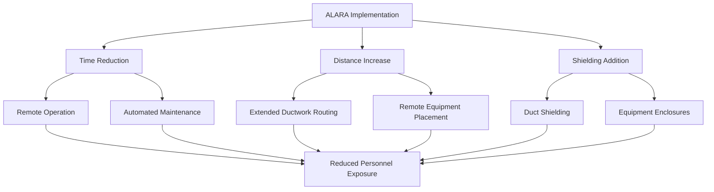
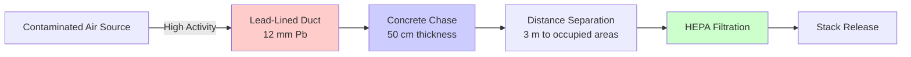
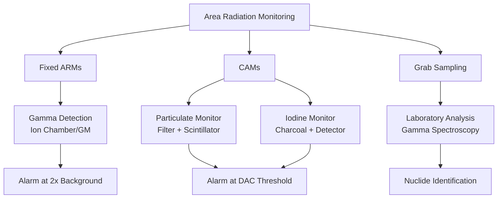

## ALARA Principles in HVAC Design

The As Low As Reasonably Achievable (ALARA) principle drives radiation protection strategy in fuel handling HVAC systems. Per 10 CFR 20.1101, exposure reduction relies on time minimization, distance maximization, and shielding optimization. HVAC systems implement ALARA through contamination confinement, negative pressure cascades preventing migration, and engineered controls reducing worker proximity to radiation sources.

The fundamental dose relationship governs design decisions:

$$H = \frac{\dot{H}_0 \cdot t}{d^2} \cdot e^{-\mu x}$$

Where $H$ is effective dose (mSv), $\dot{H}_0$ is dose rate at reference distance (mSv/h), $t$ is exposure time (h), $d$ is distance from source (m), $\mu$ is attenuation coefficient (cm⁻¹), and $x$ is shield thickness (cm).

## Dose Rate Calculations

Dose rate calculations for contaminated ductwork require modeling both surface contamination and airborne activity. Surface dose contribution follows:

$$\dot{H}_{surf} = \frac{A_{surf} \cdot E_{avg} \cdot k}{2\pi d^2}$$

Where $A_{surf}$ is surface activity (Bq/cm²), $E_{avg}$ is average gamma energy (MeV), $k$ is conversion factor (5.76 × 10⁻⁷ mSv·m²/MeV·Bq), and $d$ is distance (m).

For airborne radionuclides in exhaust streams:

$$\dot{H}_{air} = C_{air} \cdot DCF \cdot BR$$

Where $C_{air}$ is air concentration (Bq/m³), $DCF$ is dose conversion factor (Sv/Bq), and $BR$ is breathing rate (1.2 m³/h standard worker).

| Radionuclide | Half-Life | DCF Inhalation (Sv/Bq) | Primary Concern |
|--------------|-----------|------------------------|-----------------|
| Co-60 | 5.27 y | 3.1 × 10⁻⁹ | External gamma |
| Cs-137 | 30.2 y | 3.2 × 10⁻⁹ | External gamma |
| I-131 | 8.02 d | 7.4 × 10⁻⁹ | Thyroid uptake |
| Sr-90 | 28.8 y | 2.3 × 10⁻⁸ | Bone deposition |
| Pu-239 | 24,110 y | 2.5 × 10⁻⁵ | Alpha lung dose |

## Ductwork Shielding Requirements

Shielding calculations for contaminated ductwork follow exponential attenuation principles. Required thickness for gamma-emitting contaminants:

$$x = \frac{1}{\mu} \ln\left(\frac{\dot{H}_0}{\dot{H}_{target}}\right)$$

For concrete shielding around 1.25 MeV gamma source (Co-60), $\mu$ = 0.0595 cm⁻¹. To reduce 10 mSv/h to 0.025 mSv/h (occupational limit):

$$x = \frac{1}{0.0595} \ln\left(\frac{10}{0.025}\right) = 100.8 \text{ cm}$$

Practical shielding approaches include:

- **Lead-lined ductwork**: 6-12 mm lead for high-activity sections
- **Concrete encasement**: 30-100 cm depending on source strength
- **Labyrinth routing**: Multiple 90° bends exploiting scatter reduction
- **Distance separation**: Elevated or buried runs maintaining >2 m clearance

## Contamination Containment Strategy

Contamination control relies on negative pressure differentials and flow path engineering. The pressure cascade principle maintains progressive negativity toward contamination sources:

$$\Delta P_{total} = \sum_{i=1}^{n} \Delta P_i$$

Where each zone maintains minimum 12.5 Pa differential to adjacent lower-hazard area per NUREG-0800 Section 9.4.1.

| Zone Classification | Pressure Differential | Air Changes per Hour | Filtration Stage |
|---------------------|----------------------|----------------------|------------------|
| Clean Area | Reference (0 Pa) | 4-6 | Pre-filter only |
| Potentially Contaminated | -12.5 Pa | 6-10 | Pre + HEPA |
| Contaminated | -25 Pa | 10-20 | Pre + HEPA + Charcoal |
| Hot Cell | -50 Pa | 20-40 | Dual HEPA + Charcoal |

Leak tightness requirements prevent contamination escape. For Class I nuclear ductwork per ASME AG-1:

$$Q_{leak} \leq 0.1\% \text{ of system flow at } 1.5 \times P_{operating}$$

## Area Radiation Monitoring Systems

Continuous monitoring provides real-time dose rate surveillance and contamination detection. Area radiation monitors (ARMs) measure gamma exposure rates with typical response:

$$R = \frac{I - I_0}{S} \cdot CF$$

Where $R$ is dose rate (mSv/h), $I$ is detector current (nA), $I_0$ is background current, $S$ is sensitivity factor (nA per mSv/h), and $CF$ is calibration factor.

Continuous air monitors (CAMs) detect airborne particulates and gases. Collection efficiency for filter-based systems:

$$\eta = 1 - e^{-k \cdot v \cdot t}$$

Where $\eta$ is collection efficiency, $k$ is deposition coefficient (m⁻¹), $v$ is face velocity (m/s), and $t$ is residence time (s). HEPA filters achieve $\eta$ > 99.97% at 0.3 μm.

## Personnel Exposure Controls

Engineering controls minimize personnel dose through automation and remote operation. Access control criteria per 10 CFR 20.1601 requires posting for areas exceeding 0.05 mSv/h. High radiation areas (>1 mSv/h) mandate locked access.

Administrative controls implement work planning:

- Pre-job dose estimates using $H = \dot{H} \cdot t$
- Task scheduling during low-activity periods
- Job rotation limiting individual exposure
- Stay-time calculations: $t_{max} = H_{allowable} / \dot{H}_{area}$

Personal protective equipment addresses intake prevention rather than external shielding. Respiratory protection factors range from 10 (half-face) to 10,000 (supplied air with hood).

Annual occupational limits per 10 CFR 20.1201 establish boundaries: 50 mSv total effective dose equivalent, 500 mSv extremity dose, 150 mSv lens of eye. HVAC design targeting <5 mSv/y for routine operations provides substantial safety margin.

## Components

- Contamination Control Ventilation
- Particulate Removal Hepa
- Radioactive Iodine Removal
- Airborne Radioactivity Monitoring
- Continuous Air Monitors Cam
- Grab Sampling Systems
- Personnel Protection
