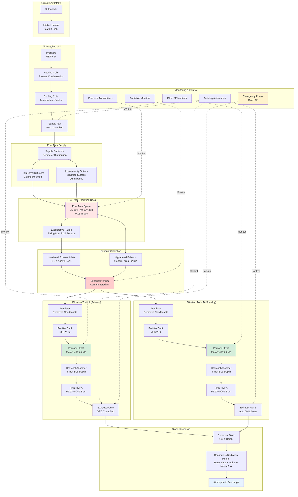

Spent fuel pool ventilation systems manage the complex thermal and radiological environment created by underwater storage of irradiated nuclear fuel assemblies. These systems must remove moisture-laden air containing radioactive gases, maintain negative pressure confinement, control humidity to prevent corrosion, and provide continuous filtration during both normal operations and accident conditions. The design integrates decay heat management, evaporative moisture control, and radioactive gas removal while complying with 10 CFR Part 50 Appendix A General Design Criteria and 10 CFR 50.36 Technical Specifications.

## Spent Fuel Pool Thermal and Radiological Environment

The spent fuel pool creates a unique environment driven by decay heat from fission product radioactive decay transferred to pool water.

**Decay Heat Generation:**

Immediately after reactor shutdown, a typical pressurized water reactor (PWR) fuel assembly generates approximately 1.5% of its operating power from radioactive decay. For a 3,000 MW thermal reactor with 193 assemblies:

$$P_{decay}(t) = P_{operating} \times 0.066 \times t^{-0.2}$$

where $P_{decay}$ is decay power in MW, $P_{operating}$ is reactor operating power, and $t$ is time after shutdown in days. At 7 days post-shutdown, a full core offload generates approximately 12-15 MW thermal. At 30 days, this decreases to 7-9 MW. At one year, a pool containing 300 fuel assemblies generates 1-2 MW.

**Heat Transfer to Pool Water:**

Decay heat transfers from fuel rod cladding to surrounding water through convective heat transfer:

$$Q = h \cdot A \cdot (T_{clad} - T_{water})$$

where $h$ is convective heat transfer coefficient (typically 1,000-3,000 W/m²·K for natural convection), $A$ is fuel rod surface area, $T_{clad}$ is cladding surface temperature, and $T_{water}$ is bulk water temperature. Pool cooling systems maintain water temperature at 120-140°F (49-60°C) under normal conditions.

**Evaporation Rate:**

Pool water evaporates at rates determined by heat flux and ambient conditions:

$$\dot{m}_{evap} = \frac{Q_{decay} + Q_{ambient}}{h_{fg}}$$

where $\dot{m}_{evap}$ is evaporation rate (kg/s), $Q_{decay}$ is decay heat, $Q_{ambient}$ is heat gain from ambient air and radiation, and $h_{fg}$ is latent heat of vaporization (2,260 kJ/kg at atmospheric pressure). A pool with 2 MW decay heat evaporates approximately 0.9 kg/s (8 gpm) continuously.

**Radioactive Contaminants in Evaporated Air:**

Evaporation transfers radioactive species from pool water to air:

1. **Tritium (H-3):** Water-soluble isotope evaporates proportionally with H₂O, creating tritiated water vapor (HTO)
2. **Noble gases:** Krypton-85, xenon-133 released from fuel rod defects remain dissolved in water until agitation releases them
3. **Iodine isotopes:** I-131, I-133 present from fuel defects volatilize partially depending on pH and chemical form
4. **Particulates:** Activated corrosion products (Co-58, Co-60, Cs-137) entrained as aerosols

The ventilation system must capture and filter this contaminated air before atmospheric discharge.

## Ventilation System Configuration

Spent fuel pool ventilation systems employ once-through air flow with staged filtration.

**Supply Air Path:**

Outdoor air enters through weather-protected louvers with bird screens. Prefilters remove atmospheric particulate before air conditioning. Heating coils raise air temperature during cold weather to prevent condensation on cool pool surfaces. Cooling coils remove sensible and latent heat during warm weather, maintaining 75-85°F supply temperature. The supply fan, controlled by VFD, delivers air through low-velocity ceiling diffusers around the pool perimeter.

**Exhaust Air Path:**

Contaminated air exits through exhaust grilles positioned 3-6 feet above the pool deck, capturing the rising evaporative plume. Low-level exhaust location is critical—positioning exhausts at ceiling level allows contaminated air to spread throughout the space before capture. The exhaust plenum collects air from multiple pickup points before routing to dual redundant filter trains.

**Air Distribution Pattern:**

Supply air enters at the building perimeter with horizontal throw, flows across upper spaces, then descends toward the pool surface. The evaporative plume rises due to buoyancy (warm, humid air less dense than surrounding air), carrying radioactive contaminants. Exhaust grilles intercept this upward flow before dispersion. Air change rate of 15-20 ACH ensures complete air replacement every 3-4 minutes.

## Radioactive Gas Removal Calculations

The filtration system must remove radioactive contaminants to concentrations below 10 CFR Part 20 effluent limits.

**Particulate Removal Efficiency:**

HEPA filters remove particulate contamination through four mechanisms: interception, impaction, diffusion, and electrostatic attraction. The combined efficiency for dual-stage HEPA filtration:

$$\eta_{total} = 1 - (1 - \eta_1)(1 - \eta_2)$$

For two 99.97% efficient filters in series:

$$\eta_{total} = 1 - (1 - 0.9997)(1 - 0.9997) = 1 - (0.0003)(0.0003) = 0.9999991$$

This provides decontamination factor (DF) of:

$$DF = \frac{1}{1 - \eta_{total}} = \frac{1}{0.0000009} \approx 1.1 \times 10^6$$

**Radioiodine Removal:**

Charcoal adsorber beds remove volatile iodine through physical adsorption and chemisorption. The penetration through activated carbon follows exponential decay:

$$P = e^{-k \cdot \tau}$$

where $P$ is penetration fraction, $k$ is adsorption rate constant (0.5-2.0 s⁻¹ for radioiodine on impregnated carbon), and $\tau$ is residence time (seconds). For 4-inch bed depth at 40 fpm face velocity:

$$\tau = \frac{bed\:depth}{velocity} = \frac{4\:in}{40\:fpm} = \frac{0.333\:ft}{40\:ft/min} = 0.5\:min = 30\:s$$

Assuming $k = 1.0$ s⁻¹:

$$P = e^{-1.0 \times 30} = e^{-30} \approx 9.4 \times 10^{-14}$$

This provides iodine decontamination factor exceeding $10^{13}$, far beyond required performance.

**Noble Gas Removal:**

Noble gases (Kr-85, Xe-133) are chemically inert and do not adsorb on charcoal at ambient temperature. Removal requires cryogenic distillation or delay beds, not typically installed in spent fuel pool ventilation. Instead, systems rely on dilution and dispersion from elevated stack discharge.

The atmospheric dilution factor at ground level downwind from stack discharge:

$$\chi/Q = \frac{1}{2\pi \cdot u \cdot \sigma_y \cdot \sigma_z} \cdot exp\left(-\frac{H^2}{2\sigma_z^2}\right)$$

where $\chi/Q$ is dilution factor (s/m³), $u$ is wind speed (m/s), $\sigma_y$ and $\sigma_z$ are horizontal and vertical dispersion coefficients (m), and $H$ is effective stack height (m). For a 100-foot (30 m) stack with typical dispersion:

$$\chi/Q \approx 1 \times 10^{-5} \text{ to } 1 \times 10^{-6}\:s/m^3$$

This dilution, combined with radioactive decay during transport, maintains ground-level concentrations below 10 CFR Part 20.1301 public dose limits (100 mrem/year).

**Tritium (H-3) Control:**

Tritiated water vapor cannot be removed by HEPA filtration. Two approaches manage tritium releases:

1. **Source reduction:** Minimize pool water evaporation through floating covers (reduce evaporation by 80-90%)
2. **Dilution:** Stack discharge provides atmospheric mixing

Tritium release rate:

$$\dot{A}_{H-3} = C_{H-3} \cdot \dot{m}_{evap} \cdot \frac{\rho_{air}}{\rho_{water}}$$

where $\dot{A}_{H-3}$ is activity release rate (Ci/s), $C_{H-3}$ is tritium concentration in pool water (typically 0.1-1.0 μCi/mL), $\dot{m}_{evap}$ is evaporation rate (kg/s), and the density ratio accounts for vapor-to-liquid conversion. For pool with 0.5 μCi/mL tritium and 8 gpm evaporation:

$$\dot{A}_{H-3} = 0.5\:\mu Ci/mL \times 8\:gpm \times \frac{3,785\:mL}{gal} \times \frac{1\:gal}{8\:min} \times \frac{60\:min}{1\:hr} \approx 14,000\:\mu Ci/hr$$

Annual release: $1.4 \times 10^4 \times 8,760 = 1.2 \times 10^8$ μCi/year = 120 mCi/year. This remains well below typical technical specification limits (1-10 Ci/year).

## Ventilation Operating Modes

Spent fuel pool ventilation operates in distinct modes based on operational status and radiological conditions.

### Ventilation Mode Comparison

| Parameter | Normal Operations | Refueling Operations | High Radiation Alarm | Accident/Loss of Coolant |
|-----------|-------------------|----------------------|----------------------|--------------------------|
| **Air Change Rate** | 15-20 ACH | 20-25 ACH | 20-25 ACH | 25-30 ACH |
| **Supply Airflow** | 100% design | 100% design | 100% design | 100% design (on emergency power) |
| **Exhaust Configuration** | Single train operational | Both trains operational | Both trains operational | Both trains operational |
| **Pressure Differential** | -0.10 to -0.15 in. w.c. | -0.15 to -0.20 in. w.c. | -0.20 to -0.25 in. w.c. | Maximum achievable (may degrade) |
| **Filtration Requirement** | Dual HEPA + charcoal | Dual HEPA + charcoal | Dual HEPA + charcoal | Dual HEPA + charcoal |
| **Radiation Monitoring** | Continuous, 15-min average | Continuous, 5-min average | Continuous, 1-min average | Continuous, 1-min average |
| **Control Room Alarm** | High radiation only | Radiation trend + high alarm | Immediate alarm | Immediate alarm + logs |
| **Fuel Handling Status** | Permitted (with restrictions) | Active fuel movement | Suspended until investigation | Suspended indefinitely |
| **Isolation Dampers** | Normal position | Normal position | Normal position | Close only on structural threat |
| **Emergency Power** | Available on standby | Available on standby | May activate | Required for operation |
| **Temperature Setpoint** | 75-85°F | 75-80°F (tighter control) | 75-85°F | Not controlled (survival mode) |
| **Humidity Control** | 40-60% RH | 40-50% RH | 40-60% RH | Not controlled |
| **Makeup Air Source** | Outdoor air | Outdoor air | Outdoor air | Outdoor air or stored air |

**Mode Transition Logic:**

- **Normal to Refueling:** Initiated by refueling operations work order; increases ACH and activates both exhaust trains
- **Any Mode to High Radiation:** Automatic transition on area radiation monitor alarm setpoint (typically 10× background)
- **High Radiation to Normal:** Manual reset only after investigation confirms source term and corrective actions implemented
- **Any Mode to Accident:** Automatic on safety injection signal, containment isolation signal, or loss of pool level indication

## Pressure Control Strategy

Maintaining negative pressure relative to adjacent spaces ensures contaminated air does not migrate to clean areas.

**Pressure Differential Maintenance:**

The building automation system controls exhaust fan speed to maintain constant differential pressure:

$$\Delta P_{setpoint} = P_{adjacent} - P_{pool\:area}$$

A pressure transmitter measures differential pressure across the boundary wall. The control loop adjusts exhaust fan VFD:

$$VFD_{output} = K_p \cdot (\Delta P_{setpoint} - \Delta P_{actual}) + K_i \int (\Delta P_{setpoint} - \Delta P_{actual}) dt$$

where $K_p$ is proportional gain and $K_i$ is integral gain. Supply fan airflow tracks exhaust with offset to maintain inflow:

$$Q_{supply} = Q_{exhaust} - Q_{infiltration}$$

Typical infiltration: 5-10% of exhaust airflow through doorways, penetrations, and building envelope.

**Pressure Cascade Verification:**

During commissioning and annually thereafter, pressure relationships verified:

1. Outdoor air = 0.00 in. w.c. (reference)
2. Clean zones (offices) = +0.05 in. w.c.
3. Buffer zones (corridors) = -0.05 in. w.c.
4. Pool operating deck = -0.15 in. w.c.
5. Cask loading pit = -0.20 in. w.c.

Smoke tube testing confirms airflow direction at doorways and penetrations.

## NRC Regulatory Requirements

Multiple regulatory requirements govern spent fuel pool ventilation design and operation.

**10 CFR Part 50 - Domestic Licensing of Production and Utilization Facilities:**

- **Appendix A, GDC 60:** Control of releases of radioactive materials to the environment shall be designed with appropriate confinement and filtering systems
- **Appendix A, GDC 61:** Fuel storage and radioactive waste systems shall include capability to permit appropriate inspection and monitoring
- **Section 50.36:** Technical Specifications must include limiting conditions for operation (LCOs) for systems required to ensure fuel storage integrity

**10 CFR 50.36 Technical Specification Requirements:**

Each plant develops facility-specific Technical Specifications approved by NRC. Typical LCOs include:

1. **Minimum exhaust train availability:** One train operable during fuel handling operations (both trains for full core offload)
2. **Pressure differential surveillance:** Daily verification during refueling; weekly during normal operations
3. **HEPA filter in-place testing:** Within 18 months after installation and after each filter replacement
4. **Radiation monitor operability:** Continuous operation required when spent fuel pool contains irradiated fuel

**Action Statements for LCO Violations:**

- If required exhaust train inoperable: Restore to operable status within 7 days or suspend fuel handling operations
- If pressure differential below minimum: Restore within 1 hour or verify alternate confinement boundary established
- If radiation monitor inoperable: Restore within 30 days or implement compensatory sampling program

**10 CFR Part 20 - Standards for Protection Against Radiation:**

- **Section 20.1201:** Occupational dose limits require ALARA (As Low As Reasonably Achievable) implementation through ventilation design
- **Section 20.1301:** Public dose limits (100 mrem/year) drive stack discharge requirements and radiation monitoring
- **Section 20.1501:** Effluent monitoring requires continuous measurement and recording of radioactive releases

**Regulatory Guide 1.140 - Design, Inspection, and Testing Criteria for Air Filtration Systems:**

Provides specific guidance for nuclear air treatment systems:

- Filter housing design pressure: 1.5 times maximum fan shutoff pressure
- HEPA filter face velocity: 250 fpm maximum
- Charcoal adsorber residence time: 0.25 seconds minimum at design airflow
- In-place testing frequency: Annually at minimum
- Pressure decay testing: Demonstrates building integrity (typically ≤50% volume change per day)

**Stack Discharge Height Requirements:**

Regulatory Guide 1.111 specifies stack height calculations based on atmospheric dispersion modeling. Minimum heights typically 100-150 feet above grade to ensure adequate dilution before ground-level impact. Continuous stack radiation monitors measure:

1. Particulate: Real-time monitoring with moving filter paper (alarm at 10⁻⁸ μCi/cc)
2. Radioiodine: Charcoal cartridge sampling (alarm at 10⁻¹⁰ μCi/cc for I-131)
3. Noble gas: Beta-gamma detector (alarm at 10⁻⁵ μCi/cc for Xe-133 equivalent)

Spent fuel pool ventilation systems provide essential confinement and filtration for one of the highest-hazard operations in nuclear facilities. The integration of thermal management, moisture control, pressure cascade maintenance, and high-efficiency filtration ensures radioactive material releases remain orders of magnitude below regulatory limits while protecting workers from internal radiation exposure. Compliance with 10 CFR Part 50 Technical Specifications and continuous monitoring demonstrate the defense-in-depth philosophy fundamental to nuclear safety.
