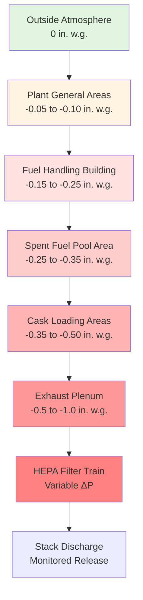

## Overview

Fuel handling area ventilation systems maintain radiological confinement through controlled airflow patterns, engineered negative pressure differentials, and multi-stage filtration. These systems protect personnel and the environment during fuel transfer, storage, and handling operations by containing airborne radioactive materials and directing potential releases through monitored pathways.

The ventilation design establishes a hierarchy of pressure zones that ensure air flows from areas of lower contamination potential toward areas of higher contamination potential, with all exhaust air subjected to HEPA filtration and continuous radiation monitoring before discharge.

## Air Change Rate Requirements

### Spent Fuel Pool Area

Minimum ventilation rates for spent fuel pool areas balance decay heat removal, humidity control, and contamination dilution. The air change rate directly affects the transient response time for contamination clearance.

**Minimum Requirements:**

| Area Type | ACH Minimum | ACH Typical | Basis |
|-----------|-------------|-------------|-------|
| Spent Fuel Pool | 4 | 6-10 | 10 CFR 20 ALARA |
| Fuel Transfer Canal | 6 | 8-12 | Contamination control |
| Cask Loading Pit | 8 | 10-15 | High activity operations |
| Refueling Floor | 4 | 6-8 | General area dilution |

The time constant for contaminant removal follows first-order decay:

$$C(t) = C_0 e^{-\lambda t}$$

where $\lambda = \frac{N}{60}$ and $N$ is the air change rate per hour. For 99% removal:

$$t_{99\%} = \frac{-\ln(0.01)}{\lambda} = \frac{276}{N} \text{ minutes}$$

At 10 ACH, 99% removal occurs in 27.6 minutes, providing rapid response to contamination events.

### Design Considerations

Air velocities over water surfaces must remain below 50 fpm to prevent excessive evaporation while maintaining adequate mixing. The convective heat flux from spent fuel pools creates natural stratification that ventilation systems must counteract:

$$q_{conv} = h \cdot A \cdot (T_{water} - T_{air})$$

where $h$ is the convective heat transfer coefficient (1-2 Btu/hr-ft²-°F for pool surfaces) and $A$ is the exposed water surface area.

## Negative Pressure Maintenance

### Pressure Differential Hierarchy

Nuclear facilities establish cascading negative pressures that direct airflow from clean areas toward potentially contaminated zones. This pressure gradient provides the primary confinement barrier during normal operations.

### Pressure Control Dynamics

The required pressure differential depends on leakage area and volumetric flow:

$$\Delta P = \rho \left(\frac{Q}{C_d A}\right)^2 \frac{1}{2}$$

For typical construction quality with effective leakage area of 0.1% of envelope area, maintaining -0.25 in. w.g. requires:

$$Q_{leak} = C_d A \sqrt{\frac{2\Delta P}{\rho}}$$

This leakage flow must be continuously supplied by the exhaust system to maintain the pressure boundary. Control systems typically modulate exhaust dampers in response to differential pressure sensors with ±0.01 in. w.g. deadband.

### Confinement Integrity

NRC Regulatory Guide 1.140 specifies that confinement ventilation systems maintain negative pressure within 10 seconds of initiating emergency mode. This rapid response requires:

- Redundant exhaust fans with automatic start sequencing
- Emergency power supply from diesel generators
- Continuous pressure monitoring with alarm setpoints
- Quarterly leak rate testing per 10 CFR 50 Appendix J

## HEPA Filtration Systems

### Multi-Stage Filtration Train

Fuel handling area exhaust passes through redundant filtration stages before atmospheric release. The standard configuration includes:

```mermaid
flowchart LR
    A[Contaminated Air<br/>from Fuel Area] --> B[Moisture Separator<br/>Remove Entrained Water]
    B --> C[Electric Heater<br/>Reduce RH to 70%]
    C --> D[Prefilter Bank<br/>MERV 8-13]
    D --> E[First HEPA Stage<br/>99.97% @ 0.3μm]
    E --> F[Iodine Adsorber<br/>Activated Carbon]
    F --> G[Second HEPA Stage<br/>99.97% @ 0.3μm]
    G --> H[Exhaust Fan<br/>Negative Pressure]
    H --> I[Stack Monitor<br/>Continuous RAM]
    I --> J[Atmospheric<br/>Discharge]

    style A fill:#ffcccc
    style E fill:#ffe6cc
    style F fill:#e6ccff
    style G fill:#ccffcc
    style J fill:#cce6ff
```

### Filtration Efficiency

HEPA filters achieve 99.97% minimum efficiency for 0.3 μm particles, the most penetrating particle size (MPPS). System efficiency for two stages in series:

$$\eta_{total} = 1 - (1-\eta_1)(1-\eta_2) = 1 - (0.0003)^2 = 0.9999999$$

This provides 99.99999% efficiency (decontamination factor of 10⁷) for particulate radioactive materials.

Filter pressure drop increases with dust loading following:

$$\Delta P(t) = \Delta P_0 + k \cdot m_{dust}(t)$$

where $k$ is the filter resistance coefficient (typically 0.5-1.5 in. w.g. per lb/ft²) and $m_{dust}$ is accumulated dust mass. Filters require replacement when differential pressure reaches 4-6 in. w.g. or efficiency degrades below specification.

### Iodine Removal

Radioactive iodine (primarily I-131) exists in both particulate and gaseous forms. Activated carbon impregnated with potassium iodide (KI) or triethylenediamine (TEDA) adsorbs gaseous iodine through chemisorption:

$$\text{I}_2 + \text{C}_{activated} \rightarrow \text{C-I}_2$$

Adsorber efficiency depends on:

- **Residence Time**: Minimum 0.25 seconds at maximum flow
- **Relative Humidity**: Maintain below 70% to prevent pore blockage
- **Carbon Depth**: Typically 2-4 inches
- **Mesh Size**: 8x16 or 12x30 mesh for optimal contact

Properly designed iodine adsorbers achieve 95-99% removal efficiency for methyl iodide (CH₃I), the most challenging iodine species.

## Airborne Contamination Limits

### Derived Air Concentrations

10 CFR 20 Appendix B establishes Derived Air Concentration (DAC) values for occupational exposure limits. For fuel handling areas, critical isotopes include:

| Isotope | DAC (μCi/mL) | Physical Form | Primary Concern |
|---------|--------------|---------------|-----------------|
| Kr-85 | 1 × 10⁻⁴ | Gas | Noble gas release |
| I-131 | 2 × 10⁻⁸ | Gas/Particulate | Thyroid dose |
| Cs-137 | 4 × 10⁻⁸ | Particulate | Whole body dose |
| Sr-90 | 9 × 10⁻⁹ | Particulate | Bone seeker |
| Pu-239 | 2 × 10⁻¹² | Particulate | Alpha emitter |

### Monitoring Requirements

Continuous air monitors (CAMs) in fuel handling areas detect airborne radioactivity in real-time. Alert setpoints typically trigger at 10% DAC with evacuation at 30-50% DAC.

The integrated dose from airborne contamination:

$$D = \int_0^T C(t) \cdot BR \cdot DCF \, dt$$

where $BR$ is breathing rate (2 × 10⁴ mL/min for light work) and $DCF$ is the dose conversion factor (Sv/Bq) specific to each radionuclide.

## Release Pathway Monitoring

### Stack Monitoring Systems

All exhaust from fuel handling areas discharges through monitored stacks equipped with:

- **Particulate Monitors**: Filter paper collection with beta/gamma detection
- **Iodine Monitors**: Charcoal cartridge with gamma spectrometry
- **Noble Gas Monitors**: Flow-through ionization chambers or scintillation detectors
- **Flow Measurement**: Pitot tube arrays or thermal anemometers

### Regulatory Release Limits

10 CFR 20.1301 limits public dose to 100 mrem/year from all pathways. Stack releases must comply with:

$$\frac{\Sigma C_i}{EC_i} \leq 1$$

where $C_i$ is the measured concentration of isotope $i$ and $EC_i$ is the effluent concentration limit from 10 CFR 20 Appendix B Table 2.

**Typical annual release limits:**

- Noble gases: < 10 Ci/reactor (air dose basis)
- Iodines and particulates: < 1 Ci/reactor (organ dose basis)
- Tritium: < 20 Ci/reactor (whole body dose basis)

### Dispersion Modeling

Atmospheric dispersion calculations determine ground-level concentrations using Gaussian plume models:

$$C(x,y,z) = \frac{Q}{2\pi u \sigma_y \sigma_z} \exp\left(-\frac{y^2}{2\sigma_y^2}\right) \left[\exp\left(-\frac{(z-H)^2}{2\sigma_z^2}\right) + \exp\left(-\frac{(z+H)^2}{2\sigma_z^2}\right)\right]$$

where $Q$ is release rate (Ci/s), $u$ is wind speed (m/s), $H$ is effective stack height (m), and $\sigma_y$, $\sigma_z$ are atmospheric dispersion coefficients.

Stack height must provide adequate dispersion to meet site boundary dose limits under worst-case meteorological conditions (Pasquill stability class F with 1 m/s wind speed).

## Emergency Operating Modes

Fuel handling ventilation systems operate in multiple modes:

| Mode | Trigger | ACH | ΔP | Filtration |
|------|---------|-----|-------|------------|
| Normal | Routine operations | 6-10 | -0.25 | Single HEPA |
| Fuel Movement | Active transfers | 10-12 | -0.35 | Dual HEPA + Iodine |
| High Radiation | CAM alarm | 15-20 | -0.50 | Dual HEPA + Iodine |
| Emergency | Loss of coolant | Maximum | Maximum | All stages |

Emergency mode engages automatically upon detection of high airborne contamination, spent fuel pool low level, or seismic events exceeding operating basis earthquake (OBE) limits.

## System Testing and Surveillance

### In-Place Testing

ASME N510 and AG-1 Code require periodic testing:

- **HEPA Filter Leak Test**: Annual DOP or PAO challenge at 99.97% efficiency
- **Adsorber Efficiency**: Quarterly methyl iodide penetration test (≥ 95% removal)
- **System Flow**: Quarterly verification within ±10% of design
- **Pressure Boundary**: Quarterly leak rate < 10% volume per day at design ΔP

### Functional Testing

10 CFR 50 Appendix B requires:

- Monthly automatic start verification
- Quarterly emergency mode transition (< 10 seconds)
- Annual flow balance and pressure survey
- Refueling outage comprehensive system validation

Test results and corrective actions are documented in accordance with 10 CFR 50.59 configuration control requirements.

---

**Fuel handling area ventilation systems provide the critical safety function of radiological confinement through engineered pressure differentials, redundant filtration, and continuous monitoring. Compliance with NRC regulations and rigorous testing programs ensures these systems perform reliably during routine operations and accident conditions.**