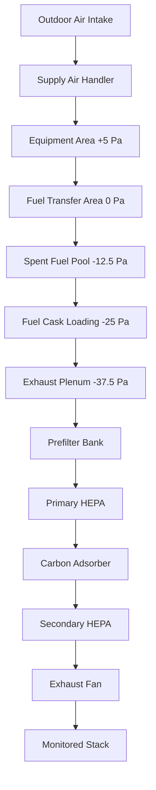

Nuclear fuel handling areas require specialized ventilation systems that prevent airborne radioactive contamination release while maintaining thermal control around spent fuel pools. These systems operate under the strictest confinement requirements, designed per 10 CFR Part 50 Appendix A General Design Criterion 61 (Fuel Storage and Handling) and 10 CFR Part 72 (Licensing Requirements for the Independent Storage of Spent Nuclear Fuel).

## Fuel Handling Building Configuration

The fuel handling building houses the spent fuel pool, fuel transfer canal, cask loading area, and associated equipment. Ventilation design establishes multiple confinement barriers through pressure cascades and filtration stages.

**Typical Space Arrangement:**

This arrangement creates four distinct pressure zones with air flowing progressively toward areas of highest contamination potential before HEPA filtration and stack discharge.

## Spent Fuel Pool Ventilation

The spent fuel pool area presents unique challenges: high humidity from pool evaporation, decay heat from stored fuel assemblies, and potential for airborne contamination during fuel handling operations.

**Thermal Load Components:**

The total heat load consists of convective and evaporative components from the pool surface plus radiant heat from fuel assemblies during transfer operations:

$$Q_{total} = Q_{conv} + Q_{evap} + Q_{rad} + Q_{lights} + Q_{equipment}$$

**Pool Surface Evaporation:**

Evaporation rate depends on pool surface temperature, air temperature, relative humidity, and air velocity across the surface. The mass transfer equation governs evaporation:

$$\dot{m}_{evap} = h_m \cdot A_{pool} \cdot (W_{sat,pool} - W_{air})$$

Where:
- $h_m$ = mass transfer coefficient (typically 0.15-0.30 lb/h·ft²)
- $A_{pool}$ = pool surface area (ft²)
- $W_{sat,pool}$ = humidity ratio at pool surface saturation conditions
- $W_{air}$ = humidity ratio of room air

For a typical spent fuel pool at 120°F surface temperature in a 85°F room at 50% RH:

$$\dot{m}_{evap} = 0.20 \times 1000 \times (0.0265 - 0.0118) = 2.94 \text{ lb/h}$$

The latent heat removal requirement becomes:

$$Q_{evap} = \dot{m}_{evap} \cdot h_{fg} = 2.94 \times 1050 = 3,087 \text{ Btu/h}$$

**Air Change Requirements:**

| Space Function | Minimum ACH | Typical Design ACH | Basis |
|----------------|-------------|-------------------|-------|
| Spent fuel pool area | 4 | 6-8 | Contamination dilution + moisture removal |
| Fuel transfer area | 6 | 8-10 | Higher activity during operations |
| Cask loading pit | 8 | 10-12 | Maximum contamination potential |
| Equipment rooms | 4 | 6 | Standard industrial ventilation |

Air change rates balance contamination dilution requirements against excessive cooling that could cause localized condensation on cold surfaces.

**Humidity Control Strategy:**

Pool area relative humidity maintained between 40-60% to prevent:
- Condensation on equipment and structural surfaces (dewpoint control)
- Excessive drying that increases airborne particulate suspension
- Corrosion of fuel assemblies and storage racks during long-term storage

The supply air dewpoint must remain below the coldest surface temperature in the space:

$$T_{dp,supply} < T_{surface,min} - 5°F$$

This 5°F margin prevents condensation under transient conditions such as outdoor temperature swings or equipment cycling.

## Negative Pressure Cascade Maintenance

Fuel handling buildings operate under negative pressure relative to atmosphere, with internal pressure cascades directing airflow from clean to contaminated zones.

**Design Pressure Differentials:**

**Pressure Control Methodology:**

Differential pressure across each boundary maintained through supply/exhaust airflow balance:

$$\Delta P = \frac{\rho \cdot v^2}{2} + \frac{12 \rho Q^2}{\rho_{std} \cdot A^2}$$

For low-velocity applications through doorways and transfer openings, the simplified orifice flow equation applies:

$$Q = C_d \cdot A \cdot \sqrt{\frac{2 \Delta P}{\rho}}$$

Where:
- $Q$ = leakage airflow (cfm)
- $C_d$ = discharge coefficient (0.6-0.65 for doorways)
- $A$ = opening area (ft²)
- $\Delta P$ = pressure differential (lb/ft²)
- $\rho$ = air density (lb/ft³)

**Example Calculation:**

For a personnel door (3 ft × 7 ft) with 0.25-inch gap perimeter and -12.5 Pa differential pressure:

Leakage area: $A = (2 \times 3 + 2 \times 7) \times (0.25/12) = 0.417 \text{ ft}^2$

$$Q = 0.65 \times 0.417 \times \sqrt{\frac{2 \times 12.5 \times 0.2089}{0.075}} = 85 \text{ cfm}$$

The exhaust system must provide this leakage flow plus the designed ventilation airflow to maintain the pressure differential.

**Pressure Control Implementation:**

1. **Supply fan control:** Variable frequency drive modulates to maintain space pressure setpoint
2. **Exhaust fan control:** VFD operates to maintain constant exhaust airflow slightly exceeding supply
3. **Pressure transmitter:** High-accuracy sensor (±0.5 Pa) monitors differential continuously
4. **Alarming:** Low differential pressure alarm at 75% of design, critical alarm at 50%

Control logic maintains exhaust flow as master with supply flow tracking:

$$Q_{supply} = Q_{exhaust} - Q_{leakage,design}$$

This ensures negative pressure maintenance even during supply fan failure (exhaust continues while supply stops).

## HEPA Filtration Train Design

Fuel handling building exhaust passes through multi-stage filtration trains achieving 99.97% minimum particulate removal efficiency.

**Filter Train Configuration:**

| Stage | Filter Type | Efficiency | Typical ΔP Clean | ΔP at Changeout |
|-------|-------------|------------|------------------|-----------------|
| 1 | Prefilter (MERV 14) | 85-90% @ 0.3-1.0 μm | 0.5 in. w.c. | 1.5 in. w.c. |
| 2 | Moisture separator | Droplet removal | 0.3 in. w.c. | 0.8 in. w.c. |
| 3 | Heater coil | Reduce RH to <70% | 0.2 in. w.c. | 0.2 in. w.c. |
| 4 | Primary HEPA | 99.97% @ 0.3 μm | 1.0 in. w.c. | 4.0 in. w.c. |
| 5 | Carbon adsorber | Radioiodine removal | 0.8 in. w.c. | 2.0 in. w.c. |
| 6 | Secondary HEPA | 99.97% @ 0.3 μm | 1.0 in. w.c. | 4.0 in. w.c. |

**Total System Pressure Drop:**

$$\Delta P_{system} = \sum_{i=1}^{n} \Delta P_i + \Delta P_{ductwork} + \Delta P_{fittings}$$

For the above train at mid-life loading:

$$\Delta P_{total} = 1.0 + 0.5 + 0.2 + 2.5 + 1.4 + 2.5 + 1.2 = 9.3 \text{ in. w.c.}$$

Exhaust fans selected for 12-14 inches w.c. total static pressure to accommodate filter loading progression.

**HEPA Filter Physics:**

HEPA filters capture particles through four mechanisms operating simultaneously:

1. **Interception:** Particles following airflow streamlines contact fibers
2. **Impaction:** Inertial particles deviate from streamlines, impacting fibers
3. **Diffusion:** Brownian motion causes small particles (<0.1 μm) to contact fibers
4. **Electrostatic attraction:** Charged particles attracted to oppositely charged fibers

The combined efficiency exhibits a minimum at approximately 0.3 μm diameter, termed the "most penetrating particle size" (MPPS):

$$\eta_{total} = 1 - (1-\eta_{interception})(1-\eta_{impaction})(1-\eta_{diffusion})(1-\eta_{electrostatic})$$

At 0.3 μm, interception and impaction reach minimum efficiency while diffusion hasn't fully dominated, creating the worst-case particle size for testing.

**Filter Face Velocity:**

Face velocity through HEPA filters limited to 250 fpm maximum to prevent media damage and maintain efficiency:

$$V_{face} = \frac{Q}{A_{filter}} \leq 250 \text{ fpm}$$

For 10,000 cfm exhaust flow:

$$A_{required} = \frac{10,000}{250} = 40 \text{ ft}^2$$

Using standard 24" × 24" × 11.5" filters (4 ft² face area each):

$$N_{filters} = \frac{40}{4} = 10 \text{ filters minimum}$$

Design typically includes 12 filters (20% margin) arranged in 2 rows of 6 filters.

## Airborne Contamination Control

Fuel handling operations generate airborne radioactive particles through fuel assembly movement, cask loading, and pool water splashing. Ventilation systems minimize worker exposure through source containment, dilution, and filtration.

**Contamination Sources:**

- **Fuel handling:** Crud (corrosion products) and fission products from fuel cladding surfaces
- **Pool water aerosolization:** Suspended particulates become airborne through bubbling or splashing
- **Dry cask loading:** Potential for airborne release during fuel transfer to dry storage casks
- **Maintenance activities:** Disturbance of contaminated surfaces during equipment work

**Derived Air Concentration (DAC) Compliance:**

10 CFR Part 20 establishes DAC limits for airborne radioactivity. Ventilation systems maintain concentrations below these limits through dilution:

$$C_{avg} = \frac{S + Q_{in} \cdot C_{in}}{Q_{out}}$$

Where:
- $C_{avg}$ = average airborne concentration (μCi/cm³)
- $S$ = source term generation rate (μCi/s)
- $Q_{in}$ = supply airflow (cm³/s)
- $C_{in}$ = inlet air concentration (typically zero)
- $Q_{out}$ = exhaust airflow (cm³/s)

For compliance: $C_{avg} < DAC_{limit}$

**Ventilation Effectiveness:**

Local exhaust capture efficiency at fuel handling locations expressed as:

$$\epsilon = \frac{Q_{captured}}{Q_{generated}}$$

Where $\epsilon$ should approach 1.0 (100% capture) through proper hood design and placement. The capture velocity at the source location must exceed the cross-draft velocity:

$$V_{capture} > 2 \times V_{crossdraft}$$

Typical design: $V_{capture}$ = 100-150 fpm at pool surface during fuel handling operations.

## Stack Discharge and Monitoring

Filtered exhaust discharges through a monitored stack meeting NRC Regulatory Guide 1.111 (Methods for Estimating Atmospheric Transport and Dispersion).

**Stack Height Determination:**

Stack height calculated to ensure adequate dispersion and prevent re-entrainment into building air intakes. The effective stack height considers physical height plus plume rise:

$$H_e = H_s + \Delta H$$

Where plume rise from buoyancy:

$$\Delta H = \frac{1.6 \cdot F^{1/3} \cdot x_{f}^{2/3}}{u}$$

For typical fuel building exhaust at ambient temperature (no thermal buoyancy), $\Delta H$ approaches zero, requiring increased physical stack height.

**Good Engineering Practice (GEP) Height:**

$$H_{GEP} = H_b + 1.5 \cdot L_b$$

Where:
- $H_b$ = building height
- $L_b$ = lesser building dimension (width or length)

For a 100 ft tall building with 200 ft × 150 ft footprint:

$$H_{GEP} = 100 + 1.5 \times 150 = 325 \text{ ft minimum}$$

**Continuous Air Monitoring:**

Radiation monitors sample exhaust stream continuously per 10 CFR 20.1501:

- **Particulate monitor:** Fixed filter samples exhaust, analyzing for gross beta/gamma activity
- **Iodine monitor:** Charcoal cartridge specifically targets I-131 and other radioiodines
- **Noble gas monitor:** Real-time detector for Kr-85, Xe-133, and other noble gases
- **Flow measurement:** Continuous airflow monitoring to calculate total activity release

Alarm setpoints established at fractions of effluent concentration limits (typically 10% of regulatory limit for alarm, 50% for automatic system response).

## Emergency Operating Modes

Fuel handling ventilation systems include provisions for emergency operation during design basis accidents.

**Loss of Offsite Power:**

Emergency diesel generators restore power within 10 seconds:
- Exhaust fans restart automatically on emergency power bus
- Supply fans may remain off (natural infiltration provides makeup air)
- Control systems transfer to UPS-backed panels
- Minimum single exhaust train operation maintained

**Fuel Handling Accident:**

Postulated fuel assembly drop activates enhanced confinement:
- High radiation signal isolates normal ventilation
- Emergency exhaust train starts automatically
- Enhanced HEPA filtration path (Series 3-stage HEPA)
- Control room and Technical Support Center switch to emergency recirculation mode

**Flooding Events:**

Equipment elevation above design basis flood level:
- Exhaust fans and electrical equipment elevated minimum 2 ft above 100-year flood
- Watertight doors isolate ground-level equipment rooms
- Submersible sump pumps with emergency power prevent flooding of below-grade spaces

Nuclear fuel handling ventilation represents the intersection of nuclear safety, radiological protection, and precision environmental control engineering. The negative pressure cascade principle, redundant HEPA filtration stages, and continuous monitoring ensure worker protection and environmental compliance during the most radiologically significant routine operations at nuclear facilities.
