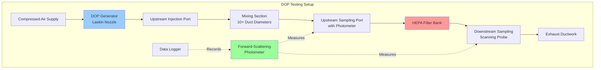

DOP (dioctyl phthalate) aerosol testing establishes the industry standard method for verifying nuclear-grade HEPA filter performance at the most penetrating particle size (MPPS) of 0.3 micrometers. This testing methodology quantifies filter efficiency through direct measurement of aerosol penetration, providing definitive verification that installed systems meet the mandatory 99.97% minimum efficiency required by ASME AG-1 and nuclear regulatory requirements.

## Physical Principles of Aerosol Filtration

HEPA filter media captures particles through four fundamental mechanisms operating simultaneously across the fiber matrix.

**Inertial Impaction** dominates for particles above 1 micrometer. Large particles possess sufficient inertia that they cannot follow airstream deflection around fibers. Trajectory deviation from streamlines causes direct collision with fiber surfaces.

**Interception** captures particles 0.1 to 1 micrometer traveling within one particle radius of fiber surfaces. While particles follow air streamlines, physical contact occurs when streamlines pass sufficiently close to fibers.

**Diffusion** (Brownian motion) controls capture for particles below 0.1 micrometer. Random molecular bombardment causes particle trajectory deviation from streamlines, increasing collision probability with fibers. Diffusion efficiency increases dramatically as particle size decreases.

**Electrostatic attraction** enhances capture across all size ranges when filter media or particles carry electrostatic charge. Nuclear-grade filters typically receive minimal electrostatic treatment due to rapid charge decay in humid environments.

The 0.3 micrometer particle size represents the minimum efficiency point where inertial and diffusion mechanisms transition. Particles larger or smaller than MPPS experience higher capture efficiency, making 0.3 micrometers the critical test point for filter verification.

## DOP Aerosol Properties and Generation

Dioctyl phthalate (C₂₄H₃₈O₄, molecular weight 390.6 g/mol) serves as the standard test aerosol due to its favorable physical properties:

- Liquid aerosol remains stable without evaporation or agglomeration
- Low vapor pressure (1.3 × 10⁻⁷ mmHg at 20°C) prevents particle size change
- Non-toxic at test concentrations
- High refractive index (1.486) enables sensitive optical detection
- Room temperature liquid simplifies aerosol generation

**Aerosol Generation Methods:**

Cold generation using compressed air through a Laskin nozzle produces polydisperse DOP aerosol with mass median diameter of 0.3 micrometers and geometric standard deviation of approximately 1.8. The Laskin nozzle operates by forcing compressed air through a submerged jet that creates fine bubbles. Bubble rupture at the liquid surface generates aerosol droplets following predictable size distribution.

The concentration upstream of test filters typically ranges from 80 to 100 micrograms per liter, sufficient for accurate downstream measurement while avoiding excessive media loading during testing.

## Filter Efficiency and Penetration Calculations

Filter efficiency and penetration represent complementary expressions of filter performance.

**Efficiency** quantifies the fraction of challenge aerosol captured:

$$\eta = \frac{C_u - C_d}{C_u} \times 100\%$$

Where:
- $\eta$ = filter efficiency (%)
- $C_u$ = upstream aerosol concentration (µg/L)
- $C_d$ = downstream aerosol concentration (µg/L)

**Penetration** quantifies the fraction passing through:

$$P = \frac{C_d}{C_u} \times 100\%$$

For nuclear HEPA filters meeting minimum performance:

$$\eta = 99.97\% \rightarrow P = 0.03\%$$

**Decontamination Factor** expresses the concentration reduction ratio:

$$DF = \frac{C_u}{C_d} = \frac{1}{P/100}$$

For 99.97% efficiency:

$$DF = \frac{1}{0.0003} = 3,333$$

This decontamination factor indicates that only 1 particle in 3,333 penetrates the filter, providing substantial protection against radioactive particle release.

**Two-Stage System Performance:**

When two filters operate in series, the combined penetration equals the product of individual penetrations:

$$P_{total} = P_1 \times P_2$$

For two 99.97% efficient filters:

$$P_{total} = 0.0003 \times 0.0003 = 9 \times 10^{-8} = 0.000009\%$$

This yields combined efficiency of 99.999991% and decontamination factor exceeding 11 million.

## In-Place Testing Methodology

In-place testing verifies installed system performance without filter removal, ensuring complete system integrity including filter-to-housing seal quality.

**Test Procedure Requirements:**

1. **System Stabilization:** Operate ventilation system at design flow rate for minimum 15 minutes before testing to establish steady-state conditions.

2. **Upstream Concentration Establishment:** Inject DOP aerosol at rate producing 80-100 µg/L concentration at upstream sampling point. Monitor concentration stability (±10%) for 5 minutes before downstream measurement begins.

3. **Downstream Scanning:** Using handheld probe connected to photometer, scan downstream face of each filter at 2 inches per second maximum velocity. Probe inlet positioned 1 inch from filter face captures aerosol penetrating that specific location.

4. **Penetration Scanning:** Scan entire filter face, frame perimeter, gasket interfaces, and all housing penetrations (instrumentation ports, access doors, duct connections). Any location showing elevated concentration indicates leakage path.

5. **Acceptance Criteria Evaluation:** No single point reading shall exceed 0.03% of upstream concentration. Any exceedance constitutes test failure requiring investigation and correction.

6. **Documentation:** Record upstream concentration, all downstream readings, scan pattern coverage, environmental conditions (temperature, humidity, barometric pressure), and system operating parameters (flow rate, pressure drop).

## Photometer Measurement Principles

Forward-scattering photometers measure aerosol concentration by quantifying light scattered by particles passing through measurement chamber.

**Optical Configuration:**

- Light source (typically LED or laser diode) illuminates aerosol stream
- Particles scatter incident light in all directions
- Photodetector positioned 30-90° from incident beam axis measures forward-scattered light
- Scattered light intensity correlates with particle concentration

**Light Scattering Intensity:**

For particles smaller than wavelength (Rayleigh scattering regime):

$$I_s \propto \frac{d^6}{\lambda^4}$$

Where:
- $I_s$ = scattered light intensity
- $d$ = particle diameter
- $\lambda$ = incident light wavelength

The strong diameter dependence ($d^6$) makes photometers highly sensitive to 0.3 micrometer particles while showing reduced response to smaller particles.

**Concentration Measurement:**

Photometer output voltage relates to aerosol concentration through calibration factor:

$$C = K \times V_{out}$$

Where:
- $C$ = aerosol concentration (µg/L)
- $K$ = calibration factor (µg/L per volt)
- $V_{out}$ = photometer output voltage

Factory calibration against gravimetric or condensation particle counter standards establishes K-factor specific to each instrument and aerosol type.

## Comparison of Aerosol Testing Methods

| Test Method | Aerosol Type | Particle Size | Advantages | Limitations | Primary Application |
|-------------|--------------|---------------|------------|-------------|---------------------|
| **DOP Testing** | Liquid (dioctyl phthalate) | 0.3 µm MMD | Non-toxic; stable aerosol; established standard; simple generation | Being phased out; detection requires photometer | Nuclear HEPA verification |
| **PAO Testing** | Liquid (polyalphaolefin) | 0.3 µm MMD | Non-toxic; stable; low vapor pressure; modern replacement for DOP | Higher cost than DOP; requires compatible photometer | Commercial and nuclear HEPA testing |
| **DEHS Testing** | Liquid (di-ethyl-hexyl-sebacate) | 0.3 µm MMD | Non-toxic; biodegradable; excellent stability | Limited historical data compared to DOP | European HEPA testing (EN 1822) |
| **Sodium Chloride** | Solid (NaCl crystals) | 0.3-0.6 µm | Inexpensive; non-toxic; easily generated | Hygroscopic; size changes with humidity; requires flame photometer | Filter media manufacturing QC |
| **PSL Spheres** | Solid (polystyrene latex) | Monodisperse | Precise size control; NIST traceable | Expensive; requires nebulization; particle counter detection | Research and calibration |
| **DMPS Testing** | Solid (fused oil droplets) | 0.1-1.0 µm | Size-selective testing; efficiency curve generation | Complex equipment; long test duration | Research applications |

## ASME AG-1 Testing Requirements

ASME AG-1, Section TA, "Testing of Air Cleaning Systems," establishes mandatory requirements for nuclear air cleaning system testing.

**Filter Acceptance Testing (Factory):**

Each nuclear-grade HEPA filter receives individual factory testing per ASME AG-1 Article TA-3000:

- Test aerosol: DOP, PAO, or DEHS at 0.3 µm MMD
- Challenge concentration: 80-100 µg/L
- Scan velocity: Maximum 2 inches per second
- Acceptance: Minimum 99.97% efficiency, maximum 0.03% penetration at any point
- Filters failing acceptance testing are rejected and destroyed

**In-Place System Testing:**

Installed systems require testing per ASME AG-1 Article TA-5000:

- Initial testing after installation
- Testing after filter replacement or system modification
- Periodic testing per facility technical specifications (typically annual)
- Challenge concentration: 80-100 µg/L upstream
- Acceptance: No downstream reading exceeding 0.03% of upstream concentration
- Documentation: Permanent quality assurance records

**Alternative Test Methods:**

ASME AG-1 permits PAO (polyalphaolefin) or DEHS (di-ethyl-hexyl-sebacate) aerosols as DOP alternatives, provided equivalent particle size distribution and detection sensitivity. Many facilities transition to PAO due to reduced health concerns compared to phthalate compounds.

## DOE Filter Testing Standards

Department of Energy facilities follow DOE-STD-3020, "Specification for HEPA Filters Used by DOE Contractors," which aligns with ASME AG-1 requirements while adding DOE-specific provisions:

**Quality Assurance Requirements:**

- Filter manufacturers maintain nuclear quality assurance programs per 10 CFR 830
- Individual filter traceability through serialization
- Certified material test reports for all components
- Environmental and seismic qualification documentation

**Performance Testing:**

- Efficiency testing at 100% and 20% of rated flow
- Pressure drop measurement at multiple flow rates
- Rough handling test (vibration and shock)
- Elevated temperature testing for fire-resistant filters (up to 700°F for some applications)

**Acceptance Criteria:**

- Minimum 99.97% efficiency at 0.3 µm at both test flows
- Pressure drop within specification range (typically 0.8-1.2 inches water gauge at rated flow)
- No visible damage after rough handling
- Efficiency maintained above 99.95% at elevated temperature

## Common Testing Failures and Causes

Testing failures typically result from installation defects rather than filter media defects:

**Gasket Compression Issues:**

Insufficient gasket compression creates bypass path around filter perimeter. Proper compression requires 25-35% gasket deflection. Torque specifications on hold-down clamps ensure uniform compression.

**Housing Leaks:**

Welded housing seams, access door gaskets, or instrumentation penetrations may leak if damage occurs during installation or operation. Pressure testing housings before filter installation identifies structural leakage.

**Filter Damage:**

Physical damage to filter media during handling or installation creates localized high-penetration areas. Filters should never be contacted on face or supported by media pack during installation.

**Incorrect Installation:**

Filters installed backwards or without proper seating in knife-edge frames create massive bypass. Visual verification of airflow direction arrows before testing prevents this failure mode.

**Aerosol Distribution Problems:**

Insufficient mixing length upstream of filters (less than 10 duct diameters) results in non-uniform aerosol distribution. Localized high or low concentrations invalidate penetration measurements.

## Test Frequency and Documentation Requirements

Nuclear facilities operate under technical specifications derived from safety analysis reports and NRC-approved licensing basis:

**Testing Frequency:**

- Initial testing: Before system operability declaration
- Post-maintenance: After any activity affecting filter train integrity
- Periodic surveillance: 18 to 24 month intervals (plant-specific)
- Post-accident: After any event potentially damaging filters (seismic event, fire, flooding)

**Documentation Requirements:**

- Test procedure identification and revision
- System identification and operating parameters
- Aerosol type, concentration, and distribution verification
- Complete downstream scan results with acceptance criteria
- Technician qualifications and signatures
- Test equipment calibration status
- Corrective actions for any deficiencies
- QA review and approval

Test records constitute permanent plant records subject to NRC inspection and must be retained for facility lifetime.

## Modern Testing Alternatives

While DOP remains widely specified in existing nuclear facility procedures, alternatives address health and environmental concerns:

**Polyalphaolefin (PAO):**

Synthetic hydrocarbon oil with virtually identical aerosol properties to DOP but without phthalate concerns. PAO testing uses identical equipment and procedures with comparable or superior detection sensitivity.

**Laser Particle Counters:**

Advanced instruments count individual particles by size range rather than measuring bulk concentration. Particle counters provide detailed efficiency data across multiple size ranges but require significantly longer test duration and higher cost.

**Continuous Monitoring Systems:**

Permanently installed photometers monitor downstream concentration continuously during operation. While not replacing periodic penetration scanning, continuous monitoring provides real-time indication of filter degradation or failure.

Understanding DOP testing principles, procedures, and acceptance criteria ensures proper verification of nuclear HEPA filter system performance, maintaining the final barrier preventing radioactive particle release to the environment.
