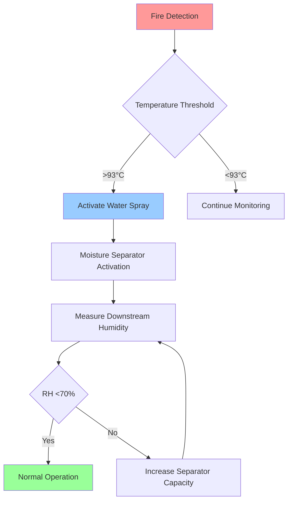
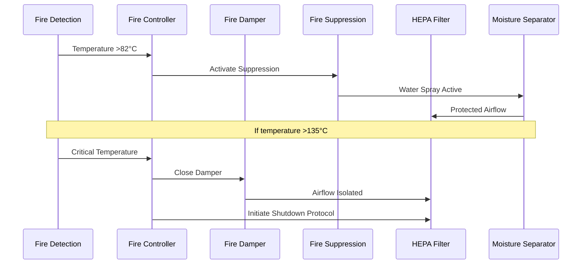

## Fire Resistance Requirements for Nuclear HEPA Systems

Fire-resistant HEPA filtration systems in nuclear facilities must maintain containment integrity while preventing fire propagation through ventilation pathways. The dual challenge involves protecting the filter media from thermal degradation while ensuring the housing structure withstands fire conditions without compromising radioactive confinement.

### Physical Principles of HEPA Filter Fire Exposure

The thermal degradation of HEPA filter media follows first-order decomposition kinetics:

$$\frac{d\alpha}{dt} = A \exp\left(-\frac{E_a}{RT}\right)(1-\alpha)$$

Where $\alpha$ represents the degree of decomposition, $A$ is the pre-exponential factor, $E_a$ is activation energy (typically 120-180 kJ/mol for glass fiber media), $R$ is the gas constant, and $T$ is absolute temperature.

Standard glass fiber HEPA media begins losing structural integrity at approximately 260°C (500°F), while adhesives and sealants may fail at lower temperatures (150-200°C). The transition from mechanical filtration to thermal failure occurs rapidly once critical temperature thresholds are exceeded.

## Fire-Rated Filter Housings

### Structural Fire Resistance

Fire-rated HEPA housings must provide barrier protection rated per ASTM E119 or equivalent standards. NRC Regulatory Guide 1.52 requires fire barriers protecting safety-related filtration systems to maintain structural integrity for minimum 1-hour fire ratings, with 3-hour ratings common for critical confinement applications.

The heat transfer through a multi-layer housing wall follows:

$$Q = \frac{A(T_h - T_c)}{\sum_{i=1}^{n} \frac{L_i}{k_i}}$$

Where $Q$ is heat transfer rate, $A$ is wall area, $T_h$ and $T_c$ are hot and cold surface temperatures, $L_i$ is thickness of layer $i$, and $k_i$ is thermal conductivity of each material layer.

### Housing Material Specifications

| Material | Max Operating Temp | Fire Rating | Thermal Conductivity | Application |
|----------|-------------------|-------------|---------------------|-------------|
| Carbon Steel (3mm) | 538°C (1000°F) | 1-3 hour | 45 W/m·K | Standard housings |
| Stainless Steel 304 | 649°C (1200°F) | 1-3 hour | 16 W/m·K | Corrosive environments |
| Stainless Steel 316L | 649°C (1200°F) | 1-3 hour | 16 W/m·K | High-corrosion zones |
| Insulated Double-Wall | 260°C (filter limit) | 3 hour | 0.8 W/m·K (effective) | Critical applications |

## Temperature Limits for Filter Media

### Glass Fiber Media Performance

Standard borosilicate glass fiber HEPA media exhibits the following thermal performance envelope:

- **Continuous Operation**: Up to 120°C (248°F)
- **Intermittent Exposure**: Up to 200°C (392°F) for <30 minutes
- **Structural Failure**: >260°C (500°F)
- **Complete Degradation**: >400°C (752°F)

The particle collection efficiency remains stable until the glass transition temperature initiates fiber softening. The critical Stokes number for particle capture becomes:

$$Stk = \frac{\rho_p d_p^2 U}{18 \mu d_f}$$

Where $\rho_p$ is particle density, $d_p$ is particle diameter, $U$ is approach velocity, $\mu$ is gas viscosity (temperature-dependent), and $d_f$ is fiber diameter.

As temperature increases, gas viscosity $\mu$ increases proportionally to $T^{0.7}$, slightly reducing collection efficiency before catastrophic structural failure occurs.

### High-Temperature Filter Options

For applications requiring enhanced thermal resistance:

- **Ceramic Fiber Media**: Continuous operation to 900°C (1652°F)
- **Metal Fiber Media**: Continuous operation to 538°C (1000°F)
- **Silicon Carbide Filters**: Continuous operation to 1200°C (2192°F)

These specialized media trade reduced particle capture efficiency (typical 95-99% vs. 99.97% for standard HEPA) for thermal survivability.

## Pre-Fire Suppression Systems

### Water Spray System Integration

Pre-fire suppression systems protect HEPA filters through evaporative cooling and physical fire suppression. The cooling effectiveness depends on droplet evaporation rate:

$$\dot{m}_{evap} = \frac{h_{fg} \cdot A_d \cdot (P_{sat}(T_s) - P_v)}{R_v T_{film}}$$

Where $h_{fg}$ is latent heat of vaporization, $A_d$ is droplet surface area, $P_{sat}$ is saturation pressure at surface temperature, $P_v$ is vapor partial pressure, and $T_{film}$ is film temperature.

### Suppression System Design Parameters

- **Activation Temperature**: 93-135°C (200-275°F), below filter damage threshold
- **Water Density**: 6.1-12.2 L/min·m² (0.15-0.30 gpm/ft²)
- **Droplet Size**: 400-800 μm for optimal heat absorption without excessive carryover
- **Response Time**: <30 seconds from detection to full discharge

## Moisture Separators

### Preventing Water Damage to HEPA Media

Moisture separators protect HEPA filters from water damage following fire suppression activation. The separation efficiency follows inertial impaction mechanics:

$$\eta_{sep} = 1 - \exp\left(-\frac{Stk}{Stk_{50}}\right)^n$$

Where $Stk_{50}$ is the Stokes number at 50% collection efficiency (typically 0.2-0.4 for moisture eliminators), and $n$ is an empirical constant (1.5-2.0).

### Moisture Separator Specifications

| Type | Removal Efficiency | Pressure Drop | Maximum Loading | Location |
|------|-------------------|---------------|-----------------|----------|
| Vane-Type | 95-98% (>10 μm) | 125-250 Pa | 0.5 L/m³ | Upstream of HEPA |
| Mesh Pad | 98-99% (>5 μm) | 150-300 Pa | 0.3 L/m³ | Upstream of HEPA |
| Chevron | 99%+ (>8 μm) | 100-200 Pa | 0.7 L/m³ | Upstream of HEPA |
| Cyclonic | 90-95% (>20 μm) | 200-400 Pa | 2.0 L/m³ | Pre-separator stage |

The separator must maintain relative humidity below 70% at the HEPA face to prevent media saturation and efficiency degradation.

## Fire Damper Integration

### Coordinated Fire Protection Strategy

Fire dampers and HEPA filters must function as an integrated fire barrier system. The damper closure must occur before flame propagation reaches the filter while maintaining ventilation flow for radioactive confinement.

### Damper Closure Logic

The fire damper closure temperature $T_{close}$ must satisfy:

$$T_{close} < T_{filter,max} - \Delta T_{response}$$

Where $T_{filter,max}$ is maximum allowable filter temperature (typically 200°C for intermittent exposure) and $\Delta T_{response}$ is the thermal lag between damper activation and complete closure (typically 30-50°C equivalent).

Standard fire damper ratings:

- **1.5-hour UL 555 rated**: Standard protection for non-critical zones
- **3-hour UL 555 rated**: High-hazard or safety-related applications
- **Dynamic closure**: <5 seconds from signal to complete closure
- **Leakage Class**: Class I (<10 cfm/ft² at 4 in. w.g.) or Class II (<20 cfm/ft²)

## Post-Fire Integrity Verification

### Testing Protocol Requirements

ASME AG-1 Section FC requires post-fire testing to verify continued filtration performance and structural integrity. The verification protocol includes:

1. **Visual Inspection**: Housing integrity, gasket condition, mounting hardware
2. **Aerosol Challenge Test**: DOP or PAO test to verify ≥99.97% efficiency
3. **Pressure Drop Measurement**: Compare to pre-fire baseline (±20% acceptance)
4. **Leak Testing**: In-place bubble point or pressure decay test
5. **Flow Distribution**: Verify uniform face velocity (±20% across filter face)

### Acceptance Criteria

| Parameter | Acceptance Limit | Failure Action |
|-----------|------------------|----------------|
| Filtration Efficiency | ≥99.97% at 0.3 μm | Replace filter |
| Pressure Drop Change | <20% from baseline | Investigate cause |
| Housing Leak Rate | <0.05% bypass | Reseal or replace gasket |
| Structural Deflection | <L/360 (span/360) | Replace housing |
| Damper Functionality | Full closure <5 sec | Repair or replace damper |

The penetration $P$ through a compromised filter is calculated as:

$$P = \left(1 - \eta\right) + f_{bypass}$$

Where $\eta$ is filter efficiency and $f_{bypass}$ is fractional bypass flow. Even small bypass paths (1-2%) can dominate total penetration when filter efficiency is high (99.97%).

### Regulatory Compliance Framework

NRC Regulatory Guide 1.52 and 10 CFR 50 Appendix A General Design Criterion 61 require fire protection systems for HEPA filters in safety-related nuclear ventilation to:

- Prevent fire propagation through ventilation pathways
- Maintain confinement function during and after fire events
- Allow operator verification of system integrity post-event
- Provide redundant protection for single-failure tolerance

ASME AG-1 Section FC specifically addresses fire protection for nuclear air cleaning systems, mandating fire-resistant housings, thermal protection, and post-fire testing protocols that exceed standard industrial practices.

## Conclusion

Fire-resistant HEPA filtration for nuclear facilities requires comprehensive integration of thermal protection, fire suppression, moisture management, and post-event verification. The physics of thermal degradation dictates temperature limits that drive housing design, suppression activation thresholds, and damper closure logic. Compliance with NRC and ASME AG-1 requirements ensures both fire safety and radioactive confinement integrity are maintained throughout design basis fire scenarios.
