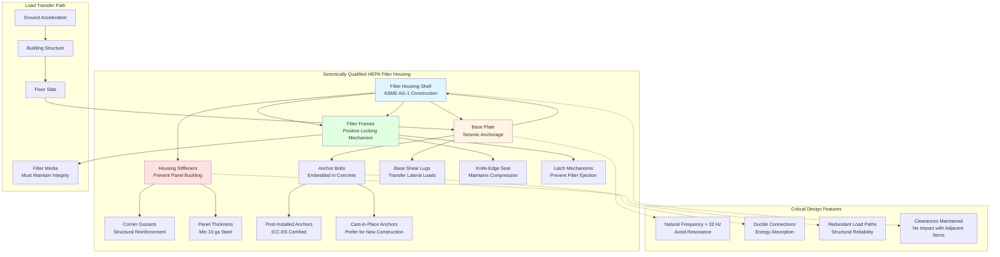

Nuclear HEPA filtration systems must maintain structural integrity and functional operability during and after seismic events up to and including the Safe Shutdown Earthquake (SSE). Seismic qualification demonstrates that filter assemblies, housings, mounting systems, and associated ductwork can withstand dynamic loads without loss of filtration capability or containment function. This qualification protects against radioactive release during the most severe postulated ground motion.

## Fundamental Seismic Response Physics

Seismic ground acceleration imparts inertial forces to structures and equipment through Newton's second law. A filter housing of mass $m$ experiencing ground acceleration $\ddot{u}_g(t)$ develops an inertial force:

$$F_{inertial}(t) = m \cdot \ddot{u}_{total}(t) = m \cdot (\ddot{u}_g(t) + \ddot{u}_{relative}(t))$$

where $\ddot{u}_{total}$ represents total acceleration (ground plus relative motion) and $\ddot{u}_{relative}$ represents acceleration relative to the ground. For a single-degree-of-freedom system, the equation of motion becomes:

$$m\ddot{u} + c\dot{u} + ku = -m\ddot{u}_g(t)$$

where $c$ is damping coefficient and $k$ is stiffness. The natural frequency of the system:

$$f_n = \frac{1}{2\pi}\sqrt{\frac{k}{m}}$$

Resonance occurs when seismic frequency content matches the equipment natural frequency, amplifying response. Nuclear safety-related equipment must either avoid resonance with dominant seismic frequencies (typically 2-10 Hz) or demonstrate adequate strength to withstand amplified response.

## Response Spectra Analysis

Response spectra provide the maximum response of single-degree-of-freedom oscillators to ground motion as a function of frequency and damping. The spectral acceleration $S_a(f_n, \zeta)$ represents peak acceleration experienced by a structure with natural frequency $f_n$ and damping ratio $\zeta$.

The base shear force on equipment mounted at elevation becomes:

$$V_{base} = \frac{S_a(f_n, \zeta)}{g} \cdot W \cdot A_f$$

where:
- $g$ = gravitational acceleration (386.4 in/s²)
- $W$ = equipment operating weight
- $A_f$ = amplification factor for mounting elevation
- $S_a$ = spectral acceleration from floor response spectrum

For equipment mounted on upper floors, floor response spectra (FRS) account for building amplification. Peak floor acceleration typically exceeds ground acceleration by factors of 2 to 4 depending on building characteristics and equipment location.

The overturning moment at the base of a filter housing of height $h$ becomes:

$$M_{OTM} = V_{base} \cdot h \cdot \frac{2}{3}$$

The factor 2/3 accounts for first-mode response shape where maximum acceleration occurs at the top while the centroid of inertial force acts at approximately 2/3 height.

## IEEE 344 Qualification Standards

IEEE Standard 344, "Recommended Practice for Seismic Qualification of Class 1E Equipment for Nuclear Power Generating Stations," establishes requirements for seismic qualification programs. This standard applies to safety-related HEPA filtration systems credited for accident mitigation.

**Key IEEE 344 Requirements:**

- **Testing or Analysis:** Qualification by shake table testing, analysis, or combination
- **Required Response Spectrum (RRS):** Envelops site-specific design response spectra with margin
- **Test Response Spectrum (TRS):** Actual shake table motion must envelope RRS at all frequencies
- **Operability Demonstration:** Equipment must function during and after seismic testing
- **Aging Consideration:** Account for material degradation over qualified life

The Required Response Spectrum typically adds 10-20% margin above design spectra to account for variability. For 5% damping (typical for welded steel structures), the test must envelope:

$$TRS(f, 5\%) \geq 1.1 \cdot RRS(f, 5\%)$$

at all frequencies between 1-33 Hz (the Zero Period Acceleration frequency range).

## DOE Seismic Standards

Department of Energy facilities follow DOE-STD-1020 and DOE-STD-1021 for seismic design and evaluation. These standards establish Performance Categories (PC) based on safety function importance:

| Performance Category | Target Performance Goal | Design Basis Earthquake |
|---------------------|------------------------|------------------------|
| PC-1 | Low hazard facility | 500-year return period |
| PC-2 | Important/moderate hazard | 1,000-year return period |
| PC-3 | Hazardous facility | 2,500-year return period |
| PC-4 | Critical hazardous | 10,000-year return period |

Nuclear HEPA systems in DOE facilities typically require PC-3 or PC-4 qualification, corresponding to 1E-3 or 1E-4 annual exceedance probability. The median ground acceleration for these hazard levels ranges from 0.2g to 0.8g depending on site seismicity.

DOE standards permit qualification by:

1. **Testing to generic response spectra** (conservative approach)
2. **Analysis using site-specific spectra** (requires detailed structural modeling)
3. **Experience data** (limited applicability for custom equipment)

## Seismic Qualification Methods Comparison

Different qualification approaches offer distinct advantages and limitations:

| Method | Advantages | Disadvantages | Typical Application |
|--------|-----------|---------------|---------------------|
| **Shake Table Testing** | Directly demonstrates operability; captures nonlinear effects; high confidence | Expensive; limited specimen size; requires test facility | New designs; critical components |
| **Finite Element Analysis** | Cost-effective; evaluates design variations; identifies stress concentrations | Requires validation; modeling uncertainty; limited for nonlinear behavior | Routine applications; design optimization |
| **Static Coefficient Method** | Simple calculations; conservative results; widely accepted | Overly conservative; ignores dynamic amplification; crude stress estimates | Preliminary design; screening |
| **Combined Testing/Analysis** | Optimizes cost/confidence; tests critical items; analyzes remainder | Complexity in combining results; requires careful documentation | Large assemblies; modular designs |
| **Experience Data** | No new testing; relies on operating history | Limited applicability; requires similarity justification; low confidence for modifications | Identical replacement equipment |

## Filter Housing Seismic Design

Nuclear HEPA filter housings require robust structural design to resist seismic loads while maintaining leak-tightness. The housing experiences:

**Lateral Loads:**

Horizontal seismic acceleration creates base shear distributed to mounting points. For a housing with uniformly distributed weight, the reaction at each of $n$ anchor bolts:

$$R_{anchor} = \frac{V_{base}}{n} \sqrt{1 + \left(\frac{M_{OTM} \cdot e}{V_{base} \cdot L}\right)^2}$$

where $e$ is eccentricity between center of mass and geometric center, and $L$ is dimension between anchor rows.

**Vertical Loads:**

Vertical seismic acceleration (typically 2/3 of horizontal) adds to or subtracts from gravity loads:

$$W_{effective} = W \cdot (1 \pm \frac{S_{a,vertical}}{g})$$

This affects bolt tension and bearing stresses at supports.

**Combined Stress Check:**

Housing shell experiences combined membrane and bending stresses. The maximum stress intensity per ASME Section III:

$$S_{max} = \sqrt{(\sigma_{membrane} + \sigma_{bending})^2 + 3\tau_{shear}^2}$$

must remain below allowable stress limits with appropriate factors of safety (typically 1.5 for Level D service limits corresponding to SSE).

## Filter Media and Frame Integrity

The filter media itself—pleated borosilicate glass microfibers bound with organic resin—must survive seismic acceleration without tearing or detaching from the frame. Critical considerations:

**Pleat Stability:**

Pleat separation typically 3-6 mm provides structural rigidity through corrugated geometry. Seismic acceleration perpendicular to pleats creates bending moments in the media. The maximum fiber stress:

$$\sigma_{fiber} = \frac{E \cdot \ddot{u} \cdot L^2}{2t}$$

where $E$ is modulus, $L$ is pleat depth, and $t$ is media thickness. Typical seismic accelerations (3-5g) generate stresses well below glass fiber tensile strength (500-700 MPa) but may exceed resin bond strength if frame-to-media adhesive fails.

**Frame-to-Media Bond:**

The interface between filter media and supporting frame experiences shear stress from differential acceleration. Polyurethane adhesives provide bond strength 2-4 MPa, adequate for typical seismic loads with appropriate safety factors.

**Pleat Separators:**

Aluminum or string separators maintain pleat spacing under lateral acceleration. Without separators, pleats collapse under seismic loading, blocking airflow and increasing pressure drop.

## Mounting System Design

Filter housings require anchorage designed for combined seismic and operational loads. Anchor bolts experience:

**Tension Load (Vertical Seismic + Overturning):**

$$T_{bolt} = \frac{4M_{OTM}}{n \cdot L} - \frac{W_{effective}}{n}$$

for bolts on the tension side of the housing, where $n$ is number of bolts per row and $L$ is spacing between rows.

**Shear Load (Horizontal Seismic):**

$$V_{bolt} = \frac{V_{base}}{n_{total}}$$

where $n_{total}$ is total number of anchor bolts.

**Combined Interaction:**

ACI 318 Appendix D requires interaction check:

$$\left(\frac{V_{bolt}}{V_{allow}}\right)^{5/3} + \left(\frac{T_{bolt}}{T_{allow}}\right)^{5/3} \leq 1.0$$

Post-installed expansion anchors or adhesive anchors require ICC-ES evaluation reports demonstrating seismic adequacy. Cast-in-place headed studs provide superior performance but require advance coordination with structural construction.

## Operability Testing Requirements

Seismic qualification must demonstrate continued functionality during and after earthquake. For HEPA systems, this requires:

**Pre-Test Baseline:**
- DOP penetration test establishing <0.03% leakage
- Pressure drop measurement at design flow
- Visual inspection of filter and housing condition

**During-Test Monitoring:**
- Continuous DOP injection and downstream sampling
- Pressure drop recording
- Accelerometer data at multiple locations

**Post-Test Verification:**
- Repeat DOP penetration test (must meet same <0.03% criterion)
- Pressure drop comparison (increase <10% indicates media damage)
- Visual inspection for structural damage, seal displacement, or frame deformation

Any failure—increased penetration, excessive pressure drop change, or structural damage—requires design modification and re-testing.

## Ductwork and Piping Seismic Supports

Ductwork connected to seismically qualified HEPA housings requires compatible seismic bracing to prevent interaction damage. SMACNA "Seismic Restraint Manual" provides prescriptive requirements:

- **Maximum spacing:** 40 feet for lateral bracing, 80 feet for longitudinal
- **Minimum angles:** 45° from horizontal for diagonal braces
- **Clearances:** Maintain 2-inch minimum gap to prevent impact

Flexible connections at housing interfaces accommodate differential movement between ductwork and equipment without overstressing connections. These connections must maintain leak-tightness (verified by post-seismic testing) while allowing several inches of displacement.

## Quality Assurance Documentation

Seismic qualification programs generate extensive documentation subject to regulatory review:

- Test procedures and acceptance criteria
- As-built test specimen drawings
- Calibration records for instrumentation
- Test logs with real-time observations
- Data acquisition records (acceleration, displacement, strain)
- Post-test inspection reports
- Qualification report summarizing compliance demonstration

This documentation provides traceability from site-specific seismic demand through testing or analysis to operability demonstration, ensuring regulatory confidence in equipment performance during design basis earthquakes.

Proper seismic qualification of nuclear HEPA filtration systems protects public health and safety by ensuring radioactive containment remains intact during the most severe ground motion—the ultimate test of nuclear safety system reliability.
