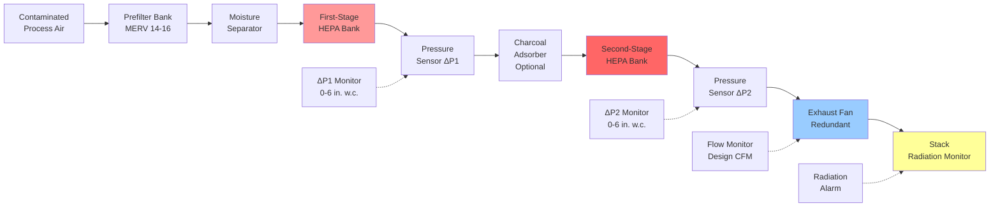

Two-stage HEPA filtration systems provide defense-in-depth particulate removal for nuclear facilities through series-connected filter banks. This configuration achieves decontamination factors exceeding 1,000,000 while ensuring continued protection even if one stage experiences degradation or failure. The redundancy principle derives from nuclear safety philosophy requiring multiple independent barriers between radioactive materials and the environment.

## Physics of Series Filtration

HEPA filters remove particles through four simultaneous mechanisms operating at different particle size ranges. Understanding these mechanisms reveals why two-stage systems provide superior reliability compared to single-stage designs.

**Filtration Mechanisms:**

1. **Interception:** Particles following airstream contact fibers when their center passes within one particle radius of the fiber surface
2. **Impaction:** Particles with sufficient inertia cannot follow rapid airstream direction changes around fibers and collide with fiber surfaces
3. **Diffusion:** Brownian motion causes submicron particles to deviate from streamlines and contact fibers
4. **Electrostatic attraction:** Electric charges on fibers attract oppositely charged particles

The most penetrating particle size (MPPS) occurs at approximately 0.3 micrometers where interception and impaction become less effective while diffusion has not yet dominated. HEPA filters are tested at this critical size to verify worst-case performance.

**Single-Stage Efficiency:**

Nuclear-grade HEPA filters must demonstrate minimum 99.97% efficiency at 0.3 μm per ASME AG-1. This translates to maximum 0.03% penetration:

$$P_1 = 1 - \eta_1 = 1 - 0.9997 = 0.0003$$

Where:
- $P_1$ = fractional penetration of first stage
- $\eta_1$ = fractional efficiency of first stage

**Two-Stage Combined Efficiency:**

When identical filters operate in series, the second stage captures particles penetrating the first stage. Total penetration equals the product of individual penetrations:

$$P_{total} = P_1 \times P_2$$

For two 99.97% efficient stages:

$$P_{total} = 0.0003 \times 0.0003 = 9 \times 10^{-8}$$

Combined efficiency:

$$\eta_{total} = 1 - P_{total} = 1 - 9 \times 10^{-8} = 0.99999991$$

This represents 99.999991% efficiency or "seven nines" of particulate removal.

**Decontamination Factor:**

Nuclear applications express filtration performance as decontamination factor (DF), the ratio of upstream to downstream concentration:

$$DF = \frac{C_{upstream}}{C_{downstream}} = \frac{1}{P_{total}}$$

For two-stage 99.97% HEPA system:

$$DF = \frac{1}{9 \times 10^{-8}} = 1.11 \times 10^{7}$$

This decontamination factor exceeds 11,000,000, providing extraordinary protection against radioactive particle release.

## Two-Stage Configuration Design

**Component Arrangement Rationale:**

The specific sequence optimizes performance and equipment protection:

- **Prefilters upstream:** Remove bulk particulate loading (>10 μm) extending first-stage HEPA life by factor of 3-5
- **Moisture separator:** Prevents liquid water entrainment which causes HEPA media collapse and efficiency loss
- **First-stage HEPA:** Removes 99.97% of particles, reducing loading on downstream components
- **Charcoal adsorber:** Positioned between HEPA stages to prevent radioiodine release; requires upstream HEPA to prevent carbon bed plugging with particulates
- **Second-stage HEPA:** Captures carbon fines from adsorber and provides backup filtration if first stage fails
- **Exhaust fan downstream:** Creates negative pressure throughout filter train, preventing contaminated air leakage from housing penetrations

## Single-Stage vs Two-Stage Performance

| Parameter | Single-Stage HEPA | Two-Stage HEPA | Improvement Factor |
|-----------|-------------------|----------------|-------------------|
| Minimum efficiency | 99.97% | 99.999991% | 3,703× |
| Maximum penetration | 0.03% | 0.000009% | 3,333× |
| Decontamination factor | 3,333 | 11,111,111 | 3,333× |
| Reliability (annual) | 99.0% | 99.99% | 100× |
| Filter life expectancy | 2-3 years | 4-6 years (2nd stage) | 2× |
| Pressure drop (clean) | 1.0 in. w.c. | 2.0 in. w.c. | 2× |
| Fan energy increase | Baseline | +15-25% | - |
| Capital cost increase | Baseline | +40-60% | - |
| Meets DOE-STD-3020 | Marginal | Yes | Full compliance |
| Accident mitigation | Single barrier | Redundant barrier | Defense-in-depth |

**Reliability Analysis:**

If first-stage HEPA develops 10% bypass due to gasket failure or media tear, a single-stage system efficiency degrades catastrophically:

$$\eta_{degraded} = 0.90 \times 0.9997 + 0.10 \times 0 = 0.89973$$

This represents 89.973% efficiency - completely unacceptable for nuclear applications.

With two-stage configuration, the same first-stage failure results in:

$$\eta_{total,degraded} = 1 - [(0.90 \times 0.0003 + 0.10 \times 1.0) \times 0.0003]$$

$$\eta_{total,degraded} = 1 - [0.10027 \times 0.0003] = 1 - 0.000030081 = 0.999969919$$

This maintains 99.9969% efficiency - still providing exceptional protection while first-stage repair occurs.

## DOE-STD-3020 Requirements

Department of Energy Standard 3020, "Specification for HEPA Filters Used by DOE Contractors," establishes mandatory requirements for nuclear facility filtration:

**Filter Construction:**

- Media: Continuous pleated borosilicate microfiber paper, 0.3-1.0 μm fiber diameter
- Separator material: Aluminum or kraft paper corrugated separators maintaining 0.04-0.06 inch pleat spacing
- Sealant: Fire-resistant adhesive qualified for 250°F continuous service
- Frame: Marine-grade plywood or particleboard with moisture-resistant coating; stainless steel for high-temperature applications
- Gasket: Closed-cell neoprene or polyurethane providing 25-35% compression at specified torque

**Performance Specifications:**

Each filter tested with monodisperse 0.3 μm DOP aerosol:

- Minimum efficiency: 99.97% at rated flow
- Maximum initial pressure drop: 1.0 in. w.c. at rated flow
- Particulate penetration: ≤0.03% at any point across filter face

**Quality Assurance:**

DOE-STD-3020 mandates 100% individual filter testing rather than batch sampling used in commercial applications. Every filter receives:

- Efficiency scan across entire downstream face
- Pressure drop measurement at rated flow
- Visual inspection for construction defects
- Certificate of compliance with test data

This rigorous testing ensures no defective filters enter nuclear service.

## ASME AG-1 Filter Housing Design

ASME AG-1, "Code on Nuclear Air and Gas Treatment," Section FC (Filter Housings and Ventilation Units) specifies housing design, fabrication, and testing requirements.

**Structural Requirements:**

Filter housings must withstand design basis accident conditions:

$$P_{design} = P_{accident} \times SF$$

Where:
- $P_{design}$ = housing design pressure rating
- $P_{accident}$ = maximum credible accident pressure (typically 10-20 psig for reactor containment systems)
- $SF$ = safety factor of 1.5 minimum

**Leak-Tightness:**

Housing leak rate at 150% design pressure must not exceed:

$$L_{max} = 0.01\% \times Q_{design}$$

Where:
- $L_{max}$ = maximum allowable housing leakage (CFM)
- $Q_{design}$ = design airflow through housing (CFM)

For 10,000 CFM system: $L_{max} = 0.0001 \times 10,000 = 1.0$ CFM maximum leakage

**Gasket Compression:**

HEPA filter gaskets require precise compression to ensure seal integrity without damaging filter media:

$$\delta = \frac{F}{A \times k}$$

Where:
- $\delta$ = gasket deflection (inches)
- $F$ = clamping force (lbf)
- $A$ = gasket contact area (in²)
- $k$ = gasket spring rate (psi)

Target deflection: 25-35% of original gasket thickness

Insufficient compression (<20%) allows bypass flow around filter perimeter. Excessive compression (>40%) permanently deforms gasket material, preventing proper seal during subsequent filter replacements.

**Access Provisions:**

AG-1 Section FC-4000 requires:

- Bag-in/bag-out filter change capability for contaminated filters
- Minimum 24-inch square access doors for filter installation/removal
- Personnel intrusion prevention during system operation
- Lighting and electrical outlet provision inside housing for maintenance

## Pressure Drop and Fan Sizing

Two-stage systems impose significantly higher pressure drop than single-stage configurations, requiring careful fan selection.

**Total System Pressure Drop:**

$$\Delta P_{total} = \Delta P_{prefilter} + \Delta P_{separator} + \Delta P_{HEPA1} + \Delta P_{charcoal} + \Delta P_{HEPA2} + \Delta P_{duct}$$

Typical values at design airflow (new filters):

- Prefilter bank: 0.3-0.5 in. w.c.
- Moisture separator: 0.2-0.4 in. w.c.
- First-stage HEPA: 1.0-1.2 in. w.c.
- Charcoal adsorber (4-inch bed): 1.5-2.0 in. w.c.
- Second-stage HEPA: 1.0-1.2 in. w.c.
- Ductwork and fittings: 1.0-1.5 in. w.c.

Total clean system: 5.0-7.8 in. w.c.

**End-of-Life Pressure Drop:**

HEPA filters accumulate particles until pressure drop reaches replacement threshold (typically 4.0-6.0 in. w.c. per stage):

- First-stage HEPA (loaded): 4.0-6.0 in. w.c.
- Second-stage HEPA (loaded): 2.0-3.0 in. w.c. (experiences less loading due to first-stage protection)

Total dirty system: 11.5-17.3 in. w.c.

**Fan Selection Criteria:**

Exhaust fan must deliver design CFM at maximum system pressure drop with adequate margin:

$$SP_{fan,rated} = \Delta P_{total,max} \times 1.25$$

Where:
- $SP_{fan,rated}$ = fan rated static pressure capability
- $\Delta P_{total,max}$ = maximum anticipated system pressure drop
- 1.25 = design margin factor (25%)

For system with 17.3 in. w.c. maximum pressure drop:

$$SP_{fan,rated} = 17.3 \times 1.25 = 21.6 \text{ in. w.c.}$$

Select fan rated for 22+ inches water column static pressure at design CFM.

## Operational Monitoring and Maintenance

**Differential Pressure Monitoring:**

Each HEPA stage requires individual pressure drop measurement:

- Transmitter accuracy: ±0.5% of span (0-10 in. w.c. typical span)
- Pre-alarm setpoint: 3.5-4.0 in. w.c. (schedule filter replacement)
- High alarm setpoint: 5.0-6.0 in. w.c. (reduced airflow warning)
- Trend logging: 15-minute intervals for predictive maintenance

**Filter Replacement Strategy:**

Two-stage systems allow staggered replacement optimizing lifecycle costs:

1. First-stage filters replaced when reaching 4.0-5.0 in. w.c. (typically 2-3 years)
2. Second-stage filters replaced less frequently, reaching 3.0-4.0 in. w.c. after 4-6 years due to reduced particulate loading
3. Both stages replaced simultaneously during major outages for system efficiency reset

**Cost-Benefit Analysis:**

Despite higher capital cost, two-stage systems provide superior lifecycle economics:

- Extended second-stage filter life reduces replacement frequency by 50%
- Continued operation during first-stage failure prevents costly shutdowns
- Enhanced decontamination factors may allow reduced stack monitoring requirements
- Regulatory compliance assurance reduces enforcement action risk

## In-Place Aerosol Testing

Both HEPA stages require individual in-place testing per ASME N510:

**Test Procedure:**

1. Inject polydisperse DOP or PAO aerosol upstream of first-stage HEPA to 80-100 μg/L concentration
2. Measure upstream concentration with forward light-scattering photometer
3. Scan downstream face of first-stage filters at 2 inches/second, maintaining probe 1 inch from filter face
4. Document any penetration exceeding 0.03% of upstream concentration
5. Repeat process for second-stage HEPA bank using first-stage downstream as upstream reference

**Acceptance Criteria:**

- No single point reading shall exceed 0.03% of upstream concentration
- Maximum average penetration across filter bank: 0.01%
- Housing penetrations and gasket seals: 0.01% maximum

**Test Frequency:**

- Initial installation: Before system startup
- Post-maintenance: After any filter replacement or housing maintenance
- Surveillance testing: Annually minimum per technical specifications
- Post-accident: Before system return to service following design basis event

Two-stage HEPA filtration represents the industry standard for nuclear facility air cleaning systems. The defense-in-depth philosophy provides unparalleled reliability and decontamination performance, ensuring radioactive particulate containment under normal operations and accident conditions. Understanding the filtration physics, efficiency calculations, and regulatory requirements enables proper system design, operation, and maintenance protecting personnel and public safety.
