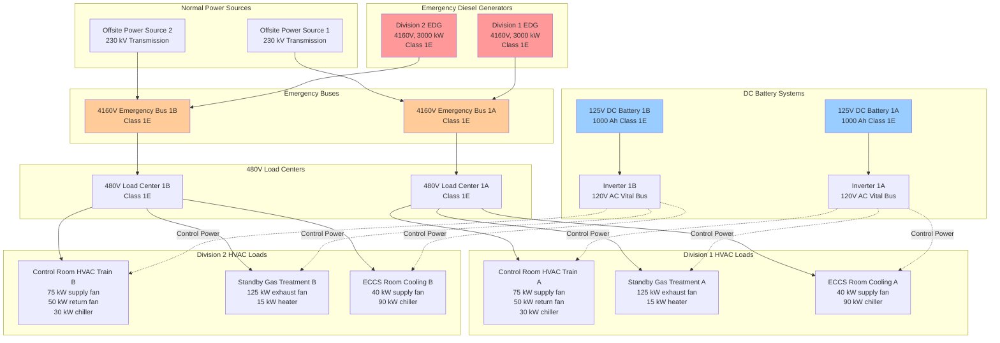

## Emergency Power Architecture for Nuclear Safety HVAC

Emergency power systems provide electrical energy to safety-related HVAC equipment during loss of offsite power (LOOP) events, ensuring continuous operation of ventilation, filtration, and environmental control systems essential to reactor safety and radiological containment. The design basis requires these systems to function following simultaneous loss of normal and alternate AC power sources while maintaining complete independence between redundant divisions.

The fundamental requirement stems from General Design Criterion 17, which mandates onsite and offsite electric power systems of sufficient capacity and capability to permit functioning of safety systems assuming a single failure. For HVAC applications, this translates to multiple independent emergency diesel generators (EDGs) supplying segregated electrical buses, each powering a complete HVAC train capable of fulfilling required safety functions.

## Class 1E Power System Characteristics

Class 1E designates the highest reliability electric power systems in nuclear facilities. The classification, established by IEEE 308 (Standard Criteria for Class 1E Power Systems for Nuclear Power Generating Stations), identifies electrical equipment and systems that are essential to emergency reactor shutdown, containment isolation, reactor core cooling, and containment and reactor heat removal, or are otherwise essential in preventing significant release of radioactive material to the environment.

**Fundamental Class 1E Requirements:**

Class 1E power systems must maintain independence between redundant divisions through physical separation, electrical isolation, and functional independence. Physical separation prevents common cause failures from fire, flooding, missiles, pipe whip, or environmental hazards. Minimum separation distances range from 20 feet (6 meters) for open routing to complete three-hour fire barrier enclosures depending on facility design basis and fire hazards analysis.

Electrical isolation prevents faults on one division from propagating to redundant divisions. This requires separate transformers, circuit breakers, cables, and buses for each division with no cross-ties except through isolation devices meeting single failure criteria. Coordination studies ensure protective devices clear faults without affecting healthy divisions.

Functional independence ensures failure or maintenance on one division does not compromise the ability of redundant divisions to perform safety functions. Each Class 1E division connects to a dedicated emergency diesel generator sized to carry 100% of required safety loads for that division.

**Design Margin and Capacity:**

Emergency diesel generators for nuclear applications incorporate substantial design margin beyond calculated loads. Typical sizing provides:

$$P_{\text{EDG}} = 1.25 \times \sum_{i=1}^{n} P_{\text{load},i} \times \text{DF}_i$$

where:
- $P_{\text{EDG}}$ = Emergency diesel generator rated capacity (kW)
- $P_{\text{load},i}$ = Individual load continuous power requirement (kW)
- $\text{DF}_i$ = Diversity factor for load type (typical 0.8-1.0)
- The 1.25 factor provides 25% margin above maximum calculated load

For motor loads, starting transients require additional analysis:

$$P_{\text{start}} = P_{\text{running}} + (I_{\text{LRA}} / I_{\text{FLA}}) \times P_{\text{motor}}$$

where:
- $P_{\text{start}}$ = Total bus load during motor starting (kW)
- $P_{\text{running}}$ = Running load of other equipment on bus (kW)
- $I_{\text{LRA}}$ = Locked rotor amperes of starting motor
- $I_{\text{FLA}}$ = Full load amperes of starting motor
- $P_{\text{motor}}$ = Motor nameplate power rating (kW)

Locked rotor to full load current ratios typically range from 6.0 to 8.0 for induction motors, creating significant starting transients that must remain within generator voltage dip limits (typically 80% minimum during starting, recovering to 95% within 2 seconds).

## Emergency Power Distribution to HVAC Systems

The following diagram illustrates emergency power distribution architecture for a two-division safety-related HVAC system:

## Load Sequencing and Timing Requirements

Emergency diesel generators must start, accelerate to rated speed and frequency, and accept loads within 10 seconds of receiving a safety actuation signal. This rapid response prevents extended interruption of safety-related HVAC systems. However, simultaneous application of all loads would exceed generator starting capacity and create severe voltage and frequency transients.

Load sequencing distributes load application over time based on priority and motor starting characteristics:

**Typical HVAC Load Sequence:**

| Sequence | Time Delay | Load Type | Power (kW) | Cumulative Load (kW) | Reason |
|----------|------------|-----------|------------|---------------------|---------|
| 1 | 0 sec | DC control power | 2 | 2 | Required for sequencer operation |
| 2 | 0 sec | Critical instrumentation | 5 | 7 | Required for system monitoring |
| 3 | 5 sec | Control room supply fan | 75 | 82 | Highest priority HVAC load |
| 4 | 10 sec | Control room return fan | 50 | 132 | Complete CR ventilation path |
| 5 | 15 sec | SGTS exhaust fan | 125 | 257 | Containment atmosphere control |
| 6 | 20 sec | ECCS room supply fan | 40 | 297 | Equipment cooling initiation |
| 7 | 30 sec | Control room chiller | 30 | 327 | Temperature control (lower priority) |
| 8 | 40 sec | ECCS room chiller | 90 | 417 | Equipment cooling (delayed acceptable) |

The sequence ensures voltage remains above 80% during motor starting and recovers to 95% within 2 seconds after each load application. Frequency must remain within 58-62 Hz (±2 Hz) during load additions with recovery to 59.5-60.5 Hz within steady-state periods.

**Load Sequencing Calculations:**

The voltage dip during motor starting is approximated by:

$$\Delta V = \frac{X''_d \times I_{\text{LRA}}}{V_{\text{base}}} \times 100\%$$

where:
- $\Delta V$ = Voltage dip percentage
- $X''_d$ = Generator subtransient reactance (per unit, typical 0.12-0.18)
- $I_{\text{LRA}}$ = Locked rotor current (amperes)
- $V_{\text{base}}$ = Base voltage (volts)

For a 75 kW motor with 6.5 LRA/FLA ratio starting on a 480V bus supplied by a generator with $X''_d = 0.15$ pu:

$$I_{\text{FLA}} = \frac{75,000}{480 \times \sqrt{3} \times 0.85 \times 0.90} = 118 \text{ A}$$

$$I_{\text{LRA}} = 6.5 \times 118 = 767 \text{ A}$$

$$\Delta V = 0.15 \times \frac{767 \times 480}{480 \times 1000} \times 100 = 11.5\%$$

This 11.5% voltage dip results in 88.5% voltage during starting, exceeding the 80% minimum requirement.

## Class 1E vs Non-Safety Power Systems Comparison

| Characteristic | Class 1E Systems | Non-Safety Systems |
|----------------|------------------|-------------------|
| **Regulatory Basis** | 10 CFR 50 Appendix A (GDC 17), IEEE 308 | Industry standards, local codes |
| **Redundancy** | Minimum two independent divisions | Single source acceptable |
| **Independence** | Physical, electrical, functional separation required | Shared components permitted |
| **Seismic Qualification** | Category I, IEEE 344 shake table or analysis | Standard building code (IBC) |
| **Environmental Qualification** | IEEE 323, 10 CFR 50.49 for harsh environment | Normal ambient only |
| **Quality Assurance** | 10 CFR 50 Appendix B program required | Commercial QA acceptable |
| **Starting Time** | ≤10 seconds from actuation signal | Typically 10-30 seconds |
| **Voltage Regulation** | ±10% steady-state, 80% minimum during transients | ±10% typical, less stringent transients |
| **Frequency Regulation** | ±2% (58-62 Hz), ±0.5% steady-state | ±3-5% acceptable |
| **Fuel Supply** | 7-day minimum onsite storage (10 CFR 50.63) | 24-48 hour typical |
| **Testing Frequency** | Monthly fast start, 24-month load test | Quarterly or annual |
| **Failure Impact** | Potential reactor shutdown, NRC reportable | Operational inconvenience |
| **Documentation** | Extensive design basis, safety analysis | Standard engineering files |
| **Modification Control** | 10 CFR 50.59 screening, possible NRC approval | Internal engineering review |
| **Installation Cost** | 3-5× non-safety equivalent | Base cost |
| **Maintenance Cost** | 2-4× non-safety equivalent | Base cost |

## Station Blackout Requirements (10 CFR 50.63)

The 10 CFR 50.63 Station Blackout Rule requires nuclear facilities to maintain core cooling, containment integrity, and appropriate containment heat removal capability for a specified duration (typically 4-8 hours) during complete loss of AC power including emergency diesel generators. This addresses scenarios where both offsite power and all onsite AC emergency power sources fail simultaneously.

Station blackout coping duration depends on:

**Coping Duration Factors:**

1. Offsite power design characteristics (redundancy and independence)
2. Emergency diesel generator reliability and redundancy
3. Condensate inventory for decay heat removal
4. Containment heat removal capability

Facilities with highly reliable offsite power (frequency <0.1 loss per year) and redundant emergency diesel generators (≥3 units, N+2 configuration) may qualify for 4-hour coping. Less reliable configurations require 8-hour or longer coping capability.

**HVAC Implications:**

During station blackout conditions, safety-related HVAC systems powered by emergency diesel generators are unavailable. Critical functions requiring continuous power receive DC battery backup:

- Control room habitability (pressurization, filtration via DC-powered dampers)
- Instrumentation and control systems
- Emergency lighting
- Communication systems

Battery-backed systems must maintain functionality for the coping duration using 125V DC or 120V AC vital buses powered through inverters. DC load calculations must account for continuous HVAC control power:

$$E_{\text{battery}} = \sum_{i=1}^{n} (P_{\text{load},i} \times t_{\text{coping}} \times 1.25) \times \frac{1}{\eta_{\text{inv}}}$$

where:
- $E_{\text{battery}}$ = Required battery capacity (Wh or Ah)
- $P_{\text{load},i}$ = Individual DC load power (W)
- $t_{\text{coping}}$ = Station blackout coping duration (hours)
- $\eta_{\text{inv}}$ = Inverter efficiency (typical 0.90-0.95)
- 1.25 = Design margin factor

For control room habitability during station blackout, battery-powered emergency lighting and smoke removal may operate using DC motors or inverter-fed AC motors. Flow rates reduce to minimum required for habitability rather than normal ventilation rates, extending battery life.

**Alternate AC (AAC) Sources:**

Many facilities supplement diesel generators with diverse power sources meeting station blackout requirements:

- Gas turbine generators (different technology from diesel)
- Combustion turbine generators
- Portable diesel generators staged offsite
- Cross-tie capability to independent onsite sources

AAC sources must demonstrate independence from Class 1E emergency diesel generators through different fuel sources, starting mechanisms, cooling systems, and physical location. This diversity prevents common cause failures affecting both emergency diesel generators and AAC sources.

## IEEE 308 Compliance Requirements

IEEE 308 (Standard Criteria for Class 1E Power Systems for Nuclear Power Generating Stations) establishes design, qualification, testing, and operational criteria ensuring Class 1E power systems meet nuclear safety requirements. Key provisions affecting HVAC emergency power include:

**Independence Criteria:**

Class 1E divisions maintain independence through physical separation, electrical isolation, and design diversity preventing common cause failures. For HVAC applications:

- Separate cable routing (minimum 20 feet or fire barriers)
- Independent cooling water sources for emergency diesel generators
- Separate fuel oil storage and transfer systems
- Independent switchgear rooms with separate HVAC systems
- No cross-connection except through isolation devices

**Loading Criteria:**

Emergency power systems must supply required loads with adequate voltage and frequency regulation under all design basis conditions:

- Voltage: ±10% steady-state, minimum 80% during transients
- Frequency: ±2% steady-state, 58-62 Hz during load changes
- Power factor: 0.8 lagging minimum
- Harmonic distortion: <5% total harmonic distortion (THD)

Variable frequency drives on HVAC motors contribute harmonic currents requiring filtering or generator sizing accommodation.

**Testing Requirements:**

IEEE 308 mandates periodic testing demonstrating emergency power system capability:

- Monthly fast start (within 10 seconds)
- 24-month full load test (4-24 hours at rated load)
- 18-month sequence logic testing
- Fuel oil sampling and analysis (quarterly)
- Battery service testing (18-month intervals)

Test acceptance criteria include starting time, voltage regulation, frequency regulation, load acceptance, and continuous operation duration.

## Fuel Storage and Transfer Systems

Emergency diesel generators require onsite fuel storage providing minimum 7-day operation at maximum safety loads per 10 CFR 50.63. This requirement ensures sustained operation during extended loss of offsite power with disrupted fuel delivery infrastructure.

**Fuel Storage Calculation:**

$$V_{\text{fuel}} = \frac{P_{\text{EDG}} \times \text{BSFC} \times t_{\text{duration}} \times N_{\text{units}}}{\rho_{\text{fuel}} \times 1.1}$$

where:
- $V_{\text{fuel}}$ = Required fuel storage volume (gallons or liters)
- $P_{\text{EDG}}$ = Emergency diesel generator rated load (kW)
- BSFC = Brake specific fuel consumption (lb/kWh, typical 0.35-0.42)
- $t_{\text{duration}}$ = Minimum operating duration (168 hours for 7 days)
- $N_{\text{units}}$ = Number of diesel generators requiring simultaneous operation
- $\rho_{\text{fuel}}$ = Fuel density (7.1 lb/gal for diesel)
- 1.1 = Margin factor accounting for tank unusable volume

For two 3000 kW emergency diesel generators with 0.38 lb/kWh fuel consumption:

$$V_{\text{fuel}} = \frac{3000 \times 0.38 \times 168 \times 2}{7.1 \times 1.1} = 49,000 \text{ gallons}$$

Storage tanks receive Seismic Category I qualification and environmental protection preventing fuel contamination from water intrusion or biological growth. Underground tanks minimize fire exposure while above-ground tanks facilitate inspection and maintenance.

**Fuel Transfer Systems:**

Redundant fuel transfer pumps (typically engine-driven and electric motor-driven) maintain day tank inventory supplying diesel generator fuel injection systems. Day tanks hold 1-4 hour fuel supply allowing time for transfer pump operation or manual refueling during transfer system failures.

Level controls automatically start transfer pumps maintaining day tank levels between 70-90% capacity. Low level alarms alert operators to transfer system malfunctions requiring manual intervention.

## Conclusion

Emergency power systems for nuclear HVAC applications represent critical infrastructure ensuring safety system functionality during design basis accidents and station blackout conditions. The rigorous requirements of 10 CFR 50.63, IEEE 308, and General Design Criteria establish performance standards significantly exceeding commercial emergency power installations.

Engineers designing or maintaining these systems must thoroughly understand independence requirements, load sequencing calculations, qualification criteria, and testing obligations. The substantial cost premium for Class 1E systems reflects extensive design analysis, quality assurance documentation, and ongoing surveillance programs ensuring reliable operation when safety depends on their performance.

Proper emergency power system design enables safety-related HVAC systems to maintain control room habitability, limit radioactive releases through filtration, cool essential equipment, and support safe reactor shutdown under the most challenging conditions nuclear facilities may encounter.
