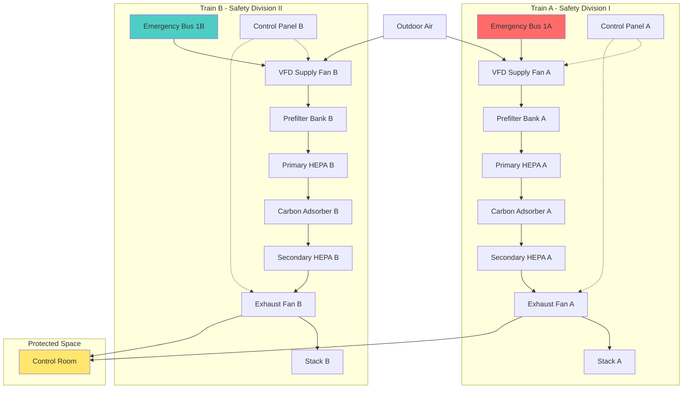

Nuclear facility HVAC systems performing safety functions must incorporate redundancy to ensure operability during single component failures, maintenance activities, and design basis accidents. The Nuclear Regulatory Commission (NRC) establishes these requirements through General Design Criterion 17 of 10 CFR 50 Appendix A, mandating that safety systems retain functionality assuming any single failure combined with loss of offsite power. This principle fundamentally shapes nuclear HVAC architecture.

## Single Failure Criterion

The single failure criterion represents the foundation of nuclear safety system design. A single failure constitutes any occurrence causing a component to become inoperable, including active component malfunction, passive component rupture, or inadvertent signal generation.

**Failure Categories:**

1. **Active failures:** Components requiring motion or state change (fans, dampers, control valves, relays)
2. **Passive failures:** Static components (ductwork rupture, structural failure, seal degradation)
3. **Common cause failures:** Events affecting multiple components simultaneously (fire, flooding, seismic events)

The design must demonstrate that the HVAC system performs its safety function despite:

- Any single active component failing to operate on demand
- Any single active component operating when not required
- Any single passive component failure (pipe break, duct rupture)
- Loss of offsite power concurrent with the single failure
- Any credible combination of single failures

**Analysis Methodology:**

Engineers conduct single failure analysis by systematically evaluating each component. For a redundant two-train system, the analysis assumes one train unavailable due to failure or maintenance, then postulates a single failure in the operating train. The system must still achieve the required safety function.

Consider a safety-related control room ventilation system. The analysis examines:

- Train A unavailable (maintenance)
- Train B supply fan fails to start: Emergency recirculation damper must actuate, and backup fan must start
- Train B damper fails to reposition: Manual operator action or physical bypass must exist
- Instrumentation failure: Redundant sensors with 2-out-of-3 logic prevent spurious actuation

## Redundant Train Architecture

Nuclear HVAC systems implement redundancy through completely independent trains, each capable of performing the full safety function. The minimum configuration provides two 100% capacity trains, though many facilities deploy three or four trains for enhanced reliability.

**Design Requirements for Redundant Trains:**

| Requirement | Implementation | Purpose |
|------------|----------------|---------|
| 100% capacity per train | Each train sized for total required flow | Single train suffices during single failure |
| Independent power supplies | Separate emergency diesel generators | Electrical failures don't affect multiple trains |
| Physical separation | Minimum 20 ft (6 m) or fire barriers | Prevents common cause damage |
| Separate instrumentation | Dedicated sensors and controls per train | Eliminates single point failures |
| Independent flowpaths | No shared ductwork, piping, or headers | Component failure isolated to single train |

**Train Configuration Example:**

A typical safety-related filtration system contains per train:

- Dedicated supply fan (variable frequency drive controlled)
- Prefilter bank (MERV 14 minimum)
- Primary HEPA filter bank
- Carbon adsorber section (radioiodine removal)
- Secondary HEPA filter bank
- Exhaust fan with emergency power connection
- Isolation dampers with fail-safe positioning
- Pressure and flow instrumentation
- Control panel with train-specific logic

The diagram illustrates complete independence between trains. No shared components exist between Train A (Safety Division I) and Train B (Safety Division II). Each train connects to separate emergency power buses, uses dedicated equipment, and discharges through independent stacks.

## Train Separation Requirements

Physical separation between redundant trains prevents common cause failures from disabling multiple trains simultaneously. The NRC evaluates separation adequacy through fire hazards analysis, flood propagation analysis, and high-energy line break analysis.

**Separation Criteria:**

1. **Spatial separation:** Minimum 20 feet (6 meters) horizontal distance with no intervening combustibles or hazards
2. **Fire barrier separation:** Three-hour fire-rated barriers between trains when spatial separation is impractical
3. **Flood protection:** Elevation differences or watertight barriers prevent flood propagation between trains
4. **Missile protection:** Physical barriers or orientation preventing missiles from affecting multiple trains
5. **Seismic interaction prevention:** Seismic Category I components separated from non-seismic equipment that could fall

**Separation Implementation Methods:**

Facilities achieve separation through:

- **Separate rooms:** Train A equipment in Room 101, Train B equipment in Room 201 (different fire zones)
- **Concrete walls:** Reinforced concrete barriers rated for 3-hour fire resistance and structural loads
- **Vertical separation:** Train A on ground floor, Train B on mezzanine level
- **Distance separation:** Equipment rooms at opposite ends of facility

Electrical cables for redundant trains follow separated raceway paths. Cable trays maintain 20-foot separation or utilize fire-rated barriers. Penetrations through fire barriers employ listed fire stops maintaining the barrier rating.

## Electrical Independence

Each redundant HVAC train connects to an independent safety-related electrical bus supplied by a dedicated emergency diesel generator. This electrical independence ensures single electrical failures cannot disable multiple trains.

**Power Distribution Architecture:**

Safety Division I (Train A):
- Emergency Diesel Generator 1A
- 4160 VAC Bus 1A
- 480 VAC Bus 1AA (through transformer)
- Motor Control Center MCC-1A
- 120 VAC Instrument Bus 1A (through inverter)

Safety Division II (Train B):
- Emergency Diesel Generator 1B
- 4160 VAC Bus 1B
- 480 VAC Bus 1BB (through transformer)
- Motor Control Center MCC-1B
- 120 VAC Instrument Bus 1B (through inverter)

Control circuits, instrumentation power, and valve operators for Train A equipment exclusively connect to Division I power. Train B exclusively uses Division II power. No cross-connections exist at any voltage level that could propagate faults between divisions.

**Breaker Coordination:**

Circuit breakers coordinate such that faults trip only the affected circuit breaker, not upstream divisional breakers. This prevents single faults from de-energizing entire safety divisions. Protective relaying includes overcurrent, ground fault, undervoltage, and differential protection with selective coordination throughout the distribution system.

## System Availability Calculation

System availability quantifies the probability that redundant trains successfully perform the safety function when demanded. Engineers calculate availability using component reliability data and system configuration.

For a two-train redundant system with independent trains, the unavailability is:

$$U_{system} = U_A \times U_B$$

where $U_A$ and $U_B$ represent unavailability of trains A and B respectively.

The system availability becomes:

$$A_{system} = 1 - U_{system} = 1 - (U_A \times U_B)$$

For a single train with unavailability $U = 0.01$ (1% unavailability, 99% availability):

$$A_{system} = 1 - (0.01 \times 0.01) = 1 - 0.0001 = 0.9999$$

The redundant system achieves 99.99% availability, a 100-fold improvement over a single train.

**Component Reliability Parameters:**

Typical nuclear HVAC component unavailability:

| Component | Unavailability (U) | Mean Time Between Failures |
|-----------|-------------------|---------------------------|
| Supply fan | 5 × 10⁻⁴ | 2000 hours |
| Exhaust fan | 5 × 10⁻⁴ | 2000 hours |
| Motor-operated damper | 1 × 10⁻³ | 1000 demands |
| Differential pressure sensor | 1 × 10⁻⁴ | 10000 hours |
| VFD controller | 2 × 10⁻³ | 500 hours |

For a train consisting of series components, the train unavailability sums:

$$U_{train} = U_{supply\_fan} + U_{HEPA} + U_{exhaust\_fan} + U_{dampers} + U_{controls}$$

With maintenance unavailability included (planned outages for testing/maintenance), the effective unavailability increases:

$$U_{effective} = U_{random} + U_{maintenance}$$

If maintenance occurs 48 hours annually (0.55% of time):

$$U_{effective} = 0.005 + 0.0055 = 0.0105$$

For two-train redundancy:

$$A_{system} = 1 - (0.0105)^2 = 0.99989$$

This calculation demonstrates that even with realistic component reliabilities and maintenance outages, two-train redundancy achieves exceptionally high system availability exceeding 99.98%.

**Mission Time Considerations:**

Nuclear accident scenarios specify mission times (duration the system must operate). For control room habitability, the mission time extends 30 days post-accident. The reliability over mission time follows:

$$R(t) = e^{-\lambda t}$$

where $\lambda$ represents the component failure rate and $t$ is mission time.

For a fan with MTBF of 2000 hours:

$$\lambda = \frac{1}{2000} = 0.0005 \text{ failures/hour}$$

Over a 720-hour (30-day) mission:

$$R(720) = e^{-0.0005 \times 720} = e^{-0.36} = 0.698$$

A single train provides 69.8% reliability over the mission. Two redundant trains achieve:

$$R_{system}(720) = 1 - (1 - 0.698)^2 = 1 - (0.302)^2 = 0.909$$

System reliability increases to 90.9% for the 30-day mission, demonstrating redundancy's importance for extended operations.

## N+1 and N+2 Redundancy

While minimum requirements mandate two trains (2 × 100%), many facilities implement enhanced redundancy for increased reliability and operational flexibility.

**N+1 Configuration (Three Trains):**

Three 100% capacity trains provide substantial advantages:

- One train available during simultaneous failure and maintenance
- Testing possible without compromising single failure protection
- Enhanced availability during refueling outages when extensive maintenance occurs
- Common practice at newer plants and research reactors

System unavailability with three independent trains:

$$U_{system} = U_A \times U_B \times U_C$$

For $U = 0.01$ per train:

$$A_{system} = 1 - (0.01)^3 = 0.999999$$

Availability reaches 99.9999% (six nines).

**N+2 Configuration (Four Trains):**

Some high-reliability applications employ four trains:

- Two trains operable during any combination of single failure and maintenance
- Extremely high availability for critical spaces (main control room)
- Allows extensive testing programs without operational impact

**Comparison of Redundancy Levels:**

| Configuration | Single Train Availability | System Availability | Reliability Improvement |
|--------------|-------------------------|-------------------|------------------------|
| Single train | 99.0% | 99.0% | Baseline |
| 2 × 100% (N+1) | 99.0% | 99.99% | 100× |
| 3 × 100% (N+2) | 99.0% | 99.9999% | 10,000× |
| 4 × 100% (N+3) | 99.0% | 99.999999% | 1,000,000× |

The diminishing returns become apparent: moving from single to dual redundancy provides dramatic improvement (factor of 100), while additional trains offer progressively smaller incremental gains. Economic and space constraints typically limit designs to two or three trains except for the most critical applications.

## Single Failure Criterion Application

Different nuclear systems apply the single failure criterion with varying rigor based on safety significance. The comparison below illustrates application scope:

| System Function | Redundancy Level | Single Failure Analysis | Testing Frequency | Power Supply |
|----------------|-----------------|------------------------|------------------|--------------|
| Containment isolation | 2 × 100% minimum | Full analysis required | Monthly valve stroke | Separate emergency buses |
| Post-accident filtration | 2 × 100% minimum | Full analysis required | Quarterly flow test | Diesel-backed power |
| Control room habitability | 2 × 100% (often 3 × 100%) | Full analysis required | Monthly actuation test | Uninterruptible + diesel |
| Safety equipment cooling | 2 × 100% minimum | Full analysis required | Quarterly flow test | Separate emergency buses |
| Auxiliary building ventilation | 2 × 50% acceptable | Simplified analysis | Quarterly run test | Normal + backup power |
| Radwaste building exhaust | 2 × 50% acceptable | Limited analysis | Annual flow test | Normal power sufficient |

High safety significance systems (containment isolation, control room habitability) require full single failure analysis, complete redundancy, and frequent testing. Lower safety significance systems may utilize partial redundancy (2 × 50%) where the combination of both trains provides full capacity but neither alone suffices for all scenarios.

## Testability Requirements

General Design Criterion 18 requires capability to test safety systems during plant operation to demonstrate operability. HVAC redundancy enables testing one train while the other remains in service.

**Testing Provisions:**

Each train includes:

- Test connections for flow measurement
- Pressure taps for differential pressure verification
- Isolation valves allowing single-train testing
- Bypass capability for filter replacement without system shutdown
- Instrumentation test ports for calibration verification

**Surveillance Testing:**

Technical Specifications establish surveillance requirements:

1. **Monthly:** Fan operability testing (start, run verification, current measurement)
2. **Quarterly:** Airflow rate measurement, differential pressure recording
3. **Annually:** HEPA filter in-place testing (99.97% minimum efficiency verification via aerosol challenge)
4. **18 months:** Integrated system test including automatic actuation logic

During surveillance testing, operators place one train in test mode while the redundant train remains available for automatic actuation. Test procedures verify that taking one train out of service properly annunciates in the control room and that the available train can fulfill the safety function.

**Online Maintenance Capability:**

Redundancy permits online maintenance within Technical Specification allowed outage times (typically 7 days). This capability prevents forced unit shutdowns for minor component failures or routine maintenance, substantially improving plant capacity factor while maintaining safety.

## Design Documentation Requirements

NRC regulations under 10 CFR 50 Appendix B require extensive documentation demonstrating compliance with redundancy requirements:

**Required Documentation:**

- **Single Failure Analysis Report:** Systematic evaluation of each credible failure demonstrating continued system functionality
- **Separation Analysis:** Documentation proving adequate physical, electrical, and functional separation between trains
- **Reliability Analysis:** Quantitative assessment of system availability and mission reliability
- **Fire Hazards Analysis:** Evaluation showing fire damage limited to single train
- **Flooding Analysis:** Demonstration that internal flooding cannot disable multiple trains
- **Seismic Interaction Analysis:** Proof that non-seismic components cannot impact multiple safety trains
- **Technical Specifications:** Limiting conditions for operation and surveillance requirements
- **Testing Procedures:** Detailed instructions for periodic testing maintaining operability

This documentation undergoes regulatory review during initial licensing and remains subject to inspection throughout plant life. Changes affecting redundancy or separation require evaluation under 10 CFR 50.59 to determine if NRC approval is necessary before implementation.

## Common Pitfalls and Design Considerations

Experience with operating nuclear plants reveals common redundancy implementation issues:

**Shared Support Systems:**

Seemingly independent trains may share support systems creating unrecognized dependencies:

- Compressed air systems supplying both train damper actuators
- Instrument air from common headers
- Chilled water for space cooling of electrical equipment rooms
- Heating systems preventing freeze damage in both trains

The design must trace all support systems ensuring each train's support systems maintain independence or receive appropriate safety classification.

**Cable Separation Violations:**

Cables for redundant trains routed through common cable trays or conduits violate separation requirements. Power cables and control cables require equal separation rigor. Careful installation quality control and as-built verification prevent inadvertent separation violations that only become apparent during fire hazards analysis review.

**Testing Interlocks:**

Test configurations sometimes bypass safety interlocks or isolation functions. Test procedures must ensure that taking one train to test mode does not compromise the available train's ability to perform the safety function. Lockouts preventing simultaneous testing of redundant trains protect against inadvertent loss of both trains.

**Maintenance Coordination:**

Procedures must prevent maintenance activities on both trains simultaneously. Maintenance schedules coordinate such that one train remains available. If both trains require maintenance, the plant enters a Technical Specification action requiring either rapid restoration or orderly shutdown.

## Regulatory Compliance Verification

The NRC verifies redundancy requirement compliance through:

1. **Design Certification Review:** Detailed examination of redundancy implementation during initial licensing
2. **Construction Inspection:** Verification of as-built separation and independence
3. **Pre-operational Testing:** Demonstration that redundant trains operate independently
4. **Periodic Inspections:** Triennial inspections verifying configuration control maintenance
5. **Resident Inspector Oversight:** Daily presence ensuring procedures maintain train separation

Non-compliance with redundancy requirements constitutes a significant safety finding potentially requiring plant shutdown until corrected. The NRC Enforcement Policy assigns violation severity levels with associated civil penalties for failures to maintain required redundancy.

Nuclear HVAC redundancy requirements ensure that safety functions remain available under single component failures, maintenance conditions, and design basis accidents. The systematic application of the single failure criterion, combined with physical and electrical train independence, produces highly reliable systems protecting public health and safety under all credible conditions. These stringent requirements, while imposing significant cost and complexity, prove essential for the extraordinarily high reliability standards nuclear facilities demand.
