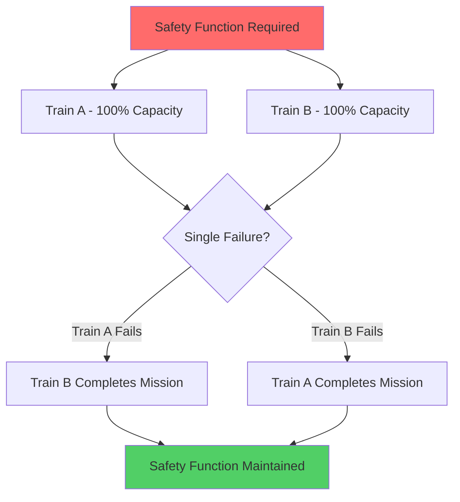
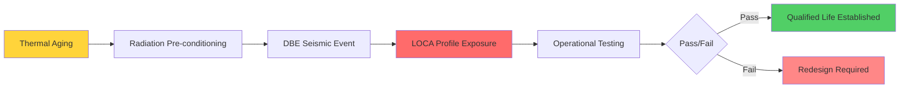

## Definition of Safety-Related Systems

Safety-related HVAC systems are those whose failure could prevent the safe shutdown of the reactor or result in significant radioactive release to the environment. Per 10 CFR 50, Appendix A, these systems must maintain their intended safety function during and after design basis events (DBEs).

**Classification Criteria:**

- **Safety-Related (Class 1E)**: Direct protective function, must operate during accidents
- **Augmented Quality (AQ)**: Non-safety but affects safety systems, enhanced QA requirements
- **Non-Safety-Related**: Commercial grade, no direct safety function

The distinction hinges on functional consequence analysis. If system failure creates conditions exceeding 10 CFR 100 dose limits at the site boundary, the system is safety-related.

## Seismic Category I Requirements

Seismic Category I (SC-I) classification ensures equipment remains functional during and after a Safe Shutdown Earthquake (SSE). The SSE represents the maximum vibratory ground motion for which safety systems are designed.

### Design Response Spectrum

Equipment must withstand spectral accelerations defined by:

$$S_a(f, \zeta) = A_{PGA} \cdot F_a(f) \cdot \frac{1}{\sqrt{1-4\zeta^2}}$$

where:
- $S_a$ = spectral acceleration (g)
- $f$ = natural frequency (Hz)
- $\zeta$ = damping ratio
- $A_{PGA}$ = peak ground acceleration
- $F_a$ = amplification factor

### Structural Qualification

SC-I HVAC components undergo dynamic analysis or shake table testing. The fundamental frequency must avoid resonance with building structures:

$$f_n = \frac{1}{2\pi}\sqrt{\frac{k}{m_{eff}}}$$

where $k$ is system stiffness and $m_{eff}$ is effective modal mass.

**Qualification Methods:**

| Method | Application | Standard |
|--------|-------------|----------|
| Dynamic analysis | Large ducted systems | IEEE 344 |
| Shake table testing | Fans, dampers, filters | IEEE 344 |
| Equivalent static | Rigid equipment ($f_n$ > 33 Hz) | ASCE 4 |
| Experience data | Proven commercial items | EPRI NP-5223 |

## Single Failure Criterion

Per 10 CFR 50, Appendix A, GDC 1, safety systems must perform their function assuming any single active or passive failure concurrent with loss of offsite power.

### Redundancy Implementation

Safety-related HVAC typically employs 100% redundant trains:

### Failure Modes Analysis

The probability of system failure given single failure criterion:

$$P_{sys,fail} = P_A \cdot P_B + P_{CCF}$$

where:
- $P_A$, $P_B$ = independent failure probabilities of each train
- $P_{CCF}$ = common cause failure probability

Common cause failures (CCF) must be minimized through:
- Physical separation (typically ≥ 20 feet or fire barriers)
- Electrical independence (separate Class 1E buses)
- Environmental diversity (separate ventilation zones)
- Functional isolation (separate instrumentation and controls)

## Environmental Qualification

Safety-related equipment must operate in post-accident environments per 10 CFR 50.49. Following a loss-of-coolant accident (LOCA), containment conditions evolve dramatically.

### Post-LOCA Environmental Profile

Temperature evolution inside containment follows energy balance:

$$\frac{dT}{dt} = \frac{\dot{Q}_{steam} - \dot{Q}_{removal}}{mc_p}$$

**Typical LOCA Environment:**

| Parameter | Pre-Accident | Peak (LOCA) | Post-LOCA (24 hr) |
|-----------|--------------|-------------|-------------------|
| Temperature | 120°F | 340°F | 280°F |
| Pressure | 14.7 psia | 65 psia | 35 psia |
| Humidity | 40% RH | 100% RH | 100% RH |
| Radiation | Background | 1×10⁶ rad | 5×10⁵ rad |

### Qualification Testing

Equipment undergoes sequential aging and accident simulation per IEEE 323:

Qualified life $t_q$ is calculated using Arrhenius relationship:

$$t_q = t_{ref} \cdot e^{\frac{E_a}{R}\left(\frac{1}{T_{op}}-\frac{1}{T_{ref}}\right)}$$

where:
- $E_a$ = activation energy (eV)
- $R$ = gas constant
- $T_{op}$ = operating temperature (K)
- $T_{ref}$ = reference test temperature (K)

## Testing and Surveillance Requirements

Technical Specifications mandate periodic testing to verify operability and performance within analyzed limits.

### Surveillance Test Intervals

**ASME AG-1 Code Requirements:**

| Component | Test Type | Frequency | Acceptance Criteria |
|-----------|-----------|-----------|---------------------|
| HEPA filters | DOP/PAO test | 18 months | ≥ 99.97% efficiency |
| Charcoal adsorbers | Methyl iodide test | 18 months | ≥ 95% removal |
| ESF fans | Flow measurement | 18 months | ≥ 90% design flow |
| Dampers | Stroke time | 92 days | ≤ design time |
| Emergency power | Load sequence | 18 months | Full rated capacity |

### Pressure Decay Testing

Control room and safety-related areas undergo in-place leak testing. The leak rate is quantified by pressure decay:

$$Q_{leak} = V_{room} \cdot \frac{dP}{dt} \cdot \frac{1}{P_{atm}}$$

where:
- $Q_{leak}$ = volumetric leak rate (cfm)
- $V_{room}$ = pressurized volume (ft³)
- $dP/dt$ = pressure decay rate (in. w.g./min)

Acceptance criterion typically: $Q_{leak} \leq 0.25$ air changes per hour at test pressure.

## Technical Specification Compliance

Limiting Conditions for Operation (LCO) define minimum equipment requirements. When equipment is inoperable, Completion Times dictate maximum allowed outage duration.

### Operability Determination

A system is operable when it can perform its specified safety function. This requires:

1. **Physical integrity**: No degraded conditions affecting function
2. **Electrical availability**: Power supply aligned and functional
3. **Instrumentation**: Controls and indications accurate
4. **Support systems**: Cooling water, compressed air available
5. **Performance capability**: Meets analyzed flow, pressure, filtration

### Allowed Outage Time (AOT) Basis

AOT is established through probabilistic risk assessment. The conditional core damage probability (CCDP) during maintenance must remain acceptable:

$$CCDP = \sum_{i} P_{initiator,i} \cdot P_{failure|initiator,i} \cdot AOT$$

Typical safety-related HVAC AOT: 7 days for one train out of service, provided the opposite train is operable.

## Nuclear Safety Design Criteria

General Design Criteria (GDC) from 10 CFR 50, Appendix A establish minimum requirements:

- **GDC 2**: Seismic and environmental design
- **GDC 4**: Environmental and dynamic effects accommodation
- **GDC 19**: Control room habitability
- **GDC 41**: Containment atmosphere cleanup
- **GDC 60**: Control of releases of radioactive materials to the environment
- **GDC 61**: Fuel storage and handling ventilation

### Quality Assurance Requirements

10 CFR 50, Appendix B mandates comprehensive QA programs for safety-related items covering:

- **Design Control**: Verification, peer review, configuration management
- **Procurement**: Supplier audits, source verification, commercial grade dedication
- **Fabrication**: Material traceability, qualified welders, NDE requirements
- **Testing**: Documented procedures, calibrated instruments, acceptance criteria
- **Maintenance**: Preventive maintenance, post-maintenance testing, corrective action

**ASME AG-1 Code** provides detailed design and construction requirements for nuclear air treatment systems, superseding AG-1 Section BA for fans, FC for filter housings, and SA for adsorbers.

Safety-related HVAC represents the pinnacle of environmental control engineering, where regulatory compliance, physical robustness, and operational reliability converge to protect public health and safety under the most challenging conditions conceivable.
