## Fundamental Principles of Seismic Qualification

Seismic qualification ensures that safety-related HVAC equipment maintains structural integrity and performs required safety functions during and after seismic events. The qualification process addresses the dynamic response of equipment to ground motion transmitted through building structures, a complex interaction governed by Newton's second law and principles of structural dynamics.

When seismic waves propagate through the earth and into nuclear facility structures, they create time-varying accelerations at equipment mounting locations. These accelerations generate inertial forces on HVAC components proportional to their mass. The magnitude and frequency content of these forces depend on ground motion characteristics, building dynamic properties, and equipment dynamic characteristics.

**Seismic Design Basis Events:**

Nuclear facilities design for two earthquake levels:

**Operating Basis Earthquake (OBE):** Lower-level earthquake that could reasonably occur during facility operating lifetime. Safety-related equipment must remain functional during and after OBE with no loss of safety function. Typical peak ground acceleration ranges from 0.05g to 0.15g depending on site seismicity.

**Safe Shutdown Earthquake (SSE):** Maximum earthquake potential for the site based on geological and seismological investigation. Equipment must maintain structural integrity and perform safety functions during and after SSE. SSE typically equals 2× OBE acceleration, with peak ground acceleration ranging from 0.10g to 0.30g for most sites, reaching 0.5g or higher in high seismicity regions.

## Dynamic Response Physics

The seismic response of HVAC equipment follows fundamental dynamics governed by the equation of motion for a single degree of freedom system:

$$m\ddot{x} + c\dot{x} + kx = -m\ddot{x}_g$$

where:
- $m$ = equipment mass (kg)
- $c$ = damping coefficient (N⋅s/m)
- $k$ = stiffness (N/m)
- $x$ = relative displacement from equilibrium (m)
- $\ddot{x}_g$ = ground acceleration (m/s²)

The natural frequency characterizes how the system vibrates when disturbed:

$$f_n = \frac{1}{2\pi}\sqrt{\frac{k}{m}} \text{ (Hz)}$$

Equipment with natural frequencies near dominant ground motion frequencies experiences resonance, amplifying response accelerations significantly. The amplification factor depends on damping ratio:

$$\beta = \frac{c}{c_c} = \frac{c}{2\sqrt{km}}$$

Typical damping values for HVAC equipment:

| Equipment Type | Damping Ratio (β) |
|---------------|------------------|
| Welded steel fans | 2-3% |
| Bolted steel assemblies | 4-5% |
| Equipment with isolators | 5-7% |
| Ductwork | 2-3% |

The maximum acceleration response occurs at resonance:

$$A_{max} = A_{ground} \times \frac{1}{2\beta}$$

For equipment with 3% damping, resonance produces amplification factors approaching 16.7, demonstrating why seismic qualification must account for dynamic amplification.

## Seismic Qualification Methods

IEEE 344 "Recommended Practice for Seismic Qualification of Class 1E Equipment for Nuclear Power Generating Stations" establishes qualification approaches. Regulatory Guide 1.100 endorses IEEE 344 with specific clarifications for NRC acceptance.

### Analysis Method

Dynamic analysis calculates equipment response using mathematical models. The method applies to equipment with well-defined geometry, material properties, and boundary conditions.

**Modal Analysis Approach:**

1. Develop finite element model of equipment
2. Extract natural frequencies and mode shapes
3. Calculate modal participation factors
4. Apply response spectrum to each mode
5. Combine modal responses using SRSS or CQC method

The response spectrum represents maximum acceleration response versus natural frequency for a given damping value. Site-specific spectra derived from ground motion time histories envelope all anticipated earthquake characteristics.

Modal combination using Square Root of Sum of Squares (SRSS):

$$R_{total} = \sqrt{\sum_{i=1}^{n} R_i^2}$$

For closely-spaced modes (frequency ratio < 1.1), Complete Quadratic Combination (CQC) provides more accurate results:

$$R_{total} = \sqrt{\sum_{i=1}^{n}\sum_{j=1}^{n} \rho_{ij} R_i R_j}$$

where $\rho_{ij}$ represents correlation coefficients between modes.

**Analysis Method Advantages:**
- Lower cost than physical testing
- Parametric studies readily performed
- Applicable to large, immovable equipment
- Provides stress distribution insight

**Analysis Method Limitations:**
- Requires accurate modeling of damping, joints, and connections
- Difficult for complex geometries
- Model validation essential
- Conservative assumptions may overestimate required capacity

### Testing Method

Shake table testing subjects equipment to simulated seismic motion, directly verifying performance under dynamic conditions. Testing provides empirical evidence of structural adequacy and functional capability.

**Test Setup Requirements:**

The equipment mounts to a shake table platform via its actual anchorage configuration. The table reproduces specified acceleration time histories or response spectra in three orthogonal directions simultaneously or sequentially depending on table capabilities.

Test Response Spectrum (TRS) must envelope Required Response Spectrum (RRS) across all frequencies with margin:

$$TRS(f,\beta) \geq 1.1 \times RRS(f,\beta) \text{ for all } f$$

The 1.1 factor provides 10% margin ensuring test severity exceeds design basis.

**Resonance Search Testing:**

Prior to seismic simulation, low-level sine sweeps identify equipment natural frequencies. Monitoring accelerometers at critical locations detect resonance peaks indicating modes requiring evaluation.

**Seismic Simulation Testing:**

Full-level testing applies design basis motion for specified duration (typically 30 seconds strong motion). Equipment must operate during testing (for active components) and demonstrate functionality after testing.

**Testing Method Advantages:**
- Directly demonstrates performance
- Captures actual damping, friction, and nonlinear behavior
- Reveals unexpected failure modes
- High confidence for license approval

**Testing Method Limitations:**
- Expensive, especially for large equipment
- Limited to table capacity (size and weight)
- Difficult to test installed configurations
- Specimen-to-specimen variability

### Combined Analysis and Testing

Many qualification programs use testing for complex subassemblies combined with analysis for overall equipment response. This hybrid approach balances cost and technical rigor.

## Comparison of Qualification Methods

| Criterion | Dynamic Analysis | Shake Table Testing | Combined Approach |
|-----------|-----------------|---------------------|-------------------|
| Cost | $ | $$$ | $$ |
| Schedule | 2-4 months | 4-8 months | 3-6 months |
| Applicability | Limited by modeling complexity | Limited by table capacity | Wide applicability |
| Confidence level | Moderate (model dependent) | High (empirical) | High |
| Design iteration | Easy | Difficult/expensive | Moderate |
| NRC acceptance | Requires detailed justification | Readily accepted | Generally accepted |
| Large equipment | Applicable | Often impractical | Preferred method |
| Novel designs | Conservative assumptions needed | Demonstrates actual performance | Validates critical components |
| Damping values | Must be justified | Measured directly | Measured for components |

## Seismic Category I Requirements

Equipment designated Seismic Category I must maintain safety function capability under SSE loading. This requires:

**Structural Adequacy:**

Stresses remain below allowable limits with appropriate safety factors. ASME Section III Division 1 Subsection NF provides allowable stresses for component supports:

For normal and upset conditions (including OBE):
- Primary membrane stress: $\sigma_m \leq 0.6S_y$
- Primary membrane + bending: $\sigma_{m+b} \leq 0.9S_y$

For emergency conditions (SSE):
- Primary membrane stress: $\sigma_m \leq 0.9S_y$
- Primary membrane + bending: $\sigma_{m+b} \leq 1.35S_y$

where $S_y$ represents material yield strength.

**Functional Capability:**

Active components (fans, dampers, controls) must operate during seismic events when required for safety function. Testing demonstrates operational capability under dynamic loading.

**Anchorage Design:**

Support systems transfer seismic loads from equipment to building structure. Anchorage design follows ACI 349 (Code Requirements for Nuclear Safety-Related Concrete Structures) for concrete anchors or AISC standards for steel structures.

The required anchor capacity considers:

$$F_{anchor} = \sqrt{(T_{seismic})^2 + (T_{dead})^2} + V_{seismic} \times \mu$$

where:
- $T_{seismic}$ = seismic tension force
- $T_{dead}$ = dead load tension/compression
- $V_{seismic}$ = seismic shear force
- $\mu$ = friction coefficient

## Seismically Qualified HVAC System Components

```mermaid
graph TB
    subgraph "Seismic Category I HVAC Equipment"
        A[Emergency Filtration Unit]
        B[Safety-Related Fan]
        C[Isolation Damper]
        D[Control Room AC Unit]
        E[HEPA Filter Housing]
        F[Ductwork with Seismic Supports]
    end

    subgraph "Qualification Elements"
        A --> A1[Shake Table Test<br/>0.3g SSE]
        A --> A2[Functional Test<br/>During Motion]
        A --> A3[Anchorage Design<br/>ACI 349]

        B --> B1[Modal Analysis<br/>FEA Model]
        B --> B2[Resonance Search<br/>10-35 Hz Range]
        B --> B3[Mounting Verification]

        C --> C1[Damper Stroke Test<br/>Under Seismic]
        C --> C2[Seal Leakage Test<br/>Post-Seismic]
        C --> C3[Actuator Qualification]

        D --> D1[Combined Method<br/>Test + Analysis]
        D --> D2[Vibration Isolation<br/>Seismic Stops]
        D --> D3[Refrigeration System<br/>Integrity]

        E --> E1[Frame Strength<br/>ASME AG-1]
        E --> E2[Filter Media<br/>Retention]
        E --> E3[Support Analysis]

        F --> F1[40 ft Max Spacing<br/>Lateral Supports]
        F --> F2[Flexibility Analysis<br/>Thermal + Seismic]
        F --> F3[II/I Interaction<br/>Evaluation]
    end

    subgraph "Regulatory Compliance"
        G[IEEE 344 Testing]
        H[RG 1.100 Guidance]
        I[ASME QME-1]
        J[10 CFR 50 App B QA]
    end

    A1 --> G
    B1 --> G
    C1 --> G
    D1 --> G
    E1 --> I
    F1 --> H

    G --> J
    H --> J
    I --> J

    style A fill:#ff6b6b
    style B fill:#ff6b6b
    style C fill:#ff6b6b
    style D fill:#ff6b6b
    style E fill:#ff6b6b
    style F fill:#ff6b6b
    style J fill:#4ecdc4
```

## Ductwork Seismic Support Design

Ductwork seismic supports prevent excessive motion and structural failure during earthquakes. SMACNA "HVAC Duct Construction Standards" Chapter 6 provides design guidance supplemented by facility-specific calculations.

**Support Spacing:**

Maximum longitudinal spacing: 40 feet (12.2 m)
Maximum transverse spacing: 40 feet (12.2 m)

Supports near concentrated loads (fans, dampers) require reduced spacing based on load distribution analysis.

**Lateral Force Calculation:**

The seismic lateral force on ductwork:

$$F_p = 0.4 \times a_p \times S_{DS} \times W_p \times \frac{1 + 2\frac{z}{h}}{R_p/I_p}$$

where:
- $a_p$ = component amplification factor (2.5 for rigid equipment)
- $S_{DS}$ = design spectral acceleration
- $W_p$ = component weight
- $z$ = height above base
- $h$ = structure height
- $R_p$ = component response modification factor
- $I_p$ = component importance factor (1.5 for seismic Category I)

**Bracing Configuration:**

Four-way bracing provides resistance in both horizontal directions. Braces orient at 45° angles to horizontal, creating effective load paths. Each brace carries:

$$F_{brace} = \frac{F_p}{\cos(45°) \times 2} = \frac{F_p}{1.414}$$

## Seismic II/I Interaction

Non-seismic (Category II) systems near Seismic Category I equipment require evaluation to prevent impact or damage during earthquakes. Failed non-seismic components must not disable safety functions.

**Evaluation Criteria:**

Calculate potential displacement of non-seismic equipment:

$$\delta_{II} = \frac{S_a \times g}{(2\pi f_n)^2}$$

If $\delta_{II} + clearance < separation$, no interaction occurs.

Otherwise, either restrain Category II equipment to seismic standards or increase separation distance.

**Overhead Systems:**

Piping, cable trays, and ductwork above safety-related equipment require restraint preventing falling debris. Even non-safety systems receive seismic restraint when positioned above Category I equipment.

## Regulatory Requirements and Standards

**IEEE 344:** Defines qualification procedures including test setup, instrumentation, acceptance criteria, and documentation requirements. The standard requires qualification to envelope all mounting orientations and locations where equipment will be installed.

**Regulatory Guide 1.100:** Endorses IEEE 344 with clarifications:
- Test Response Spectrum must envelope Required Response Spectrum with margin
- Resonance frequency confirmation required before and after testing
- Multi-axis testing preferred; sequential single-axis acceptable with justification
- Functional testing during and after seismic simulation mandatory

**ASME QME-1:** Qualification of Active Mechanical Equipment Used in Nuclear Facilities provides additional requirements for rotating equipment, focusing on bearing integrity and shaft alignment under seismic loading.

**Documentation Requirements:**

Qualification packages submitted to NRC include:
- Equipment description and safety function
- Qualification method selection justification
- Analysis calculations or test procedures
- Test reports with time histories and response spectra
- Functional test results
- Discrepancy resolution
- Qualified equipment parameters (location, mounting, orientation limits)

## Conclusion

Seismic qualification of nuclear HVAC systems ensures safety function availability during and after earthquakes through rigorous analysis or testing. Understanding dynamic response physics, applying appropriate qualification methods, and meeting regulatory requirements produces equipment capable of protecting public health and safety under extreme natural phenomena. The combination of IEEE 344 testing standards, RG 1.100 regulatory guidance, and sound engineering analysis provides the technical foundation for seismic qualification programs supporting nuclear facility safety.
