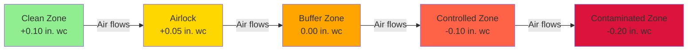
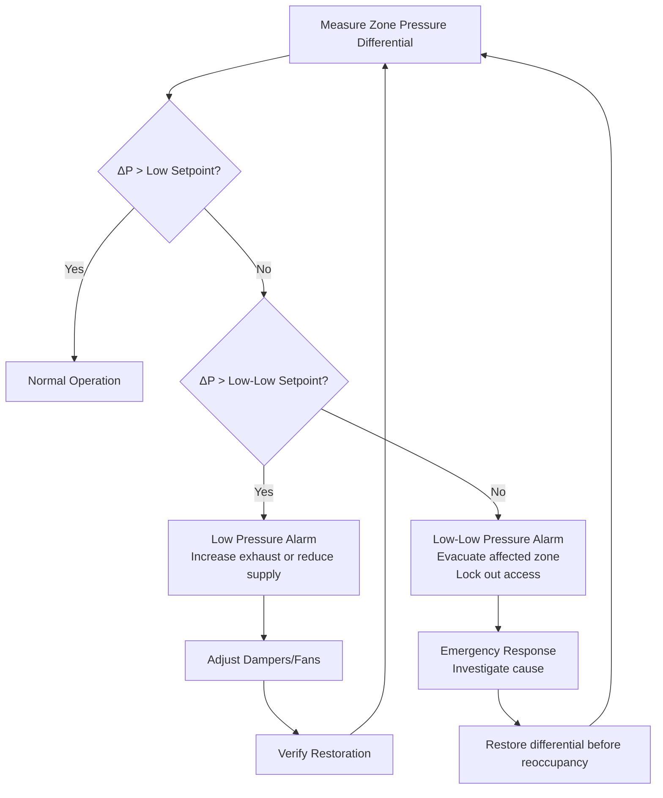

## Fundamental Principle of Directional Airflow Control

Clean-to-dirty airflow patterns in nuclear facilities rely on cascading pressure differentials to ensure that air always flows from areas of lower radiological contamination potential toward areas of higher contamination risk. This physics-based approach prevents radioactive particles and contaminated air from migrating into occupied clean zones, protecting personnel and preventing the spread of contamination.

The driving force is the pressure gradient between zones. Air naturally flows from high-pressure regions to low-pressure regions, following the pressure differential equation:

$$Q = C \cdot A \cdot \sqrt{\frac{2\Delta P}{\rho}}$$

Where:
- $Q$ = volumetric airflow rate through opening (cfm)
- $C$ = discharge coefficient (typically 0.6-0.65 for doorways)
- $A$ = leakage area (ft²)
- $\Delta P$ = pressure differential (lbf/ft²)
- $\rho$ = air density (lbm/ft³)

This relationship demonstrates that maintaining consistent pressure differentials is critical—doubling the pressure difference increases airflow by approximately 41%, while halving it reduces flow by 29%.

## Zone Classification and Pressure Cascade Design

Nuclear facilities establish radiological zones based on contamination potential, typically organized into four categories with progressively negative pressures:

| Zone Classification | Typical Pressure Differential | Airflow Direction | Contamination Risk |
|---------------------|-------------------------------|-------------------|--------------------|
| Clean Zone (Office Areas) | +0.125 to +0.15 in. wc | Outward | None |
| Buffer Zone (Corridors) | +0.05 to +0.10 in. wc | Into buffer from clean | Minimal |
| Controlled Zone (RCA Entry) | -0.05 to -0.10 in. wc | Into controlled | Low to Moderate |
| Contaminated Zone (Hot Areas) | -0.15 to -0.25 in. wc | Into contaminated | High |

The pressure cascade must maintain a minimum differential of 0.025 inches water column (in. wc) between adjacent zones under all operating conditions, per 10 CFR 20 guidance. However, most facilities target 0.05 to 0.125 in. wc to provide margin against pressure fluctuations caused by door operations, filter loading, and system variations.

### Pressure Differential Calculation

For a multi-zone cascade, the total system pressure requirement from the cleanest to most contaminated zone is:

$$\Delta P_{total} = \sum_{i=1}^{n} \Delta P_i + \Delta P_{margin}$$

Where $\Delta P_i$ represents the differential across each zone boundary, and $\Delta P_{margin}$ accounts for pressure losses during door openings (typically 20-30% of nominal differential).

## Airlock Design and Operation

Airlocks serve as pressure transition zones between areas with significantly different pressure regimes. The two primary configurations are:

### Bubble Airlock Configuration

Maintained at a pressure higher than both adjacent zones, ensuring airflow into both spaces:

$$P_{airlock} > P_{clean} > P_{contaminated}$$

This configuration prevents contamination transfer but requires continuous make-up air and results in higher energy consumption.

### Sink Airlock Configuration

Maintained at a pressure lower than both adjacent zones, drawing air from both spaces:

$$P_{clean} > P_{contaminated} > P_{airlock}$$

This configuration provides superior containment when the contaminated side pressure unexpectedly rises but may allow clean-to-dirty cross-contamination if both doors open simultaneously.

## Leakage Rate Calculations

Uncontrolled leakage through cracks, penetrations, and door seals determines the actual airflow required to maintain pressure differentials. The leakage rate through building envelope components follows:

$$Q_{leak} = K \cdot A \cdot (\Delta P)^n$$

Where:
- $K$ = leakage coefficient (depends on opening geometry)
- $A$ = equivalent leakage area (in²)
- $n$ = flow exponent (0.5 for turbulent, 1.0 for laminar)

For typical commercial door construction with weatherstripping, the leakage area ranges from 4 to 12 in² per door. At 0.10 in. wc differential:

$$Q_{leak} = 0.65 \cdot 8 \text{ in}^2 \cdot \sqrt{\frac{2 \cdot 0.10 \cdot 5.2}{0.075}} = 52 \text{ cfm per door}$$

This calculation demonstrates why maintaining pressure control requires substantial airflow—a single door can demand 50-100 cfm of make-up or exhaust air depending on pressure direction.

## Differential Pressure Monitoring Systems

Continuous monitoring of zone pressure differentials is mandated by 10 CFR 20.1406 and implemented through:

**Magnehelic Gauges**: Provide visual indication at zone boundaries. Accuracy of ±2% full scale (±0.002 in. wc on 0.1 in. wc range) limits precision for low differentials.

**Electronic Pressure Transmitters**: Higher accuracy (±0.5% of reading) enables integration with building automation systems. The measurement uncertainty must be considered in control logic:

$$\Delta P_{control} = \Delta P_{setpoint} + U_{instrument} + \Delta P_{margin}$$

**Alarm Setpoints**: Configured to alert before differential falls below minimum acceptable value:

- Low alarm: 80% of setpoint (e.g., 0.04 in. wc when setpoint is 0.05 in. wc)
- Low-low alarm: Minimum acceptable differential (e.g., 0.025 in. wc)

## Door Interlock Systems

To prevent simultaneous opening of both airlock doors (which would eliminate the pressure barrier), interlocking systems employ:

**Mechanical Interlocks**: Physical linkages prevent one door from opening while the other remains open. No electrical power required but offers no override capability.

**Electromagnetic Interlocks**: Powered locks controlled by door position sensors. Allow administrative override for emergencies but require backup power to maintain locked state during power failure.

**Pressure-Based Interlocks**: Monitor differential pressure and prevent door opening if differential falls below threshold. Most sophisticated but subject to sensor failure modes.

The interlock logic must account for door cycling time to allow pressure recovery:

$$t_{recovery} = \frac{V_{airlock}}{\dot{V}_{net}} \cdot \ln\left(\frac{\Delta P_{initial}}{\Delta P_{final}}\right)$$

Where $V_{airlock}$ is the airlock volume and $\dot{V}_{net}$ is the net airflow into or out of the space.

## System Design Considerations

Achieving reliable clean-to-dirty airflow requires:

1. **Dedicated exhaust systems** for contaminated zones to prevent cross-contamination through shared ductwork
2. **Supply air volume control** using pressure-independent VAV terminals to maintain zone pressures despite filter loading
3. **Exhaust air flow tracking** to maintain offset between supply and exhaust (typically 10-15% more exhaust in contaminated zones)
4. **HEPA filtration** on exhaust streams from contaminated zones per 10 CFR 20, Appendix B
5. **Redundant exhaust fans** with automatic switchover to ensure continuous negative pressure

The supply-exhaust offset for a contaminated zone is:

$$\dot{V}_{exhaust} = \dot{V}_{supply} + \dot{V}_{infiltration} + \dot{V}_{pressurization}$$

Where $\dot{V}_{pressurization}$ is the additional exhaust required to achieve the target negative pressure (typically 100-300 cfm per zone depending on size and leakage characteristics).

## Performance Verification and Testing

ASHRAE Standard 111 provides test procedures for verifying pressure differential performance:

- **Initial commissioning**: Verify differentials under all door positions and operating modes
- **Filter loading simulation**: Test differentials at clean and dirty filter conditions
- **Door swing test**: Measure differential recovery time after door operation
- **Tracer gas testing**: Verify actual airflow direction using SF₆ or other tracers

Acceptance criteria typically require maintaining minimum differential for 95% of occupied time and recovering to setpoint within 30-60 seconds after door operation.

The clean-to-dirty airflow pattern is the fundamental containment strategy for nuclear facilities, providing passive protection through physics-based pressure control that operates continuously without requiring active detection of contamination release.