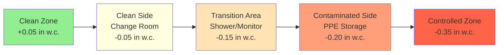
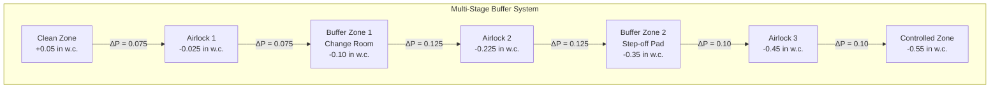

# Buffer Zone HVAC Systems in Nuclear Facilities

Buffer zones serve as intermediate pressure regions between clean uncontaminated areas and controlled radiological zones in nuclear facilities, providing transitional spaces that prevent direct contamination migration during personnel and equipment movement. These critical transition areas—including airlocks, change rooms, step-off pads, and access corridors—employ carefully designed ventilation systems that maintain specific pressure relationships to adjacent zones while accommodating the dynamic airflow disturbances created by door openings, personnel movement, and equipment transfer. NRC Regulatory Guide 1.140 establishes buffer zone pressure requirements that ensure bidirectional protection: negative pressure relative to clean zones prevents contamination escape, while positive pressure relative to controlled zones prevents contamination ingress during normal operations.

## Buffer Zone Purpose and Requirements

### Functional Objectives

**Primary contamination barrier:**
Buffer zones establish a graduated pressure cascade that minimizes the pressure step between clean and controlled zones. Rather than maintaining a single large differential (e.g., +0.05 in w.c. clean to -0.50 in w.c. controlled), buffer zones create intermediate pressure levels that reduce transient airflows during door openings and provide containment redundancy.

**Personnel decontamination pathway:**
Change rooms and step-off pads within buffer zones allow workers to don and doff personal protective equipment in controlled ventilation environments where contamination detection and removal occur before personnel enter clean areas. The progressive pressure reduction matches the staged decontamination process.

**Equipment transfer corridor:**
Buffer zones provide controlled pathways for tools, materials, and equipment moving between radiological zones, with airflow patterns designed to prevent contamination spread during transfer operations.

### Regulatory Requirements

**NRC Regulatory Guide 1.140 specifications:**
- Negative pressure relative to clean zones: -0.125 to -0.25 in w.c.
- Positive pressure relative to controlled zones: +0.125 to +0.25 in w.c.
- Pressure differential maintained during all door positions
- Continuous monitoring with alarm capability
- Annual verification testing per ASME N511

**10 CFR 20 radiation protection standards:**
Buffer zone design must support contamination control programs that maintain worker exposure ALARA (As Low As Reasonably Achievable) by preventing contamination migration from controlled to clean areas through properly directed airflow.

**Design basis criteria:**

| Parameter | Specification | Regulatory Basis |
|-----------|--------------|------------------|
| Minimum differential to clean zone | -0.125 in w.c. | NRC RG 1.140 |
| Minimum differential to controlled zone | +0.125 in w.c. | NRC RG 1.140 |
| Air changes per hour | 10-20 ACH | ASHRAE, facility-specific |
| Supply filtration | MERV 13-16 | 10 CFR 50 App A |
| Exhaust filtration | Single-stage HEPA | NRC guidance |
| Pressure recovery time | <5 seconds post-door closure | Industry standard |
| Differential monitoring | ±0.01 in w.c. accuracy | ASME AG-1 |

## Air Pressure Cascading from Clean to Controlled

### Pressure Cascade Fundamentals

**Three-zone pressure relationship:**
The buffer zone establishes an intermediate pressure level that creates two smaller pressure steps rather than one large differential:

$$P_{clean} > P_{buffer} > P_{controlled}$$

Typical absolute pressures relative to atmosphere:
- Clean zone: $P_c = +0.05$ in w.c.
- Buffer zone: $P_b = -0.10$ in w.c.
- Controlled zone: $P_{ctrl} = -0.35$ in w.c.

**Pressure differential calculations:**
Clean-to-buffer differential:

$$\Delta P_{c-b} = P_c - P_b = 0.05 - (-0.10) = +0.15 \text{ in w.c.}$$

Buffer-to-controlled differential:

$$\Delta P_{b-ctrl} = P_b - P_{ctrl} = -0.10 - (-0.35) = +0.25 \text{ in w.c.}$$

Total clean-to-controlled differential:

$$\Delta P_{total} = \Delta P_{c-b} + \Delta P_{b-ctrl} = 0.15 + 0.25 = 0.40 \text{ in w.c.}$$

### Supply-Exhaust Balance for Buffer Zone Pressure

**Imbalance airflow calculation:**
Buffer zone pressure depends on the net airflow imbalance between supply and exhaust, accounting for leakage through all boundaries:

$$Q_{exhaust} - Q_{supply} = Q_{leak,clean} + Q_{leak,controlled}$$

Where leakage flows are determined by pressure differential and opening characteristics:

$$Q_{leak} = C_d A_{effective} \sqrt{\frac{2\rho \Delta P}{\rho}}$$

**Example calculation for buffer zone:**
Given:
- Buffer zone volume: 2,000 ft³
- Effective leakage area to clean zone: 3.0 ft²
- Effective leakage area to controlled zone: 2.5 ft²
- Target pressure: -0.10 in w.c. (clean), +0.25 in w.c. (controlled)
- Discharge coefficient: $C_d = 0.65$

Leakage from clean to buffer:

$$Q_{c-b} = 0.65 \times 3.0 \times \sqrt{\frac{2 \times 0.075 \times 0.0346}{0.075}} = 5.1 \times 0.0831 = 424 \text{ CFM}$$

Leakage from buffer to controlled:

$$Q_{b-ctrl} = 0.65 \times 2.5 \times \sqrt{\frac{2 \times 0.075 \times 0.0578}{0.075}} = 4.23 \times 0.1075 = 455 \text{ CFM}$$

Required exhaust exceeds supply by:

$$Q_{imbalance} = 424 + 455 = 879 \text{ CFM}$$

For 15 ACH target ventilation rate:

$$Q_{supply} = \frac{2,000 \times 15}{60} = 500 \text{ CFM}$$

$$Q_{exhaust} = 500 + 879 = 1,379 \text{ CFM}$$

### Transient Airflow During Door Opening

**Door opening flow surge:**
When doors open between zones, instantaneous high-velocity flow occurs to equalize pressure. This transient flow must be supplied/exhausted by the ventilation system to restore design differentials rapidly:

$$Q_{door} = C_d A_{door} \sqrt{\frac{2\Delta P}{\rho}}$$

For standard 3 ft × 7 ft personnel door ($A = 21$ ft²) with 0.15 in w.c. differential:

$$Q_{door} = 0.65 \times 21 \times \sqrt{\frac{2 \times 0.0346}{0.075}} = 13.65 \times 0.961 = 13,115 \text{ CFM}$$

This represents instantaneous surge flow lasting 5-10 seconds during door opening/closing cycle.

**Pressure recovery design:**
Buffer zone supply/exhaust systems must provide sufficient reserve capacity to restore pressure differentials within 5 seconds of door closure. Required reserve capacity:

$$Q_{reserve} = \frac{V_{buffer} \times N_{recovery}}{60}$$

Where $N_{recovery}$ represents air changes during recovery period (typically 1.5-2.0 ACH):

$$Q_{reserve} = \frac{2,000 \times 1.5}{60} = 50 \text{ CFM}$$

## Change Room Ventilation Design

### Change Room Layout and Airflow

**Zoning within change room:**
Change rooms subdivide into clean side (street clothes), buffer transition area (shower/decontamination), and contaminated side (protective clothing storage) with progressive pressure reduction following contamination risk gradient.

**Airflow pattern requirements:**
Supply air enters clean side of change room, flows across personnel as they transition through stages, and exhausts from contaminated side near floor level to capture settled particles. This clean-to-dirty airflow prevents contamination migration toward clean areas.

### Supply and Exhaust Configuration

**Supply air delivery:**
- Location: Ceiling-mounted diffusers on clean side
- Velocity: 300-500 FPM at diffuser face (low turbulence)
- Distribution: Uniform coverage across personnel circulation paths
- Filtration: MERV 13-16 prefilters, once-through ventilation
- Temperature: 68-72°F (comfort during clothing changes)

**Exhaust air collection:**
- Location: Floor-level or low-wall grilles on contaminated side
- Velocity: 200-300 FPM at grille face
- Coverage: Multiple exhaust points prevent dead zones
- Filtration: Single-stage HEPA (99.97% at 0.3 μm)
- Monitoring: Continuous radiation monitoring before discharge

**Design parameters table:**

| Parameter | Clean Side | Transition | Contaminated Side |
|-----------|-----------|------------|-------------------|
| Pressure (in w.c.) | -0.05 | -0.15 | -0.20 |
| Air changes (ACH) | 10-12 | 15-20 | 20-25 |
| Supply CFM (100 ft² ea) | 167 | 250 | 333 |
| Exhaust CFM (100 ft² ea) | 184 | 292 | 400 |
| Temperature (°F) | 70 | 70 | 72 |
| Face velocity (FPM) | 75 | 100 | 125 |

### Contamination Control Features

**Step-off pad ventilation:**
Dedicated exhaust at floor level immediately inside controlled zone entrance captures contamination from personnel footwear. Minimum 150 FPM face velocity across step-off pad surface with direct exhaust to HEPA filtration prevents tracking contamination into buffer areas.

**Shower and decontamination stations:**
Personnel contamination events require emergency decontamination showers within buffer zones. Shower exhaust systems provide:
- 20-30 ACH during decontamination operations
- Instant-on capability with motion or manual activation
- Warm water supply (95-105°F) for contamination removal
- Floor drains connected to radioactive liquid waste systems
- Air curtain at shower entrance maintaining 200 FPM

**Personal protective equipment storage:**
Contaminated PPE storage areas within change rooms maintain maximum negative pressure (-0.25 in w.c.) with dedicated exhaust preventing cross-contamination to clean areas. HEPA-filtered exhaust handles particulate contamination from PPE removal.

## Airlock Integration

### Double-Door Airlock Systems

**Airlock pressure control strategy:**
Airlocks maintain intermediate pressure between adjacent zones, calculated as the arithmetic mean of boundary pressures:

$$P_{airlock} = \frac{P_{zone1} + P_{zone2}}{2}$$

For clean-to-buffer airlock:

$$P_{airlock} = \frac{0.05 + (-0.10)}{2} = -0.025 \text{ in w.c.}$$

This intermediate pressure ensures airflow always moves toward lower pressure zone regardless of which door opens, providing bidirectional contamination protection.

**Interlock control logic:**
Electronic interlocks prevent simultaneous door opening, eliminating direct airflow path between clean and controlled zones. Interlock system includes:
- Magnetic door position switches verifying closed status
- Time delay (5-10 seconds) ensuring pressure recovery before opposite door unlocks
- Emergency override capability for personnel evacuation
- Local status indication and remote monitoring

### Airlock Ventilation Systems

**Supply/exhaust design:**
Airlock ventilation operates continuously to maintain intermediate pressure and rapidly purge contamination after each use:

**Continuous mode (doors closed):**
- Supply: 15-20 ACH maintains pressure balance
- Exhaust: Slightly exceeds supply for negative pressure
- Filtration: MERV 13-16 supply, HEPA exhaust

**Purge mode (post-use):**
- Supply: Increases to 30-40 ACH for 2-3 minutes
- Exhaust: Increases proportionally maintaining pressure
- Duration: 3-5 complete air volume changes

**Airlock sizing calculation:**
For 8 ft × 8 ft × 8 ft airlock (512 ft³):

Continuous mode flow rate:

$$Q_{continuous} = \frac{512 \times 18}{60} = 154 \text{ CFM supply}$$

Purge mode flow rate:

$$Q_{purge} = \frac{512 \times 35}{60} = 299 \text{ CFM supply}$$

### Buffer Zone Airlock Integration

**Series airlock configuration:**
Complex nuclear facilities employ series airlocks creating multiple buffer stages between clean and highly contaminated zones:

Each airlock and buffer stage adds contamination containment barrier while maintaining personnel access efficiency.

## Contamination Containment Principles

### Physical Barriers and Airflow

**Directed airflow strategy:**
Buffer zone contamination control relies on consistent clean-to-dirty airflow maintained through:

1. **Pressure gradient**: Negative pressure relative to clean zones draws air inward
2. **Velocity threshold**: Minimum 75-100 FPM face velocity at openings prevents back-migration
3. **Exhaust placement**: Low-mounted exhausts capture settled contamination
4. **Supply distribution**: Ceiling supplies direct flow downward and across room

**Contamination migration prevention:**
During door opening transients, buffer zone design ensures contamination movement always flows toward controlled zones:

$$\vec{V}_{air} = -\nabla P$$

Air velocity vector follows pressure gradient from high to low pressure. Proper pressure cascade ensures this gradient always points toward controlled zone.

### HEPA Filtration in Buffer Zones

**Single-stage HEPA on buffer exhaust:**
Buffer zone exhaust receives single-stage HEPA filtration (99.97% efficiency at 0.3 μm) providing:
- Particulate contamination capture before discharge
- Protection of downstream ductwork from contamination
- Reduced maintenance burden compared to controlled zone two-stage systems

**Pressure drop considerations:**
Clean HEPA filter pressure drop: 1.0-1.5 in w.c.
Loaded HEPA filter pressure drop: 3.0-4.0 in w.c. (replacement trigger)

Total exhaust fan static pressure:

$$SP_{total} = SP_{duct} + SP_{HEPA} + SP_{fittings} + SP_{discharge}$$

Typical design: 6-8 in w.c. total static pressure for buffer zone exhaust fans.

### Continuous Air Monitoring

**Contamination detection:**
Buffer zones incorporate continuous air monitors (CAMs) measuring airborne radioactivity in real-time:
- Sample location: Exhaust ductwork upstream of HEPA filters
- Measurement: Gross beta-gamma activity (cpm or μCi/ml)
- Alarm setpoint: 2-5× background levels
- Response: Automatic increased ventilation, operator notification

**Differential pressure monitoring:**
Each buffer zone boundary requires continuous differential pressure measurement:
- Sensor type: Capacitance manometer (±0.01 in w.c. accuracy)
- Display: Local indication and control room annunciation
- Alarms: Warning at 75% of design ΔP, alarm at 50%
- Data logging: 1-minute intervals for regulatory compliance

## Personal Protective Equipment Considerations

### PPE Donning and Doffing Ventilation

**Clean side PPE donning:**
Personnel don protective equipment on clean side of change room under positive pressure relative to transition area. Clean air supply prevents contamination contact before controlled zone entry:
- Supply: Ceiling diffusers providing downward laminar flow
- Velocity: 50-75 FPM over work area
- Cleanliness: MERV 13-16 filtration maintaining IAQ

**Contaminated side PPE removal:**
PPE doffing occurs on contaminated side under negative pressure with enhanced exhaust capture. Critical design features:
- Multiple exhaust points at floor and mid-level
- Minimum 125 FPM face velocity at exhaust grilles
- Immediate proximity to step-off pad and monitoring station
- HEPA filtration of all exhaust air

### Respiratory Protection Integration

**Self-contained breathing apparatus (SCBA):**
High-contamination entries require SCBA use, affecting change room design:
- SCBA storage: Pressurized cabinets with HEPA-filtered air supply
- Donning area: Dedicated space with 200 FPM vertical laminar flow
- Testing station: Fit-testing booth with exhaust capture
- Fill station: Separated room with explosion-proof electrical

**Air-purifying respirators (APR):**
Standard entries use APRs with particulate filters, requiring:
- Clean storage in positive-pressure cabinets
- Fit-testing annually per 10 CFR 20
- Used filter disposal in contaminated waste containers
- Decontamination capability before removal

### Contamination Survey Stations

**Personnel contamination monitors (PCMs):**
Buffer zones incorporate automated PCMs at exit points detecting contamination before clean zone entry:
- Hand/foot monitors at step-off pads
- Portal monitors at change room exits
- Sensitivity: <20 dpm/100 cm² beta-gamma
- Alarm response: Locks exit door, signals decontamination required

**Ventilation for survey stations:**
PCM stations require dedicated ventilation preventing contamination spread during surveys:
- Local exhaust: 150-200 FPM capture velocity at floor level
- Supply: Low-velocity ceiling supply (300 FPM) providing clean air
- Pressure: Slight negative (-0.02 in w.c.) relative to surrounding buffer area
- Filtration: HEPA exhaust capturing any disturbed contamination

### PPE-Related Contamination Sources

**Heat stress and moisture:**
Impermeable protective clothing generates significant metabolic heat requiring enhanced cooling:
- Supply air temperature: 65-68°F in PPE donning areas
- Ventilation rate: 20-25 ACH preventing heat accumulation
- Air velocity: 75-100 FPM providing convective cooling
- Relative humidity: 40-50% preventing moisture condensation

**Particulate generation during PPE removal:**
Removing contaminated protective clothing disturbs surface contamination creating airborne particles. Buffer zone exhaust design captures this transient loading:
- Enhanced exhaust rate during doffing operations
- Low-mounted exhausts (12-24 in above floor)
- Multiple exhaust points preventing dead zones
- HEPA filtration protecting downstream ductwork

Buffer zone HVAC systems represent sophisticated engineering solutions balancing contamination control, personnel safety, and operational efficiency, providing essential transitional spaces that protect workers and prevent radioactive material migration in nuclear facilities.
