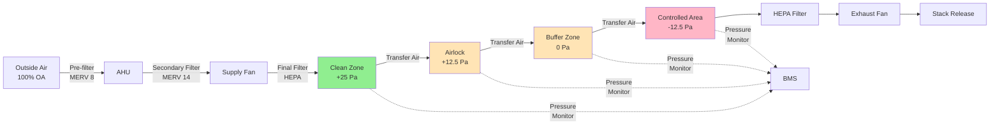

Clean zones in nuclear facilities represent the highest level of radiological cleanliness, requiring stringent HVAC control to prevent contamination ingress and maintain safe working environments for personnel and equipment. These areas demand precise pressure control, high-efficiency filtration, and continuous monitoring to ensure regulatory compliance and operational safety.

## Clean Zone Definition and Requirements

Clean zones are uncontaminated areas within nuclear facilities where no radioactive materials are present or expected under normal operating conditions. These spaces include administrative offices, control rooms, main control areas, electrical equipment rooms, and personnel facilities such as change rooms on the clean side.

The primary HVAC objective for clean zones is maintaining positive pressure relative to adjacent buffer zones and controlled areas. This pressure hierarchy prevents migration of potentially contaminated air into clean spaces. Typical pressure differentials range from +0.05 to +0.10 inches water gauge (+12.5 to +25 Pa) relative to buffer zones.

Clean zones must maintain environmental conditions suitable for continuous personnel occupancy. Temperature ranges typically fall between 68°F and 76°F (20°C to 24°C) with relative humidity controlled between 30% and 60% to ensure comfort and prevent static electricity accumulation that could affect sensitive electronic equipment.

## Positive Pressure Maintenance

Positive pressure control in clean zones relies on supplying more air than is exhausted or transferred to adjacent spaces. The pressure differential is calculated using:

$$\Delta P = \frac{Q_{supply} - Q_{exhaust}}{C_L}$$

where $\Delta P$ is the pressure differential (Pa), $Q_{supply}$ is the supply airflow rate (m³/s), $Q_{exhaust}$ is the exhaust airflow rate (m³/s), and $C_L$ is the leakage coefficient dependent on building construction quality.

Air change rates in clean zones typically range from 4 to 8 air changes per hour (ACH), calculated as:

$$ACH = \frac{Q_{supply} \times 3600}{V_{room}}$$

where $Q_{supply}$ is in m³/s and $V_{room}$ is the room volume in m³.

Supply air systems for clean zones incorporate variable air volume (VAV) controls with minimum airflow setpoints to ensure adequate ventilation during low occupancy periods. Pressure control loops continuously modulate supply and exhaust dampers to maintain setpoint differentials within ±0.005 inches water gauge (±1.25 Pa).

## Filtration Requirements for Clean Zones

Clean zone supply air passes through multi-stage filtration to remove particulates and ensure high air quality. The typical filtration train consists of:

| Filter Stage | Efficiency Rating | Primary Function |
|--------------|------------------|------------------|
| Pre-filter | MERV 8 | Coarse particulate removal, system protection |
| Secondary Filter | MERV 13-14 | Fine particulate removal |
| Final Filter | MERV 15-16 or HEPA | Sub-micron particulate removal |

HEPA filters (minimum 99.97% efficient at 0.3 μm) are installed in critical clean zones such as control rooms and emergency response facilities to provide protection against external radiological releases. These filters require regular differential pressure monitoring with replacement typically occurring at 2.0 to 2.5 inches water gauge (500 to 625 Pa) pressure drop.

Supply air diffusers in clean zones utilize low-velocity designs to minimize noise and drafts. Discharge velocities are typically limited to 400-600 feet per minute (2.0-3.0 m/s) to maintain acoustic levels below NC-35 to NC-40 in occupied spaces.

## Personnel and Equipment Entry

Clean zone access occurs through controlled entry points equipped with airlocks or vestibules that maintain pressure cascades. Personnel transition from clean zones through buffer zones to controlled areas via change rooms where protective clothing is donned.

The airlock pressure cascade maintains:

- Clean zone: +0.10 inches water gauge (+25 Pa) relative to buffer
- Airlock/vestibule: +0.05 inches water gauge (+12.5 Pa) relative to buffer
- Buffer zone: 0.00 inches water gauge (neutral or slightly positive relative to controlled areas)

Equipment entering clean zones undergoes radiological survey and decontamination if necessary before transfer. Material airlocks with interlocked doors prevent simultaneous opening that would compromise pressure differentials.

## Monitoring and Alarming

Clean zone HVAC systems incorporate comprehensive monitoring to detect pressure excursions, filter degradation, and system failures. Critical monitoring points include:

**Differential Pressure Monitoring**: Pressure transmitters with ±0.001 inches water gauge (±0.25 Pa) accuracy continuously measure pressure differentials between clean zones and adjacent spaces. Alarm setpoints activate at ±20% deviation from setpoint values.

**Airflow Monitoring**: Supply and exhaust airflow stations with thermal or differential pressure sensors verify flow rates remain within design tolerances. Low airflow alarms indicate filter loading, fan failures, or damper malfunctions.

**Filter Differential Pressure**: Magnehelic gauges or electronic transmitters monitor pressure drop across each filter stage. High differential pressure indicates filter loading requiring replacement.

**Temperature and Humidity**: Environmental sensors with ±0.5°F (±0.3°C) and ±2% RH accuracy monitor space conditions with alarms for out-of-range conditions.

All monitoring points connect to the building management system (BMS) with data trending, alarm annunciation, and automatic system responses. Critical alarms transmit to continuously staffed control rooms for immediate response.

## Transition to Buffer and Controlled Areas

The transition from clean zones to buffer zones and subsequently to controlled areas follows a strict pressure cascade that prevents contamination migration. Buffer zones serve as intermediate spaces between clean and potentially contaminated areas, typically maintained at neutral pressure or slight positive pressure relative to controlled areas.

Pressure cascade design ensures directional airflow always flows from areas of lower contamination potential toward areas of higher contamination potential. Transfer air from clean zones flows to buffer zones, then to controlled areas where it is exhausted through HEPA filtration before release.

Door interlocks prevent simultaneous opening of multiple doors in the cascade, which would short-circuit the pressure differential and allow contamination migration. Electromagnetic locks controlled by the BMS enforce sequential door operation in personnel and material transfer airlocks.

Emergency conditions such as fire or evacuation may require pressure reversal to allow personnel egress from controlled areas through clean zones. Emergency override systems temporarily reverse exhaust flow and activate supplemental HEPA filtration to protect clean zones during emergency egress while maintaining personnel safety as the priority.

Clean zone HVAC systems represent the foundation of radiological zoning in nuclear facilities, providing the highest level of protection against contamination ingress through rigorous pressure control, filtration, and monitoring. Proper design, operation, and maintenance of these systems is essential for facility safety and regulatory compliance.