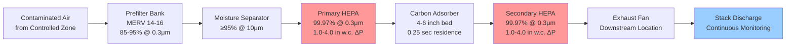
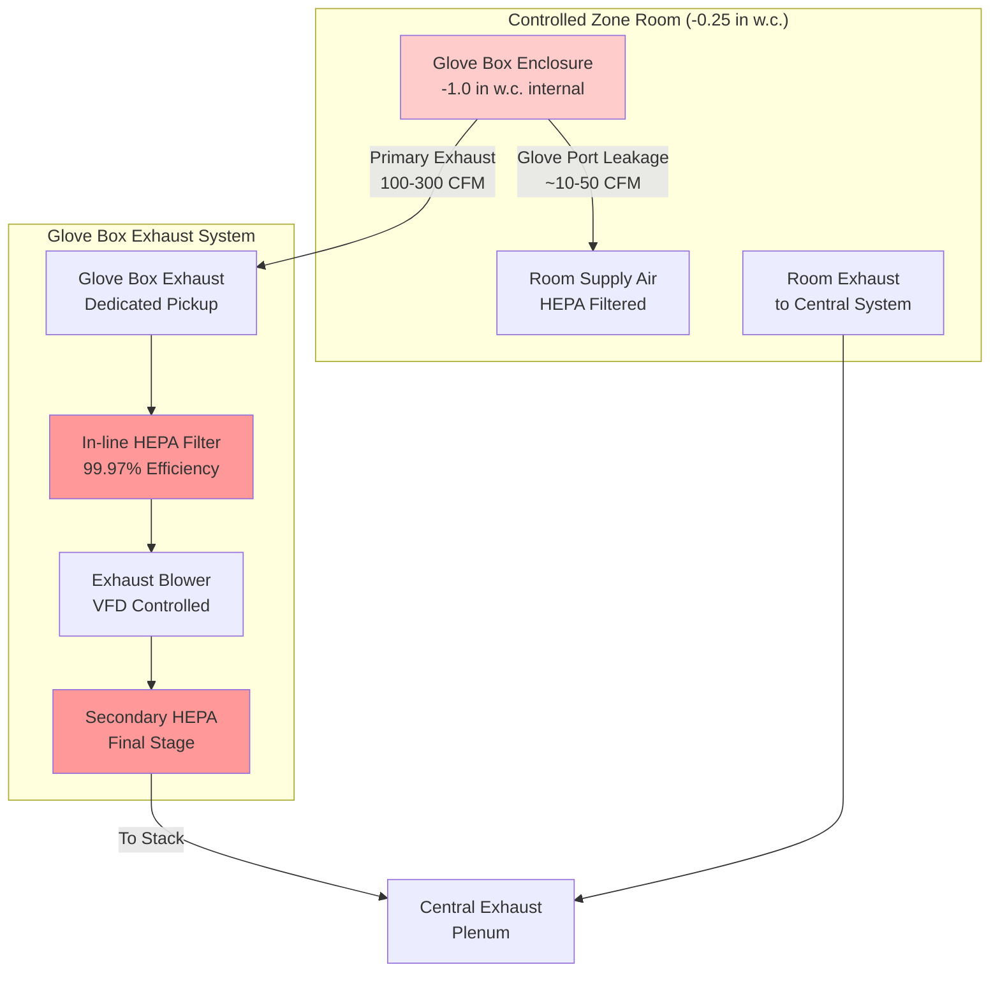

Controlled zones represent the highest contamination risk areas in nuclear facilities, requiring the most stringent HVAC controls to prevent radioactive material migration. These zones encompass reactor containment buildings, hot cells, glove boxes, decontamination facilities, and radioactive waste processing areas. The ventilation system provides the final engineered barrier against contamination release through maximum negative pressure, redundant HEPA filtration, continuous radiation monitoring, and strict once-through airflow patterns per NRC Regulatory Guide 1.140 and 10 CFR Part 20.

## Controlled Zone Classification and Requirements

### Zone Definition and Containment Criteria

Controlled zones contain radioactive materials, contaminated equipment, or processes that generate airborne radioactivity. Access requires radiation work permits, personnel dosimetry, and protective equipment. The HVAC system maintains these areas at maximum negative pressure relative to all other building spaces to ensure contaminated air flows only toward filtered exhaust paths.

**Regulatory basis per 10 CFR Part 20:**
- Derived air concentration (DAC) limits for specific isotopes
- Airborne radioactivity area designation when concentrations exceed 1 DAC
- High radiation area controls for dose rates exceeding 100 mrem/hr
- Very high radiation area controls for dose rates exceeding 500 rad/hr at 1 meter

**Controlled zone pressure requirements:**

| Zone Type | Pressure vs. Buffer | Pressure vs. Atmosphere | Air Changes | Filtration Stages |
|-----------|---------------------|------------------------|-------------|-------------------|
| Standard controlled | -0.125 to -0.25 in w.c. | -0.25 to -0.50 in w.c. | 4-6 ACH | Dual HEPA |
| Hot cells | -0.25 to -0.50 in w.c. | -0.50 to -1.00 in w.c. | 6-10 ACH | Dual HEPA + carbon |
| Glove boxes | -0.50 to -1.00 in w.c. | -1.00 to -2.00 in w.c. | 10-15 ACH | Dual HEPA |
| Reactor containment | -0.25 to -0.50 in w.c. | -0.50 to -1.50 in w.c. | 0.5-1.0 ACH | Dual HEPA + carbon |
| High-activity areas | -0.50 to -1.50 in w.c. | -1.00 to -3.00 in w.c. | 15-20 ACH | Triple HEPA |

The pressure differential ensures directional airflow from areas of lower contamination potential toward areas of higher contamination, creating a containment hierarchy.

### Negative Pressure Maintenance Systems

**Pressure control strategy:**

Controlled zones achieve negative pressure through exhaust airflow exceeding supply airflow. The pressure differential depends on the volumetric imbalance and building envelope leakage characteristics.

$$\Delta P = K \cdot \left(\frac{Q_{exhaust} - Q_{supply}}{A_{leak}}\right)^n$$

Where:
- $\Delta P$ = Pressure differential (in w.c.)
- $K$ = Building tightness coefficient (0.5-2.0 depending on construction)
- $Q_{exhaust}$ = Exhaust airflow (CFM)
- $Q_{supply}$ = Supply airflow (CFM)
- $A_{leak}$ = Effective leakage area (ft²)
- $n$ = Flow exponent (0.5-0.65 for turbulent flow)

For controlled zone requiring -0.25 in w.c. with 500 ft² effective leakage area:

$$Q_{imbalance} = A_{leak} \sqrt{\frac{2 \Delta P}{\rho K}} = 500 \sqrt{\frac{2 \times 0.0578}{0.075 \times 1.0}} = 4,400 \text{ CFM}$$

Therefore, exhaust must exceed supply by approximately 4,400 CFM to maintain the design differential.

**Variable frequency drive control:**

Modern systems employ VFD-controlled exhaust fans with pressure transmitters providing continuous feedback. The control algorithm maintains constant differential pressure despite varying leakage rates:

$$Q_{exhaust} = Q_{base} + K_p (\Delta P_{setpoint} - \Delta P_{actual}) + K_i \int (\Delta P_{setpoint} - \Delta P_{actual}) dt$$

This proportional-integral (PI) control compensates for door openings, filter loading, and envelope leakage changes.

**Redundancy requirements:**

- Two 100% capacity exhaust trains minimum
- Automatic switchover on fan failure (transfer time <10 seconds)
- Shared supply system with emergency backup
- Diesel generator backup power for safety-related functions
- Battery backup for critical pressure monitoring and alarms

## HEPA Filtration of Exhaust Air

### Multi-Stage Filtration Configuration

Controlled zone exhaust requires redundant HEPA filtration to achieve decontamination factors exceeding 10⁶ (99.9999% removal efficiency). The standard configuration employs prefilters, dual HEPA banks, and activated carbon for radioiodine removal.

**Filter train arrangement:**

**Combined filtration efficiency:**

For two HEPA filters in series, each with 99.97% efficiency:

$$\eta_{total} = 1 - (1 - \eta_1)(1 - \eta_2) = 1 - (1 - 0.9997)(1 - 0.9997) = 0.999999 \text{ or } 99.9999\%$$

This represents a decontamination factor (DF) of:

$$DF = \frac{1}{1 - \eta_{total}} = \frac{1}{1 - 0.999999} = 1,000,000$$

**HEPA filter specifications per ASME AG-1:**

- Minimum efficiency: 99.97% at 0.3 μm (most penetrating particle size)
- Maximum face velocity: 250 FPM at design flow (prevents media damage)
- Filter media: Glass fiber or synthetic (radiation-resistant types for high dose areas)
- Frame construction: Stainless steel or treated wood for high-humidity environments
- Gasket seal: Neoprene or silicone, designed for leak-tight installation
- Testing: Individual DOP/PAO test certification required for each filter

**Pressure drop characteristics:**

Clean filter: 1.0-1.5 in w.c.
Loaded filter (replacement): 3.5-4.0 in w.c.
Design basis: 2.5 in w.c. (mid-life condition)

Total system static pressure requirement:

$$SP_{total} = SP_{duct} + SP_{prefilter} + SP_{HEPA1} + SP_{carbon} + SP_{HEPA2} + SP_{stack}$$

Typical values: 8-15 in w.c. total for controlled zone exhaust systems.

### In-Place Filter Testing

**ASME N510 aerosol challenge testing:**

Annual in-place testing validates installed system efficiency and identifies bypass leakage around filter seals. The test introduces aerosol upstream and measures downstream concentration.

$$\eta_{system} = \left(1 - \frac{C_{downstream}}{C_{upstream}}\right) \times 100\%$$

**Test procedure:**
1. Introduce PAO (polyalphaolefin) aerosol generator upstream of HEPA banks
2. Target upstream concentration: 80-100 μg/L
3. Measure downstream concentration with photometer
4. Scan entire filter face and frame perimeter
5. Acceptance: ≤0.05% penetration for primary systems, ≤0.01% for critical applications

**Leak detection and repair:**

Penetrations exceeding 0.05% indicate filter damage or seal leakage:
- Filter media damage: Replace filter
- Gasket leak: Re-seal with approved compound
- Frame leak: Repair or replace housing
- Re-test after repair to verify correction

### Activated Carbon Adsorber Design

**Radioiodine removal requirement:**

Iodine-131 (8-day half-life) represents a critical fission product requiring removal. Activated carbon adsorbs radioiodine through physisorption and chemisorption mechanisms when impregnated with potassium iodide or triethylenediamine (TEDA).

**Design parameters per Regulatory Guide 1.52:**

$$t_{residence} = \frac{V_{carbon}}{Q} \geq 0.25 \text{ seconds}$$

Where:
- $V_{carbon}$ = Carbon bed volume (ft³)
- $Q$ = Airflow rate (CFM)

For 10,000 CFM exhaust system:

$$V_{carbon} = Q \times t_{residence} = 10,000 \times \frac{0.25}{60} = 41.7 \text{ ft³}$$

**Bed configuration:**
- Depth: 4-6 inches minimum (2-4 inches typical, doubled for safety margin)
- Type: TEDA-impregnated coconut shell carbon
- Ignition temperature testing: ≥150°C per ASTM D3466
- Radioiodine removal efficiency: ≥95% at design flow and humidity

Carbon beds positioned between HEPA stages prevent carbon fines from entering exhaust stack while capturing any iodine that penetrates the primary HEPA.

## Contamination Monitoring Systems

### Continuous Air Monitors (CAMs)

**Real-time airborne radioactivity detection:**

Continuous air monitors sample controlled zone air and exhaust streams to detect airborne contamination and provide immediate alarm capability. Monitors employ multiple detection technologies depending on isotope characteristics.

**Monitor types and applications:**

| Monitor Type | Detection Method | Isotopes Monitored | Sensitivity | Location |
|--------------|------------------|-------------------|-------------|----------|
| Alpha CAM | Scintillation detector | Pu-239, Am-241, U-238 | 1-10 DAC | Glove box exhaust |
| Beta CAM | Geiger-Mueller tube | Sr-90, Cs-137, I-131 | 10-100 DAC | General controlled zones |
| Gamma CAM | NaI scintillation | Co-60, Cs-137, I-131 | Variable | Process areas |
| Particulate | Filter collection + counting | All particulates | 1 DAC | All exhausts |
| Iodine-specific | Silver zeolite cartridge | I-131, I-125 | 0.1-1 DAC | Reactor containment |

**Alarm setpoints per 10 CFR Part 20:**

- Alert (low): 1 DAC (initiate investigation)
- Alarm (high): 10 DAC (evacuate area, isolate ventilation)
- High-high alarm: 100 DAC (automatic containment isolation)

**Sample flow requirements:**

$$Q_{sample} = \frac{V_{zone} \times ACH}{60} \times SF$$

Where:
- $V_{zone}$ = Zone volume (ft³)
- $ACH$ = Air changes per hour
- $SF$ = Sample fraction (typically 0.1-1.0% of exhaust flow)

For 50,000 ft³ controlled zone with 6 ACH:

$$Q_{sample} = \frac{50,000 \times 6}{60} \times 0.005 = 25 \text{ CFM minimum sample flow}$$

### Stack Effluent Monitoring

**Regulatory requirement per 10 CFR Part 20.1302:**

All controlled zone exhausts discharge through monitored stacks with continuous sampling, radiation detection, flow measurement, and permanent recording. Stack monitoring provides:

1. Verification of HEPA filtration performance
2. Quantification of radioactive releases to environment
3. Compliance demonstration for effluent limits
4. Emergency response data during accident conditions

**Stack monitoring system components:**

- Sample probe: Isokinetic extraction from centerline of stack
- Sample transport: Heated line maintains >25°F above dew point (prevents condensation)
- Particulate filter: Continuous collection for alpha/beta/gamma analysis
- Radioiodine cartridge: Charcoal or silver zeolite for I-131 capture
- Flow measurement: Pitot tube or ultrasonic flow meter
- Radiation detectors: Real-time gamma monitors + laboratory analysis of collected media

**Isokinetic sampling requirement:**

$$\frac{V_{sample}}{V_{stack}} = \frac{Q_{sample}/A_{probe}}{Q_{stack}/A_{stack}} = 1.0 \pm 0.2$$

Maintaining this ratio ensures representative particulate sampling without bias toward larger or smaller particles.

## Glove Box and Hot Cell Integration

### Glove Box Ventilation Design

**Purpose and contamination control:**

Glove boxes provide sealed enclosures for handling highly radioactive materials while allowing manipulation through glove ports. Internal negative pressure prevents contamination escape through small leaks, torn gloves, or material transfer ports.

**Pressure differential requirements:**

- Glove box interior to room: -0.50 to -1.00 in w.c.
- Absolute internal pressure: -1.00 to -2.00 in w.c. relative to atmosphere
- Differential monitoring accuracy: ±0.01 in w.c.

**Ventilation system configuration:**

**Airflow calculations:**

Glove box inleakage through glove ports and small penetrations:

$$Q_{leak} = C_d \times A_{leak} \times \sqrt{\frac{2 \Delta P}{\rho}}$$

For 20 glove ports (8-inch diameter each) with -1.0 in w.c. differential:

Total leak area: $A_{leak} = 20 \times \pi (4/12)^2 = 6.98 \text{ ft²}$

$$Q_{leak} = 0.65 \times 6.98 \times \sqrt{\frac{2 \times 0.0361}{0.075}} = 150 \text{ CFM}$$

Design exhaust must exceed leakage by 50-100% for safety margin: **200-250 CFM per glove box.**

**Air change rate verification:**

For 100 ft³ glove box internal volume with 200 CFM exhaust:

$$ACH = \frac{Q \times 60}{V} = \frac{200 \times 60}{100} = 120 \text{ air changes per hour}$$

This high air change rate ensures rapid contamination removal and pressure response during material transfer operations.

### Hot Cell HVAC Systems

**Hot cell definition and shielding:**

Hot cells contain extremely high-activity radioactive materials requiring thick concrete shielding (3-6 feet) and remote handling equipment. Ventilation must remove decay heat, prevent contamination release, and maintain negative pressure despite high thermal loads.

**Thermal load considerations:**

Radioactive decay generates significant heat within hot cells:

$$Q_{decay} = A \times E_{decay} \times 3.41 \text{ BTU/hr per watt}$$

Where:
- $A$ = Activity (Curies)
- $E_{decay}$ = Decay energy (watts/Curie, isotope-specific)

For Sr-90/Y-90 source (100,000 Ci, 6.7 watts/kCi):

$$Q_{decay} = 100,000 \times 0.0067 = 670 \text{ watts} = 2,290 \text{ BTU/hr}$$

**Ventilation and cooling design:**

- Supply air: HEPA filtered, temperature controlled (65-75°F to remove decay heat)
- Air changes: 6-10 ACH minimum for contamination control
- Supplemental cooling: Chilled water coils in supply for high heat loads
- Exhaust: Dual HEPA filtration with radiation monitors

**Cell penetration sealing:**

All services entering hot cells (electrical, piping, instrumentation) require gas-tight seals:
- Mechanical seals: Stainless steel plates with neoprene gaskets
- Electrical penetrations: Epoxy potted or compression seal assemblies
- Piping penetrations: Welded sleeves with annular sealing
- Leak testing: Pressure decay test to verify <0.1% volume/day leakage

## High-Activity Area Ventilation

### Design Basis for Extreme Contamination Levels

**Classification criteria:**

High-activity areas exceed 100 R/hr gamma dose rates or contain megacurie-level radioactive sources. Examples include spent fuel pools, reprocessing cells, isotope production facilities, and high-level waste storage.

**Enhanced ventilation requirements:**

- Pressure: -0.50 to -1.50 in w.c. (higher differentials for extreme contamination)
- Air changes: 15-20 ACH minimum (increased dilution ventilation)
- Filtration: Triple HEPA in series (DF >10⁹) with intermediate carbon stages
- Materials: Radiation-hardened components (stainless steel ductwork, rad-hard gaskets)
- Shielding: Ductwork routed to minimize radiation streaming through penetrations

**Triple HEPA efficiency:**

$$\eta_{triple} = 1 - (1-0.9997)^3 = 0.999999999 \text{ or } 99.9999999\%$$

Decontamination factor:

$$DF = \frac{1}{1-0.999999999} = 1,000,000,000$$

This extreme filtration efficiency reduces discharge concentrations to below detection limits even for very high source terms.

**Radiation-resistant materials:**

Standard HEPA filter media degrades under sustained gamma exposure:
- Glass fiber media: Usable to ~10⁶ rad cumulative dose
- Silica fiber media: Usable to ~10⁸ rad cumulative dose
- Stainless steel HEPA (sintered metal): Usable to >10⁹ rad (cleanable and reusable)

Material selection depends on expected cumulative radiation dose over filter service life.

### Emergency Containment Systems

**Accident scenario ventilation:**

Design basis accidents (DBA) require continued ventilation operation under extreme conditions:
- Temperature: Up to 250°F (post-accident steam release)
- Humidity: 100% RH (saturated steam conditions)
- Radiation: 10⁶-10⁸ rad cumulative dose
- Duration: 30 days continuous operation minimum

**Qualified equipment specifications:**

All safety-related ventilation equipment requires environmental qualification per 10 CFR Part 50 Appendix B:
- Seismic qualification: Operable during and after design basis earthquake (DBE)
- Moisture resistance: Sealed motors, stainless construction, heated filter housings
- Temperature rating: 250°F continuous operation capability
- Radiation tolerance: Components tested to 2× expected accident dose

**Containment isolation valves:**

Automatic isolation dampers close on high radiation signal to prevent unfiltered release:
- Closure time: ≤5 seconds from initiation signal
- Leak tightness: <0.01 CFM per square foot of damper area at design pressure
- Actuation: Fail-closed on loss of power or control air
- Position indication: Redundant limit switches with control room indication

**Post-accident cleanup:**

Following accident termination, supplemental filtration systems restore containment atmosphere:
- Portable HEPA units: 5,000-20,000 CFM capacity, trailer-mounted
- Cleanup rate: Achieve <1 DAC within 48-72 hours
- Connections: Pre-installed male/female flanges for rapid deployment
- Power: Independent diesel generator or grid connection

Controlled zone HVAC systems in nuclear facilities employ the most sophisticated contamination control technology in building engineering. Multiple independent containment barriers—negative pressure cascades, redundant HEPA filtration, continuous monitoring, and emergency backup systems—ensure radioactive materials remain confined under all operating conditions. Rigorous design analysis, comprehensive testing, and continuous surveillance maintain these critical safety systems throughout facility operational life.

