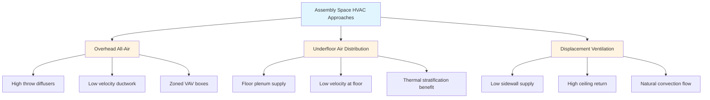
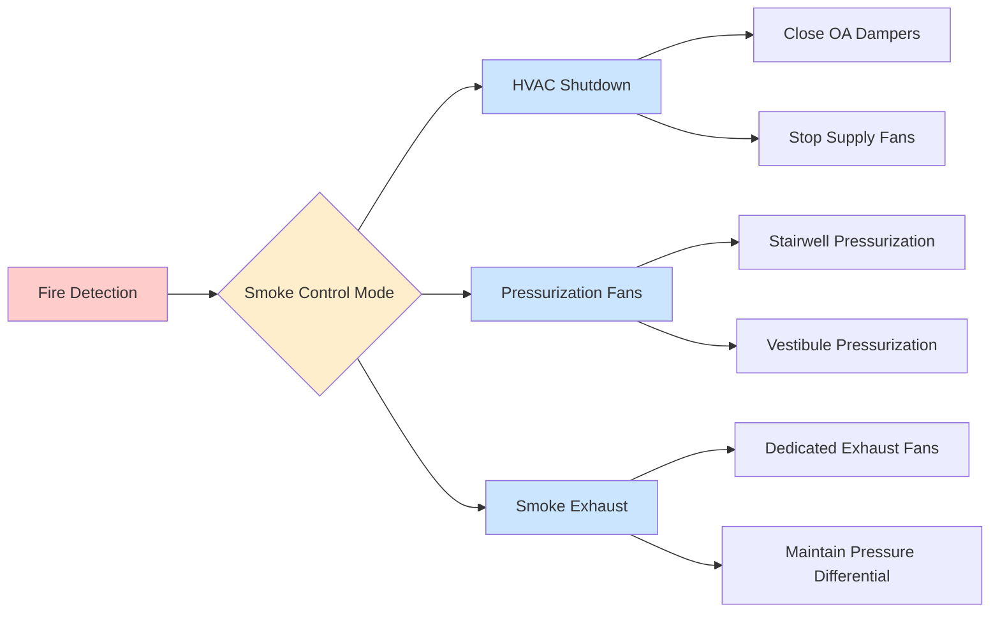

## Overview

Places of assembly present unique HVAC challenges due to high peak occupancy densities, variable usage patterns, and stringent life safety requirements. Assembly spaces—including theaters, auditoriums, convention centers, arenas, and houses of worship—require systems that address extreme thermal and ventilation loads while maintaining acceptable comfort for predominantly sedentary occupants. The fundamental challenge lies in managing metabolic heat generation from hundreds to thousands of occupants concentrated in relatively small volumes while delivering adequate ventilation without creating drafts or excessive noise.

## Occupancy Characteristics and Load Profiles

### Peak Occupant Density

Assembly spaces are defined by occupant densities that far exceed typical commercial buildings:

| Space Type | Design Density | Sensible Heat per Person | Latent Heat per Person |
|-----------|----------------|--------------------------|------------------------|
| Theater (fixed seats) | 1 person per 5-10 ft² | 245 BTU/hr | 155 BTU/hr |
| Arena (sports event) | 1 person per 10-15 ft² | 250 BTU/hr | 200 BTU/hr |
| Conference room | 1 person per 15-20 ft² | 245 BTU/hr | 155 BTU/hr |
| Dance hall | 1 person per 10-15 ft² | 305 BTU/hr | 345 BTU/hr |

The total cooling load from occupants in a 500-seat theater at full capacity:

$$Q_{total} = N \times (q_s + q_l) = 500 \times (245 + 155) = 200,000 \text{ BTU/hr} = 16.7 \text{ tons}$$

This represents the occupant load alone, excluding envelope gains, lighting, and equipment.

### Load Diversity and Temporal Variations

Unlike office buildings with relatively stable occupancy throughout business hours, assembly spaces experience dramatic load swings based on event schedules. The diversity factor—the ratio of actual coincident load to the sum of individual peak loads—significantly impacts system sizing:

$$\text{Diversity Factor} = \frac{\text{Actual Peak Load}}{\text{Sum of Individual Peaks}}$$

For a performing arts center with multiple venues, diversity factors typically range from 0.6 to 0.8, allowing for reduced central plant capacity. However, individual zone equipment must handle full local peaks.

## Ventilation Requirements per ASHRAE 62.1

### Outdoor Air Calculation

ASHRAE 62.1 establishes minimum ventilation rates for assembly spaces using the ventilation rate procedure:

$$V_{oz} = R_p \times P_z + R_a \times A_z$$

Where:
- $V_{oz}$ = outdoor air required in the breathing zone (CFM)
- $R_p$ = people outdoor air rate (CFM/person)
- $P_z$ = zone population
- $R_a$ = area outdoor air rate (CFM/ft²)
- $A_z$ = zone floor area (ft²)

### Assembly Space Classifications

| Occupancy Category | $R_p$ (CFM/person) | $R_a$ (CFM/ft²) | Notes |
|--------------------|--------------------|--------------------|-------|
| Auditorium seating | 5 | 0.06 | Fixed seats |
| Places of religious worship | 5 | 0.06 | Fixed/movable seats |
| Courtrooms | 5 | 0.06 | Spectator areas |
| Legislative chambers | 5 | 0.06 | Public seating |
| Libraries (reading areas) | 5 | 0.12 | Higher area component |
| Museums/galleries | 7.5 | 0.06 | More active occupancy |

For a 10,000 ft² auditorium with 800 seats:

$$V_{oz} = 5 \times 800 + 0.06 \times 10,000 = 4,000 + 600 = 4,600 \text{ CFM}$$

This minimum outdoor air must be maintained under all operating conditions to ensure acceptable indoor air quality.

## System Selection and Design Strategies

### Air Distribution Approaches

### Overhead All-Air Systems

The most common approach uses ceiling-mounted air handling units with high-induction diffusers to ensure adequate mixing without creating drafts in the occupied zone. Critical design parameters:

**Throw distance calculation:**

$$L = \frac{V_t}{K \times \sqrt{Q}}$$

Where:
- $L$ = throw distance to terminal velocity (ft)
- $V_t$ = terminal velocity (typically 50 FPM)
- $K$ = diffuser coefficient (manufacturer data)
- $Q$ = airflow rate (CFM)

For draft-free conditions in theaters, supply air velocity at head level (4-5 ft above floor) should not exceed 30 FPM.

### Displacement Ventilation Systems

Displacement systems supply cool air at floor level (typically 63-68°F) at very low velocities (less than 50 FPM). The supply air temperature differential drives the physics:

$$\Delta T = T_{return} - T_{supply} = 10-15°F$$

Buoyancy forces from occupant heat create upward convection currents that carry contaminants toward ceiling-mounted exhaust points. The stratification height can be estimated:

$$h_s = \frac{Q_{total}}{1.08 \times CFM \times \Delta T}$$

This approach works well for large-volume spaces with high ceilings (minimum 10-12 ft) but requires careful attention to supply air temperatures to avoid ankle-level discomfort.

## Thermal Comfort Considerations

### Sedentary Occupant Requirements

Theater and auditorium audiences remain seated for extended periods with metabolic rates around 1.0 met (58 W/m²). ASHRAE Standard 55 comfort zone boundaries must account for:

**Predicted Mean Vote (PMV) calculation inputs:**
- Metabolic rate: 1.0 met (sedentary)
- Clothing insulation: 0.5-1.0 clo (seasonal variation)
- Air velocity: less than 30 FPM preferred
- Radiant temperature asymmetry: less than 9°F vertical

The neutral temperature for sedentary occupants with 0.5 clo clothing is approximately 76°F operative temperature. However, assembly spaces often target 72-74°F to accommodate the wide range of individual preferences in high-density seating.

### Acoustic and Draft Constraints

Supply air velocity limitations in occupied zones are driven by both comfort and acoustics:

| Location | Maximum Velocity | Noise Criterion |
|----------|------------------|-----------------|
| Performance theaters | 25 FPM | NC-20 to NC-25 |
| Cinema | 30 FPM | NC-30 |
| Conference halls | 35 FPM | NC-30 to NC-35 |
| Sports arenas | 40 FPM | NC-40 |

## Life Safety and Smoke Control Integration

### Smoke Control System Coordination

Assembly occupancies typically require smoke control systems under the International Building Code for spaces with occupant loads exceeding 300 persons. The HVAC system must interface with dedicated smoke control:

### Pressurization Requirements

Stairwell and exit corridor pressurization systems must maintain minimum pressure differentials:

$$\Delta P = 0.05 \text{ to } 0.10 \text{ in. w.c. (12.5 to 25 Pa)}$$

The required fan capacity depends on leakage area and desired pressure:

$$CFM = 2610 \times A_L \times \sqrt{\Delta P}$$

Where $A_L$ is the total leakage area in ft².

## Demand-Controlled Ventilation

Assembly spaces are prime candidates for CO₂-based demand-controlled ventilation (DCV) given highly variable occupancy. The outdoor air fraction adjusts based on measured CO₂ concentration:

$$\frac{V_{ot}}{V_t} = \frac{C_s - C_o}{C_z - C_o}$$

Where:
- $V_{ot}$ = outdoor air intake flow
- $V_t$ = total supply air
- $C_s$ = supply air CO₂ concentration
- $C_o$ = outdoor air CO₂ concentration
- $C_z$ = zone CO₂ concentration (target: 1000-1200 ppm)

DCV systems can reduce ventilation energy by 40-60% during partial occupancy periods while ensuring code compliance at full occupancy.

## Design Checklist

**Critical considerations for assembly space HVAC:**
- Establish design occupancy from code-required egress calculations, not architectural program
- Calculate outdoor air requirements at peak occupancy per ASHRAE 62.1 ventilation rate procedure
- Size equipment for full peak loads; apply diversity only to central plants serving multiple zones
- Verify supply air throw distances and terminal velocities for draft-free operation
- Coordinate with fire protection for smoke control system interfaces
- Specify low-velocity ductwork (maximum 1500 FPM in occupied areas) for acoustic performance
- Design for rapid pre-cooling or pre-heating before events (2-4 hour lead time typical)
- Implement economizer controls where climate permits for pre-event conditioning with free cooling
- Consider energy recovery on large outdoor air quantities (payback typically under 3 years)

---

**File location:** `/Users/evgenygantman/Documents/github/gantmane/hvac/content/specialty-applications-testing/specialty-hvac-applications/places-of-assembly/_index.md`