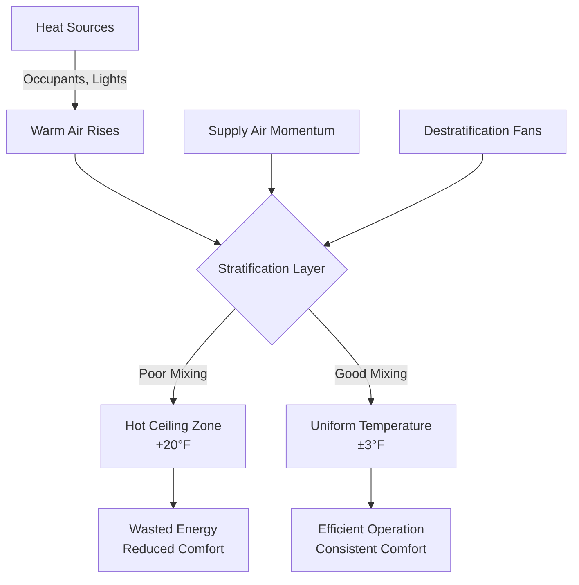
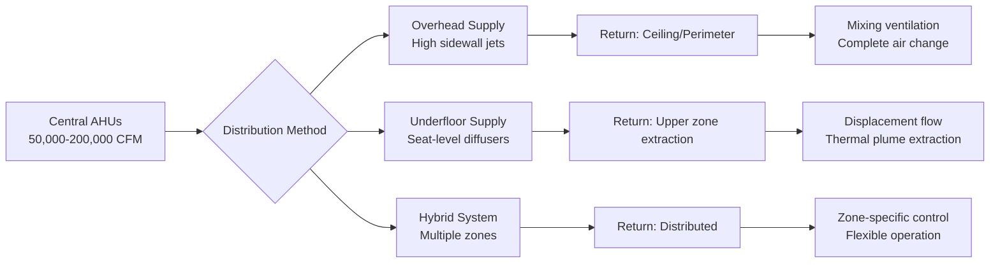
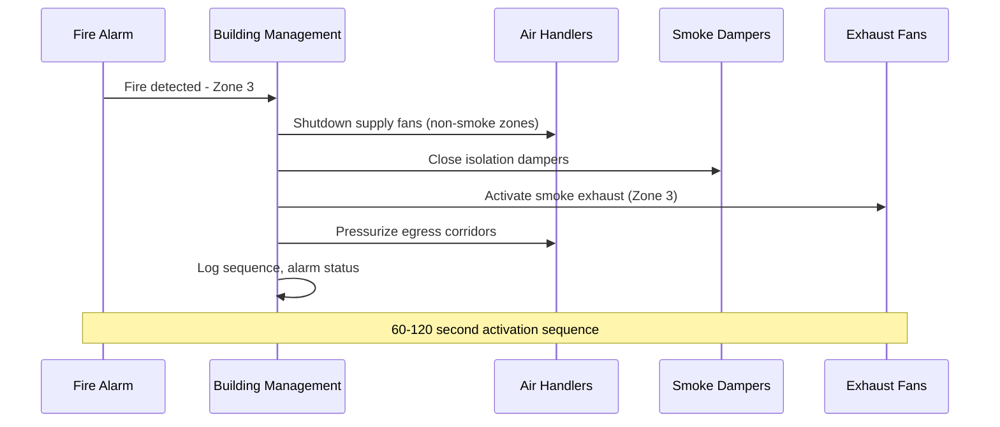

Arenas and stadiums present unique HVAC challenges due to their massive enclosed volumes, highly variable occupancy densities, and conflicting performance requirements between spectator comfort and playing surface conditions. These facilities demand specialized engineering approaches that account for thermal stratification, extreme peak loads, and life safety integration.

## Fundamental Load Characteristics

The sensible and latent cooling loads in assembly venues differ fundamentally from conventional buildings due to occupancy density and activity levels.

The peak occupant load generates heat at rates governed by metabolic activity:

$$q_{person} = q_{sensible} + q_{latent} = 250 + 200 = 450 \text{ BTU/hr per person (seated, excited)}$$

For a 20,000-seat arena at full capacity:

$$Q_{total} = 20,000 \times 450 = 9,000,000 \text{ BTU/hr} = 750 \text{ tons}$$

This calculation excludes lighting, envelope loads, and ventilation air, which typically add 40-60% additional capacity requirements.

### Indoor vs Outdoor Venue Considerations

| Parameter | Indoor Arena | Outdoor Stadium | Retractable Roof |
|-----------|--------------|-----------------|------------------|
| Envelope Load | High (glazing heat gain) | Minimal (concourses only) | Variable (position-dependent) |
| Solar Radiation | Controlled | Direct on seating | Partial exposure |
| Stratification | Critical challenge | Limited zones only | Mode-dependent control |
| Ventilation Rate | 15 CFM/person (ASHRAE 62.1) | Natural + mechanical mix | Transitional strategies |
| Design Complexity | Very high | Moderate | Extreme (dual-mode) |

## Thermal Stratification Physics

Large-volume spaces experience significant vertical temperature gradients due to buoyancy-driven flow. The stratification height depends on the heat input and volume geometry:

$$\Delta T = \frac{Q_{total}}{1.08 \times A_{floor} \times v_{mixing}}$$

Where $v_{mixing}$ represents the effective mixing velocity induced by supply air momentum. Without adequate air circulation, temperature differentials of 15-25°F between floor and ceiling zones commonly occur.

### Stratification Control Methods

1. **High-momentum supply systems**: Jet velocities of 2000-4000 FPM at discharge create mixing throughout the occupied zone
2. **Displacement ventilation**: Low-velocity (50-100 FPM) supply at floor level with ceiling extraction
3. **Destratification fans**: Large-diameter, low-speed fans (8-24 ft diameter) circulate air vertically
4. **Underfloor air distribution**: Supply through seating risers for direct occupant conditioning

## Multi-Purpose Facility Design Requirements

Modern arenas host diverse events requiring adaptable HVAC strategies. Design conditions vary dramatically:

**Ice Hockey**: Ice surface maintained at 20-24°F, air temperature 50-60°F, relative humidity 30-40% maximum to prevent fog formation.

**Basketball**: Standard comfort conditions, 72-76°F, 40-60% RH.

**Concerts**: Maximum occupancy density, latent loads increase 30-40% due to standing, dancing activities.

**Conventions**: Partial floor usage, zoning capability essential to avoid conditioning unused volume.

The psychrometric challenge during ice events requires precise dewpoint control:

$$\omega_{max} = 0.622 \times \frac{P_{sat,ice}}{P_{atm} - P_{sat,ice}}$$

At ice surface temperature of 22°F, $P_{sat} = 0.0394$ psia, yielding maximum humidity ratio of 0.0017 lb/lb to prevent condensation and fog.

## Air Distribution Strategies

### Supply Air Quantities and Turnover

For a 2,000,000 cubic foot arena volume at design occupancy:

$$CFM_{total} = \frac{Q_{sensible}}{1.08 \times \Delta T}$$

Assuming $\Delta T = 20°F$ and $Q_{sensible} = 6,000,000$ BTU/hr:

$$CFM_{total} = \frac{6,000,000}{1.08 \times 20} = 277,778 \text{ CFM}$$

This results in air changes per hour:

$$ACH = \frac{277,778 \times 60}{2,000,000} = 8.3 \text{ air changes/hr}$$

Higher ACH rates (10-15) improve mixing and reduce stratification but increase fan energy consumption.

## Code Requirements and Life Safety

Assembly occupancies fall under IBC Chapter 3 and IMC Chapter 4 requirements. Key provisions:

**Ventilation**: ASHRAE 62.1 mandates 15 CFM/person outdoor air for spectator seating areas. This requirement cannot be reduced by demand-controlled ventilation in assembly spaces.

**Smoke Control**: IBC Section 909 requires smoke control systems for Group A-1, A-2, A-3, and A-4 occupancies exceeding specific area and occupancy thresholds. Large arenas typically employ:

- Mechanical smoke exhaust at 6-8 ACH minimum
- Pressurization of exit corridors and stairs (+0.05 to +0.10 in. w.c.)
- Automatic detection and activation systems
- Compartmentation and smoke barriers

**Emergency Operation**: HVAC systems must integrate with fire alarm systems for automatic shutdown or smoke control mode activation. Supply fans serving egress paths may require continued operation under emergency power.

### Life Safety Integration Sequence

## Energy Considerations and Part-Load Operation

Arenas operate at design conditions only 10-15% of annual hours. Part-load strategies significantly impact energy consumption:

1. **Variable volume systems**: Reduce airflow proportional to occupancy and load
2. **Zoned conditioning**: Condition only occupied seating sections and event floor
3. **Thermal storage**: Ice-based or chilled water storage for peak-shaving during events
4. **Heat recovery**: Capture exhaust air energy for perimeter heating and domestic hot water

The part-load ratio (PLR) for typical arena operation:

$$PLR = \frac{\text{Actual Operating Hours at Load}}{\text{Total Operating Hours}} = \frac{400}{8760} \approx 0.046$$

This low PLR necessitates equipment staging, VFD control, and efficient unloading to avoid energy waste during non-event periods.

## Conclusion

Successful arena and stadium HVAC design requires balancing extreme peak loads, diverse event requirements, and life safety mandates while maintaining operational flexibility and energy efficiency. Engineers must apply rigorous load analysis, stratification control, and code-compliant smoke management to create environments that serve both spectator comfort and athletic performance across widely varying conditions.
