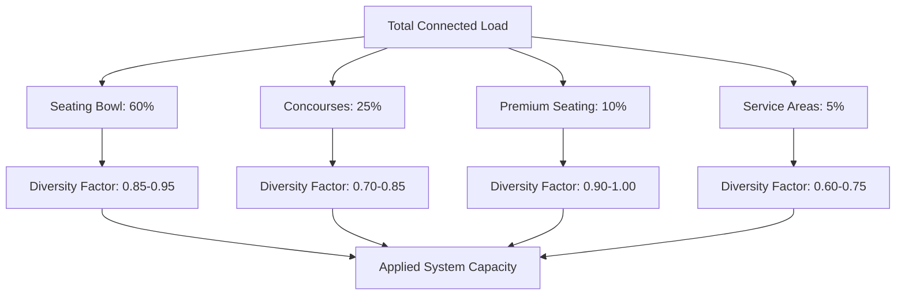

## Overview

HVAC systems for arenas and stadiums present unique capacity challenges driven by extreme occupancy density variations, rapid load transitions during arrival and departure, and massive outdoor air requirements. Unlike conventional buildings where occupancy builds gradually, these facilities experience surge conditions that can overwhelm undersized systems within minutes.

The fundamental challenge: designing for peak transient loads while maintaining operational efficiency during partial occupancy events, which represent 60-80% of annual operating hours.

## Crowd Heat Generation Fundamentals

Human heat generation follows the metabolic equation:

$$Q_{sensible} = M \cdot A_{DuBois} \cdot (1 - \eta) \cdot SHR$$

Where $M$ is metabolic rate (W/m²), $A_{DuBois}$ is body surface area (typically 1.8 m²), $\eta$ is mechanical efficiency (0 for seated spectators), and $SHR$ is sensible heat ratio.

For spectators, heat generation varies by activity level:

| Activity Level | Sensible Heat (W/person) | Latent Heat (W/person) | Total Heat (W/person) | SHR |
|----------------|-------------------------|------------------------|---------------------|-----|
| Seated, calm | 70 | 35 | 105 | 0.67 |
| Seated, moderate activity | 85 | 55 | 140 | 0.61 |
| Standing, light activity | 95 | 65 | 160 | 0.59 |
| Walking slowly | 115 | 85 | 200 | 0.58 |

Peak crowd load for a 20,000-seat arena assuming 90% sensible, 10% standing:

$$Q_{total} = (18,000 \times 140) + (2,000 \times 160) = 2,520,000 + 320,000 = 2,840,000 \text{ W} = 238 \text{ tons}$$

This represents the sustained occupant load only, not including solar, lighting, or transmission loads.

## Load Diversity Factors

Applying full design capacity for all zones simultaneously results in substantial overcapitalization. ASHRAE research demonstrates that actual peak loads exhibit significant diversity across facility zones.

Recommended diversity factors by venue size:

| Venue Capacity | Seating Bowl | Concourses | Premium Areas | Overall Plant Diversity |
|----------------|-------------|-----------|---------------|------------------------|
| 5,000-10,000 | 0.90 | 0.75 | 0.95 | 0.85 |
| 10,000-20,000 | 0.88 | 0.78 | 0.95 | 0.82 |
| 20,000-50,000 | 0.85 | 0.80 | 0.95 | 0.80 |
| 50,000-100,000 | 0.85 | 0.82 | 0.95 | 0.78 |

These factors account for:
1. Staggered zone occupancy during arrival
2. Concourse traffic patterns (not all zones peak simultaneously)
3. Partial house events
4. Equipment performance margins

## Arrival and Departure Surge Loads

The most severe transient condition occurs during pre-event arrival when outdoor air loads combine with crowd sensible and latent heat. For a 60-minute arrival window:

```mermaid
gantt
    title Thermal Load Profile - Event Day
    dateFormat HH:mm
    axisFormat %H:%M
    section Loads
    Background Load       :done, 14:00, 2h
    Arrival Surge        :active, 16:00, 1h
    Sustained Event Load :crit, 17:00, 3h
    Departure Surge      :active, 20:00, 30m
    Post-Event          :done, 20:30, 1h
```

Peak arrival load rate calculation:

$$\dot{Q}_{arrival} = \frac{N_{capacity} \times f_{arrival}}{t_{window}} \times (Q_{person} + Q_{OA,person})$$

For a 20,000-seat arena with 80% arrival over 60 minutes:

$$\dot{Q}_{arrival} = \frac{20,000 \times 0.80}{60 \text{ min}} \times (140 \text{ W} + 45 \text{ W}) = 49,333 \text{ W/min}$$

This 823 kW/min ramp rate demands systems capable of rapid capacity deployment and substantial thermal mass buffering.

## Outdoor Air Requirements for Large Assemblies

ASHRAE Standard 62.1 specifies outdoor air requirements based on occupancy category. For assembly spaces:

$$V_{OA} = R_p \times P_z + R_a \times A_z$$

Where:
- $R_p$ = 5 cfm/person (assembly occupancy)
- $P_z$ = zone population
- $R_a$ = 0.06 cfm/ft² (area component)
- $A_z$ = zone floor area

For a 20,000-seat bowl with 250,000 ft² seating area:

$$V_{OA} = (5 \times 20,000) + (0.06 \times 250,000) = 100,000 + 15,000 = 115,000 \text{ cfm}$$

This represents 45-60% of total system airflow in most designs. Outdoor air thermal load during summer design conditions (95°F DB, 75°F WB) to achieve 75°F, 50% RH:

$$Q_{OA,sensible} = 1.08 \times 115,000 \times (95 - 75) = 2,484,000 \text{ Btu/hr}$$
$$Q_{OA,latent} = 0.68 \times 115,000 \times (\omega_{outside} - \omega_{inside})$$

Using psychrometric properties: $\omega_{95/75} = 0.0136$, $\omega_{75/50} = 0.0093$:

$$Q_{OA,latent} = 0.68 \times 115,000 \times (0.0136 - 0.0093) \times 1060 = 337,000 \text{ Btu/hr}$$

Total outdoor air load: 2.82 million Btu/hr (235 tons), representing 50-70% of total cooling during peak arrival.

## Egress Ventilation Strategy

Post-event egress creates a reverse surge condition. As occupants depart, the thermal mass accumulated in seating, structure, and furnishings releases stored heat. Effective egress ventilation prevents uncomfortable post-event conditions in premium areas where guests may linger.

Design approach:

1. Maintain minimum 30% outdoor air during egress (first 30 minutes post-event)
2. Shift cooling priority to concourses and premium zones
3. Allow seating bowl temperature drift to 78-80°F
4. Deploy economizer cooling when ambient conditions permit

Economizer effectiveness during evening events (common for indoor arenas):

$$\dot{Q}_{economizer} = 1.08 \times V_{economizer} \times (T_{return} - T_{outside})$$

For 200,000 cfm economizer airflow with 78°F return and 65°F outside:

$$\dot{Q}_{economizer} = 1.08 \times 200,000 \times (78 - 65) = 2,808,000 \text{ Btu/hr} = 234 \text{ tons}$$

This free cooling substantially reduces post-event mechanical cooling demand.

## Capacity Sizing Strategy

Recommended approach for system capacity determination:

1. Calculate full occupancy loads for all zones
2. Apply zone diversity factors based on facility size
3. Add 15-20% for outdoor air load variability
4. Include 10% equipment performance margin
5. Validate against arrival surge ramp rates

For central plants serving 20,000+ seat venues, install capacity in modular increments matching 20-25% of peak load to optimize part-load efficiency during smaller events.

## Components

- 10000 To 20000 Seat Arenas
- 20000 To 50000 Seat Stadiums
- 50000 To 100000 Seat Mega Stadiums
- Occupancy Density Variation
- Standing Room Areas
- Premium Seating Requirements
- General Admission Conditioning
