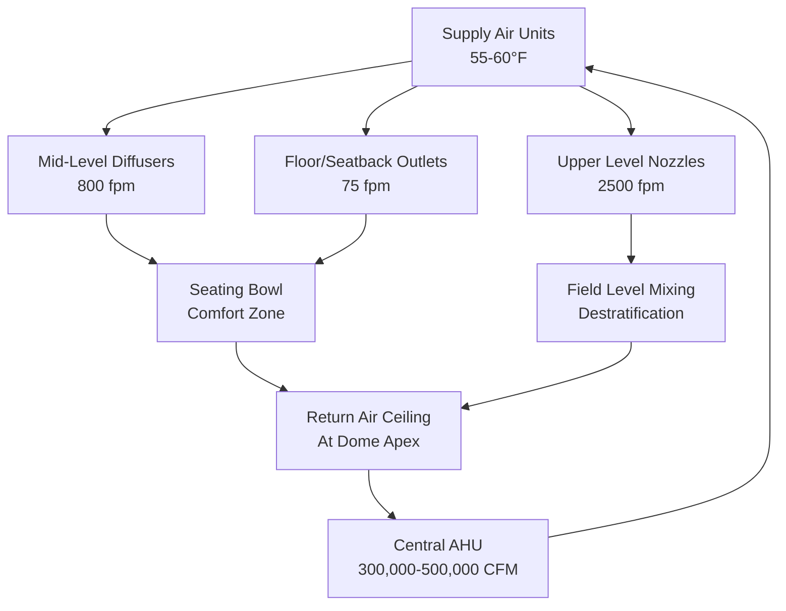

## Overview

Domed stadiums present exceptional HVAC challenges due to their massive enclosed volumes (typically 5-15 million ft³), high occupant densities (40,000-80,000 spectators), and conflicting thermal requirements between playing surfaces and seating zones. The engineering challenge centers on managing air stratification in spaces with vertical dimensions exceeding 200 feet while maintaining precise field-level conditions for natural turf or athlete performance alongside acceptable comfort in spectator zones spanning multiple levels.

## Thermal Load Characteristics

### Volume and Stratification Effects

The fundamental challenge in domed stadium HVAC stems from buoyancy-driven stratification. Temperature differentials create density gradients described by:

$$\frac{dP}{dz} = -\rho g$$

where vertical pressure variation drives warm air accumulation at the dome apex. For a 250-foot high space with a 15°F temperature differential, the theoretical neutral pressure plane sits at approximately 125 feet, placing occupied seating zones in negative pressure relative to field level.

Stratification severity depends on the Richardson number:

$$Ri = \frac{g \beta \Delta T H}{U^2}$$

where $\beta$ is thermal expansion coefficient, $\Delta T$ is vertical temperature difference, $H$ is characteristic height, and $U$ is characteristic velocity. Values of $Ri > 10$ indicate buoyancy-dominated flow requiring active destratification.

### Solar Load Through Translucent Roofs

Modern domed stadiums increasingly utilize translucent roof materials (ETFE, polycarbonate panels) for natural lighting. Solar heat gain becomes substantial:

$$Q_{solar} = A_{roof} \cdot SHGC \cdot I_{solar} \cdot CLF$$

For a 200,000 ft² roof with SHGC = 0.45 and peak insolation of 300 BTU/hr·ft², instantaneous solar gains exceed 27 million BTU/hr. The cooling load factor (CLF) accounts for thermal mass effects, but peak loads during afternoon events dictate system sizing.

| Roof Type | SHGC | Visible Transmittance | Peak Load Impact |
|-----------|------|----------------------|------------------|
| ETFE Single Layer | 0.85 | 0.90 | 340 BTU/hr·ft² |
| ETFE Triple Layer | 0.45 | 0.75 | 180 BTU/hr·ft² |
| Translucent Panels | 0.35 | 0.50 | 140 BTU/hr·ft² |
| Opaque Insulated | 0.05 | 0.00 | 20 BTU/hr·ft² |

### Occupancy Loads

Peak occupancy generates sensible and latent loads:

- Sensible: 250 BTU/hr per person (light activity, seating)
- Latent: 200 BTU/hr per person
- Total: 450 BTU/hr per person

For 60,000 occupants, total metabolic load reaches 27 million BTU/hr, comparable to solar gains. Localized load densities in lower bowl seating (0.5-0.7 persons/ft² of floor area) create hotspots requiring supplemental conditioning.

## Air Distribution Strategies

### Field-Level Conditioning Requirements

Natural turf systems in enclosed stadiums demand precise environmental control:

- **Temperature**: 60-75°F at turf canopy height
- **Relative Humidity**: 50-60% (prevents disease, maintains playability)
- **Air Velocity**: <200 fpm (prevents excessive moisture loss)
- **Photosynthetically Active Radiation**: 400-700 μmol/m²·s (supplemental lighting)

The energy balance at the turf surface:

$$Q_{net} = Q_{solar} + Q_{lights} - Q_{evap} - Q_{conv} - Q_{rad}$$

Evapotranspiration cooling from actively growing turf can exceed 100 BTU/hr·ft² of field area, creating a thermal sink requiring 10-15 million BTU/hr heating offset during events.

### Displacement Ventilation for Spectator Zones

Low-velocity displacement systems leverage thermal buoyancy. Supply air delivered at 65-68°F through floor-level or seatback diffusers creates a cool zone in the occupied lower 8-10 feet:

$$Q_{zone} = \dot{m} c_p (T_{exhaust} - T_{supply})$$

Typical design parameters:
- Supply velocity: 50-100 fpm
- Temperature differential: 5-8°F below space temperature
- Air change rate: 0.8-1.2 ACH for occupied zones

This approach reduces fan energy by 30-40% compared to traditional overhead mixing while improving thermal comfort through reduced air motion and vertical temperature gradients aligned with occupancy.

### Overhead Mixing for Destratification

High-momentum jets from upper-level locations combat stratification. Nozzle-type diffusers with throw distances of 150-200 feet deliver air with initial velocities of 2,000-3,000 fpm. The Archimedes number governs jet trajectory:

$$Ar = \frac{g \beta \Delta T D}{U_o^2}$$

where $D$ is nozzle diameter and $U_o$ is discharge velocity. Maintaining $Ar < 0.01$ ensures jet penetration to field level before buoyant rise dominates.

## System Design Approach

### Zoning and Capacity

Domed stadiums require multiple HVAC zones:

| Zone | Area | Design Conditions | Supply CFM/Person |
|------|------|------------------|-------------------|
| Playing Field | 80,000 ft² | 68-72°F, 55% RH | N/A (area-based) |
| Lower Bowl Seating | 25,000 seats | 72-76°F, 45-55% RH | 15-20 CFM |
| Upper Bowl Seating | 35,000 seats | 70-74°F, 45-55% RH | 12-18 CFM |
| Luxury Suites | 80 suites | 70-75°F, individual control | 25-30 CFM |
| Concourses | 150,000 ft² | 74-78°F, 50% RH | 0.5 CFM/ft² |
| Press/Broadcast | 15,000 ft² | 70-72°F, equipment loads | 1.5 CFM/ft² |

Total system capacity typically ranges from 8,000-12,000 tons of refrigeration, with central plants utilizing chilled water distribution (40-45°F supply, 54-58°F return).

### Ventilation Per ASHRAE 62.1

Outdoor air requirements follow occupancy categories:
- **Spectator areas**: 7.5 CFM/person (0.06 CFM/ft² + occupant component)
- **Playing field**: 0.3 CFM/ft²
- **Luxury suites**: 5 CFM/person + 0.06 CFM/ft²

For 60,000 occupants plus ancillary spaces, minimum outdoor air approaches 500,000 CFM. Demand-controlled ventilation using CO₂ sensors (setpoint 1,000-1,200 ppm) reduces energy consumption during partial occupancy events.

### Equipment Sizing and Redundancy

Critical systems require N+1 redundancy:
- Central chillers: 4 × 2,500 tons (25% redundancy)
- Air handling units: Multiple units per zone (failure of one unit reduces capacity 20-30%)
- Pumps: Duplex or triplex arrangements with VFD control

Fan energy dominates operational costs. Variable volume systems with inlet guide vanes or VFDs reduce annual energy by 40-50% compared to constant volume operation.

## Operational Considerations

### Pre-Cooling and Thermal Mass

Stadium mass (concrete, steel) provides thermal storage. Pre-cooling 12-24 hours before events reduces peak mechanical load by 15-25%. The effective thermal capacitance:

$$C_{eff} = \sum m_i c_{p,i}$$

For typical construction, effective capacitance reaches 50-100 BTU/°F per ft² of floor area, storing 5-10 million BTU with 2°F temperature depression.

### Event-Mode vs. Maintenance-Mode

Operating profiles differ dramatically:
- **Event mode**: Full capacity, maximum outdoor air, spectator comfort priority
- **Maintenance mode**: Reduced capacity (20-30%), field conditioning priority, minimal outdoor air
- **Setup/Breakdown**: Intermediate capacity, moderate outdoor air

Energy management systems transition between modes based on schedules and real-time occupancy sensing.

## Conclusion

Domed stadium HVAC design demands integration of large-volume air distribution physics, multi-zone thermal management, and operational flexibility. Success requires computational fluid dynamics modeling to predict stratification patterns, careful attention to throw and momentum characteristics of high-level diffusers, and recognition that field conditioning and spectator comfort represent fundamentally different thermal environments within a single enclosure.
