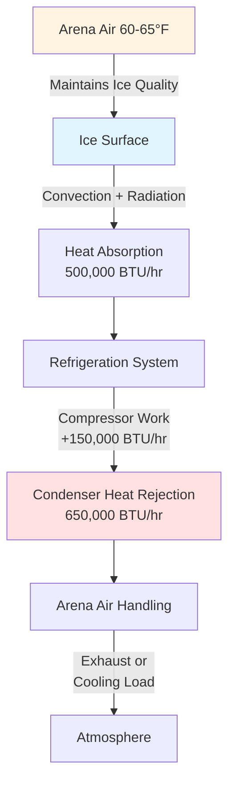

## Event Load Fundamentals

Arena HVAC systems must accommodate dramatically different thermal profiles across event types. The load spectrum ranges from ice hockey requiring sub-freezing ice surfaces (15-24°F) with refrigeration heat rejection, to high-density concerts generating 70-90 BTU/hr per occupant with massive stage lighting loads exceeding 500,000 BTU/hr.

The fundamental challenge lies in the temporal variability of loads. A venue hosting hockey on Friday evening and a concert Saturday night experiences a load swing of 4-6 million BTU/hr in under 24 hours.

## Ice Rink Thermal Dynamics

### Ice Sheet Heat Balance

The ice surface represents a massive sensible cooling load that paradoxically increases the building's total cooling requirement. The heat flux into ice follows:

$$q_{ice} = \frac{k \cdot A \cdot (T_{air} - T_{ice})}{z} + h_{conv} \cdot A \cdot (T_{air} - T_{ice}) + \alpha \cdot A \cdot q_{rad}$$

Where:
- $k$ = concrete slab thermal conductivity (12-15 BTU·in/hr·ft²·°F)
- $z$ = slab thickness above refrigerant pipes (typically 1.5-2.5 inches)
- $h_{conv}$ = convective heat transfer coefficient (0.8-1.5 BTU/hr·ft²·°F)
- $\alpha$ = ice surface absorptivity (0.05-0.10 for clean ice)
- $q_{rad}$ = incident radiation from lighting and structure

### Refrigeration Heat Rejection Impact

Ice rink refrigeration systems reject 1.2-1.4 times the heat absorbed by the ice surface due to compressor work. For a standard 17,000 ft² NHL rink:

- Ice absorption: 450,000-650,000 BTU/hr
- Condenser rejection: 600,000-850,000 BTU/hr

This rejected heat must be managed by the arena HVAC system, typically through dedicated condenser air systems or evaporative condensers with exhaust.

### Arena Air Temperature Strategies

Ice events require arena air temperatures of 60-65°F with relative humidity below 50% to prevent fog formation and minimize ice surface heat load. The dewpoint must remain below 45°F to avoid condensation on the ice during rapid air movement.

## Basketball and Indoor Court Loads

Basketball configuration eliminates the ice cooling sink and introduces a insulated floor system over the concrete slab. Key thermal differences:

| Parameter | Ice Hockey | Basketball | Delta |
|-----------|-----------|------------|-------|
| Ice/Floor Surface Temp | 20°F | 72°F | +52°F |
| Arena Air Temp | 62°F | 72-75°F | +12°F |
| Refrigeration Heat Rejection | 650,000 BTU/hr | 0 | -650,000 BTU/hr |
| Floor Heat Capacity Effect | Heat sink | Insulated neutral | +300,000 BTU/hr swing |
| Occupant Density | 17,000-19,000 | 17,000-19,000 | Neutral |

The net effect: basketball events require 350,000-450,000 BTU/hr less cooling than ice hockey despite higher air temperatures, due to elimination of refrigeration heat rejection.

## Concert Lighting and Stage Loads

Concert configurations introduce the highest sensible loads in arena applications.

### Stage Lighting Heat Emission

Modern concert lighting arrays consist of:

1. **Moving head fixtures**: 575W-1200W per unit, 50-200 units
2. **LED wash arrays**: 300W-500W per unit, 100-300 units
3. **Follow spots**: 1200W-2500W per unit, 4-8 units
4. **Video walls**: 150-250 W/m², 50-200 m²

Total connected lighting load: 200-400 kW (680,000-1,365,000 BTU/hr)

Actual heat emission accounts for luminous efficacy:

$$Q_{lighting} = P_{connected} \times 3.412 \times \eta_{heat}$$

Where $\eta_{heat}$ = 0.70-0.85 for LED systems (15-30% energy converts to light, remainder to heat).

For a major concert: $Q_{lighting}$ = 350 kW × 3.412 × 0.80 = 956,000 BTU/hr

### Sound System and Production Loads

- Audio amplification: 50-150 kW (170,000-510,000 BTU/hr)
- Video production: 30-80 kW (100,000-270,000 BTU/hr)
- Pyrotechnics/effects: Variable, instantaneous loads 2-5 million BTU/hr (brief duration)

## Occupant Load Density Variations

ASHRAE Fundamentals Chapter 18 provides occupant heat gain values, but arena applications require event-specific adjustments:

| Event Type | Occupancy Rate | Activity Level | Sensible Load (BTU/hr·person) | Latent Load (BTU/hr·person) |
|------------|---------------|----------------|-------------------------------|----------------------------|
| Ice Hockey | 85-95% | Moderate (cheering) | 250-280 | 180-220 |
| Basketball | 90-98% | High (intense cheering) | 280-320 | 220-270 |
| Concert (seated) | 95-100% | Moderate-High | 270-300 | 200-240 |
| Concert (floor GA) | 100-120% | Very High (dancing) | 320-380 | 270-330 |

For a 18,000-seat arena at full basketball capacity:

$$Q_{occupants} = N \times (q_{sensible} + q_{latent}) = 18,000 \times (300 + 245) = 9,810,000 \text{ BTU/hr}$$

## Rapid Changeover Thermal Management

### Ice-to-Basketball Conversion

Timeline: 12-18 hours for complete thermal stabilization

```mermaid
gantt
    title Ice-to-Basketball Thermal Transition
    dateFormat HH:mm
    axisFormat %H:%M

    section Ice Surface
    Ice maintained 20°F           :done, ice1, 00:00, 2h
    Insulated floor installation  :active, floor1, 02:00, 4h
    Floor warming to 68-72°F      :floor2, 06:00, 8h

    section Arena Air
    60°F maintenance              :done, air1, 00:00, 4h
    Gradual warming 60→72°F       :active, air2, 04:00, 8h
    72°F stabilization            :air3, 12:00, 2h

    section HVAC Mode
    Ice event cooling             :done, hvac1, 00:00, 2h
    Reduced cooling transition    :active, hvac2, 02:00, 6h
    Heating mode for floor        :hvac3, 08:00, 4h
    Standard comfort cooling      :hvac4, 12:00, 2h
```

### Pre-Event Conditioning Strategies

**Ice Events (from basketball configuration):**
- T-24h: Begin floor removal, expose concrete slab (72°F)
- T-20h: Activate ice refrigeration system, begin slab cooldown
- T-16h: Arena air temperature reduction 72°F → 62°F at 0.5-0.8°F/hr
- T-12h: Ice resurfacing begins when slab reaches 18-22°F
- T-8h: First ice layer complete (0.5 inches), continue buildup
- T-4h: Final ice thickness 1.0-1.25 inches, painting if required
- T-2h: Arena stabilized at 60-62°F, RH 40-48%

**Concert Events (from any configuration):**
- T-12h: Floor installation complete if required
- T-10h: Arena pre-cooling to 68-70°F (anticipate crowd and lighting loads)
- T-6h: Stage lighting system powered for thermal stabilization
- T-4h: Full HVAC capacity available, monitor equipment zones
- T-2h: Arena temperature 69-71°F, allowing 2-3°F rise during event

## Load Calculation Summary

Total arena cooling load by event type (18,000-seat venue):

| Load Component | Ice Hockey | Basketball | Concert |
|----------------|-----------|------------|---------|
| Occupants | 8.5 MMBtu/hr | 9.8 MMBtu/hr | 10.5 MMBtu/hr |
| Lighting (arena) | 0.8 MMBtu/hr | 1.2 MMBtu/hr | 0.6 MMBtu/hr |
| Lighting (stage/ice) | 0.3 MMBtu/hr | 0.0 MMBtu/hr | 1.0 MMBtu/hr |
| Refrigeration rejection | 0.7 MMBtu/hr | 0.0 MMBtu/hr | 0.0 MMBtu/hr |
| Sound/production | 0.1 MMBtu/hr | 0.2 MMBtu/hr | 0.8 MMBtu/hr |
| Envelope/infiltration | 0.5 MMBtu/hr | 0.6 MMBtu/hr | 0.6 MMBtu/hr |
| **Total Peak Load** | **10.9 MMBtu/hr** | **11.8 MMBtu/hr** | **13.5 MMBtu/hr** |

Peak load diversity factor: 1.24 (concert vs. ice hockey)

ASHRAE Standard 90.1 requires that systems serving these facilities account for load diversity through variable volume air systems, staging of equipment, and thermal energy storage where economically justified.

## Design Recommendations

1. **Size central plant for concert configuration** (13-14 MMBtu/hr cooling) with equipment staging for efficient ice event operation
2. **Separate refrigeration condenser heat** from main arena HVAC to avoid load coupling
3. **Install floor-level air distribution** for ice events to maintain stratification and reduce heating load to upper seating
4. **Provide dedicated stage/production cooling** with 150-200 CFM/kW of connected load
5. **Design for 0.5-0.8°F/hr controlled temperature ramp rates** during event transitions to prevent structural condensation

The key to successful multi-use arena HVAC design lies in understanding the physics of each event type's thermal signature and providing flexible, staged systems capable of efficient operation across the full load spectrum.
