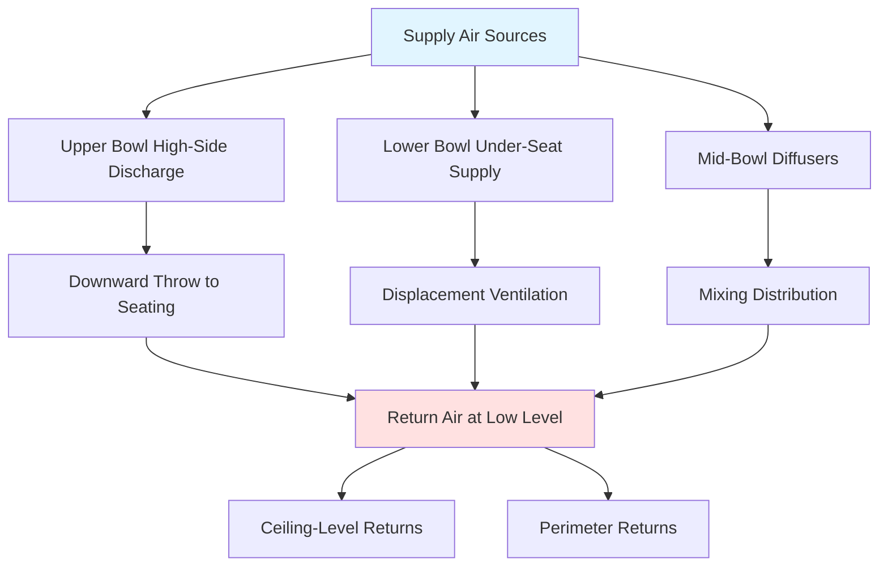
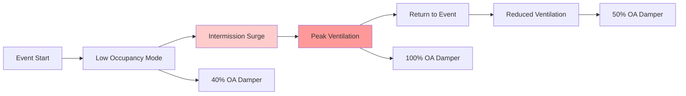

## Overview

Indoor arenas present unique HVAC challenges due to large open volumes, high and variable occupancy densities, diverse use patterns, and strict comfort requirements across multiple zones. A 15,000-seat arena typically encompasses 2-4 million cubic feet of conditioned space with peak cooling loads exceeding 500 tons. The system must accommodate basketball games, hockey events, concerts, conventions, and other activities—each with distinct thermal and ventilation requirements.

## Thermal Load Characteristics

Indoor arena cooling loads differ significantly from conventional buildings due to occupancy-driven sensible and latent heat gains.

### Spectator Heat Generation

Each spectator generates approximately 400-450 Btu/h total heat, split between sensible and latent components based on activity and excitement level. For a 15,000-seat arena at 90% occupancy:

$$Q_{total} = N \times q_{person} \times OF = 15000 \times 425 \times 0.90 = 5,740,000 \text{ Btu/h}$$

where $N$ is seating capacity, $q_{person}$ is heat gain per person, and $OF$ is occupancy factor.

The sensible heat ratio (SHR) varies by event type:

| Event Type | Typical SHR | Sensible Load | Latent Load |
|------------|-------------|---------------|-------------|
| Basketball/Hockey | 0.65-0.70 | 3,730 kBtu/h | 2,010 kBtu/h |
| Concert (high energy) | 0.55-0.60 | 3,155 kBtu/h | 2,585 kBtu/h |
| Convention/Trade Show | 0.70-0.75 | 4,020 kBtu/h | 1,720 kBtu/h |

### Lighting and Equipment Loads

Arena lighting systems contribute 50,000-150,000 watts depending on event requirements. Sports broadcasts require 150-200 footcandles at playing surface level, translating to approximately 1.5-2.0 watts per square foot of bowl area. For a 200,000 sf bowl:

$$Q_{lights} = 200,000 \text{ sf} \times 1.75 \frac{W}{sf} \times 3.412 \frac{Btu/h}{W} = 1,194,000 \text{ Btu/h}$$

Scoreboards, sound systems, and video displays add 100-300 kW of heat to the space.

## Spectator Bowl Air Distribution

The spectator bowl requires uniform air distribution to maintain comfort across all seating tiers while managing the large vertical temperature gradient inherent in high-bay spaces.

### Stratification Control

Temperature stratification in arena bowls follows the buoyancy-driven relationship:

$$\frac{dT}{dz} = \frac{g}{c_p T} \left(1 - \frac{1}{\gamma}\right) \approx 5.4°F \text{ per 100 ft}$$

for an adiabatic atmosphere, where $g$ is gravitational acceleration, $c_p$ is specific heat, $T$ is absolute temperature, and $\gamma$ is the ratio of specific heats.

Active mechanical ventilation must counteract this natural stratification. ASHRAE Standard 62.1 requires 7.5 cfm per person for arenas, translating to 112,500 cfm for our 15,000-seat example at full occupancy. However, thermal load management typically drives higher airflow rates of 10-15 cfm per person.

### Distribution Strategies

**High-side discharge systems** supply air from the upper bowl perimeter with high-velocity jets (1,500-2,500 fpm) that entrain room air and deliver mixed air to seating areas. The throw distance must satisfy:

$$L = K \times \frac{V_0 \times D_0}{\sqrt{\Delta T}}$$

where $L$ is throw distance (ft), $V_0$ is discharge velocity (fpm), $D_0$ is effective diameter (ft), $\Delta T$ is temperature difference (°F), and $K$ is an empirical constant (typically 25-35).

**Under-seat displacement** supplies low-velocity (50-100 fpm) air at 63-65°F directly to the occupied zone. Contaminated warm air rises by natural convection, extracted at ceiling level. This approach provides excellent ventilation effectiveness (1.2-1.4 vs. 1.0 for mixing) but requires larger air volume for equivalent cooling.

## Premium Seating Climate Control

Luxury suites and club seats demand superior comfort control compared to general admission seating.

### Suite-Level Conditioning

Each suite typically includes individual temperature control with dedicated VAV boxes or fan coil units. Design parameters:

| Parameter | General Seating | Premium Suites |
|-----------|-----------------|----------------|
| Temperature Range | 68-72°F | 70-74°F (adjustable) |
| Ventilation Rate | 7.5 cfm/person | 10-15 cfm/person |
| Air Changes | 6-8 ACH | 8-12 ACH |
| Background Noise | NC-45 to NC-50 | NC-35 to NC-40 |

Suite conditioning often employs four-pipe fan coil systems allowing simultaneous heating and cooling across different suites during shoulder seasons. Each suite's load varies with occupancy, glass exposure, and activity:

$$Q_{suite} = Q_{glass} + Q_{people} + Q_{lights} + Q_{equipment} + Q_{ventilation}$$

For a typical 12-person suite with 100 sf of west-facing glass:

$$Q_{glass} = A \times SHGC \times SC \times CLF = 100 \times 180 \times 0.40 \times 0.85 = 6,120 \text{ Btu/h}$$

## Concourse Ventilation

Concourses experience high-density transient occupancy during intermissions and entry/exit periods, with peak densities reaching 10-15 sf per person.

### Demand-Based Ventilation

CO₂-based demand control ventilation optimizes concourse conditioning during variable occupancy events. The required outdoor air follows:

$$V_{OA} = \frac{N \times G \times 10^6}{C_s - C_{OA}}$$

where $V_{OA}$ is outdoor air (cfm), $N$ is occupants, $G$ is CO₂ generation (0.0052 cfm/person), $C_s$ is space setpoint (typically 1,000 ppm), and $C_{OA}$ is outdoor CO₂ concentration (400 ppm).

Concourse systems must respond rapidly to occupancy changes. A well-designed system achieves setpoint within 15-20 minutes of peak occupancy:

## Loading Dock and Back-of-House Pressurization

Loading docks require negative pressure relative to occupied spaces to prevent exhaust gas and odor migration. Effective pressure control maintains 0.02-0.05 inches w.c. differential:

$$\Delta P = \frac{\rho V^2}{2g_c} + \frac{f L \rho V^2}{2 g_c D}$$

Overhead air curtains at dock doors minimize infiltration during loading operations. A typical dock door requires 2,000-3,000 cfm per linear foot of opening width at 1,500-2,000 fpm discharge velocity.

Equipment rooms, particularly those housing refrigeration machinery and electrical transformers, demand robust cooling independent of arena event schedules. Design for continuous operation at peak outdoor conditions with 100% redundancy for critical cooling systems.

## System Integration and Control

Arena HVAC systems employ building automation with event-based scheduling, load anticipation algorithms, and zone-level feedback control. Pre-cooling strategies begin 4-6 hours before events, pulling space temperature 2-4°F below setpoint to offset initial load surge. Integration with ticketing systems enables predictive load calculation and optimized system staging.

---

**References**: ASHRAE Handbook—HVAC Applications, Chapter 5 (Places of Assembly); ASHRAE Standard 62.1 (Ventilation for Acceptable Indoor Air Quality); ASHRAE Standard 55 (Thermal Environmental Conditions for Human Occupancy)

## Components

- Basketball Arena Hvac
- Hockey Arena Ice Rink
- Concert Venue Flexible
- Multi Purpose Arena Design
- Seating Capacity 5000 To 20000
- Bowl Seating Configuration
- Suite Level Hvac
- Concourse Air Distribution
- Locker Room Ventilation
- Equipment Room Cooling
