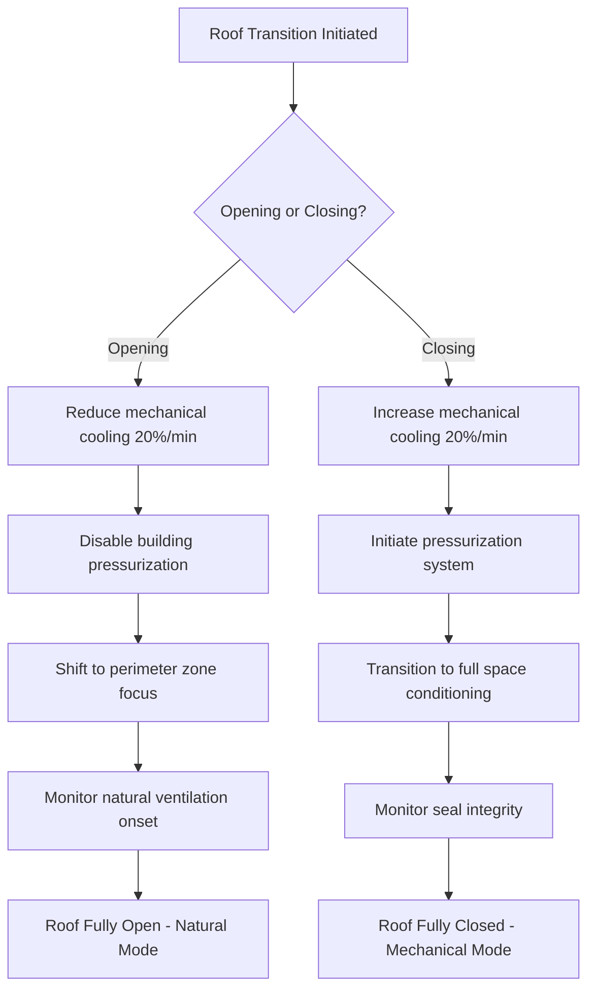
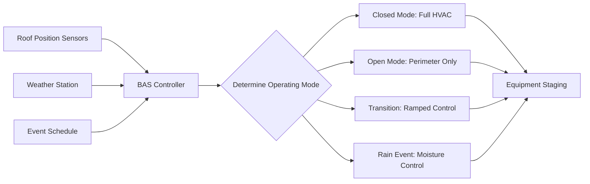

Retractable roof stadiums present unique HVAC challenges due to the fundamental transformation between enclosed and open-air conditions. The system must accommodate two distinct operating modes with vastly different heat loads, ventilation requirements, and pressurization strategies while managing rapid transitions between states.

## Dual Operating Mode Fundamentals

The thermodynamic conditions shift dramatically between roof states. With the roof closed, the stadium functions as a conventional enclosed space requiring mechanical conditioning and pressurization. When open, the structure becomes a semi-outdoor venue where natural ventilation dominates and mechanical systems supplement rather than control conditions.

**Closed Roof Mode:**
- Full mechanical cooling and heating
- Building pressurization at 0.02-0.05 in. w.g.
- Infiltration minimized through positive pressure
- Complete moisture control capability
- Peak cooling loads 8,000-15,000 tons depending on capacity

**Open Roof Mode:**
- Natural ventilation through roof aperture
- Perimeter cooling for occupied zones
- No building pressurization
- Moisture control limited to direct removal
- Mechanical load reduced 60-80%

The transition between modes creates a third operational state where the system must respond to changing boundary conditions while maintaining acceptable comfort levels for spectators already seated.

## Load Calculation for Dual Modes

System sizing must accommodate both extremes. The sensible heat gain with roof closed follows standard enclosed assembly calculations:

$$Q_{sensible} = Q_{lights} + Q_{occupants} + Q_{solar} + Q_{transmission} + Q_{equipment}$$

For a 50,000 seat stadium with roof closed:
- Occupant sensible: $50,000 \times 250 \text{ Btu/hr} = 12,500,000 \text{ Btu/hr}$
- Lighting (200W/seat): $50,000 \times 682 \text{ Btu/hr} = 34,100,000 \text{ Btu/hr}$
- Solar through translucent roof: $150,000 \text{ ft}^2 \times 40 \text{ Btu/hr·ft}^2 = 6,000,000 \text{ Btu/hr}$
- Transmission and equipment: ~8,000,000 Btu/hr
- Total: ~60,600,000 Btu/hr (5,050 tons)

With roof open, direct solar gain on seating and field increases while transmission through the building envelope decreases substantially. The mechanical system must still condition perimeter zones but relies on natural ventilation for bulk air movement.

The ratio of closed-to-open mode capacity typically ranges from 2.5:1 to 4:1 depending on climate and roof design.

## Pressurization Strategy When Closed

Maintaining positive building pressure prevents infiltration and controls moisture entry. The pressure differential across the building envelope drives infiltration flow:

$$Q_{infiltration} = A \times C \times \sqrt{\Delta P}$$

Where $A$ is the leakage area, $C$ is the flow coefficient, and $\Delta P$ is the pressure differential.

For retractable roof stadiums, target pressure differential of 0.02-0.05 in. w.g. relative to outdoors provides adequate infiltration control without excessive mechanical roof stress. The roof seal system must accommodate this pressure while allowing smooth operation during transitions.

Supply air quantity for pressurization exceeds exhaust by 15-25% to create the positive pressure field. ASHRAE Standard 62.1 ventilation requirements still apply, typically demanding 7.5 cfm per person for assembly spaces:

$$V_{oa} = 50,000 \times 7.5 = 375,000 \text{ cfm minimum}$$

The pressurization airflow adds to this base requirement.

## Natural Ventilation with Roof Open

When the roof opens, the stadium becomes a naturally ventilated structure with significant stack effect and wind-driven flows. The volumetric flow rate from thermal buoyancy:

$$Q = C_d A \sqrt{2g\Delta H \frac{\Delta T}{T_i}}$$

Where:
- $C_d$ = discharge coefficient (0.6-0.65)
- $A$ = effective opening area
- $g$ = gravitational acceleration
- $\Delta H$ = height between inlet and outlet
- $\Delta T$ = indoor-outdoor temperature difference
- $T_i$ = indoor absolute temperature

For a stadium with effective roof opening of 100,000 ft² and height differential of 150 ft, stack flow can exceed 3,000,000 cfm with a 10°F temperature difference. This natural ventilation overwhelms mechanical systems, making control of interior conditions impossible.

The mechanical system shifts to perimeter zone conditioning, focusing on occupied seating areas rather than bulk space control. Displacement ventilation from low sidewall diffusers provides localized cooling while warm air exhausts naturally through the roof opening.

## Transition Period Conditioning

The roof transition period (typically 10-20 minutes) creates dynamic boundary conditions. As the roof opens or closes, the effective building volume, solar gains, and ventilation pathways change continuously.

The control sequence must ramp mechanical capacity to match the changing load profile. A linear ramp from open to closed mode capacity over the transition period prevents system hunting and maintains comfort:

$$Q_{transition}(t) = Q_{open} + \frac{Q_{closed} - Q_{open}}{t_{transition}} \times t$$

Temperature excursions of 2-4°F during transition are typical and generally acceptable for spectator comfort.

## Moisture Control During Rain Delays

Rain events with roof partially or fully open introduce direct water and moisture loads. The moisture removal requirement combines evaporation from wet surfaces and direct rainfall entry:

$$\dot{m}_{moisture} = \dot{m}_{rain} + \dot{m}_{evaporation}$$

For intense rainfall (2 in/hr) over a 50,000 ft² field:
- Direct rain mass flow: $50,000 \times \frac{2}{12} \times 62.4 = 520,000 \text{ lb/hr}$

If the roof closes during rain, this water evaporates into the space. Evaporating even 10% of captured water (52,000 lb/hr) requires enormous dehumidification:

$$Q_{latent} = \dot{m} \times h_{fg} = 52,000 \times 1,060 = 55,120,000 \text{ Btu/hr}$$

This latent load (4,600 tons at latent only) exceeds typical dehumidification capacity. Strategies include:

1. **Drain before closing:** Ensure field drainage removes standing water before roof closure
2. **High ventilation rate initially:** Exhaust moisture-laden air rather than conditioning it
3. **Gradual cooling:** Allow space temperature to rise temporarily, increasing air moisture capacity
4. **Supplemental dehumidification:** Dedicated systems for moisture removal post-event

## System Sizing Methodology

The dual-mode requirement drives equipment selection toward modular, staged capacity systems.

| Operating Mode | Cooling Capacity | Ventilation Strategy | Pressurization | Control Focus |
|----------------|------------------|----------------------|----------------|---------------|
| Roof Closed | 100% (8,000-15,000 tons) | Mechanical supply/return | 0.02-0.05 in. w.g. | Bulk space temperature/RH |
| Transition | 40-100% ramped | Mixed mechanical/natural | Ramping to zero | Zone temperatures |
| Roof Open | 20-40% | Natural + perimeter mechanical | None | Perimeter zones only |
| Rain Recovery | 100% + dehumidification | High ventilation exhaust | Variable | Moisture removal |

Equipment staging should provide at least 4-6 steps to allow smooth modulation during transitions. Variable frequency drives on supply and return fans enable precise airflow control as boundary conditions change.

**Recommended Configuration:**
- Central plant with multiple chillers (25% capacity each minimum)
- Distributed air handling units for zone control
- Separate perimeter and bulk space systems
- Dedicated dehumidification units for moisture events
- VFD-controlled supply/exhaust fans

The air distribution system must handle the full closed-roof load while allowing perimeter-only operation when open. Separate duct systems for perimeter and upper-bowl zones enable independent control.

## Control Integration Requirements

The building automation system must interface with roof position sensors, weather stations, and event scheduling systems to anticipate mode changes.

Weather prediction algorithms should initiate pre-cooling before roof closure during hot conditions, using the building mass as thermal storage to reduce peak demand during transition.

ASHRAE Standard 90.1 energy efficiency requirements apply to the mechanical systems, but economizer requirements may be waived when the roof provides direct free cooling through natural ventilation. Demonstrating equivalent or superior energy performance through integrated design earns compliance.

The unique dual-mode operation of retractable roof stadiums demands flexible, modular HVAC systems capable of responding to rapid boundary condition changes while maintaining spectator comfort across all operating states. Proper system sizing must accommodate the closed-roof peak while allowing efficient part-load operation during open-roof events.
