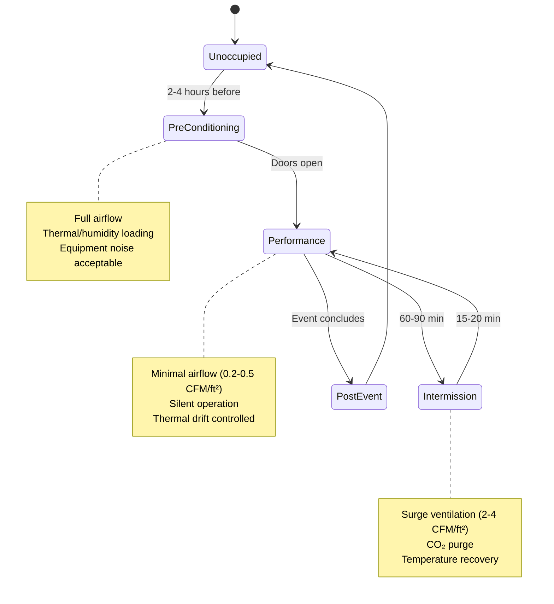
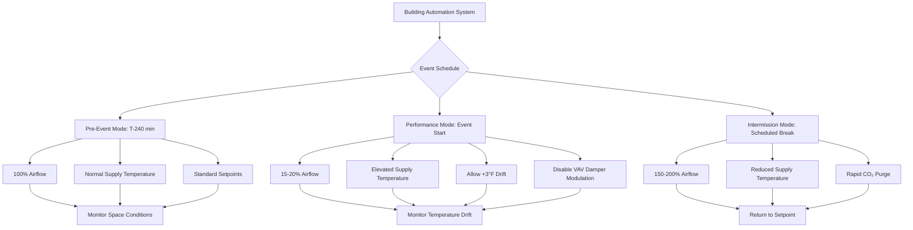

Concert halls represent the most acoustically demanding HVAC application. The dual imperatives of maintaining absolute silence during performances while providing thermal comfort for 1,500-3,000 occupants require sophisticated engineering that balances thermodynamics, psychrometrics, and acoustics.

## Acoustic Criteria and Noise Control Physics

World-class concert halls operate at NC-15 or lower during performances, equivalent to approximately 25-30 dBA. This threshold sits below the ambient noise floor of most occupied spaces and approaches the limit of human hearing sensitivity.

**Sound power attenuation requirements:**

The relationship between HVAC-generated sound power and received sound pressure level:

$$L_p = L_w - 10\log_{10}(A) + 10\log_{10}\left(\frac{Q}{4\pi r^2}\right)$$

Where:
- $L_p$ = sound pressure level at listener position (dB)
- $L_w$ = sound power level of HVAC component (dB)
- $A$ = room absorption (sabins)
- $Q$ = directivity factor
- $r$ = distance from source (ft)

Concert halls with high absorption (2,000-4,000 sabins) require duct silencers with 30-40 dB insertion loss across octave bands 125-4000 Hz. Air handling units located 100+ feet from the performance space with multiple attenuation stages achieve target criteria.

## System Operating Modes

Concert hall HVAC systems operate in distinct modes corresponding to venue usage patterns:

### Pre-Concert Conditioning

Pre-conditioning establishes thermal and humidity conditions 2-4 hours before performance. The space is treated as unoccupied, allowing full airflow rates (1.5-2.5 CFM/ft² floor area) and unrestricted equipment operation.

**Thermal mass pre-cooling energy:**

$$Q_{precool} = \sum(m_i \cdot c_{p,i} \cdot \Delta T_i)$$

For a 60,000 ft² hall with concrete/masonry construction, pre-cooling from 75°F to 68°F requires removing approximately 15-20 MMBtu from structural mass. This energy extraction prevents radiant heat gain to occupants during the performance when airflow is minimized.

### Performance Mode Operation

During performances, supply airflow reduces to 0.2-0.5 CFM/ft² floor area—sufficient only to offset latent loads from occupants. Sensible cooling relies on thermal stratification and slow air movement.

**Displacement ventilation principles:**

Low-velocity (25-50 FPM) cool air introduced at floor level creates a stratified environment. The buoyancy-driven flow follows:

$$\frac{dp}{dz} = -\rho g$$

Where vertical density gradients establish stable stratification. Heat sources (occupants, lighting) generate thermal plumes with characteristic velocity:

$$w = 1.5 \left(\frac{Q}{z}\right)^{1/3}$$

Where $w$ is plume velocity (ft/s), $Q$ is heat output (BTU/hr), and $z$ is height above source (ft). A seated occupant releasing 250 BTU/hr sensible heat generates a 30-40 FPM plume at head height, entraining surrounding air and establishing vertical temperature gradients of 5-8°F floor to ceiling.

| Operating Parameter | Pre-Event | Performance | Intermission |
|---------------------|-----------|-------------|--------------|
| Supply Airflow | 90,000-150,000 CFM | 12,000-30,000 CFM | 120,000-240,000 CFM |
| Air Changes/Hour | 4-6 ACH | 0.5-1.0 ACH | 5-10 ACH |
| Supply Temperature | 55-60°F | 60-65°F | 52-58°F |
| NC Level | NC-35 acceptable | NC-15 maximum | NC-30 acceptable |
| Space Temperature Drift | ±0°F target | +2 to +4°F acceptable | Return to setpoint |

### Intermission Load Management

Intermission periods (15-20 minutes) require rapid ventilation to purge CO₂ and remove accumulated heat. Occupant density reaches 3-5 ft²/person in lobbies, generating peak loads of 60-100 BTU/hr·person.

**CO₂ decay rate:**

$$C(t) = C_0 \cdot e^{-\lambda t} + C_{\infty}(1 - e^{-\lambda t})$$

Where $\lambda = ACH/60$ (min⁻¹). To reduce CO₂ from 1,500 ppm to 800 ppm in 15 minutes requires approximately 8-10 ACH with outdoor air at 400 ppm.

## Humidity Control for Musical Instruments

String and woodwind instruments require 40-50% RH year-round. Wood moisture content reaches equilibrium with ambient conditions following:

$$EMC = \frac{1800}{W} \left[\frac{KH(1-KH)}{1-KH+KH^2}\right]$$

Where $EMC$ is equilibrium moisture content, $W$ is fiber saturation point (30% for most woods), $K$ is temperature-dependent constant, and $H$ is relative humidity (decimal).

Humidity excursions below 35% RH cause wood shrinkage, joint separation, and sound board cracking. Excursions above 60% RH promote swelling, binding, and mold growth.

**Humidification load calculation:**

$$\dot{m}_w = \rho \cdot Q \cdot (\omega_{set} - \omega_{supply})$$

Where $\dot{m}_w$ is water addition rate (lb/hr), $\rho$ is air density (0.075 lb/ft³), $Q$ is airflow (CFM), and $\omega$ is humidity ratio (lb water/lb dry air).

A 2,400,000 ft³ hall maintaining 45% RH at 70°F during winter (outdoor conditions 20°F, 30% RH) requires approximately 150-200 lb/hr water addition at 6 ACH ventilation rate.

## Air Distribution Strategies

Concert halls employ three primary distribution strategies:

**1. Underfloor displacement ventilation**
- Floor plenums with 18-24" depth
- Low-velocity (50-100 FPM) diffusers integrated into flooring
- Supply temperatures 63-65°F (8-10°F below space)
- Return air extracted at ceiling through acoustic plenums

**2. Overhead low-velocity distribution**
- Large-area ceiling diffusers (16-25 ft² each)
- Discharge velocities 50-100 FPM
- Supply temperatures 58-62°F
- Natural convection and stratification during low-flow periods

**3. Seat-based individual diffusers**
- Personal air supplies at each seat (3-8 CFM/seat)
- Adjustable directional control
- Supply temperature 60-65°F
- Highest occupant satisfaction but complex installation

## Equipment Selection and Silencing

Air handling units serving performance spaces require:

- Variable speed fans with FC class 9 or better balance
- Inlet and discharge silencers (30+ dB insertion loss)
- Internal fiberglass lining (2-4" thickness, faced)
- Fan discharge velocities limited to 1,200-1,500 FPM
- Access sections between each component for future maintenance

Ductwork specifications:

- Velocity limits: mains 1,200-1,800 FPM, branches 800-1,200 FPM, terminals 400-600 FPM
- Minimum 3" duct liner on supply and return systems
- Flexible duct connections at all equipment (12-18" length)
- Duct silencers at branch takeoffs serving performance space
- No ductwork penetrations through stage or seating area ceilings where avoidable

## Control Sequences

Concert hall control systems implement time-based and occupancy-responsive sequences:

Transition between modes follows pre-programmed schedules integrated with ticketing systems. Manual override capability allows operators to adjust timing based on actual performance start times and intermission lengths.

## Design Checklist

Critical design requirements for concert hall HVAC:

- Acoustic modeling of all ductwork and diffusers during design phase
- NC-15 verification testing during commissioning with calibrated measurement
- Humidity control systems with ±5% RH accuracy and 0.3 µm filtration
- Redundant humidification and dehumidification equipment (N+1 minimum)
- Displacement ventilation feasibility analysis for new construction
- Pre-event conditioning timeline coordination with venue operations
- Intermission surge capacity sized for worst-case occupancy
- Emergency ventilation mode for smoke evacuation (NFPA 92)

Concert hall HVAC design demands integration of acoustic engineering, psychrometric control, and thermal comfort science. Success requires understanding that silence during performance is as critical as temperature and humidity—and far more difficult to achieve through mechanical means.
