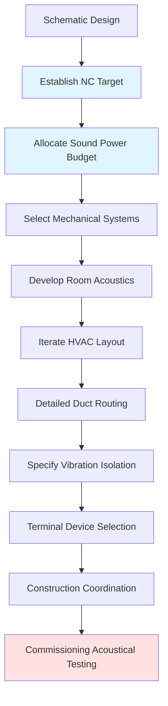
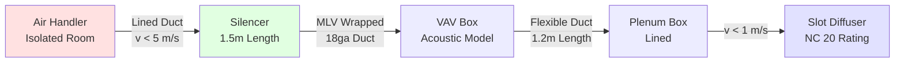

Concert hall HVAC systems present the most demanding acoustical requirements in building engineering. Achieving background noise criteria of NC 15-20 requires physics-based integration between mechanical and acoustical design disciplines, addressing sound transmission through multiple paths: airborne duct breakout, structure-borne vibration, and terminal device radiation.

## Acoustical Criteria and Physics

### Noise Criteria Fundamentals

Concert halls target NC 15-20 to preserve dynamic range for unamplified orchestral music. The NC rating represents the maximum permissible sound pressure level across octave bands:

| Octave Band Center (Hz) | NC 15 (dB) | NC 20 (dB) | NC 25 (dB) |
|-------------------------|------------|------------|------------|
| 63                      | 47         | 51         | 54         |
| 125                     | 36         | 40         | 44         |
| 250                     | 29         | 33         | 37         |
| 500                     | 22         | 26         | 31         |
| 1000                    | 17         | 22         | 27         |
| 2000                    | 14         | 19         | 24         |
| 4000                    | 12         | 17         | 22         |
| 8000                    | 11         | 16         | 21         |

ASHRAE Handbook - HVAC Applications Chapter 49 establishes these targets. The human ear's frequency-dependent sensitivity (A-weighting) makes mid-to-high frequency control (500-4000 Hz) particularly critical for perceived quietness.

### Sound Power Level Budgeting

Total sound pressure level at a listener position follows:

$$L_p = L_w + 10\log_{10}\left(\frac{Q}{4\pi r^2} + \frac{4}{R}\right)$$

Where:
- $L_p$ = sound pressure level at receiver (dB)
- $L_w$ = source sound power level (dB)
- $Q$ = directivity factor (dimensionless)
- $r$ = distance from source (m)
- $R$ = room constant, $\frac{S\alpha}{1-\alpha}$ (m²)
- $S$ = total room surface area (m²)
- $\alpha$ = average absorption coefficient

This relationship drives mechanical room isolation distance and diffuser selection.

## Acoustician Coordination Process

Critical coordination milestones:

1. **Concept phase**: Acoustician establishes room geometry, reverberation targets (1.8-2.2s for orchestral halls), and HVAC noise budget
2. **Design development**: Mechanical engineer allocates sound power to each diffuser zone based on spatial distribution
3. **Construction documents**: Joint review of duct penetrations through acoustically rated assemblies
4. **Commissioning**: Measure background noise with systems operating at design airflow

## Mechanical Room Isolation

### Structural Separation

Mechanical rooms must be structurally decoupled from performance spaces. Three isolation strategies:

| Strategy | Vibration Isolation | Application | Limitation |
|----------|---------------------|-------------|------------|
| Separate building | Complete | Remote central plant | Piping/duct run length |
| Floating slab | 95-99% at >10 Hz | Below-grade equipment room | Requires 200-300mm depression |
| Isolated platform | 90-98% at >15 Hz | Penthouse equipment | Load transfer complexity |

The natural frequency of spring isolators determines transmission:

$$f_n = \frac{1}{2\pi}\sqrt{\frac{k}{m}}$$

Where $k$ = spring stiffness (N/m) and $m$ = supported mass (kg). For 99% isolation at forcing frequency $f$, natural frequency must satisfy $f_n < 0.1f$.

### Distance Attenuation

Locating mechanical rooms 15-30m from performance spaces provides geometric attenuation:

$$TL_{distance} = 20\log_{10}\left(\frac{r_2}{r_1}\right)$$

A doubling of distance yields 6 dB reduction in structure-borne transmission.

## Equipment Mounting

### Vibration-Free Foundations

All rotating equipment requires inertia bases with mass $m_{base} \geq 1.5 \times m_{equipment}$. Spring isolators beneath inertia bases achieve:

- **Static deflection**: 50-75mm (minimum)
- **Natural frequency**: 2-3 Hz
- **Isolation efficiency**: 95-98% at fan operating speeds (900-1800 RPM)

Neoprene-in-shear isolators provide inadequate performance for concert halls due to natural frequencies above 8 Hz.

### Flexible Connections

All ductwork and piping connections to isolated equipment require flexible sections:

- **Duct**: Fabric connectors with 50-75mm free length, neoprene-coated fiberglass
- **Pipe**: Braided stainless steel hoses or rubber expansion joints
- **Electrical**: Flexible conduit with 300mm minimum loop

## Duct Breakout Noise Control

### Transmission Loss Physics

Sound energy transmits through duct walls via flexural wave propagation. Breakout transmission loss:

$$TL_{breakout} = 10\log_{10}\left(\frac{W_{in}}{W_{out}}\right) = 10\log_{10}\left(\frac{P S}{4\pi f \rho c S_{duct}}\right) + 20\log_{10}(f) - 40$$

Where:
- $P$ = duct perimeter (m)
- $S$ = duct cross-sectional area (m²)
- $f$ = frequency (Hz)
- $\rho c$ = air characteristic impedance (415 Pa·s/m at 20°C)
- $S_{duct}$ = duct surface area (m²)

### Breakout Mitigation Strategies

1. **Duct gauge increase**: 22 gauge → 18 gauge adds 8-10 dB TL
2. **External lagging**: 25mm mass-loaded vinyl (MLV) barrier adds 15-20 dB
3. **Low velocity**: Maintain duct velocity <4 m/s to minimize turbulence noise generation
4. **Round vs. rectangular**: Round ducts provide 3-5 dB better TL due to higher stiffness

## Diffuser Radiated Noise

### Terminal Device Selection

Diffuser-radiated noise dominates the sound field in occupied spaces. Sound power level from a diffuser:

$$L_w = K_w + 10\log_{10}(Q) + 50\log_{10}(v) + 10\log_{10}(A_k)$$

Where:
- $K_w$ = diffuser constant (manufacturer data)
- $Q$ = airflow rate (L/s)
- $v$ = face velocity (m/s)
- $A_k$ = free area (m²)

Critical parameters for NC 15-20:

- **Face velocity**: <1.0 m/s maximum
- **Neck velocity**: <2.0 m/s maximum
- **Active area ratio**: >0.60 for turbulence reduction
- **Aspect ratio**: Approach from ceiling plenum perpendicular to slot to minimize jetting

### Plenum Performance

Supply plenum boxes upstream of diffusers provide:

- Velocity equalization across diffuser face
- 5-8 dB additional attenuation at 250-1000 Hz
- Acoustically lined plenums (25mm fiberglass, 48 kg/m³ density) add 3-5 dB

## System Configuration

Design sequence prioritizes noise control at source, path, and receiver.

## Commissioning Verification

Final acoustical testing per ASTM E1374 validates design:

1. Position microphone at multiple listener locations (orchestra, balcony)
2. Operate all HVAC systems at design airflow
3. Measure 1/3-octave band SPL (63-8000 Hz)
4. Verify compliance with NC 15-20 criteria
5. Identify and remediate any tonal components (blade-pass frequency, motor hum)

## References

- ASHRAE Handbook - HVAC Applications, Chapter 49: "Sound and Vibration"
- ASHRAE Handbook - Fundamentals, Chapter 8: "Sound and Vibration"
- ANSI/ASA S12.60: "Acoustical Performance Criteria for Learning Spaces"

---

Successful concert hall HVAC design demands early acoustician integration, physics-based component selection, and rigorous attention to every transmission path. The 5-10 dB margin between typical commercial practice (NC 25-30) and concert hall requirements (NC 15-20) represents exponentially greater engineering effort and cost, justified by preserving the artistic experience.
