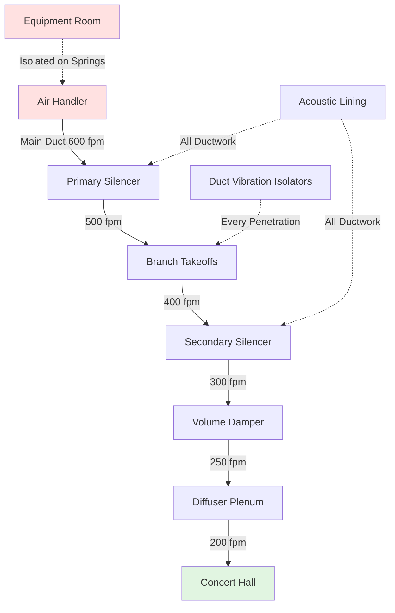
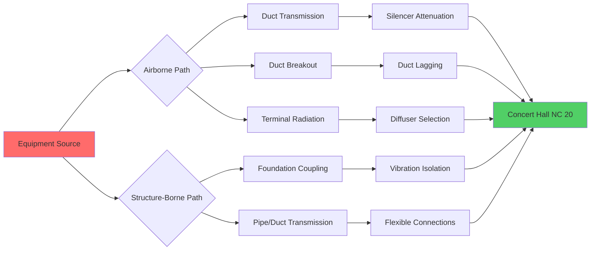

## NC 20 Requirement Fundamentals

NC 20 represents one of the most stringent background noise requirements in HVAC design, typically specified for world-class concert halls, recording studios, and critical listening environments. The Noise Criteria (NC) curves, developed by Beranek, define maximum permissible sound pressure levels across octave bands from 63 Hz to 8000 Hz. At NC 20, background noise becomes imperceptible during musical passages, preserving the full dynamic range of acoustic performances.

The challenge stems from the logarithmic nature of sound intensity. A reduction from NC 30 to NC 20 represents halving the perceived loudness, requiring exponentially greater engineering effort. Every sound path—airborne through ducts, structure-borne through mechanical coupling, and breakout through duct walls—must be analyzed and attenuated.

**NC 20 Octave Band Limits:**

| Frequency (Hz) | 63 | 125 | 250 | 500 | 1000 | 2000 | 4000 | 8000 |
|----------------|-------|-------|-------|-------|-------|-------|-------|-------|
| SPL (dB) | 47 | 36 | 29 | 22 | 17 | 14 | 12 | 11 |

Low frequencies present the greatest design challenge. The 63 Hz limit of 47 dB often controls system design because low-frequency sound attenuates slowly and penetrates barriers effectively.

## Low-Velocity Air Distribution Systems

Air velocity in ductwork directly correlates with turbulence-generated noise. The sound power generated by turbulent flow scales approximately with the eighth power of velocity:

$$W \propto v^8$$

This relationship makes velocity reduction the most effective noise control strategy. For NC 20 applications, maximum duct velocities must not exceed:

- Main supply ducts: 500-800 fpm
- Branch ducts: 400-600 fpm
- Terminal runs near hall: 300-400 fpm
- Diffuser neck velocity: 200-300 fpm

The acoustic power generated in straight duct segments follows:

$$L_w = 10 \log_{10}\left(\frac{v}{1000}\right)^5 + 10 \log_{10}(A) + K$$

where $v$ is velocity in fpm, $A$ is duct cross-sectional area in ft², and $K$ is a constant depending on duct surface roughness and configuration.

Achieving these low velocities requires substantially larger ductwork. A system designed for NC 20 may have duct cross-sections 2-3 times larger than conventional designs, directly impacting architectural coordination and construction costs.

## Duct Silencer Design and Application

Passive duct silencers employ sound-absorptive media to convert acoustic energy into heat through viscous and thermal boundary layer effects. Silencer performance depends on:

1. **Media thickness** relative to wavelength
2. **Airway width** between baffles
3. **Length** of absorptive path
4. **Media face velocity**

For low-frequency attenuation critical to NC 20, silencer design must address the quarter-wavelength relationship:

$$\lambda = \frac{c}{f}$$

where $\lambda$ is wavelength, $c$ is sound speed (1130 ft/s), and $f$ is frequency. At 63 Hz, wavelength approaches 18 feet, requiring substantial silencer length or splitter thickness for effective attenuation.

**Silencer Performance Requirements:**

| Octave Band (Hz) | Minimum Insertion Loss (dB) |
|------------------|----------------------------|
| 63 | 10-15 |
| 125 | 15-20 |
| 250 | 20-25 |
| 500 | 25-30 |
| 1000+ | 25-30 |

Critical design constraints include maintaining face velocity below 800 fpm to prevent silencer self-noise and ensuring media remains dry, as moisture severely degrades absorptive performance.

## Equipment Room Isolation

Mechanical equipment generates both airborne and structure-borne sound. For NC 20 applications, equipment rooms must be:

**Physically separated** from performance spaces by minimum 50 feet or interstitial barriers
**Structurally decoupled** through floating floors or isolated structural slabs
**Acoustically sealed** with STC 60+ wall assemblies and double-door entries

Equipment vibration transmits through rigid connections. The force transmitted through vibration isolators follows:

$$T = \frac{F}{\sqrt{1 + (2\zeta r)^2 - r^2}}$$

where $T$ is transmitted force, $F$ is disturbing force, $\zeta$ is damping ratio, and $r$ is frequency ratio $(f/f_n)$. Effective isolation requires operating frequency at least $\sqrt{2}$ times the isolator natural frequency.

**Equipment Isolation Requirements:**

| Equipment Type | Isolation Efficiency | Natural Frequency |
|----------------|---------------------|-------------------|
| Air handlers | 95-98% | 3-5 Hz |
| Chillers | 95-98% | 3-5 Hz |
| Cooling towers | 90-95% | 5-7 Hz |
| Pumps | 95-98% | 3-5 Hz |
| Fans | 95-98% | 3-5 Hz |

All piping and ductwork connections must incorporate flexible connectors with minimum 2-inch deflection capability to prevent vibration bypass.

## Sound Path Analysis

Achieving NC 20 requires identifying and quantifying every sound transmission path using the acoustic power balance:

$$L_{p,hall} = L_w + 10\log_{10}\left(\frac{Q}{4\pi r^2} + \frac{4}{R}\right)$$

where $L_{p,hall}$ is sound pressure level in the hall, $L_w$ is source sound power, $Q$ is directivity factor, $r$ is distance, and $R$ is room constant.

Critical paths typically include:

- **Duct-borne**: Direct transmission through supply/return air paths
- **Breakout**: Sound radiating from duct walls (becomes significant at low frequencies)
- **Regenerated**: Turbulence at elbows, dampers, and transitions
- **Structure-borne**: Vibration through rigid connections
- **Flanking**: Transmission through plenum spaces and building structure

## Measurement and Verification

NC level verification follows ASHRAE Standard 189.1 and ANSI S12.2 protocols. Measurements require:

**Instrumentation**: Type 1 precision sound level meters with octave band filters
**Background**: All HVAC systems operational, no extraneous sources
**Locations**: Multiple positions across performance area
**Duration**: Minimum 30-second integration time per location

The measured NC level corresponds to the highest NC curve tangent to the octave band spectrum. A single octave band exceeding limits causes NC failure, even if other bands achieve lower levels.

**Verification Protocol:**

1. Establish baseline with all systems off (ambient intrusion check)
2. Energize HVAC systems to design airflow rates
3. Measure octave band SPL at 6-12 locations
4. Plot measured spectrum against NC curves
5. Identify limiting octave band
6. Document deviations and implement corrective measures

Common failure modes include insufficient low-frequency attenuation, excessive duct velocity, inadequate equipment isolation, and flanking transmission through ceiling plenums. Remediation often requires adding secondary silencers, reducing airflow, or enhancing isolation—all costly post-construction modifications that emphasize rigorous design analysis.

Achieving NC 20 demands integrated acoustical and mechanical design from project inception. The physical constraints of low-velocity air distribution, wavelength-dependent attenuation, and multi-path sound transmission require expanded spatial allocations, premium equipment selection, and meticulous construction execution. The result preserves the intended acoustic environment where the softest musical passage remains free from mechanical system intrusion.
