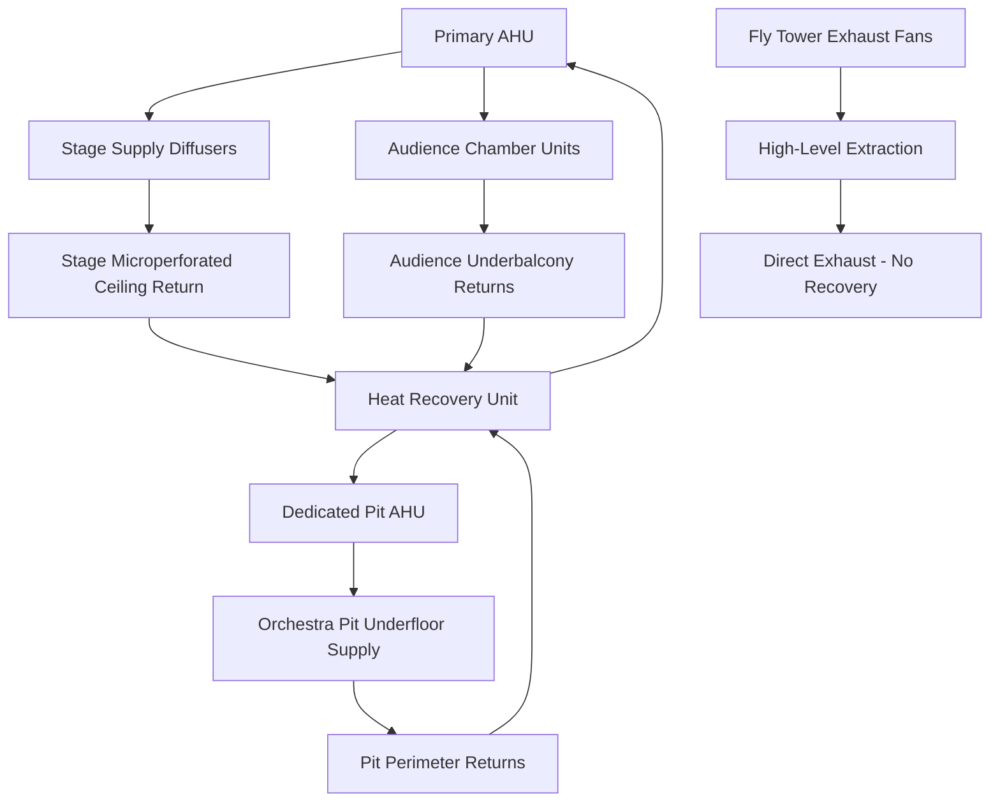

## Overview

Opera house HVAC systems present unique engineering challenges combining extreme thermal loads, stringent acoustic requirements, rapid load variations, and preservation of historic architecture. The stage house generates 50-150 W/m² from theatrical lighting while demanding near-silent operation, orchestra pits require 15-25 air changes per hour despite space constraints, and fly towers extending 20-35 m above stage level create massive stratification challenges.

## Thermal Load Characteristics

### Stage House Heat Generation

Stage lighting creates the dominant thermal load with power density varying by performance type:

| Performance Type | Lighting Power Density | Sensible Heat Ratio | Peak Load Duration |
|------------------|------------------------|---------------------|---------------------|
| Opera | 100-150 W/m² | 0.95-0.98 | 2-4 hours |
| Ballet | 80-120 W/m² | 0.96-0.99 | 1.5-3 hours |
| Drama | 50-80 W/m² | 0.97-0.99 | 2-3 hours |
| Rehearsal | 20-40 W/m² | 0.85-0.90 | 4-8 hours |

The convective heat transfer from lighting instruments follows:

$$Q_{conv} = h \cdot A \cdot (T_{fixture} - T_{air})$$

where fixture surface temperatures reach 150-250°C, creating powerful buoyant plumes with velocities:

$$v = \sqrt{2 \cdot g \cdot H \cdot \frac{\Delta T}{T_{avg}}}$$

For a 25 m fly tower with ΔT = 15 K, buoyant velocity approaches 4.8 m/s, demanding careful ventilation design to prevent stratification.

### Performer Metabolic Loads

Performers generate 200-400 W per person during active performance, with peak outputs during ensemble numbers reaching:

$$Q_{metabolic} = N_{performers} \cdot (M + W)$$

where M represents metabolic rate (300-400 W) and W represents mechanical work (50-100 W) during dance sequences.

## System Architecture

## Stage House Conditioning

### Supply Air Distribution

Stage supply systems employ ceiling-mounted microperforated panels delivering 0.15-0.25 m/s face velocity to minimize acoustic interference. Required airflow follows:

$$\dot{V} = \frac{Q_{total}}{\rho \cdot c_p \cdot \Delta T}$$

For a typical 600 m² stage with 90 kW lighting load and 12 K temperature differential:

$$\dot{V} = \frac{90,000}{1.2 \cdot 1006 \cdot 12} = 6.2 \text{ m}^3/\text{s}$$

This yields 10.3 L/s·m² supply rate, distributed through 40-60 m² of microperforated surface to maintain velocity below acoustic threshold.

### Fly Tower Ventilation Strategy

The fly tower creates a 20-35 m vertical shaft requiring dedicated exhaust to remove buoyant heat. Natural stratification causes temperature gradients of 0.5-0.8 K/m, with temperatures at grid level (25 m) reaching 15-20 K above stage floor.

Exhaust fans sized for 8-12 air changes per hour operate intermittently, activated when grid temperature exceeds setpoint by 8 K:

$$\dot{V}_{exhaust} = \frac{V_{fly} \cdot ACH}{3600} = \frac{(600 \cdot 25) \cdot 10}{3600} = 41.7 \text{ m}^3/\text{s}$$

Relief air enters through manually operated vents at stage level, creating vertical airflow that carries heat upward without disrupting stage conditions.

## Orchestra Pit Climate Control

### Space Constraints and Load Density

Orchestra pits measuring 60-100 m² accommodate 50-80 musicians in a recessed space 1.5-2.5 m below stage level, creating power densities of 30-50 W/m² (metabolic) plus 5-10 W/m² (instrument lighting).

Supply air delivered through raised floor systems at 0.3-0.5 m/s provides displacement ventilation:

$$Q_{total} = Q_{sensible} + Q_{latent} = (N \cdot 200) + (N \cdot 100 \cdot 2450/1000)$$

For 70 musicians:

- Sensible load: 14 kW
- Latent load: 17.2 kW (7 L/hr moisture)
- Total load: 31.2 kW

Required airflow at ΔT = 10 K:

$$\dot{V} = \frac{14,000}{1.2 \cdot 1006 \cdot 10} = 1.16 \text{ m}^3/\text{s}$$

This represents 16.5 air changes per hour for an 80 m² pit with 2.2 m depth.

### Acoustic Integration

Supply registers must meet NC-20 to NC-25 criteria. Maximum permissible duct velocity:

$$v_{max} = 2.5 \text{ m/s (mains)}, \quad 1.5 \text{ m/s (branches)}, \quad 0.8 \text{ m/s (terminals)}$$

Silencers provide 15-25 dB attenuation across 125-4000 Hz octave bands, with insertion loss verified by:

$$IL = 10 \log_{10}\left(\frac{W_{incident}}{W_{transmitted}}\right)$$

## Audience Chamber Systems

### Thermal Zoning Strategy

Traditional horseshoe designs with 3-5 balcony tiers require independent zone control:

- Orchestra level: 40-45% capacity, 2.5-3.0 m ceiling height
- Dress circle: 20-25% capacity, 3.5-4.5 m ceiling height
- Upper balconies: 35-40% capacity, 5.0-7.0 m ceiling height

Supply air distributed through undereat diffusers (orchestra level) and sidewall grilles (balconies) maintains vertical temperature gradient ≤ 2 K between floor and 1.8 m breathing zone.

### Quick Scene Change Conditioning

Scene changes lasting 3-8 minutes require rapid load response. System thermal inertia characterized by time constant:

$$\tau = \frac{m \cdot c_p}{\dot{m} \cdot c_p} = \frac{V_{space} \cdot \rho}{ACH \cdot V_{space} \cdot \rho / 3600} = \frac{3600}{ACH}$$

At 8 ACH, τ = 450 seconds (7.5 minutes), matching scene change duration. Supply air temperature reset of 4-6 K during blackouts prevents overcooling while managing transient loads.

## Historic Building Renovations

### Integration Constraints

Opera houses built 1850-1920 present preservation challenges:

- **Structural limitations**: Floor loading restricted to 2.5-4.0 kPa, limiting equipment placement
- **Spatial constraints**: Ceiling cavity depths of 0.3-0.8 m versus modern 1.2-1.5 m requirements
- **Aesthetic preservation**: Visible ductwork prohibited in public spaces
- **Acoustic isolation**: Impact noise transmission through historic masonry limited to STC-55

### Modern System Strategies

**Decentralized equipment placement** distributes smaller units (5-15 kW) in accessible locations rather than central plants, reducing duct sizes and structural loading.

**Displacement ventilation** from floor plenums or seat-level diffusers eliminates ceiling ductwork in preserved spaces while improving efficiency through reduced ΔT (6-8 K versus 10-12 K).

**Variable refrigerant flow (VRF)** systems with 65 mm refrigerant lines replace 400-600 mm supply ducts, threading through existing chases and cavities.

## Standards and Design Criteria

ASHRAE guidelines for opera house HVAC:

- **ASHRAE 55**: Thermal comfort targets 21-23°C, 40-55% RH during performance
- **ASHRAE 62.1**: Ventilation rate 7.5 L/s·person (audience), 12.5 L/s·person (performers)
- **ASHRAE Handbook - HVAC Applications**: Chapter 5 (Places of Assembly) specifies design conditions
- **NC-20 to NC-25**: Background noise criteria for performance spaces

Design verification requires computational fluid dynamics (CFD) modeling of stage house thermal plumes and audience chamber stratification, validated against ASHRAE Research Project RP-1515 measurement protocols.

## Performance Verification

Commission testing validates:

1. **Acoustic performance**: NC measurements at 10+ locations during full system operation
2. **Thermal distribution**: ±1.5 K variation across seating zones under full occupancy
3. **Humidity control**: 40-60% RH maintenance during 4-hour performance with 1500+ occupants
4. **Pressure relationships**: Stage house +5 to +8 Pa relative to audience to contain scenic fog
5. **Response time**: Temperature recovery within 15 minutes following scene change load transients

These parameters ensure performer comfort, audience satisfaction, and acoustic transparency required for world-class opera presentation.
