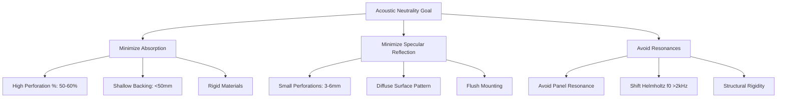
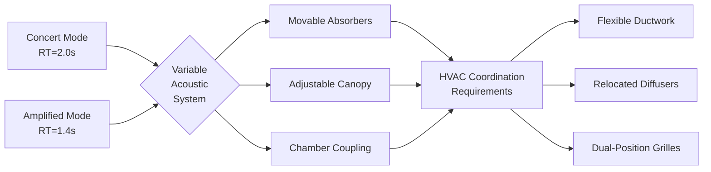

## Introduction

Reverberation time coordination represents the critical intersection between mechanical system design and architectural acoustics. HVAC components introduce discontinuities in room surfaces that act as acoustic absorbers, diffusers, or unintended reflectors. The acoustic consequences of supply diffusers, return grilles, duct penetrations, and mechanical surface treatments directly affect the Sabine equation's total absorption term and the resulting reverberation characteristics.

## Reverberation Time Physics

The Sabine equation governs reverberation time for most concert hall volumes:

$$T_{60} = \frac{0.161V}{A}$$

where $T_{60}$ is the time in seconds for sound pressure level to decay 60 dB, $V$ is room volume in cubic meters, and $A$ is total room absorption in metric sabins:

$$A = \sum_{i=1}^{n} S_i \alpha_i$$

Each HVAC element introduces surface area $S_i$ with absorption coefficient $\alpha_i$ that modifies the total absorption. A single large return grille with $\alpha = 0.30$ and area 2.0 m² contributes 0.6 sabins, equivalent to approximately 1.5 m² of audience area.

Target reverberation times for concert halls typically range from 1.8 to 2.2 seconds at mid-frequencies (500-1000 Hz) with elevated bass ratio for warmth:

$$\text{Bass Ratio} = \frac{T_{60,125} + T_{60,250}}{T_{60,500} + T_{60,1000}}$$

Optimal bass ratios range from 1.10 to 1.30 for orchestral music.

## HVAC Surface Absorption Impact

HVAC system elements contribute frequency-dependent absorption that must be quantified during acoustic design:

| HVAC Element | Absorption Coefficient Range | Dominant Effect |
|--------------|------------------------------|-----------------|
| Perforated metal diffusers (no backing) | 0.15-0.25 (500 Hz) | Resonant absorption |
| Return grilles with plenum | 0.25-0.40 (500 Hz) | Helmholtz resonance |
| Duct-mounted fabric liner (exposed) | 0.60-0.90 (1000 Hz) | Porous absorption |
| Solid metal ductwork (painted) | 0.02-0.05 | Minimal absorption |
| Expanded metal grilles | 0.10-0.20 | Viscous losses |

### Helmholtz Resonance in Grilles

Perforated grilles with backing cavities behave as Helmholtz resonators with resonant frequency:

$$f_0 = \frac{c}{2\pi}\sqrt{\frac{P}{V_c(t_{eff})}}$$

where $c$ is sound speed (343 m/s), $P$ is perforation area, $V_c$ is cavity volume, and $t_{eff}$ is effective thickness including end corrections. Absorption peaks at $f_0$ with coefficient potentially exceeding 0.50, creating localized reverberation time dips that affect tonal balance.

## Diffuser Grille Acoustic Design

Acoustic transparency requires diffuser design that minimizes both absorption and specular reflection:

### Design Criteria for Acoustic Neutrality

1. **Perforation percentage**: 40-60% open area reduces absorption while maintaining throw
2. **Perforation diameter**: Small holes (3-6 mm) minimize diffraction effects above 2000 Hz
3. **Backing depth**: Shallow plenums (<50 mm) shift resonances above speech/music range
4. **Surface profile**: Flush mounting eliminates edge diffraction
5. **Material selection**: Rigid metals prevent panel resonance

### Surface vs Ceiling Distribution

Ceiling-mounted diffusers present larger surface areas to incident sound and contribute greater absorption. Wall-mounted or high-sidewall diffusers reduce acoustic impact through smaller area and grazing incidence angles where absorption coefficients decrease by cosine factor.

## Flutter Echo Prevention

Flutter echoes arise from repetitive reflections between parallel reflective surfaces. HVAC elements can either mitigate or exacerbate flutter depending on placement and surface characteristics.

### Flutter Echo Mechanism

The flutter frequency $f_{flutter}$ between parallel surfaces separated by distance $d$ is:

$$f_{flutter} = \frac{c}{2d}$$

For a hall with 15 m ceiling-to-floor distance, flutter occurs at 11.4 Hz fundamental with audible harmonics extending to hundreds of Hz. Each reflection must be attenuated to prevent buildup.

### HVAC Mitigation Strategies

| Strategy | Implementation | Effectiveness |
|----------|---------------|---------------|
| Surface interruption | Large diffuser arrays break planar surfaces | High for ceilings |
| Absorption | Duct liner exposure at grilles | Moderate, frequency-dependent |
| Scattering | Irregular grille patterns | Moderate to high |
| Geometry | Angled ductwork penetrations | High for walls |

Distributed diffuser layouts with irregular spacing provide acoustic scattering that disrupts coherent reflections. Minimum recommended spacing irregularity is ±20% from nominal grid.

## Variable Acoustics Coordination

Variable acoustic systems allow reverberation time adjustment for different performance types. HVAC systems must accommodate movable elements without compromising air distribution:

### Coordination Requirements

**Movable wall panels**: HVAC diffusers must avoid panel locations or use relocated diffusers mounted on movable sections. Flexible duct connections (maximum 1.5 m length) accommodate panel travel while maintaining pressure class.

**Retractable banners**: Supply air must not impinge on fabric surfaces causing flutter or displacement. Minimum clearance of 1.0 m from high-velocity jets.

**Chamber coupling doors**: Return air pathways must function in both coupled and uncoupled configurations. Dual grilles or transfer ducts ensure adequate return in all acoustic modes.

**Adjustable absorption**: Motorized fabric panels or rotating elements require coordination with diffuser throw patterns to prevent short-circuiting of air distribution when panels are deployed.

## Duct Lining Acoustic Impact

Internal duct lining provides attenuation of mechanical system noise but exposed lining at grille transitions creates localized high absorption:

$$\alpha_{exposed} = 1 - (1-\alpha_{lining})\cdot\frac{A_{free}}{A_{total}}$$

Exposed fiberglass liner with $\alpha_{lining} = 0.85$ at 1000 Hz and 30% free area yields $\alpha_{exposed} = 0.62$. Standard practice restricts exposed liner to duct interiors with sealed edges at all grille perimeters.

## ASHRAE Design Standards

ASHRAE Handbook - HVAC Applications Chapter 49 (Sound and Vibration Control) provides guidance:

- Maximum recommended NC-15 for concert halls
- Reverberation time coordination with acoustical consultant required
- Diffuser selection prioritizes acoustic criteria over thermal performance in critical zones
- Return grille sizing maintains face velocity below 2.0 m/s to minimize self-generated noise

## Specification Guidelines

Mechanical specifications for acoustically critical spaces should include:

1. **Acoustic performance criteria**: Target absorption coefficients by octave band for all exposed HVAC elements
2. **Mockup requirements**: Full-scale diffuser and grille mockups for acoustic measurement before procurement
3. **Installation tolerances**: ±3 mm flush mounting to prevent edge effects
4. **Coordination drawings**: Overlay of HVAC elements on acoustic raytracing models
5. **Commissioning protocol**: Post-installation RT measurements with HVAC system in final configuration

## Conclusion

Successful reverberation time coordination requires treating HVAC system elements as integral acoustic components. The absorption, scattering, and reflection characteristics of diffusers, grilles, and duct penetrations directly influence measured reverberation time and must be quantified during design. Close coordination between mechanical and acoustical consultants, supported by physical mockups and computational verification, ensures HVAC systems support rather than compromise acoustic performance objectives.
